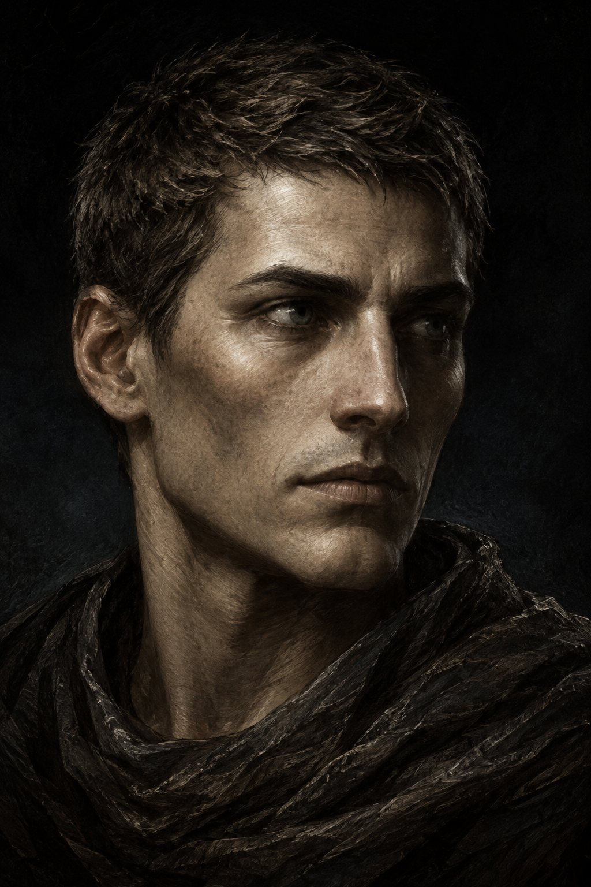
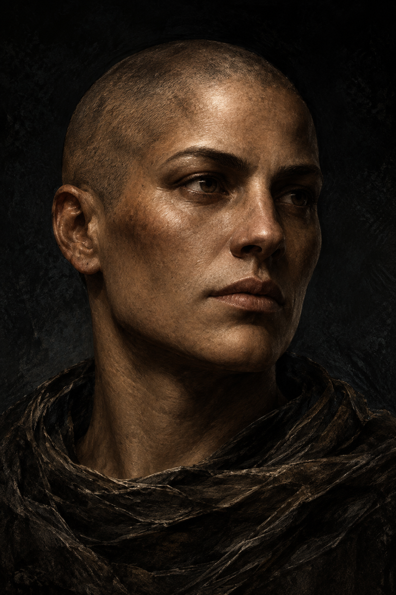
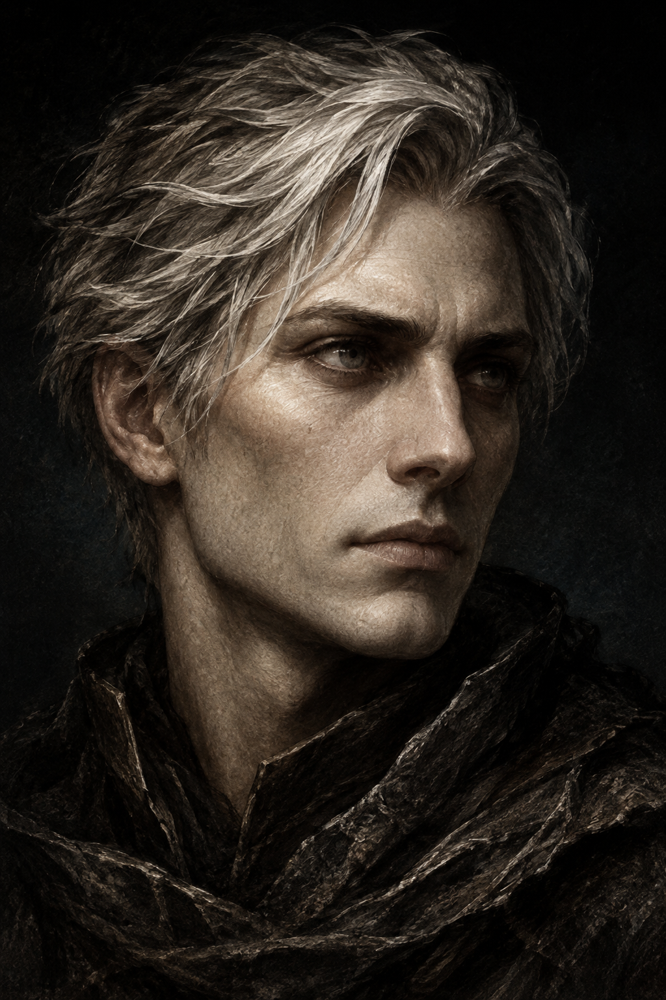

# Варианты персонажа — портреты v1

Статус: варианты для выбора, не утверждённые эталоны.

Созданы встроенным image_gen на основе ART_DIRECTION.md и трёх изображений refs. Точные запросы и параметры, доступные от инструмента, сохранены в generation-prompts.json.

Все изображения: PNG, 1024 × 1536, тёмный фон. Это портреты, не фигуры для арены. Генератор добавил ткань у плеч; стартовый персонаж по правилам игры должен быть без одежды. В игру изображения не подключены.

## Пепельный

## Земляной

## Светлый

