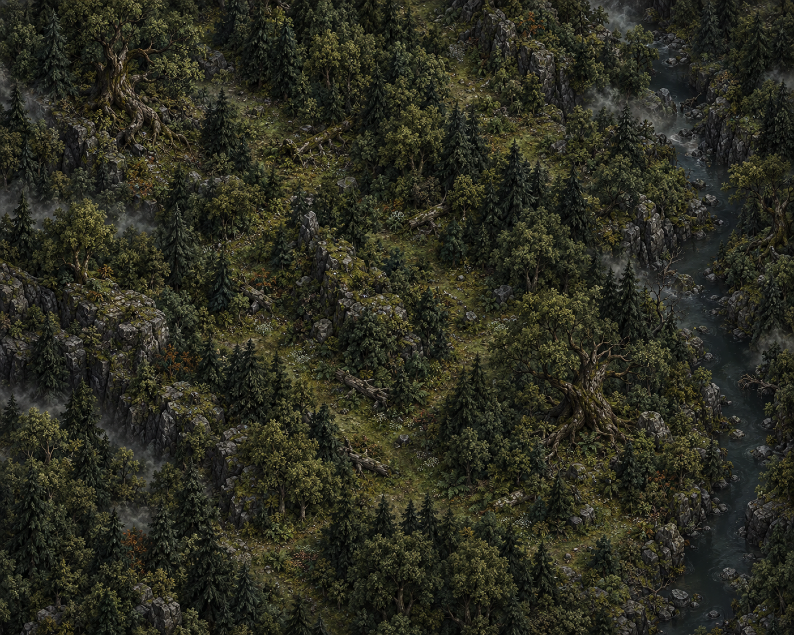
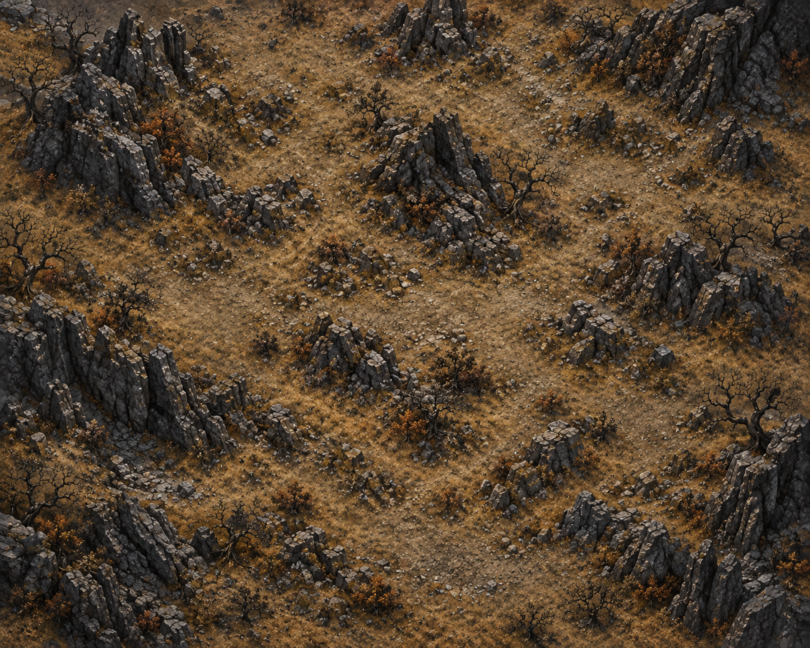
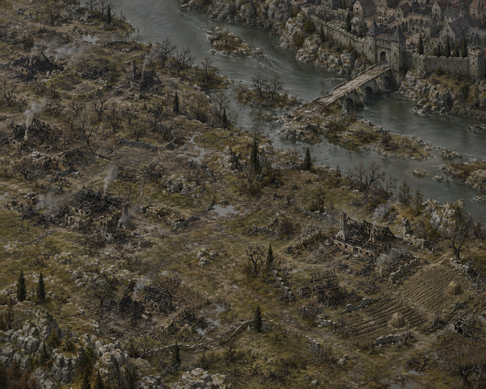
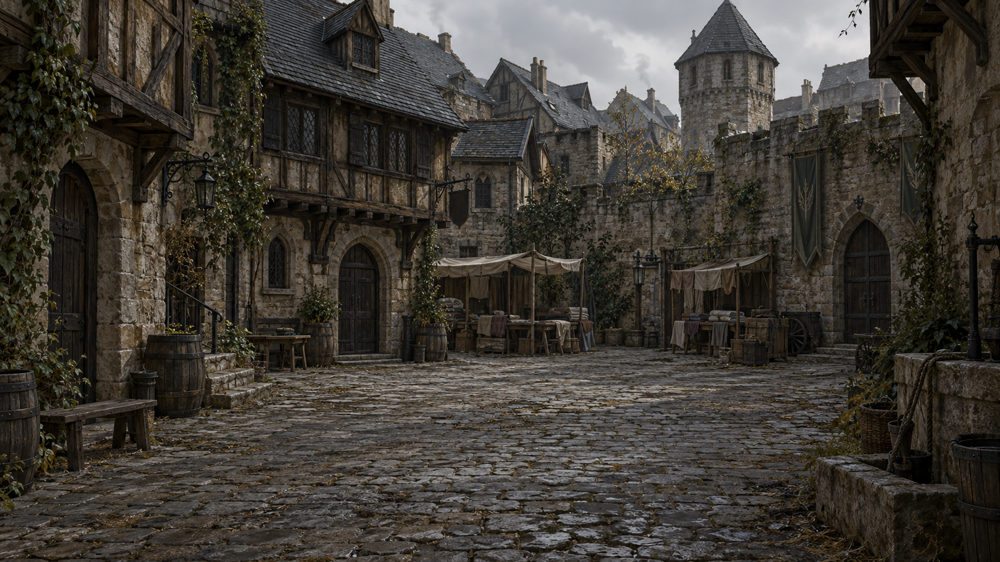
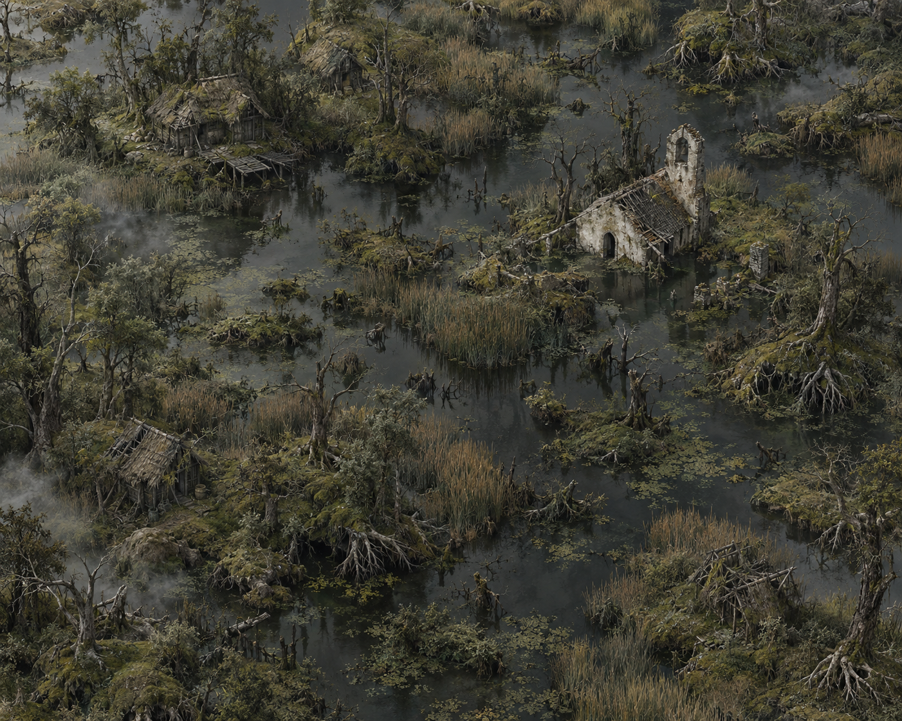
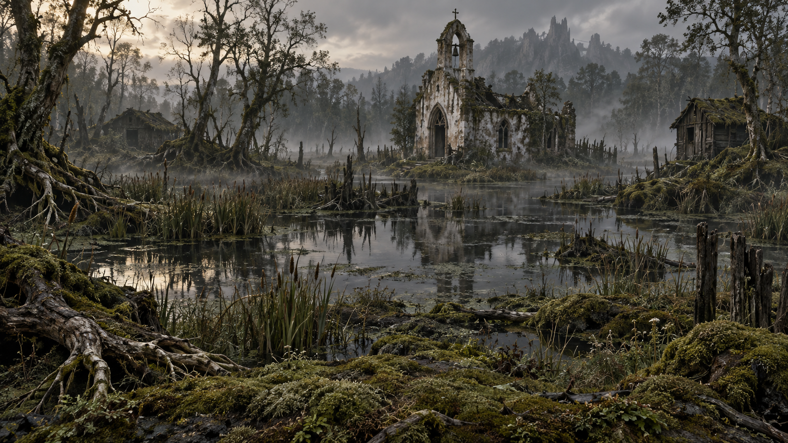
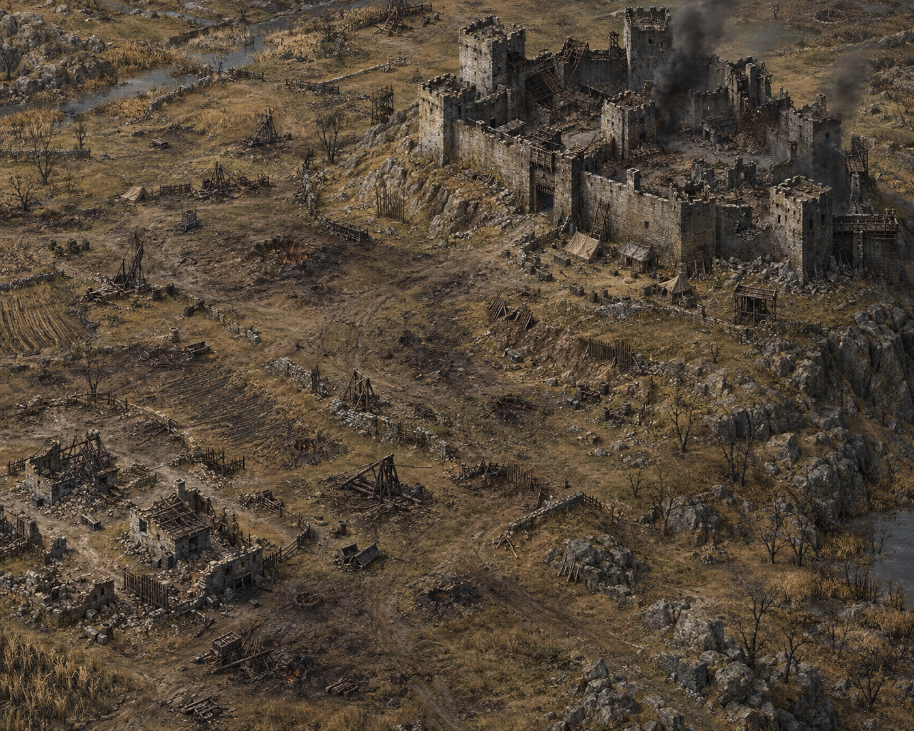
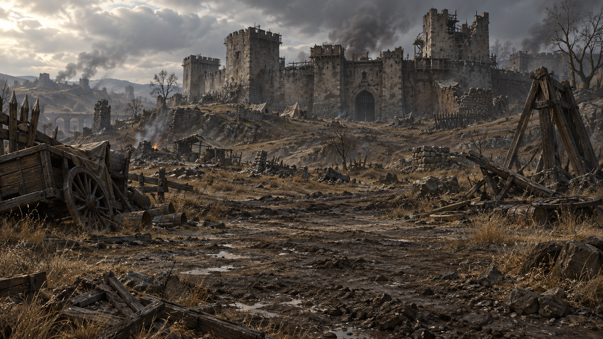
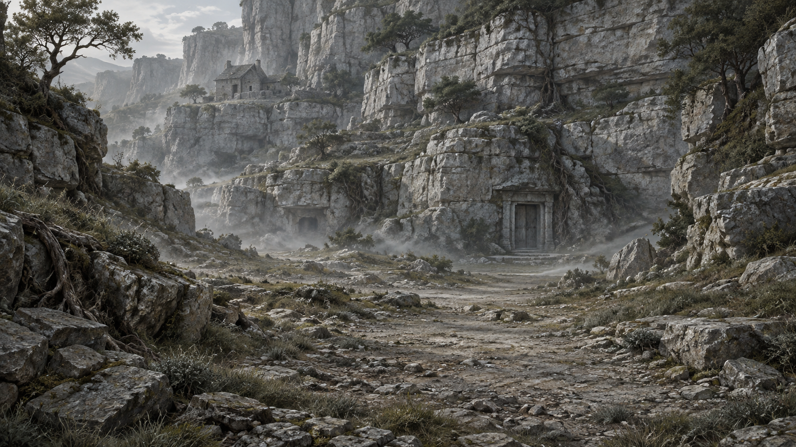

# Герои Орвеска — художественное направление

Пути в обычном тексте и в обратных кавычках указаны от корня проекта; относительные Markdown-ссылки — от расположения документа.

Единое художественное направление: портреты, существа, предметы, действия, интерфейсные значки, карты и фоны боя. Описания образов — в каталогах `docs`; актуальные пути изображений — в `data`. Перед генерацией читать этот документ и просматривать указанные референсы.

## Общий стиль

**Мрачный готический живописный портрет: скульптурный объём, глубокая светотень, шероховатая рисованная поверхность и тщательно выстроенный силуэт.**

Персонаж выглядит обитателем сурового древнего мира. Лицо и снаряжение обладают весом и фактурой: потемневший металл, сухая ткань, кость, мех, потёртая кожа. Свет выхватывает лицо и отдельные грани из почти чёрного пространства. Образ выразительный, сдержанный, настороженный или суровый.

Поверхность напоминает старую фактурную фэнтезийную иллюстрацию с живописной моделировкой формы. Натуральная анатомия сочетается с заметным художественным обобщением кожи, волос и ткани. Фотореалистический портрет, постановочная фотография и гладкий 3D-рендер не соответствуют направлению, даже при правильных цветах и костюме.

### Манера исполнения

- **Живописная поверхность:** мелкие прерывистые штрихи и протирки, напоминающие сухую кисть. Фактура следует объёму и направлению материала; равномерный шум поверх фотографии не заменяет её. Без крупных пастозных мазков, размывающих лицо, и без геометрических low-poly плоскостей.
- **Иерархия деталей:** лицо и взгляд проработаны лучше всего. Волосы собраны в отчётливые пряди и световые массы, ткань — в крупные ломаные складки с неровными светлыми кромками. Не прорисовывать каждый волосок, пору и нить одинаково подробно по всему кадру.
- **Кожа:** матовая, с неоднородными живописными полутонами; скулы, лоб и переносица ощущаются объёмными. Морщины и индивидуальные особенности сохраняются, но не превращаются в фотографическое макроизображение. Без восковой гладкости, косметической ретуши и влажного глянца.
- **Светотень:** выраженный переход от освещённых плоскостей лица к глубоким теням. Нижняя часть корпуса и одежда уходят в глубокую тень; внешний силуэт остаётся отделённым от прозрачного фона. Мягкие переходы внутри формы допустимы, равномерно проявленный студийный портрет — нет.
- **Цвет:** низкая насыщенность, близкие графитовые, серо-коричневые и костяные тона, сдержанные тёплые оттенки живой кожи. Это степень приглушённости палитры, а не требование делать всех бледными, седыми или одинакового оттенка кожи.
- **Композиция:** лицо остаётся главным центром внимания; квадратный погрудный портрет вмещает оба плеча целиком, а одежда поддерживает лицо и не становится большой самостоятельной светлой массой. Для зверя или иной анатомии ту же роль играет морда, орган восприятия или характерная передняя часть существа.

Общие требования задают манеру исполнения, но не унифицируют лица, возраст, причёски, цвет кожи и анатомию персонажей. Индивидуальность берётся из задания, направление взгляда — из правил композиции ниже. Для существ сохраняются исключения бестиария, например отсутствие объёма у исчезающего.

## Референсы

Пути ниже указаны относительно корня проекта. Описания фиксируют видимые признаки, не предполагают неизвестный способ создания оригиналов.

| Референс                      | Наблюдаемые признаки                                                                                                                                                                                                   | Для чего использовать                                                                                                        |
| ----------------------------- | ---------------------------------------------------------------------------------------------------------------------------------------------------------------------------------------------------------------------- | ---------------------------------------------------------------------------------------------------------------------------- |
| [image1.png](../refs/image1.png) | Тёплая медно-коричневая гамма; массивные наплечники; тонкие светлые кромки на тёмной броне; складки и мех головного убора; светлая борода и лицо как центр внимания; тесное портретное кадрирование, почти чёрный фон. | Вес и объём тяжёлого снаряжения, бронза и старое золото, насыщенность фактуры, контраст освещённой головы с тёмным корпусом. |
| [image2.png](../refs/image2.png) | Почти монохромная графитово-серебристая гамма; бледное угловатое лицо; длинные тёмные волосы; многослойная острая броня с рельефом; слабый холодный оттенок фона; сложная симметричная рамка.                          | Дополнительный ориентир по готическому характеру, холодной стали и рельефу снаряжения.                 |
| [image3.png](../refs/image3.png) | Светлая ткань поверх головы и нижней части лица; глубокие тени между слоями; крупные тёмные бусины; небольшой светящийся зелёный акцент глаз; светлая костяная рамка с черепом и тонкими острыми элементами.           | Ткань и обмотки, слоновая кость, светлый силуэт на тёмном фоне, дозированный магический акцент.                              |

### Приоритеты при расхождении

1. Этот документ определяет визуальные требования, композицию и допустимые отклонения.
2. `refs/image1.png`, `refs/image2.png` и `refs/image3.png` уточняют материалы и цветовые варианты; они не заменяют текстовые требования к живописности, обобщению деталей, светотени и приглушённости цвета.
3. Утверждённый базовый персонаж, если он указан в задании на редактирование, определяет индивидуальную внешность, пропорции и позу. При приведении старого портрета к новой манере сохранять его идентичность, а исполнение сверять с описанием стиля в этом документе.
4. Задание на конкретный ассет определяет экипировку и разрешённые отличия.

Борода, головной убор, острые уши, обмотанное лицо, светящиеся глаза и черепа не являются обязательными признаками каждого персонажа. Переносить нужно визуальный язык, а не внешность и набор аксессуаров конкретного героя.

## Материалы, свет и палитра

### Форма и анатомия

- Убедительная объёмная анатомия с подчёркнутыми плоскостями лица: скулы, надбровные дуги, переносица. Стилизация допускает выразительную угловатость, сохраняя человеческое строение.
- Чёткая иерархия: сначала общий силуэт, затем лицо и крупные массы экипировки, затем орнамент и фактура.
- Оружие, наплечники и ткань имеют реальную толщину. Материалы соприкасаются, перекрывают друг друга и отбрасывают контактные тени.
- Характер передаётся осанкой, взглядом и конструкцией снаряжения. Избыточная гримаса, улыбка и театральная поза не нужны.
- Голова и лицо читаются при уменьшении изображения. Мелкие детали не должны заменять крупную форму.

### Свет и тон

- Основной источник — направленный свет сверху и спереди-слева относительно изображения. Направление света не зависит от поворота персонажа.
- Ярче всего лицо и выбранные верхние грани экипировки. Корпус и периферия постепенно уходят в тень.
- Тени глубокие, почти чёрные, но в значимых местах сохраняется различие материалов.
- Блики узкие и прерывистые. Металл может блестеть по кромкам, ткань и кожа дают широкий мягкий отклик.
- Не подсвечивать весь силуэт равномерной яркой обводкой. Не использовать разноцветный студийный свет.
- Локальное свечение допустимо только по смыслу предмета или персонажа. Оно не должно заливать весь кадр.

### Цвет

Палитра ниже — рабочая интерпретация референсов, а не точная выборка пикселей. Значения задают семейства цветов; не сводить каждый материал к одной заливке.

| Семейство                       | Ориентиры                       | Применение                                               |
| ------------------------------- | ------------------------------- | -------------------------------------------------------- |
| Уголь и сажа                    | `#090B0A`, `#171C1C`            | Фон, самые глубокие тени, тёмные волосы.                 |
| Графит и старая сталь           | `#343A3B`, `#747B78`            | Холодная броня, металл, второстепенные отражения.        |
| Кость и старый лён              | `#A9A58F`, `#D1CCB5`            | Ткань, светлые волосы, кость, небольшие светлые акценты. |
| Кожа, бронза и охра             | `#49301B`, `#8B6030`, `#BC9359` | Кожа, медь, старое золото и тёплые отблески.             |
| Холодный тёмный фон             | `#19292A`                       | Едва заметное пространство за портретом.                 |
| Приглушённый магический зелёный | `#98B76F`                       | Маленький смысловой акцент, когда он задан отдельно.     |

Для одного изображения выбирать одну преобладающую гамму: холодную графитовую, тёплую бронзовую или светлую костяную. Остальные цвета поддерживают её. Не обязательно одновременно включать бронзу, зелёные глаза и белую ткань во все изображения.

### Материалы и детализация

- **Металл:** тёмный, тяжёлый, с рельефом, фасками, царапинами и потемнением в углублениях. Орнамент выглядит частью конструкции.
- **Ткань:** плотная, выцветшая, с направленными складками и видимой толщиной края. Слои различаются по тону, в стыках — глубокие тени.
- **Кожа:** матовая или слегка жирная на затёртых местах; заметны швы, сгибы и натяжение.
- **Кость:** тёплая серовато-белая, с порами и потемнением, без пластикового блеска.
- **Кожа персонажа:** живая, матовая, с живописными полутонами и объёмом; избегать фотографической детализации пор, фарфоровой гладкости и превращения тела в металлическую статую.
- **Волосы и мех:** группируются в пряди и массы; отдельные волоски поддерживают силуэт, а не создают равномерный шум.

Плотность украшений зависит от предмета. У простого кинжала остаются простые рукоять и лезвие; у стартового персонажа нет случайных амулетов. Готический характер достигается светом, формой и материалом даже без богатого декора.

### Фон и обрамление

- У всех новых портретов настоящий прозрачный фон: PNG RGBA, нулевая альфа вне силуэта и в просветах. Не рисовать угольную подложку, тональное пятно, пейзаж, дымчатый прямоугольник или шахматную сетку. Фон портрета задаёт интерфейс.
- Сложные рамки из `image2.png` и `image3.png` относятся к оформлению портретов.
- Если понадобится рамка, создавать её отдельным ассетом: симметричный тонкий готический каркас, состаренный металл или кость, рельеф и острые окончания. Не генерировать новую рамку вместе с каждым лицом.
- Низкое разрешение и зернистость исходных картинок не нужно воспроизводить как дефект: исключить JPEG-артефакты, размытость и искусственную пикселизацию. Сохранить материальную фактуру и характер светотени.

## Внешность персонажей

Следующие требования к внешности имеют приоритет над особенностями отдельных героев из референсов:

- Базовый персонаж — **человек без пола**, с нейтральной анатомией, без подчёркнутых половых признаков и без сексуализации.
- **По изображению должно быть сложно определить пол персонажа.** Это обязательное визуальное требование к новым портретам, а не только описание персонажа в интерфейсе.
- Тело органическое, с анатомически нейтральной поверхностью; не робот, не деревянный манекен и не каменный голем.
- Стартовый персонаж имеет обычное человеческое телосложение, без гипертрофированной мускулатуры.
- Не добавлять незаданные предметы: запасные мечи, колчаны, сумки и оружие за спиной. Допустимое оформление портрета описано отдельно ниже.
- В вариантах одного персонажа сохранять идентичность: строение лица, телосложение, оттенок кожи и базовые пропорции не переизобретаются.
- Противники могут иметь другие лица и телосложение в пределах человеческой анатомии и того же художественного языка.

Изображать заданные предметы без изменений конструкции ради декоративного эффекта.

### Визуальная андрогинность

- Создавать естественное сочетание мягких и более выраженных черт, при котором лицо не читается однозначно как мужское или женское. Одного отсутствия бороды недостаточно.
- Не делать стандартным образом суровое мужское лицо с массивной квадратной челюстью, тяжёлыми надбровными дугами и выраженным кадыком. Не заменять его подчёркнуто женственным модельным лицом с косметикой и декоративной укладкой.
- Не добавлять бороду, усы, тень щетины, макияж, подчёркнутые ресницы, украшения и одежду, которые специально маркируют пол. Причёска простая и не должна быть главным способом задать пол.
- Сохранять взрослый возраст, человеческую анатомию, индивидуальные особенности и разнообразие внешности. Андрогинность не означает юное безупречное лицо или одинаковые пропорции у всех персонажей.
- Не скрывать лицо маской, темнотой или размытием ради неопределённости: андрогинность должна сохраняться при хорошо читаемом лице и в миниатюре.
- При проверке оценивать общее впечатление от лица, шеи, плеч и стилизации. Если образ однозначно маркирован как мужской или женский, пересмотреть соответствующие формы и стилизацию. Это художественный критерий, а не утверждение, что пол реального человека определяется по внешности.

### Разнообразие лиц и неидеализированная внешность

Разнообразие строения лица обязательно; одинаковая модельная красота не является частью стиля.

- Включать восточноазиатскую, юго-восточноазиатскую, центральноазиатскую, южноазиатскую и другие внешности. Не сводить различия к оттенку кожи: варьировать веки, нос, щёки, форму головы, волосы и возраст. Избегать карикатуры.
- Взрослые лица разных возрастов, включая пожилые: округлые и мягкие формы допустимы наравне с угловатыми. Скульптурный объём означает убедительный свет и форму, а не обязательные острые скулы и сильную челюсть.
- Давать персонажам индивидуальные особенности: асимметрию, неровный или крупный нос, выступающие уши, морщины, пигментацию, родинки, рубцы после акне, старые зажившие шрамы, залысины, мешки под глазами. Не сглаживать их бьюти-ретушью.
- Распределять возраст и особенности кожи независимо от этнической внешности. Не связывать происхождение, шрамы или отличия кожи со злом, уродством или игровыми характеристиками.
- Выражение сдержанное и человеческое; без гротеска, свежих ран и крови. Для каждого лица выбирать несколько конкретных особенностей, а не добавлять все сразу.

### Разнообразие деталей между персонажами

- При генерации нового персонажа нельзя один в один повторять элементы другого портрета. Общими остаются художественная манера, свет, палитра и композиционный шаблон, но не конкретный набор деталей.
- Одежда должна хотя бы немного меняться: форма ворота или выреза, расположение слоёв и складок, край ткани, швы, степень износа или способ драпировки. Одной смены лица либо перекраски того же плаща недостаточно. Даже простая тёмная ткань не должна выглядеть одинаковой заготовкой на всех персонажах.
- Не воспроизводить на разных лицах одинаковые пряди, асимметрию бровей, шрамы, пятна кожи и другие индивидуальные признаки. У существ аналогично варьировать допустимые особенности меха, костей и поверхности, сохраняя анатомию вида.
- Разнообразие не требует дополнительных украшений, оружия или богатого костюма: соблюдать описание персонажа и запрет на незаданные предметы. Не менять положение головы, направление света или общий стиль ради отличий.
- Это правило относится к разным персонажам. При редактировании или создании варианта одного и того же персонажа сохранять его идентичность и заданную одежду; менять только разрешённые в задании детали.

## Портреты

Портреты героя, собеседников и существ готовятся для диалогов как **квадратные PNG RGBA 1024 × 1024 с прозрачным фоном**. Портрет может выступать над окном, поэтому у человека оба плеча и их внешние контуры должны полностью помещаться в исходнике. Рабочий размер — 1024×1024; больший квадратный исходник допустим, все координаты масштабируются пропорционально.

- Погрудная композиция: голова, шея, оба плеча целиком и верх груди. Нижний край может пересекать торс; слева и справа нельзя обрезать плечи, одежду на плечах или верх рук. Не переходить к поясному или полноростовому изображению.
- Весь боковой силуэт, включая волосы и одежду, помещается между X=6% и X=94%. Оставлять не менее 6% прозрачного поля слева и справа; максимальная ширина силуэта — 88% холста.
- При переводе портрета 2:3 в квадрат уменьшить фигуру равномерно и дорисовать отсутствующие части плеч и той же одежды. Не растягивать изображение и не ограничиваться добавлением пустых полей вокруг уже обрезанных плеч.
- Сохранять лицо, возраст, оттенок кожи, причёску, индивидуальные отметины, выражение и одежду исходного персонажа. Разрешённое изменение — новый масштаб и положение по шаблону, восстановление обрезанных плеч и прозрачность.
- Ракурс три четверти. Герой смотрит вправо; собеседники и существа — влево. Свет сверху и спереди-слева изображения, независимо от взгляда. Не зеркалить портрет.
- Без рамки, текста, фоновой тени и незаданных аксессуаров. Полупрозрачные волоски допустимы; лицо, внутренние тени и одежда остаются непрозрачными. Не удалять тёмную одежду вместе с фоном.

### Единое положение головы

Координаты относятся к полному квадратному исходнику: X от левого края, Y от верхнего, W — ширина, H — высота.

| Ориентир человеческой головы | Целевое положение | Допуск |
|---|---|---|
| Центр основного объёма головы по X | 50% W | 47–53% W |
| Верх головы с волосами | 10% H | 8–12% H |
| Линия глаз | 30% H | 28–32% H |
| Нижняя точка подбородка | 50% H | 47–53% H |
| Ширина основного объёма головы | 38% W | 34–42% W |
| Боковые границы всего силуэта | внутри 6–94% W | ни одно плечо не касается края |

Менять масштаб и положение всей фигуры, а не пропорции лица. Плечи занимают нижнюю часть холста; сохранять их естественную ширину и наклон. При конфликте координат с анатомией приоритет — узнаваемость и целые плечи, затем максимально близкое попадание в шаблон. Голова не должна заполнять почти всю ширину, в ущерб плечам и боковым полям.

Для существ сохранять смысловой центр по X=50%, глаза или орган восприятия около Y=30%. Не навязывать человеческие пропорции. Все значимые боковые выступы, уши, рога и соответствующая анатомии верхняя часть тела должны помещаться целиком с прозрачными полями. Аттрактор и другие существа без лица сохраняют свой смысловой центр и анатомию из бестиария.

### Правило кадрирования в приложении

Параметры отображения задаёт [portrait-presentation.json](../data/portrait-presentation.json). Полный квадрат исходника сохраняется при любом варианте показа.

| Показ | Область исходника | Правило |
|---|---|---|
| Диалог, полный портрет | весь квадрат 1:1 | `contain`, без боковой обрезки; прозрачность показывает фон интерфейса |
| Прямоугольная рамка | X=20–80%, Y=0–90% | рамка 2:3: обрезать бока и нижние 10%, без растяжения; исходник сохранять целиком |
| Круглая миниатюра | X=18–82% W, Y=5,5–69,5% H | сначала выделить этот квадрат 64% × 64%, затем применить круговую маску |

В Godot за прозрачными портретами рисуется тёмный коричнево-угольный фон с мягкой фактурой и виньеткой; PNG сохраняют прозрачность.

## Существа и действия

Живописная поверхность, избирательная детализация и глубокая светотень распространяются на весь бестиарий. Мех собран в массы, кость и панцирь — в фактурные плоскости. Анатомия и исключения берутся из [CREATURES.md](CREATURES.md): исчезающий остаётся плоской чёрной тенью, зверю не навязываются человеческие плечи и черты. Андрогинность базового героя не распространяется на животных. Портреты не закрепляют за существом случайно выдаваемое оружие.

Иконки базовых действий, навыков и природных приёмов: квадратные PNG RGBA, один жест или компактная композиция, поля около 8%, настоящий прозрачный фон. Без клеток поля, рамки, текста, чисел урона, пола и падающей на плоскость тени. Полупрозрачный мех и локальный магический эффект допустимы, прямоугольное облако — нет.

Блок руками изображается скрещёнными предплечьями и отличается от одиночного кулака. Базовый пинок показывается без обуви. Уворот, отскок, парирование и перевязка различаются силуэтом. Действия существ направлены влево и сохраняют анатомию вида. Путь иллюстрации берётся из `art` у владельца, а не собирается из ID в интерфейсе.

## Предметы

Источники конструкции и материалов — [EQUIPMENT.md](EQUIPMENT.md) и соответствующий каталог `data`; изображение не добавляет свойств. Визуальные ориентиры: [кинжал](../refs/items/dagger.png), [баклер](../refs/items/buckler.png), [одежда](../refs/items/robe.png). Они уточняют материалы и композицию, но не унифицируют конструкцию всех вещей.

- Один предмет целиком на квадратном холсте; пара обуви считается одним предметом. Целевой размер 1024×1024; больший исходник сохранять без искусственного увеличения. Актуальный файл задаётся в `data/item-art.json`.
- Крупный центрированный силуэт, поля около 8%. Острие, древко и края одежды не обрезать. Длинное оружие диагонально: рукоять снизу слева, остриё сверху справа. Щит и одежда вертикально с небольшим поворотом; обувь согласованной парой со смещением.
- PNG RGBA, нулевая альфа снаружи и в просветах. Без подложки, шахматной сетки, пола, окружения, рамки, текста и падающей тени. Магический акцент локален и соответствует предмету.
- Нейтральная одежда и броня без подчёркнутых признаков пола: полый предмет без носителя, головы, конечностей или видимого манекена. У кулака допустима кисть и небольшой участок запястья.
- Сохранять хват и конструкцию: дубина деревянная, молот массивный, рапира тонкая, серп изогнутый. Не добавлять ножны, шлем, второе оружие или незаданные аксессуары.
- Различать ткани, обмотки, кожу, кольчугу и панцирь по материалу и силуэту; металлический носок ботинка должен читаться. Баклер круглый, щит стража вытянутый, зеркало забвения овальное.
- Проверять узнаваемость при 40–56 px на светлой и тёмной поверхности. Рисунок должен отличаться формой, а не только цветом.

Манекен экипировки — отдельный PNG нейтрального человеческого силуэта без лица. Ячейки и их состояния накладывает интерфейс; их не рисуют в исходнике. Правая рука фронтально показанного персонажа находится слева на экране. Игровые правила слотов — в [RULES.md](RULES.md#экипировка).

Общие поверхности, рамки и ячейки рисует интерфейс Godot; художественный PNG содержит только объект. Не дублировать рамку кнопки поверх рамки изображения.

## Карты и фоны боя

Каждый пресет `data/maps.json` содержит пару непрозрачных изображений: карту путешествия около 5:4 и широкий фон боя около 16:9. Сохранять реальное разрешение генерации; `width` и `height` должны совпадать с файлом. В действующем наборе карты 3000×2400 или 1402×1122, фоны боя 1672×941. Без текста, внешней рамки и интерфейса.

### Композиция карты

- Высокий вид сверху или с небольшим наклоном, без крупного горизонта и сильной перспективы. Всё изображение — непрерывная местность, без активной центральной области.
- Не рисовать маршрут, дороги между игровыми точками, площадки для значков, круги и ромбы. Локальные мосты, крыльца и городские промежутки допустимы как окружение, но не складываются в схему прохождения.
- Значки, подписи и пунктир накладываются независимо от фона. Изображение не требует калибровать координаты узлов и выдерживает `cover` без искажения пропорций.
- Фон покрывает всю область графа со всеми отступами без искажения пропорций и горизонтальной прокрутки. Проверять композицию на узком и широком экране.
- Приглушённая оливковая, землистая, угольная и каменная гамма. Свет сверху-слева, читаемый рельеф, без ярких пятен и чрезмерно контрастной мелкой фактуры под интерфейсом.

### Композиция фона боя

Самостоятельный пейзаж той же локации, с теми же материалами, растительностью и светом. Не использовать саму карту как фон боя. Центр и верх спокойнее по тону и деталям; узнаваемые ориентиры не размещать только у краёв, поскольку `cover` обрезает изображение. Не рисовать героев, противников, поле, кубики, шкалы и кнопки.

### Локации и визуальные ориентиры

Перед генерацией просматривать пару соответствующей местности. Для нового места сохранять язык материалов и читаемость, создавая самостоятельную композицию. Фиксированная последовательность глав описана в [RULES.md](RULES.md#пресеты-и-граф-карты).

| Пресет | Характер местности | Карта | Фон боя |
|---|---|---|---|
| Тропинка в лесу (`forest`) | Крупные кроны, корни, мох, скалы и низинный туман. |  |  |
| Каменистая тропа в степях (`steppe`) | Скальные гряды и сухая трава на открытой земле. |  |  |
| Заброшенные руины (`ruins`) | Разрушенная готическая кладка, арки и колонны. |  |  |
| Разорённые земли (`ravaged-lands`) | Сожжённые усадьбы, обугленные сады, река и каменный мост. |  |  |
| Перевалец (`perevalets`) | Обитаемый город: тесные кварталы, серые стены, тёмные крыши, дворы и торговые навесы. |  |  |
| Болота Тихой Заводи (`mire`) | Чёрная вода, камыш, кривые ольхи, хижины и полузатонувшая белая часовня. |  |  |
| Земли войны (`warlands`) | Вытоптанные поля, остатки осадных машин, обозов и лагеря у старой крепости. |  |  |
| Известняковая долина (`limestone-valley`) | Слоистый светлый известняк, скупая растительность, приют и закрытые входы в камень. |  |  |

Лес чередует крупные хвойные и лиственные кроны, древние корни, бурелом, мшистые скалы и нерегулярные просветы; без одинаковых мелких ёлок, оранжевой осенней заливки, руин, мостов и водопадов. Допустима река сбоку. Степь — крупные скальные гряды, обрывы, открытый грунт и сухая серо-охристая трава; без равномерной россыпи мелких скал, яркой оранжевой заливки, воды, мостов и руин. Руины — крупные готические арки, стены, колонны, статуи и остатки соборов с растительностью и туманом; архитектура читается и в центре, без водопадов.

У болота не делать сеть настилов между обязательными остановками; у города — выделенную главную улицу с этапами. В известняковой долине не показывать содержимое тайного захоронения. Эти требования относятся к окружению, а не задают дополнительные сюжетные события.

## Значки точек карты

Каталог — [map-points.json](../data/map-points.json), ID и превью — [MAP_POINTS.md](MAP_POINTS.md). Все значки строго круглые, анфас. Портретные требования к направлению взгляда на условные символы не распространяются.

1. Снаружи — настоящая прозрачность; внутри — непрозрачный тёмный диск, чтобы карта не просвечивала через символ.
2. Для всей серии используется одна [рамка](../images/map-points/frame.png): широкий светлый состаренный металл, тонкая бронзовая внутренняя кромка, четыре утопленные заклёпки и тёмный внешний край. Без выступающих шпилей. Рамку не перегенерировать для каждого типа.
3. Под рамкой общий круг `#111513` с отступом 8%, заданный `presentation.backing`. Готовые PNG собираются из одного исходника рамки с одинаковым масштабом и положением.
4. Один крупный символ или компактная группа: светлая кость, лён, серебро, малый охристый или зелёный акцент. Без букв, чисел, подписей и мелкой вязи. Свет сверху и спереди-слева.

Готовый PNG — 512×512 RGBA. Центрированный квадрат символа занимает 62% холста, отступы 19% (`presentation.symbolBox`). Основной размер показа 64 px, нижний 48 px, крупное превью 96 px. Различать клинки, череп, костёр, наковальню, ступку, прилавок, колокол, кружку, дерево, корень с огоньком, книгу со свечой и ладонь по силуэту.

Читаемость обеспечивают светлый предмет, непрозрачная тёмная середина и светлая рамка с тёмной кромкой. Интерфейс добавляет тень `0 2px 3px #000b`, внешнюю подпись на тёмной плашке, подсказку и доступное имя. Состояния показываются внешним кольцом или отдельной меткой; не перекрашивать и не делать полупрозрачным весь PNG. Заблокированная точка сохраняет символ и получает замок. Не раскрывать значком тайного собеседника или груз.

Сначала генерировать прозрачный символ без круга, рамки и фона в `images/ui/map-points/v1/symbols/`. Затем собирать его с общей подложкой и рамкой и экспортировать `images/ui/map-points/v1/<id>.png`. Не растягивать круг в овал, не встраивать интерфейсную тень в экспорт. Обод всех готовых PNG должен совпадать пиксель в пиксель.

Проверять на **всех текущих фонах** из `maps.json`, включая светлый известняк, болотную воду, крыши и сожжённые усадьбы. Стенд `npm run preview:map-points` показывает карту/фон боя и размеры 48/64/96 px. Проверять узнаваемость без подписей, светлые и тёмные области, ширину экрана 320 px и отсутствие горизонтального переполнения. При плохой читаемости упрощать символ, сохраняя общую рамку.

## Диалоговые портреты существ

`data/creatures.json.dialoguePortrait` задаёт отдельный квадратный PNG с альфа-каналом для говорящего существа. Godot и story-preview используют его в репликах; при отсутствии берут `portrait`. Боевые портреты остаются в `portrait`.

- [demon](../images/creatures/dialogue-portraits/demon.png)
- [vampire](../images/creatures/dialogue-portraits/vampire.png)
- [faun](../images/creatures/dialogue-portraits/faun.png)
- [faerie](../images/creatures/dialogue-portraits/faerie.png)
- [wild-mage](../images/creatures/dialogue-portraits/wild-mage.png)
- [huge-wolf](../images/creatures/dialogue-portraits/huge-wolf.png)
- [swamp-hag](../images/creatures/dialogue-portraits/swamp-hag.png)
- [attractor-v1](../images/creatures/dialogue-portraits/attractor.png)

Болотница и Мать тихой заводи используют один портрет swamp-hag. Голос аттрактора также ссылается на прозрачный вариант через каталог сюжетных персонажей.


## Подключённые портреты

Портреты героев — `data/hero-portraits.json` и `images/portraits/`; собеседников — `data/characters.json` и `images/characters/`; существ — `data/creatures.json`, включая отдельные пути диалогового показа, если они заданы. Мобильные копии создаёт `mobile/scripts/sync_content.py`, их не редактируют вручную. Выбранное изображение героя используется во всех его окнах; в диалогах полный квадрат сохраняет плечи.

Каталог героев содержит 25 прозрачных портретов с ID 36–60. Они различаются возрастом, лицом, оттенком кожи, волосами и кроем простой одежды. Художественный возраст запроса не является игровой характеристикой. Превью читают существующие файлы без копирования в `docs`:

| Превью | ID | Название |
|---|---|---|
|  | `hero-36-alder` | Ольховый |
|  | `hero-37-jasper` | Яшмовый |
|  | `hero-38-rime` | Изморозь |
|  | `hero-39-sandal` | Сандаловый |
|  | `hero-40-granite` | Гранитный |
|  | `hero-41-sedge` | Осоковый |
|  | `hero-42-tamarind` | Тамариндовый |
|  | `hero-43-agate` | Агатовый |
|  | `hero-44-cedar` | Кедровый |
|  | `hero-45-coral` | Коралловый |
|  | `hero-46-pearl` | Жемчужный |
|  | `hero-47-ebony` | Эбеновый |
|  | `hero-48-rowan` | Рябиновый |
|  | `hero-49-cumin` | Тминный |
|  | `hero-50-onyx` | Ониксовый |
|  | `hero-51-dune` | Дюнный |
|  | `hero-52-teak` | Тиковый |
|  | `hero-53-salt` | Солевой |
|  | `hero-54-fern` | Папоротниковый |
|  | `hero-55-ocean` | Океанический |
|  | `hero-56-alabaster` | Алебастровый |
|  | `hero-57-iron` | Железный |
|  | `hero-58-mahogany` | Махагоновый |
|  | `hero-59-juniper` | Можжевеловый |
|  | `hero-60-dolomite` | Доломитовый |

## Рамки мобильного интерфейса

Исходные рамки находятся вместе с остальными текстурами Godot в `mobile/content/ui`:
[портретная](../mobile/content/ui/portrait-frame.png),
[круглая портретная](../mobile/content/ui/portrait-frame-round.png) и
[общая готическая](../mobile/content/ui/gothic-frame.png).
Интерфейс загружает их напрямую; копии в `images` и в синхронизируемом каталоге не нужны.
Назначение и настройки импорта — в [описании мобильных текстур](../mobile/content/ui/README.md#рамки-интерфейса).

## Порядок генерации

1. Прочитать актуальные требования нужного типа ассета и его описание в `data`/каталоге лора; просмотреть общие и специализированные референсы.
2. Для нового персонажа задать индивидуальную внешность с нуля. При редактировании приложить утверждённую базу идентичности и перечислить разрешённые изменения. Не строить цепочку, где каждый новый результат становится единственной базой следующего.
3. Явно задать стиль, свет, палитру, композицию и прозрачность. Для портретов и иконок использовать настоящий альфа-канал; для карт и фонов боя — непрозрачное окружение.
4. Проверить полный исходник и уменьшенное отображение; для портрета также прямоугольное и круглое кадрирование по конфигу. Исправить анатомию, обрезку и стиль до подключения.
5. Сохранить принятый исходник, точный запрос, роли фактически переданных референсов и доступные параметры генерации. Запросы актуальных ассетов — в `art-prompts/`, структура и схема — [README](../art-prompts/README.md). Одному PNG соответствует одноимённый JSON по тому же относительному пути; необходимые правки добавляются в `steps`. Отдельные каталоги по датам и сериям не создавать. Эти записи описывают происхождение ассета, а не заменяют художественные требования.
6. Согласованно обновить `data`, каталог с превью, ссылки клиентов и мобильные копии. Результаты испытаний и контрольные снимки хранить вне репозитория; не помещать хронологию прогонов в художественное направление.

## Шаблоны запросов

Постоянный блок:

```text
Оригинальная иллюстрация для «Героев Орвеска» по docs/ART_DIRECTION.md.
Мрачное готическое фэнтези, скульптурный объём, живописная моделировка,
сухая кисть и прерывистые штрихи по форме, состаренные материалы.
Приглушённая палитра; свет сверху и спереди-слева изображения,
глубокие тени, узкие блики. Главный смысловой центр проработан лучше
периферии. Без фотографии, бьюти-ретуши, гладкого CGI, равномерного шума,
аниме, чиби, low-poly, пластика, неона и современной техники.
Сохрани заданную анатомию и материалы, не добавляй случайные украшения,
оружие, черепа, светящиеся глаза, надписи, логотипы и водяные знаки.
```

Добавление для портрета:

```text
Квадрат 1024×1024, PNG RGBA, прозрачность вне силуэта и в просветах.
[Персонаж, возраст, анатомия, лицо, одежда, разрешённые изменения.]
Погрудно: голова, шея, оба плеча целиком и верх груди. Весь боковой
силуэт внутри X=6–94%, без обрезки плеч. Голова: центр X=50%,
макушка Y=10%, глаза Y=30%, подбородок Y=50%, ширина около 38%.
Герой смотрит вправо, остальные — влево. Не зеркалить свет.
У базового героя взрослое андрогинное лицо без половой маркировки;
возраст и особенности кожи сохраняются, без омоложения и маскировки лица.
При новом персонаже варьируй лицо, причёску, ворот и складки одежды;
при редактировании сохрани идентичность и заданные элементы базы.
Круглая выборка X=18–82%, Y=5,5–69,5%; важные черты внутри неё.
Не рисовать круг, разметку, рамку, подложку или тень на фоне.
Тёмные участки лица и одежды непрозрачны.
```

Добавление для предмета/действия:

```text
[ID, предмет или жест, конструкция, материал, число рук, локальный эффект.]
Один читаемый силуэт целиком на квадратном холсте, поля около 8%.
Оружие по диагонали, одежда и щит вертикально, обувь одной парой.
Прозрачный PNG RGBA; без носителя, подставки, пола, рамки, текста и клеток.
Одежда нейтральной формы, без подчёркнутых признаков пола.
Узнаваемость при 40–56 px важнее мелкого орнамента.
```

Добавление для символа точки:

```text
[Один крупный предмет из symbolDescription.] Светлая кость и серебро,
графитовые тени, сдержанный акцент, свет сверху спереди-слева.
Компактный центрированный силуэт с полями, настоящий прозрачный фон.
Без рамки, круга, диска, окружения, букв и чисел: они добавляются отдельно.
```

Для карт к постоянному блоку добавлять описание местности и соответствующий раздел композиции: вид сверху для карты, самостоятельный горизонтальный пейзаж для боя, непрозрачное окружение без маршрута и интерфейса.

## Проверка результата

- Сверить ID, внешний образ, анатомию и заданную конструкцию; при редактировании — идентичность и одежду базы.
- Проверить живописность, иерархию деталей, приглушённость цвета, одинаковую сторону света и читаемый силуэт. Тонировка и зерно не исправляют фотографическую манеру.
- У портрета проверить масштаб головы, целые плечи и боковые поля; у нового героя — андрогинность без детских черт и разнообразие индивидуальных деталей.
- Проверить прозрачные края на светлом и тёмном фоне: без ореола, прямоугольного пятна и удалённых теней одежды. Карты, напротив, полностью непрозрачны.
- Проверить портрет при 120–180 px и во всех вариантах кадрирования, предмет при 40–56 px, значок на всех картах при 48/64/96 px.
- Сверить реальное разрешение с каталогом, наличие файлов по относительным ссылкам, корректность путей клиентов и порядок мобильной синхронизации.
