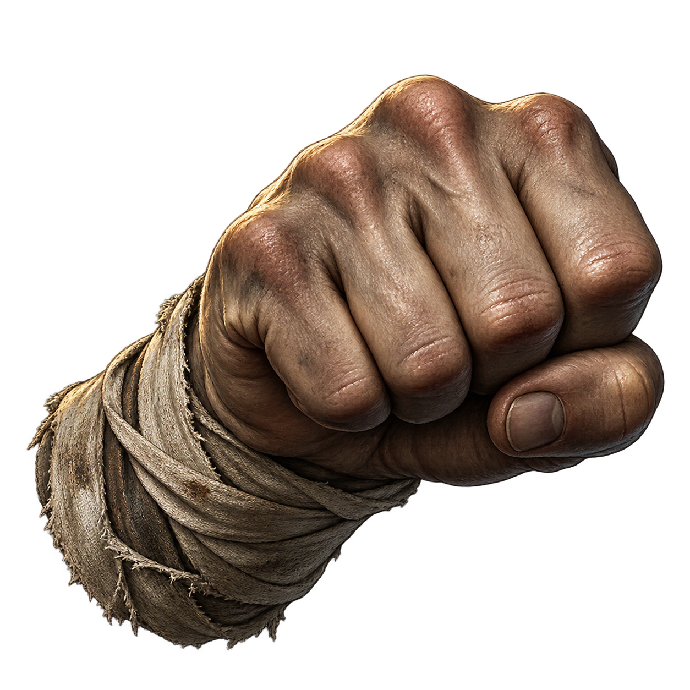
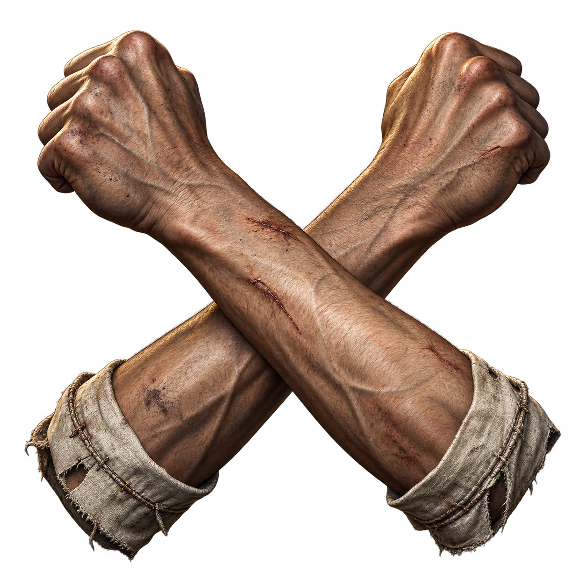

# Базовая экипировка

Каталог: `data/basic-equipment.json`. Правила — [RULES.md](RULES.md), формулы — [FORMULAS.md](FORMULAS.md).

### 15.1. КУЛАК

**Каталог:** `data/weapons.json` → `fist`.

**Вид и облик:** сжатая человеческая кисть без оружия и перчатки; следы труда и возраста соответствуют владельцу.

**Происхождение:** последняя возможность защищаться, когда за поясом ничего не осталось. Удар свободной рукой не требует магии.

**Текст действия:** «В дороге можно потерять всё. Пока пальцы сгибаются, ещё не всё потеряно».

### 15.2. НОГА

**Каталог:** `data/armor.json` → `bare-foot`.

**Описание:** Босая человеческая ступня, покрытая дорожной пылью.

### 15.3. БЛОК РУКАМИ

**Каталог:** `data/weapons.json` → `bare-hands`.

**Описание:** Скрещённые предплечья человека, готового защититься без щита.

