# Персонажи сценария «Последний носитель»

Анкеты вынесены из [STORY.md](STORY.md). Здесь хранятся роли, ограничения образа и портреты; реплики и последовательность сцен остаются в сценарии. Новые детали внешности — художественное дополнение к прежним анкетам.

Машиночитаемый каталог — `data/story-characters.json`. Это данные для будущего сюжетного слоя: наличие записи не добавляет случайного врага и само по себе не подключает диалоговый интерфейс. Сюжетные персонажи не включены в список выбираемых портретов героя и не дублируют виды в `data/creatures.json`.

## Портреты и использование

Именные собеседники изображены отдельными портретами и смотрят влево. Свет всегда сверху и спереди-слева относительно изображения; зеркальное отражение запрещено. Портрет героя берётся из текущего персонажа игрока и смотрит вправо. Аттрактор использует существующий портрет камня. Название, изображение и голос скрыты от игрока до объяснения Севрана в сцене 1.2 (`attractorKnown: true`), включая окна поражения. Картинки в `public` не содержат реплик: при текстовой правке проверяются их ссылки и условия показа; сами портреты заменяются при изменении образа персонажа. Чёрный фон, формат 2:3, без рамки, текста и оружия; отображаемая ширина 200 px. Полные требования — [ART_DIRECTION.md](ART_DIRECTION.md).

Генерация семи новых портретов выполнена встроенным `image_gen`. Запросы, происхождение и пути сохранены в `art-prompts/story-characters-v1/generation-prompts.json`. Их идентичности сохраняются между сценами; изменение костюма или выражения не должно подменять лицо.

## Герой

**Каталог:** `data/story-characters.json` → `hero`.

Используется выбранный игроком портрет; новый портрет героя не создаётся.

**Роль и ограничения:** Обычный человек без заданного имени, пола, болезни или потерянной памяти. В прологе можно выбрать исходное отношение к найму: заработок, желание сделать полезное дело или возможность уйти из разорённых земель. Это влияет на реплики, а не задаёт особые способности. После катастрофы герой продолжает путь по собственной воле.

## Брат Севран

**Каталог:** `data/story-characters.json` → `sevran`.

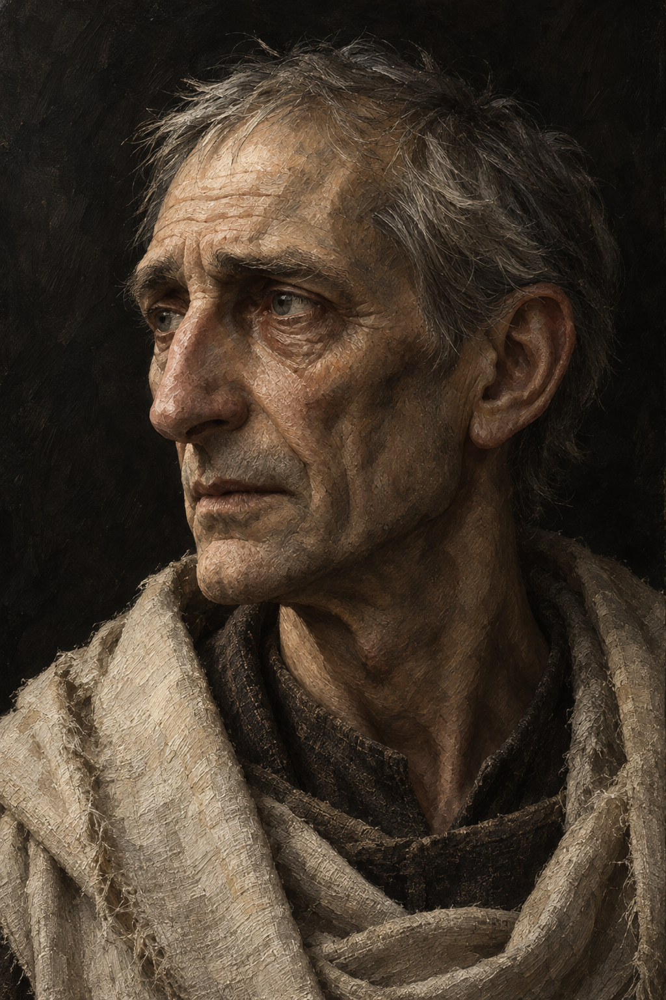

**Роль и ограничения:** Жрец Света и первоначальный носитель. Спокойный лекарь, искренне считающий изоляцию разрушительных существ помощью миру. Погибает в конце первой главы. Его слова позже вспоминаются, но сценарий не подтверждает, что его душа находится в камне.

**Внешность:** Пожилой человек с вытянутым лицом, заметным неровным носом, глубоко посаженными серыми глазами и короткими редеющими седыми волосами. Без бороды. Усталое внимательное выражение; простая выцветшая льняная одежда цвета слоновой кости поверх тёмной дорожной ткани.

## Марта

**Каталог:** `data/story-characters.json` → `marta`.

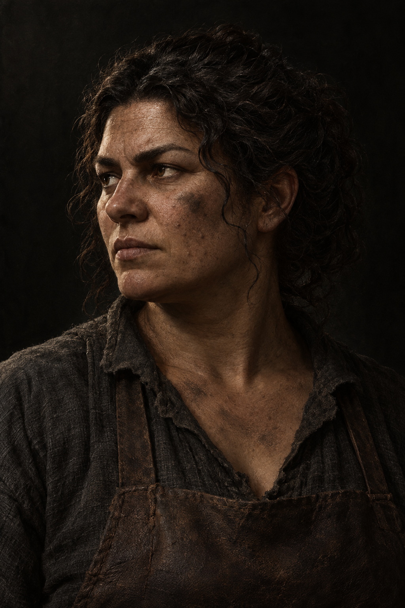

**Роль и ограничения:** Мирская кузнечиха и участница другого торгового каравана. Появляется со второй главы и временами пересекается с героем на больших дорогах. Чинит вещи жрецам, солдатам и беженцам; судит о человеке по поступкам. В лесной и болотной глубинке её заменяют оставленные мастерские и ремонтные места, а не необъяснимое мгновенное перемещение.

**Внешность:** Женщина средних лет с широким лицом, тёмной кожей, густыми бровями и просто собранными кудрявыми волосами. Следы сажи и старые неровности кожи. Сдержанный практичный взгляд; тёмная рабочая ткань и край потёртого кожаного фартука.

## Элиан

**Каталог:** `data/story-characters.json` → `elian`.

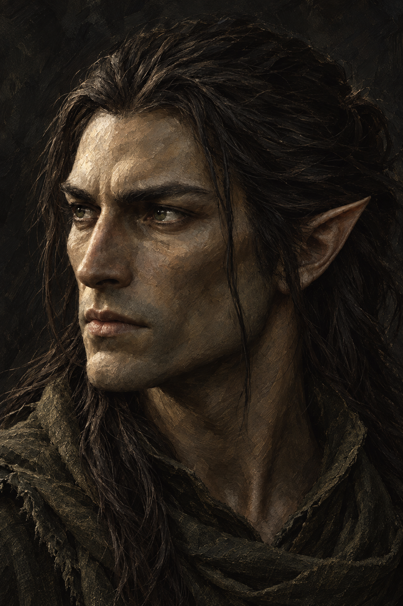

**Роль и ограничения:** Эльфийский проводник, выступающий против аттракторов. Помогает защищать лесную границу и хочет, чтобы герой услышал фею до того, как отдаст груз ордену. Не считает любое освобождение безопасным.

**Внешность:** Взрослый эльф с тонким асимметричным лицом, выраженными скулами, оливковым оттенком кожи, длинными тёмными волосами и удлинёнными заострёнными ушами. Внимательные зелёные глаза без свечения. Простая тёмная ткань лесных оттенков.

## Сестра Тея

**Каталог:** `data/story-characters.json` → `thea`.

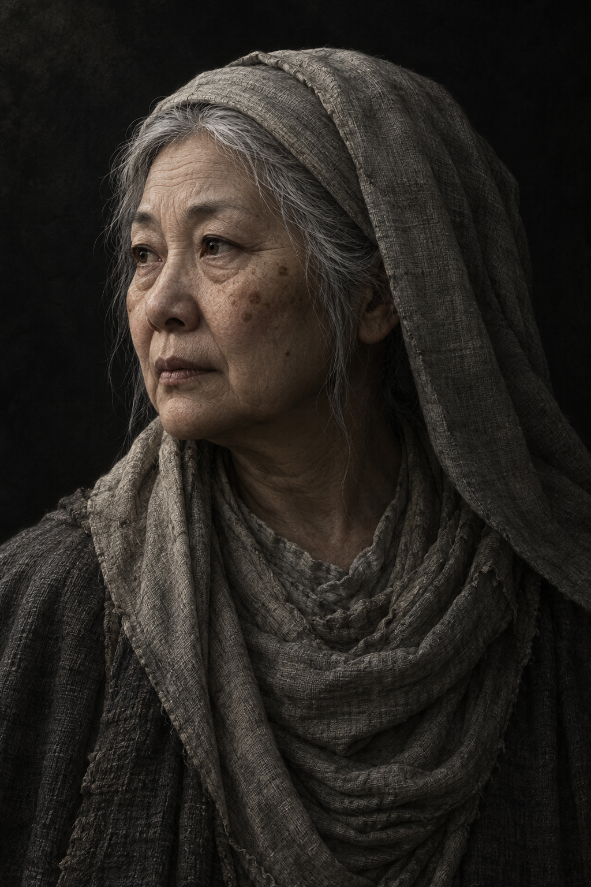

**Роль и ограничения:** Отшельница Млечного познания. Убеждена в бесконечности самонаблюдения Логоса. Не превращается в активного борца против ордена Света: беседует, наблюдает и предоставляет убежище, но не отправляется в поход.

**Внешность:** Пожилая женщина с округлым лицом восточноазиатского облика, морщинами, пигментными пятнами и спокойными тёмными глазами. Седые волосы убраны под простой льняной платок, не закрывающий лицо. Грубая серо-пепельная ткань без украшений.

## Нима Подкоренная

**Каталог:** `data/story-characters.json` → `nima`.

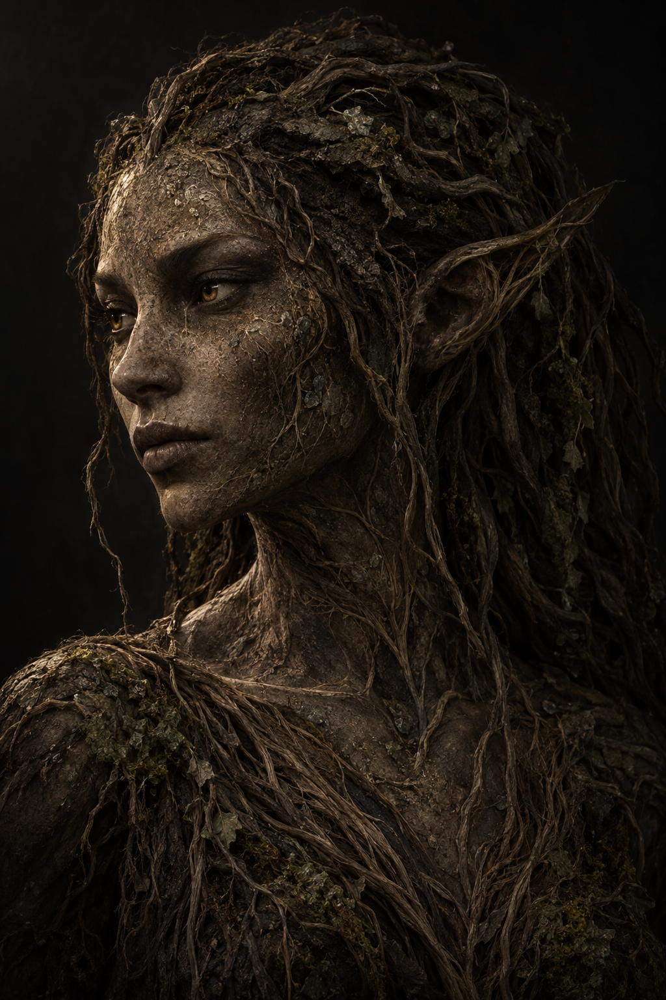

**Роль и ограничения:** Тёмная фея, связанная с подземными корневыми полостями. Её местность тянется под болотом до известняковой долины у захоронения. Это локальная территория одной феи, а не способность всех фей являться где угодно. Может разрушить аттрактор, но не обещает безопасного результата.

**Внешность:** Нечеловеческий взрослый облик: лицо из влажной земли, тонких корневых волокон и тусклых минеральных включений. Удлинённые уши и волосы-корни, приглушённые янтарные глаза. Плечи и торс продолжают ту же природную структуру. Без крыльев, рогов и обязательных признаков злодейства.

## Вейр

**Каталог:** `data/story-characters.json` → `veyr`.

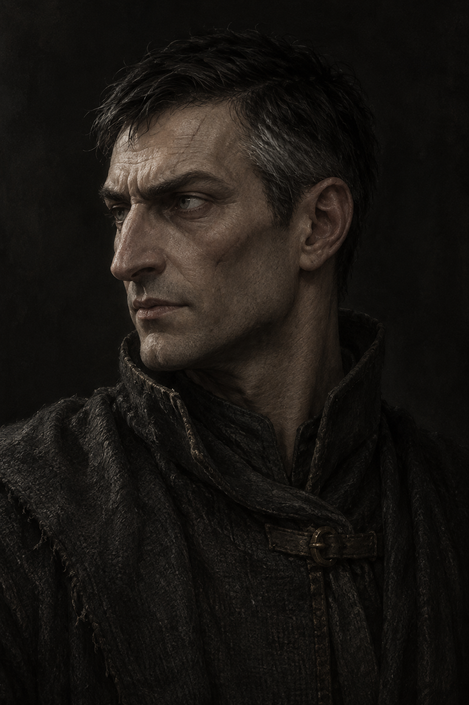

**Роль и ограничения:** Бывший боевой маг, объявленный своим командованием дезертиром за нападение на собственный обоз. В сценарии его военная защита официально снята, о чём герой узнаёт в городе. Он не представитель всего жречества или всех магов. Желает захватить камень и принудить других людей добывать для него новые осколки. Использует наёмников и магически созданных стражей; с демонами не заключает удобного взаимовыгодного союза.

**Внешность:** Человек средних лет с худым обветренным лицом, неровным крючковатым носом, короткими тёмными волосами и сединой на висках. Без бороды; узкий расчётливый взгляд. Простая изношенная тёмная одежда с высоким воротом, без заранее назначенного оружия.

## Хранительница Аста

**Каталог:** `data/story-characters.json` → `asta`.

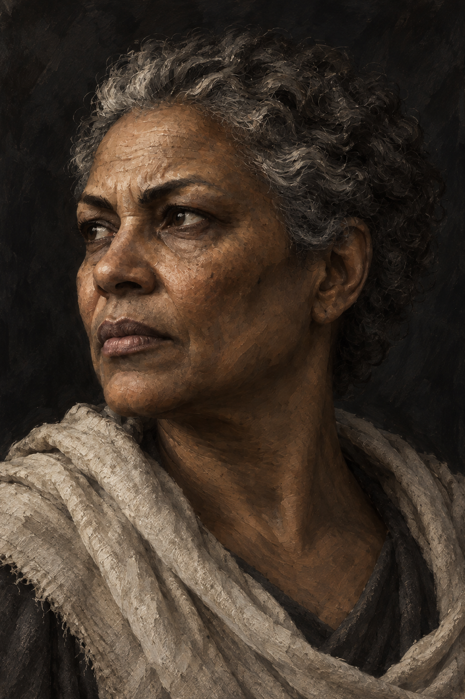

**Роль и ограничения:** Жрица Света при тайном захоронении. Принимает раненых служителей и следит за доставленными камнями. Признаёт, что знаний ордена недостаточно, но считает изоляцию менее опасной, чем возвращение разрушительных частиц в мир.

**Внешность:** Зрелая женщина с широким лицом, тёмной кожей, короткими седеющими кудрями и немного несимметричными бровями. Спокойный требовательный взгляд. Состаренный светлый лён на плечах поверх тёмной ткани; без нимба, короны и богатых украшений.

## Голос аттрактора

**Каталог:** `data/story-characters.json` → `attractor`.

**Роль и ограничения:** Формирующееся сознание наполненного камня. В этом сценарии герой слышит его внутренне, в том числе на остановках; окружающие не слышат речь напрямую. Это художественное решение, не доказательство чувствительности героя. Голос не всеведущ и не может читать все события за пределами восприятия носителя.

## Эпизодические персонажи и человеческие маски

Все 25 ранее неназначенных образов получили собственные портреты. Связь: `data/story.json` → `speakers[id].portrait` (`kind: character`) → `data/story-characters.json` → файл в `public/characters`. Подпись роли может меняться, но ID и лицо сохраняются. Другие говорящие существа используют существующие портреты бестиария.

Три маски отмечены `portrayal: humanDisguise`: до разоблачения это человеческие лица без признаков демона, вампира или болотницы. После события раскрытия используется `revealedSpeakerId` из сценария. Сюжетные условия раскрытия и реплики не менялись.

Портреты созданы встроенным `image_gen`; точные запросы и пути оригиналов — [generation-prompts.json](../art-prompts/story-extras-v1/generation-prompts.json). Все смотрят влево, свет сверху и спереди-слева, холст 1024 × 1536; без оружия и рамок. Изображения подготовлены для сюжетного интерфейса, его подключение остаётся отдельной задачей.

### Возница

**Каталог:** `data/story-characters.json` → `convoy-driver`. **Сцены:** 1.1, 1.5.

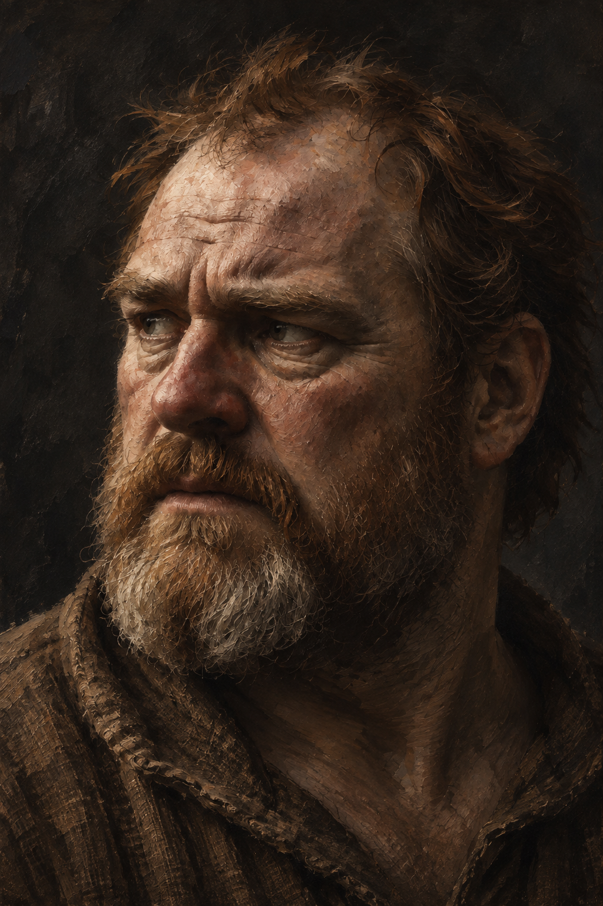

**Роль:** Возница исходного обоза; один образ в сценах 1.1 и 1.5.

**Внешность:** Мужчина около пятидесяти лет с широким обветренным лицом, густыми бровями, рыжеватой бородой с сединой и редеющими волосами. Грубый бурый лён.

### Разбойник — пленник обоза

**Каталог:** `data/story-characters.json` → `convoy-bandit`. **Сцены:** 1.3, 1.4.

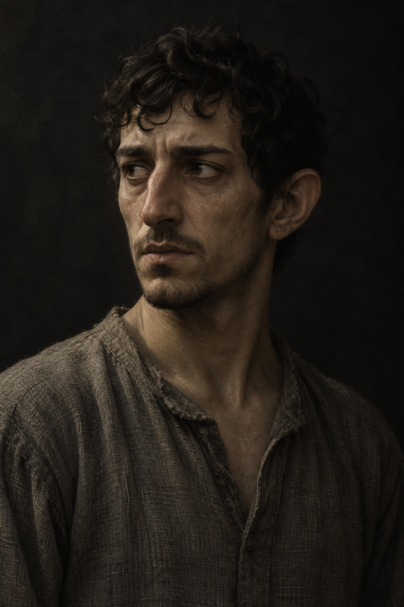

**Роль:** Разбойник из 1.3, затем тот же пленник в 1.4; смена подписи не меняет лицо.

**Внешность:** Молодой взрослый мужчина с узким лицом, оливковой кожей, короткими тёмными кудрями, оттопыренными ушами и лёгкой щетиной. Пыльная серая рубаха.

### Наёмник у моста

**Каталог:** `data/story-characters.json` → `bridge-mercenary`. **Сцены:** 1.7.

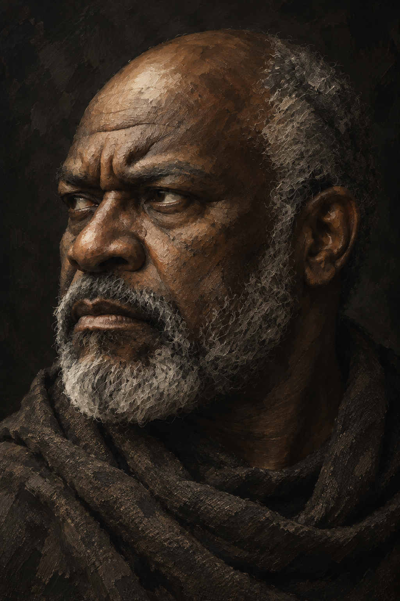

**Роль:** Противник у моста в 1.7; не тот же человек, что городские и крепостные наёмники.

**Внешность:** Пожилой крепкий мужчина с лысой макушкой, тёмной кожей, короткой седой бородой и глубокой складкой между бровями. Тёмная шерсть.

### Женщина у двери

**Каталог:** `data/story-characters.json` → `bridge-woman`. **Сцены:** 1.8.

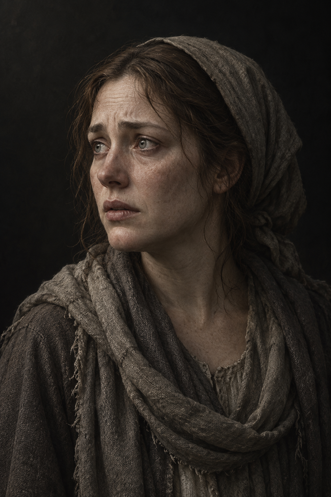

**Роль:** Человеческая маска демона до разоблачения; портрет не должен выдавать вид.

**Внешность:** Взрослая женщина с округлым бледным лицом, веснушками, мягкими серыми глазами и каштановыми волосами под простым дорожным платком. Усталый просящий взгляд.

### Городской вымогатель

**Каталог:** `data/story-characters.json` → `city-raider`. **Сцены:** 2.1.

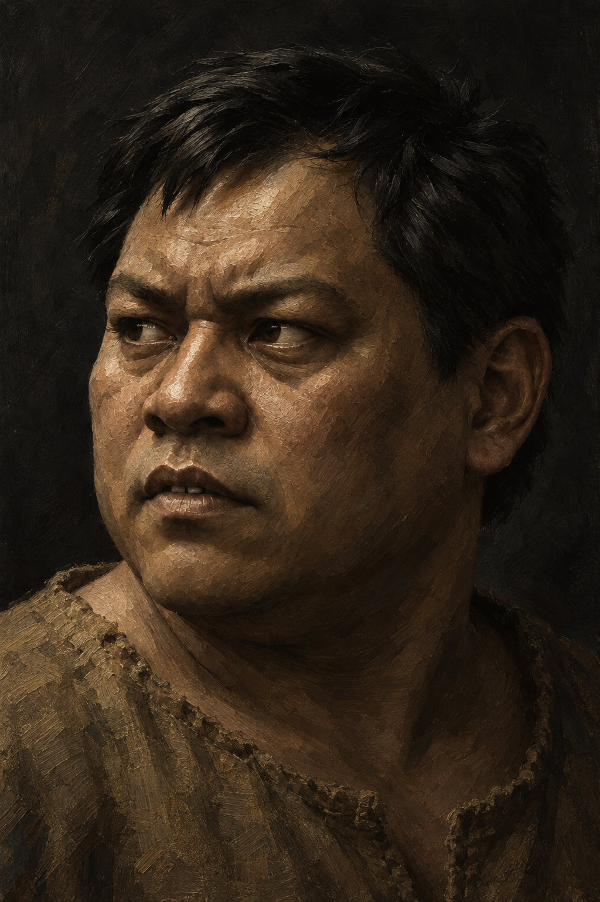

**Роль:** Вымогатель у входа в город в 2.1.

**Внешность:** Коренастый взрослый мужчина с круглым лицом, короткими чёрными волосами, широкими скулами и маленькой щербинкой между зубами. Тусклая охристая ткань.

### Городской дозорный

**Каталог:** `data/story-characters.json` → `city-watch`. **Сцены:** 2.1.

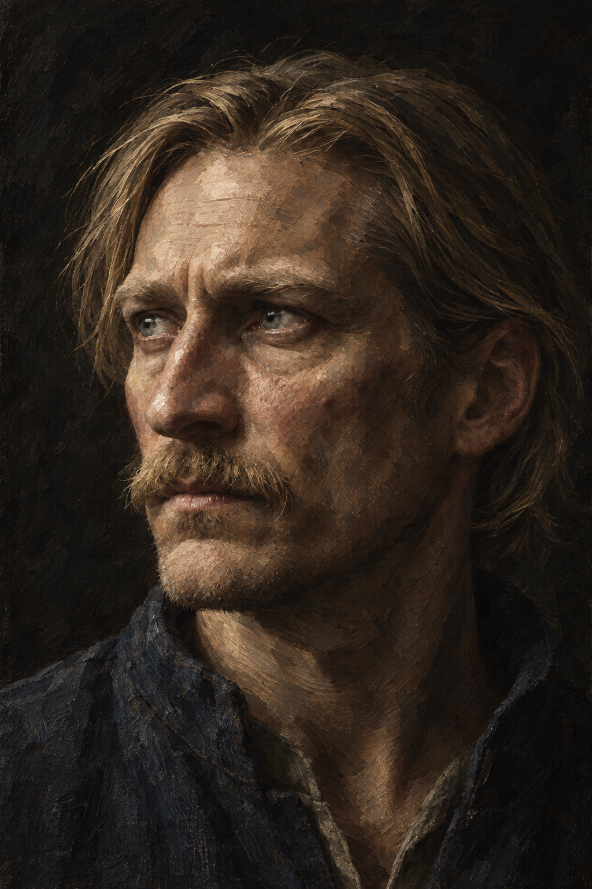

**Роль:** Дозорный, останавливающий стычку в 2.1.

**Внешность:** Мужчина средних лет с вытянутым светлым лицом, прямым носом, светлыми усами и волосами до ушей. Выцветший тёмно-синий ворот.

### Жрица приёмного дома

**Каталог:** `data/story-characters.json` → `city-priestess`. **Сцены:** 2.2, 2.9.

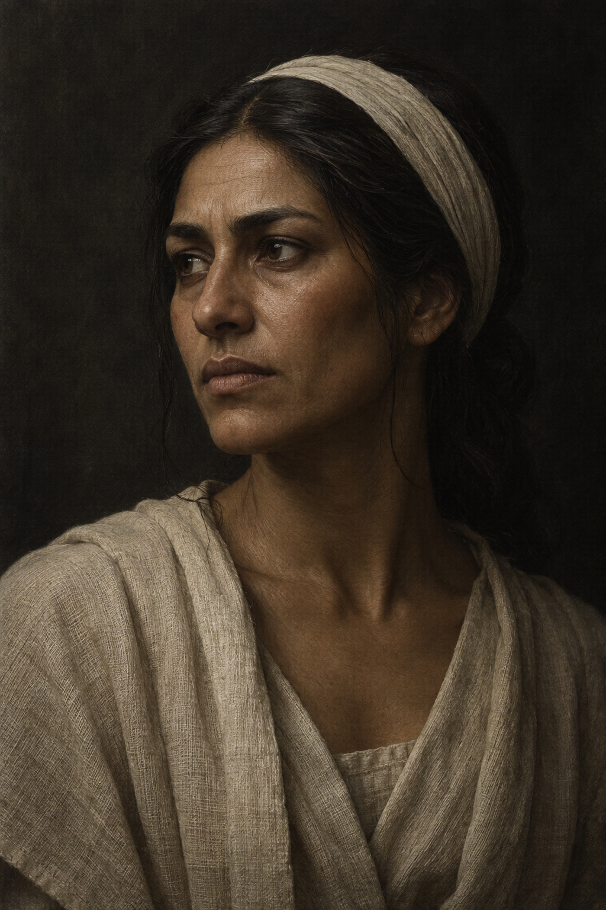

**Роль:** Жрица Перевальца в 2.2 и 2.9; не Аста и не Тея.

**Внешность:** Женщина около сорока лет с вытянутым смуглым лицом, тёмными внимательными глазами и чёрными волосами под светлой льняной повязкой. Усталое спокойствие.

### Наёмник у зерна

**Каталог:** `data/story-characters.json` → `grain-mercenary`. **Сцены:** 2.3.

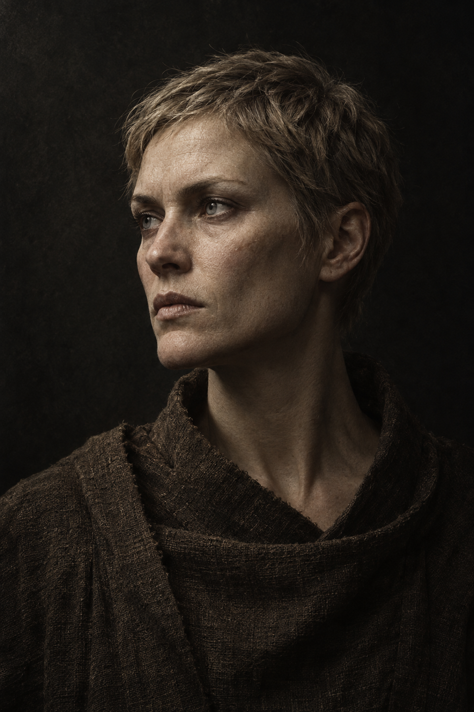

**Роль:** Наёмник у отнятого зерна в 2.3.

**Внешность:** Взрослая женщина с угловатым светлым лицом, коротко остриженными пепельными волосами и серыми глазами. Грубая тёмно-бурая ткань.

### Торговка

**Каталог:** `data/story-characters.json` → `city-trader`. **Сцены:** 2.3, 2.4.

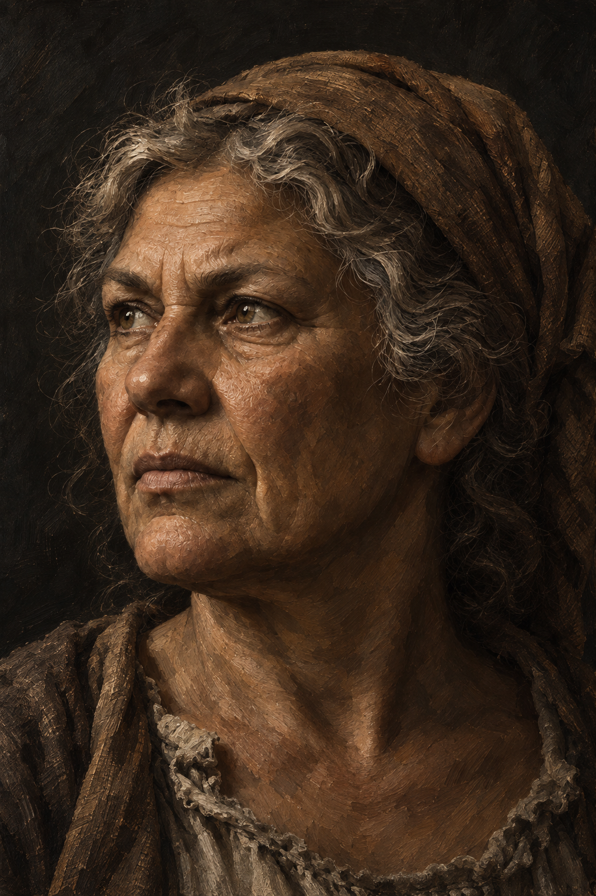

**Роль:** Торговка Перевальца в 2.3–2.4, связанная с зерном и лекарствами.

**Внешность:** Пожилая женщина с широким загорелым лицом, живыми карими глазами, морщинами у рта и густыми седыми волосами под бурым платком.

### Скупщик

**Каталог:** `data/story-characters.json` → `city-buyer`. **Сцены:** 2.4.

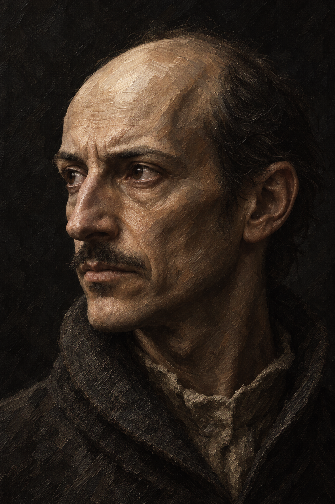

**Роль:** Скупщик лекарств в 2.4.

**Внешность:** Худощавый мужчина средних лет с лысиной, небольшими круглыми глазами, тонкими усами и узким подбородком. Высокий ворот выцветшей шерстяной одежды.

### Телохранитель гостиницы

**Каталог:** `data/story-characters.json` → `inn-bodyguard`. **Сцены:** 2.5.

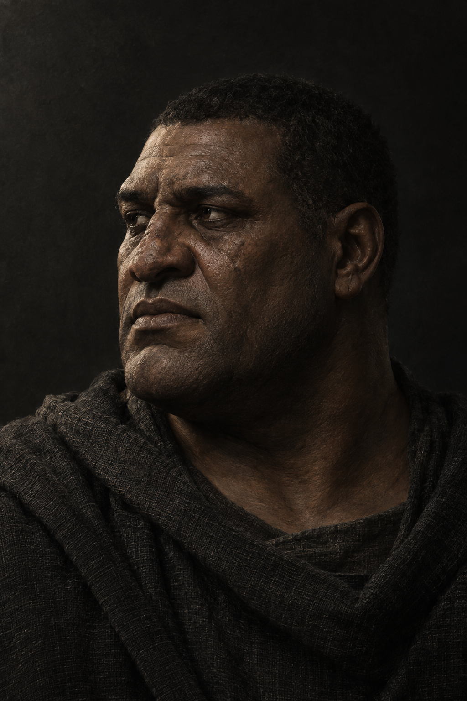

**Роль:** Телохранитель у «Тихой двери» в 2.5.

**Внешность:** Крупный взрослый мужчина с широким тёмным лицом, очень короткими волосами, сломанным носом и гладко выбритым подбородком.

### Хозяин гостиницы

**Каталог:** `data/story-characters.json` → `innkeeper-mask`. **Сцены:** 2.5, 2.6.

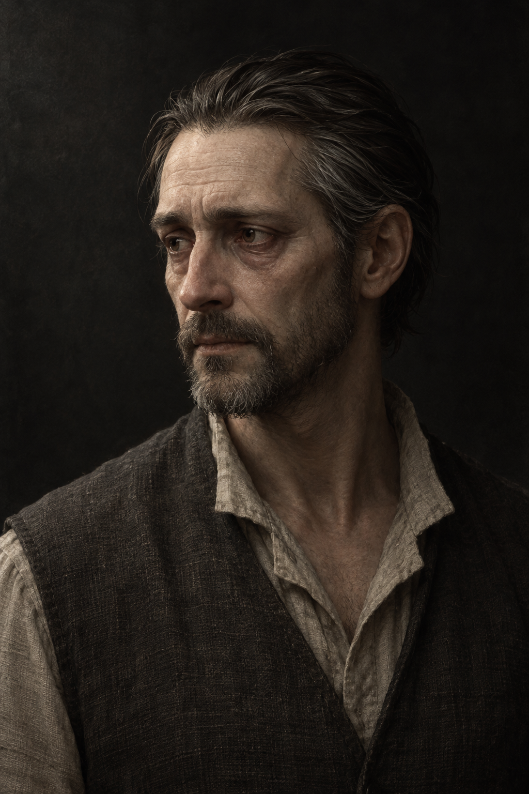

**Роль:** Человеческий образ вампира до разоблачения в 2.9; тот же хозяин в 2.5–2.6.

**Внешность:** Ухоженный мужчина средних лет с худым бледным лицом, зачёсанными назад тёмными волосами, мягкими глазами и аккуратной короткой бородой. Опрятный, но выцветший ворот.

### Слуга гостиницы

**Каталог:** `data/story-characters.json` → `inn-servant`. **Сцены:** 2.7.

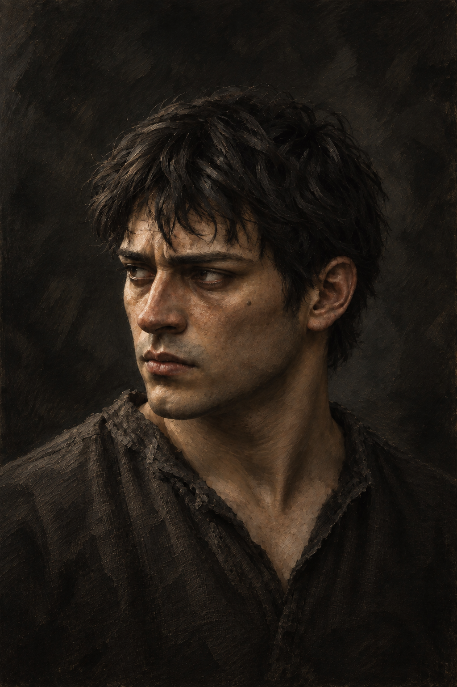

**Роль:** Слуга, преграждающий путь в 2.7.

**Внешность:** Молодой взрослый мужчина с мягким широким лицом, светло-оливковой кожей, прямыми чёрными волосами и родинкой у щеки. Тёмная рабочая рубаха.

### Пленник гостиницы

**Каталог:** `data/story-characters.json` → `inn-prisoner`. **Сцены:** 2.7.

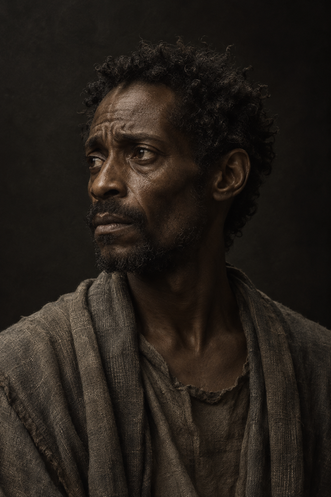

**Роль:** Освобождённый человек из подвала гостиницы в 2.7.

**Внешность:** Худой мужчина средних лет с впалыми щеками, тёмной кожей, короткими спутанными волосами и редкой бородой. Изношенная серо-бурая ткань.

### Налётчик у лесного рубежа

**Каталог:** `data/story-characters.json` → `border-raider`. **Сцены:** 3.3.

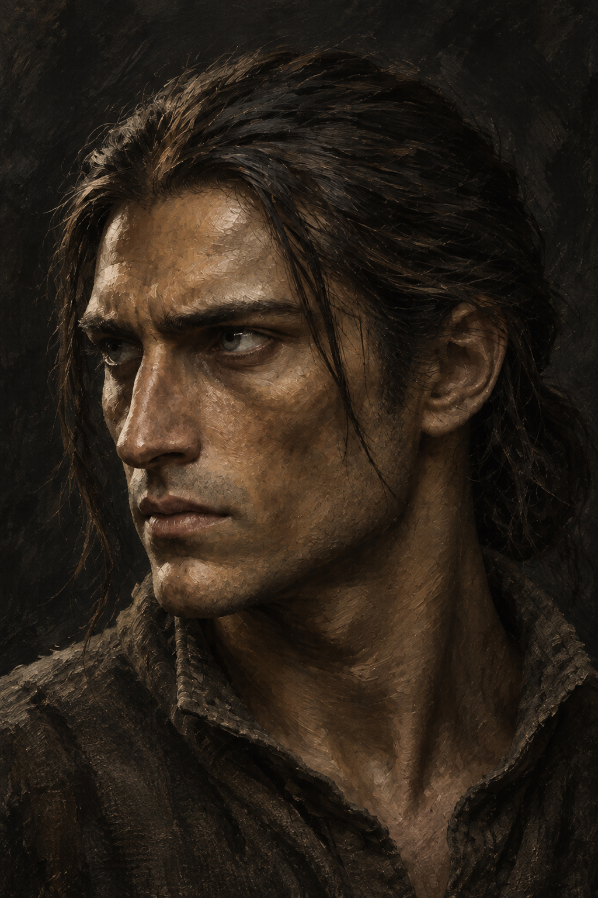

**Роль:** Противник в варианте 3.3 при уважении лесной границы.

**Внешность:** Молодой взрослый мужчина с вытянутым загорелым лицом, длинным узким носом и тёмными волосами, стянутыми сзади.

### Раненый мародёр

**Каталог:** `data/story-characters.json` → `wounded-marauder`. **Сцены:** 3.6.

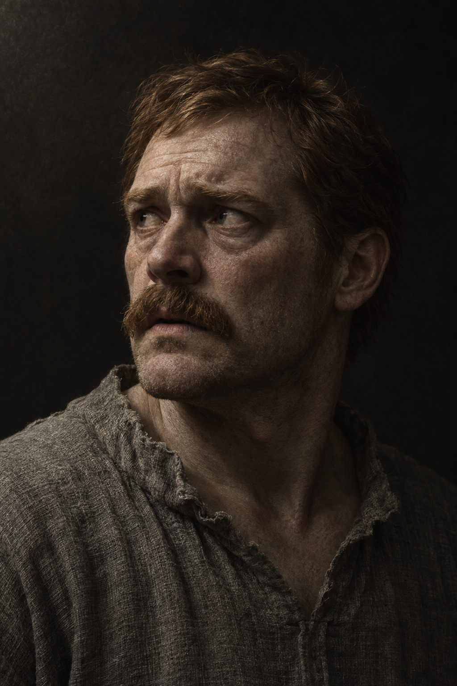

**Роль:** Беспомощный пленник в 3.6; судьба зависит от выбора героя.

**Внешность:** Мужчина средних лет с квадратным лицом, рыжеватыми волосами, густыми усами и неровными бровями. Бледность и усталость без изображения свежих ран.

### Старуха в камышах

**Каталог:** `data/story-characters.json` → `reed-crone`. **Сцены:** 4.3.

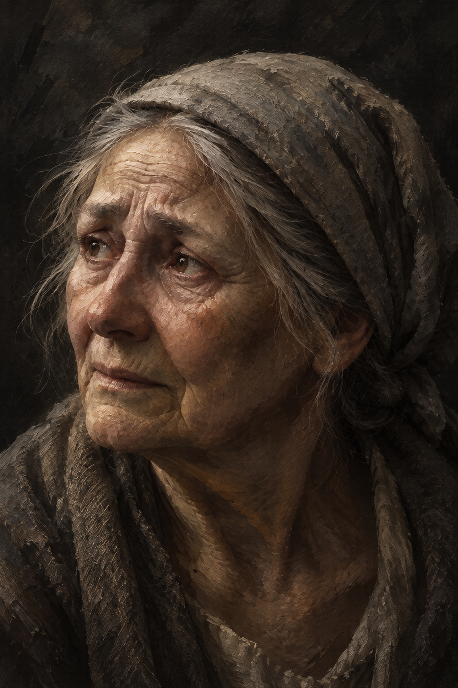

**Роль:** Безобидная человеческая маска болотницы до захвата в 4.3.

**Внешность:** Невысокая на вид пожилая женщина с мягкими щеками, глубокими морщинами и седыми волосами под простым серым платком. Просит помощи.

### Пленник болотницы

**Каталог:** `data/story-characters.json` → `marsh-prisoner`. **Сцены:** 4.3, 4.9.

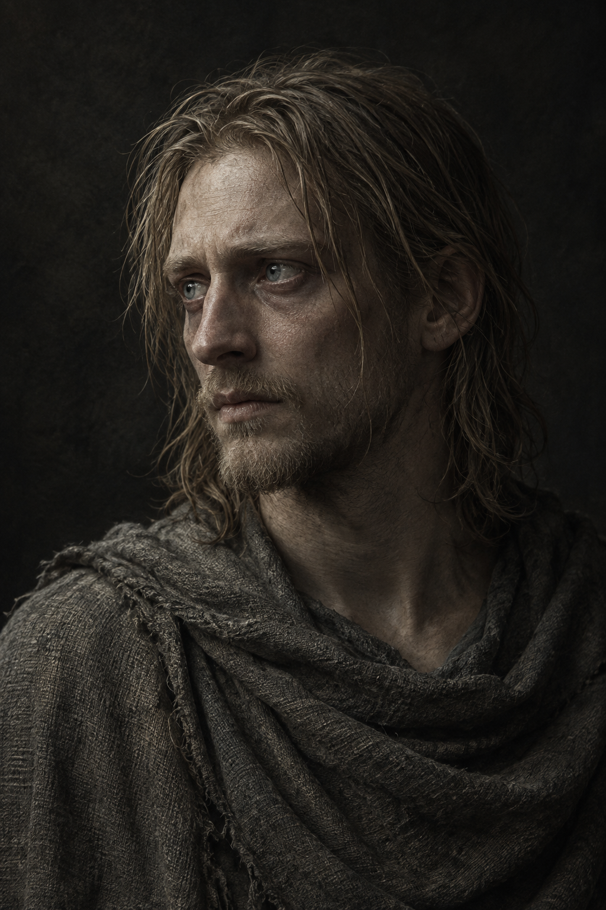

**Роль:** Пленник из 4.3, тот же освобождённый человек в 4.9.

**Внешность:** Молодой взрослый мужчина с узким бледным лицом, длинными светлыми волосами и небольшой бородой. Истощение, влажная грубая ткань.

### Преследователь на болотах

**Каталог:** `data/story-characters.json` → `marsh-pursuer`. **Сцены:** 4.7.

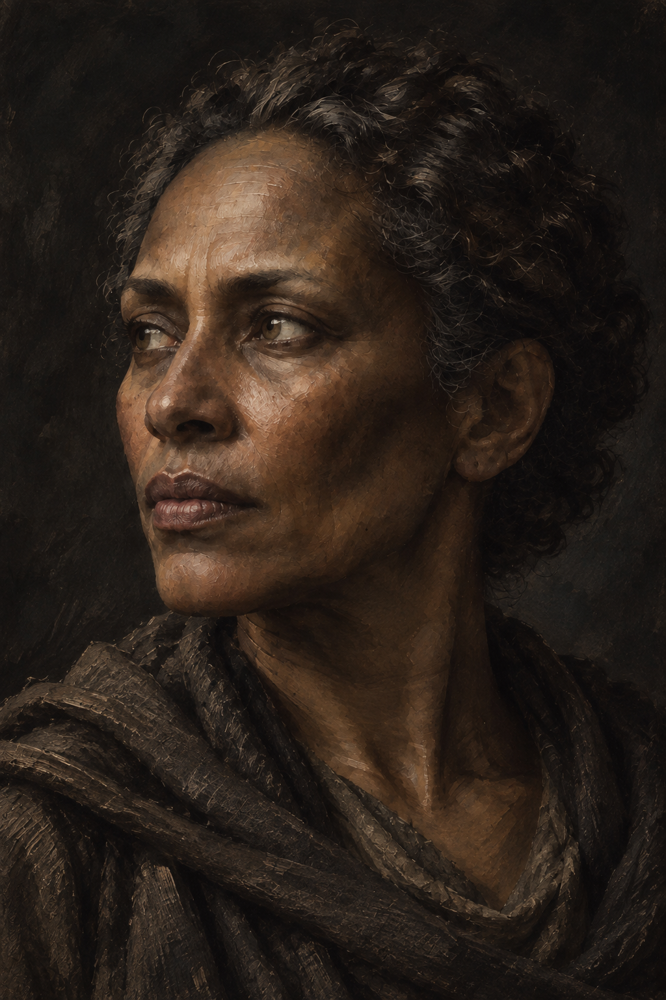

**Роль:** Наёмник Вейра в 4.7.

**Внешность:** Женщина средних лет с вытянутым тёмным лицом, короткими кудрями, высоким лбом и внимательными глазами. Тёмная дорожная ткань.

### Дозорный каравана

**Каталог:** `data/story-characters.json` → `caravan-watch`. **Сцены:** 5.4, 5.7.

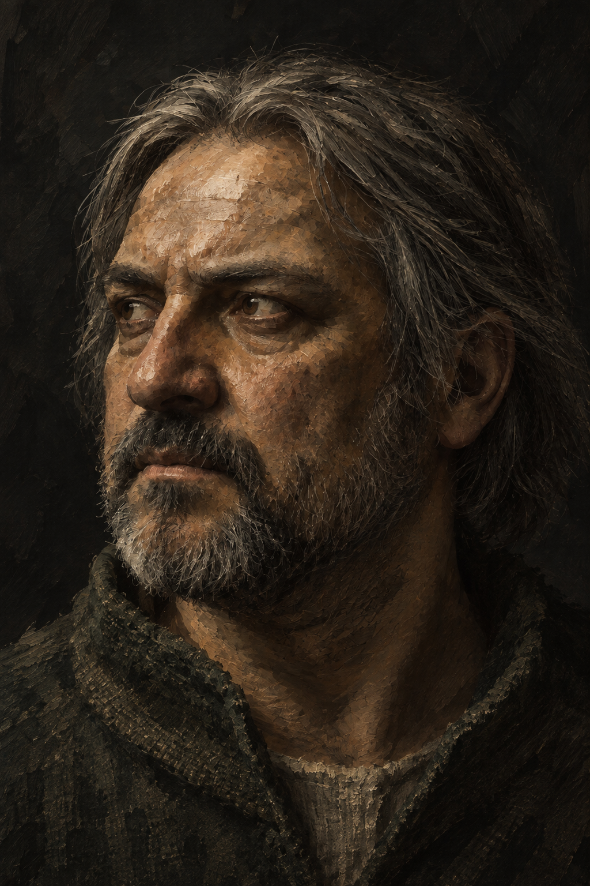

**Роль:** Один дозорный в 5.4 и 5.7; помогает распространить приказы.

**Внешность:** Мужчина средних лет с округлым обветренным лицом, прямыми седыми волосами, короткой бородой и широко посаженными глазами.

### Наёмник крепости

**Каталог:** `data/story-characters.json` → `fortress-mercenary`. **Сцены:** 5.7.

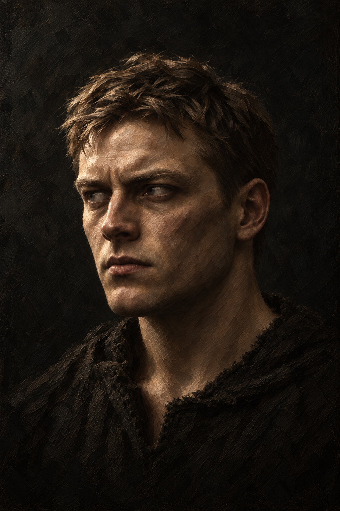

**Роль:** Противник в варианте 5.7 при скрытых приказах.

**Внешность:** Молодой взрослый мужчина с гладко выбритым светлым лицом, широким лбом, тяжёлыми веками и короткими тёмно-русыми волосами.

### Связной ордена

**Каталог:** `data/story-characters.json` → `order-courier`. **Сцены:** 5.8.

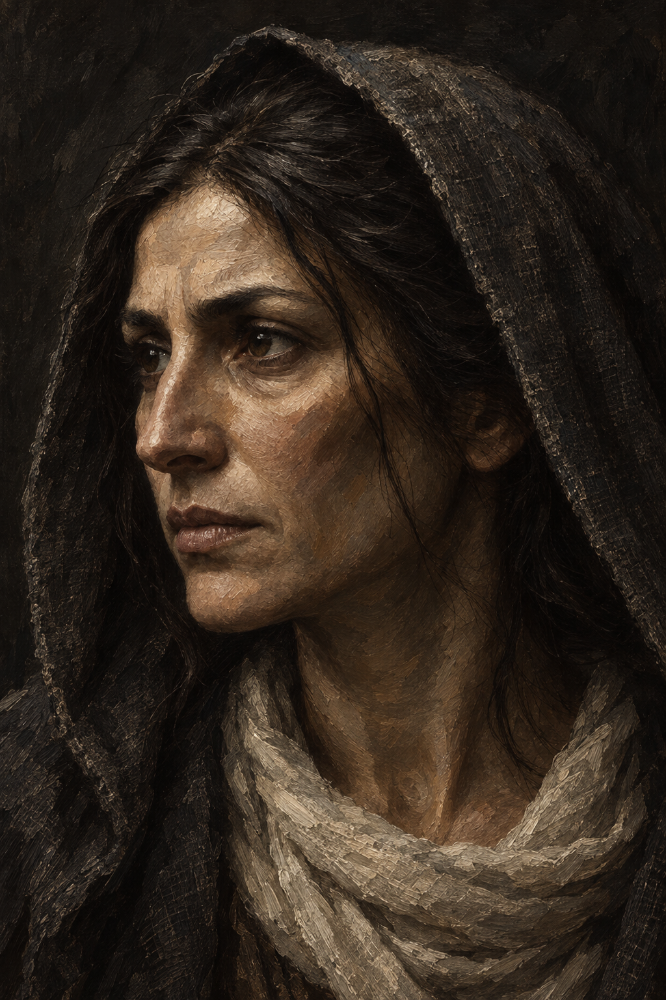

**Роль:** Связной Света в 5.8; помогает прочитать маршрут к захоронению.

**Внешность:** Взрослая женщина с узким оливковым лицом, длинным прямым носом, тёмными волосами под простым капюшоном и тёмными глазами.

### Солдат гарнизона

**Каталог:** `data/story-characters.json` → `garrison-soldier`. **Сцены:** 5.9.

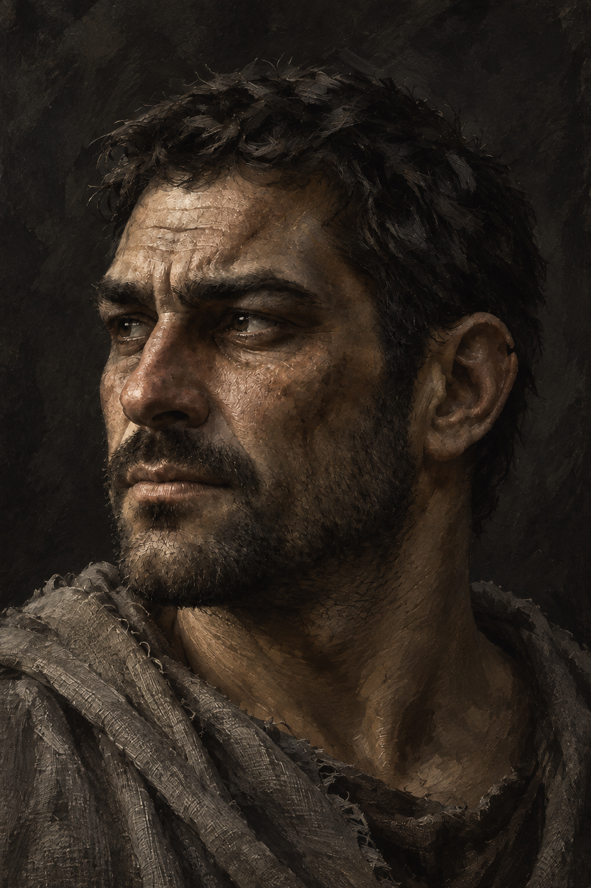

**Роль:** Солдат после боя в крепости в 5.9.

**Внешность:** Мужчина около сорока лет с широким светло-коричневым лицом, короткими жёсткими волосами, густыми бровями и щетиной.

### Охотник Вейра

**Каталог:** `data/story-characters.json` → `veyr-hunter`. **Сцены:** 6.3.

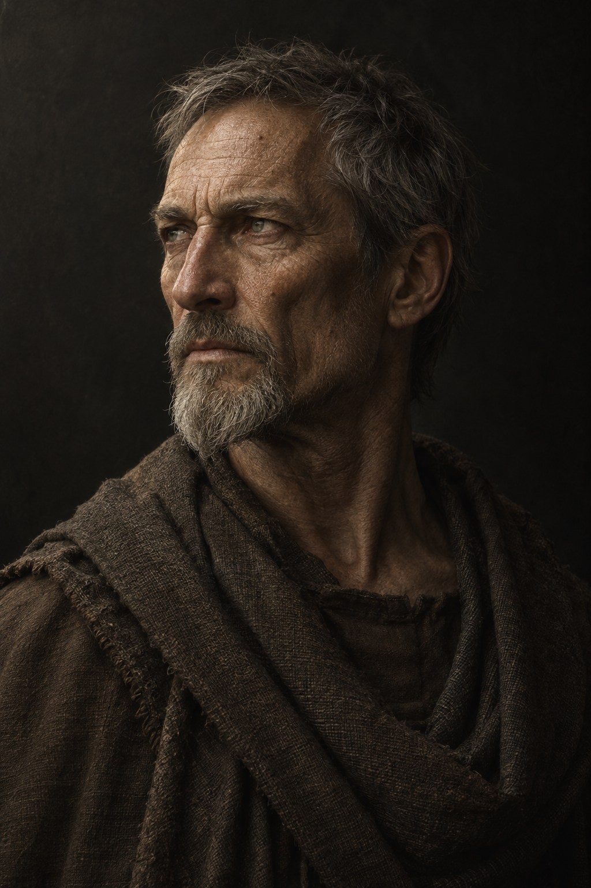

**Роль:** Наёмный охотник в долине, сцена 6.3.

**Внешность:** Пожилой худощавый мужчина с длинным загорелым лицом, короткими седыми волосами, клиновидной бородой и прищуренными глазами.

### Раненый солдат

**Каталог:** `data/story-characters.json` → `wounded-soldier`. **Сцены:** prologue.

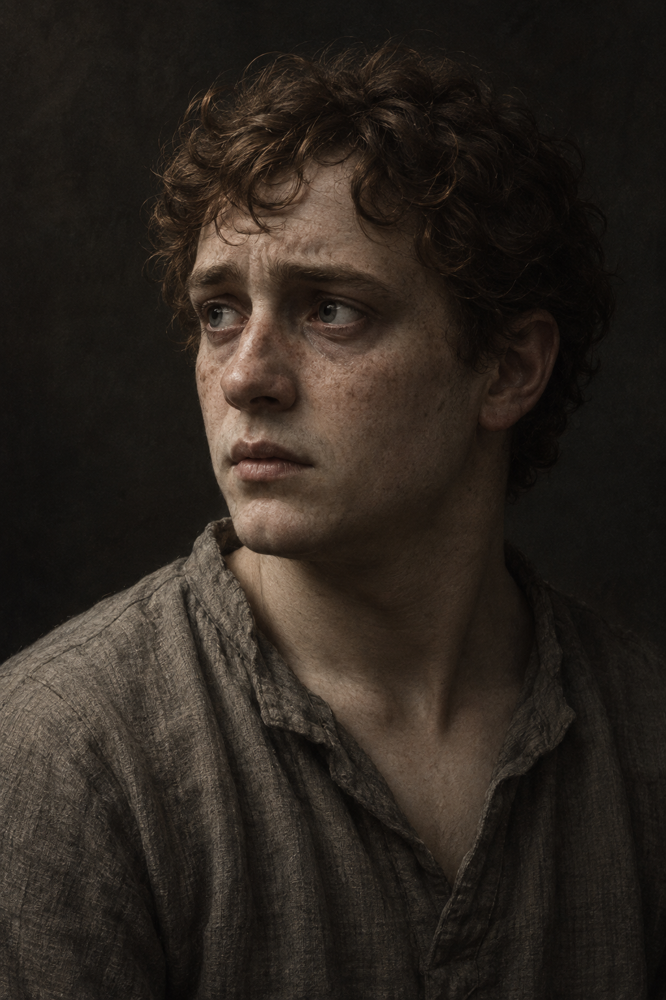

**Роль:** Солдат, которому Севран помогает в прологе; не солдат гарнизона.

**Внешность:** Молодой взрослый мужчина с округлым лицом, веснушками, короткими вьющимися каштановыми волосами и растерянным взглядом.

