# Бестиарий и народы

Художественный каталог существ: происхождение, внешность, среда, поведение и варианты текстовых встреч. ID, номера разделов и относительные пути изображений сохраняют связь с `data/creatures.json`. Литературные способности и уязвимости не вводят дополнительные механики; описания отмеченных дополнений можно развивать в рамках [LORE.md](LORE.md).

Собственные действия, боевой допуск и ограничения экипировки вынесены в [RULES.md](RULES.md#собственные-действия-и-экипировка-существ), расчёты — в [FORMULAS.md](FORMULAS.md), художественные требования — в [ART_DIRECTION.md](ART_DIRECTION.md#существа-и-действия). Формат каталога — [data/CREATURES.md](../data/CREATURES.md).

## 10. БЕСТИАРИЙ И НАРОДЫ: ИСХОДНЫЕ СУЩЕСТВА

### 10.1. ДЕМОН

**Каталог:** `data/creatures.json` → `demon`.

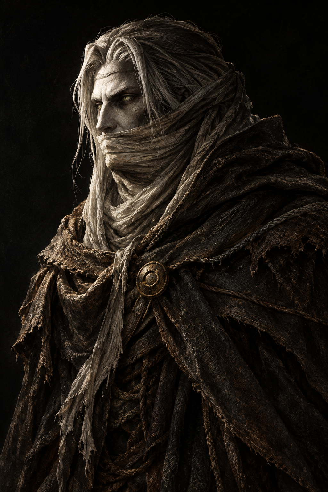

**Иллюстрации действий:**

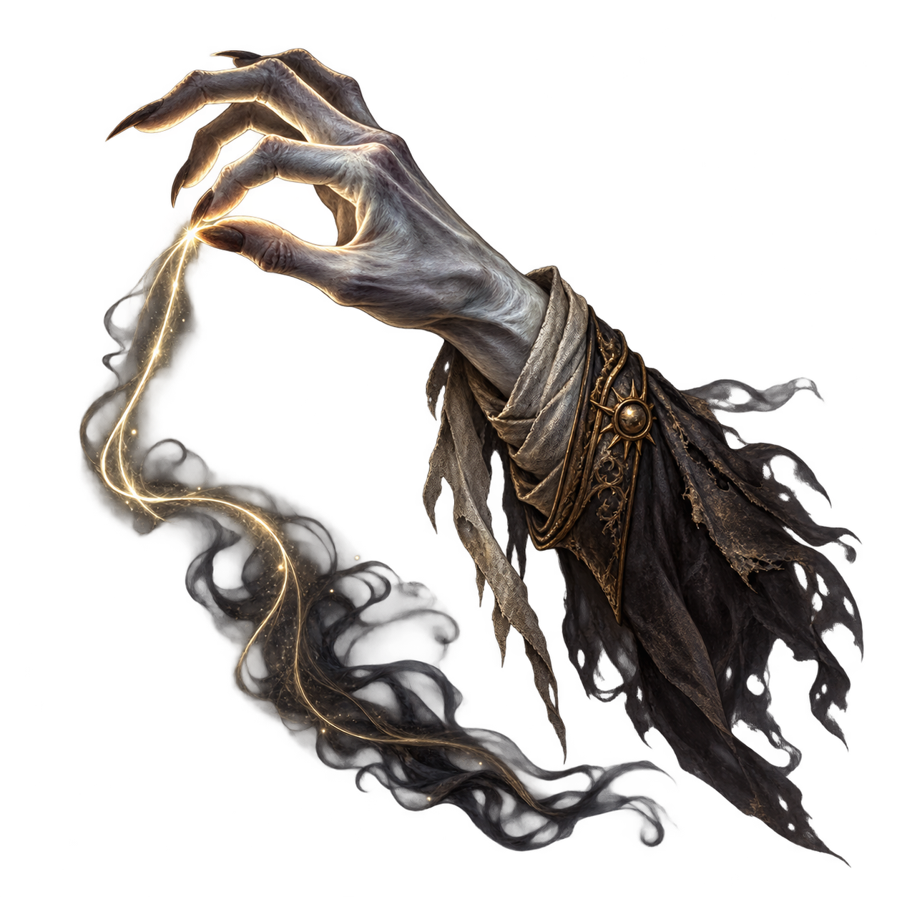

Истощение.

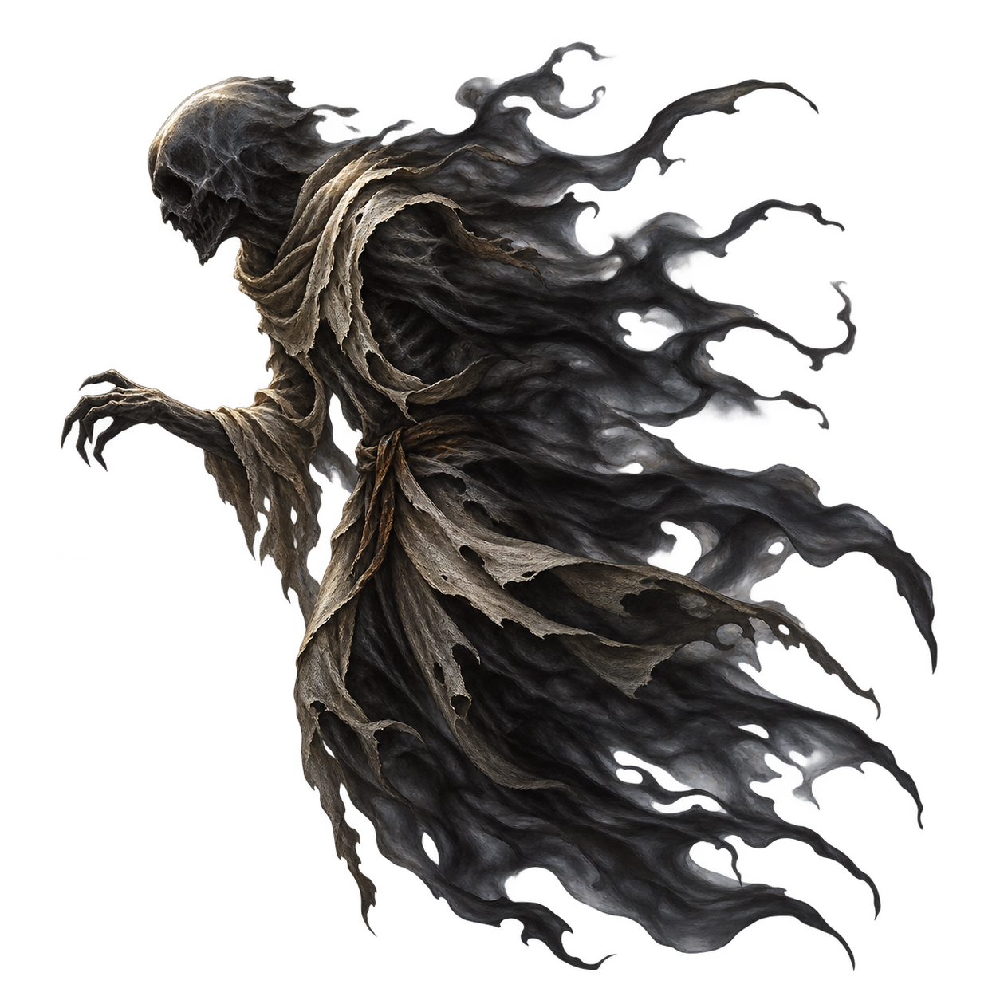

Ускользание.

**Основа:** враждебное человеку пограничное существо из иного пространства. Стремится поглотить человеческую душу — крупицу Логоса — и увеличить собственную силу. Практически не вступает с людьми в деловые отношения.

**Внешность:** принимает любое выгодное обличье. Часто выглядит как ребёнок или безобидная женщина, чтобы не вызывать настороженности и встречной агрессии. Устойчивый «истинный облик» не задан.

**Поведение:** может вручить подарок, продать или передать предмет, предложить приготовленный напиток. Через это устанавливает связь с человеком, затем проникает в его сознание через сны. Жертва болеет, слабеет и постепенно теряет способность сопротивляться.

**Места:** таверны, гостиницы, ярмарки, города; среди прикрытий — работник таверны, продавец безделушек и украшений, женщина, оказывающая сексуальные услуги.

**Способности:** изменение облика, проникновение в сны, установление связи с жертвой и поглощение души. Чтобы окончательно завладеть душой, обязан уничтожить человека в материальном мире.

**Ограничения:** ради убийства материализуется и становится уязвимым. Люди не могут попасть в его родной мир обычным образом; жрецы способны частично проникать туда во сне и выслеживать его.

**Атака:** собственная атака текущего игрового вида — магическая. Демон всё равно материализуется для окончательного убийства человека. Физическое нападение допустимо в истории его облика; конкретные дополнительные действия в бою определяются выданной экипировкой, а не предполагаются автоматически.

**Диалог:** способен общаться ради обмана и сближения; полноценное выгодное обеим сторонам соглашение нетипично.

**Текст встречи — дополнение:** «Трактирщица ставит перед вами чашу. Вы ещё не назвали себя, но она уже произносит ваше имя — так же ласково, как голос в недавнем сне».

**Для изображения:** убедительность маски важнее привычных рогов и крыльев. Отдельная чудовищная тень может быть художественным приёмом, но не является постоянным признаком демона.

### 10.2. БЕСПЛОТНЫЕ ДУХИ, ЛЁГКИЕ ДУХИ И ПРИЗРАКИ

**Каталог:** `data/creatures.json` → `light-spirit`.

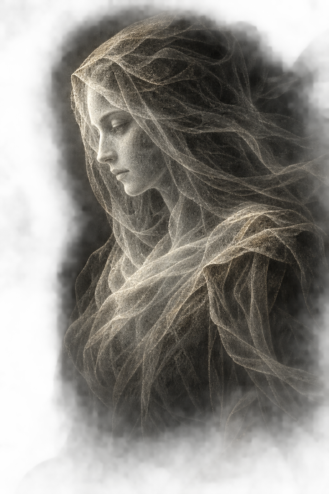

**Основа:** существа иных планов, случайно касающиеся материального мира. Не являются демонами.

**Внешность:** бледные, белёсые, едва уловимые фигуры или почти незаметное присутствие в воздухе. Отдельные призраки создают иллюзии.

**Поведение:** безвредны и инертны по отношению к людям. Могут подавать знаки, указывающие на места с хорошей или плохой энергией в зависимости от природы духа.

**Места:** жёсткая привязка не задана. Дополнение: тихие лесные прогалины, заброшенные помещения, берега и пещеры.

**Способности:** слабое проявление в реальности, иллюзии, знаки.

**Атака:** не предусмотрена для описанных безвредных духов.

**Уязвимости:** не определены. Из истории живых доспехов известно, что бесплотный дух может быть пойман магом и заключён в материальную оболочку.

**Диалог:** взаимодействие возможно, но требует чрезвычайно сложного знания, доступного немногим жрецам. Оно почти не влияет на основной сюжет.

**Текст встречи — дополнение:** «Белёсое мерцание собирается над травой. На мгновение вам кажется, что вдоль ручья тянется тропа, которой не было секунду назад».

### 10.3. ИСЧЕЗАЮЩИЙ, ИЛИ ПЛОТНАЯ ТЕНЬ

**Каталог:** `data/creatures.json` → `vanishing`.

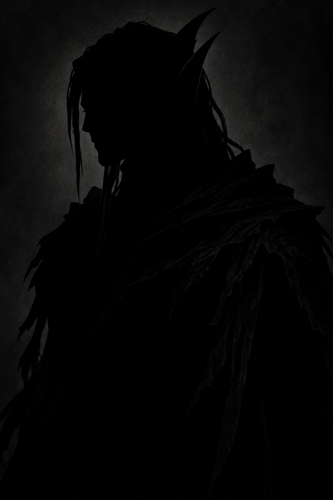

**Иллюстрации действий:**

Истощение.

Ускользание.

**Основа:** враждебное людям существо, отличное от безвредных духов. Точное происхождение не раскрыто.

**Внешность:** абсолютно чёрная, лишённая объёма тень. Может иметь очертания человека, зверя или чудовища; скользит по стенам, полу и потолку либо возникает в пространстве без предмета, который мог бы её отбрасывать. «Плотная» означает визуальную черноту, а не объёмное тело.

**Поведение:** появляется и исчезает в затенённых местах. В помещении достаточно даже слабого намёка на тень.

**Места:** тёмные углы и пространства без прямого солнечного света; конкретные типы построек не ограничены.

**Способности:** перемещение через тени, воздействие на психику и ментальный план. Может напугать, лишить рассудка и высосать жизненные силы.

**Атака:** магическая.

**Уязвимости:** не определены. Солнечный свет лишает конкретное место укрытия, но не установлено, что он уничтожает существо. Свет свечи также не объявлен надёжной защитой.

**Диалог:** не определён. Дополнение: возможны обрывки чужих мыслей вместо обычной речи.

**Текст встречи — дополнение:** «На стене ползёт чёрная фигура. Пламя дрожит, тени мебели качаются, но эта движется в другую сторону».

### 10.4. БОЛОТНИЦА

**Каталог:** `data/creatures.json` → `swamp-hag`.

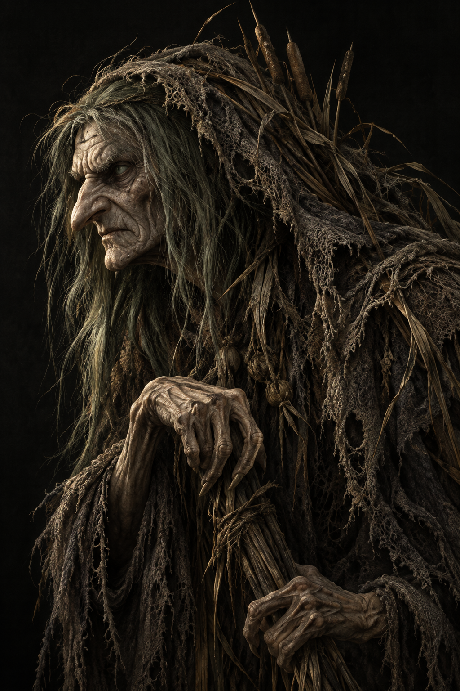

**Иллюстрации действий:**

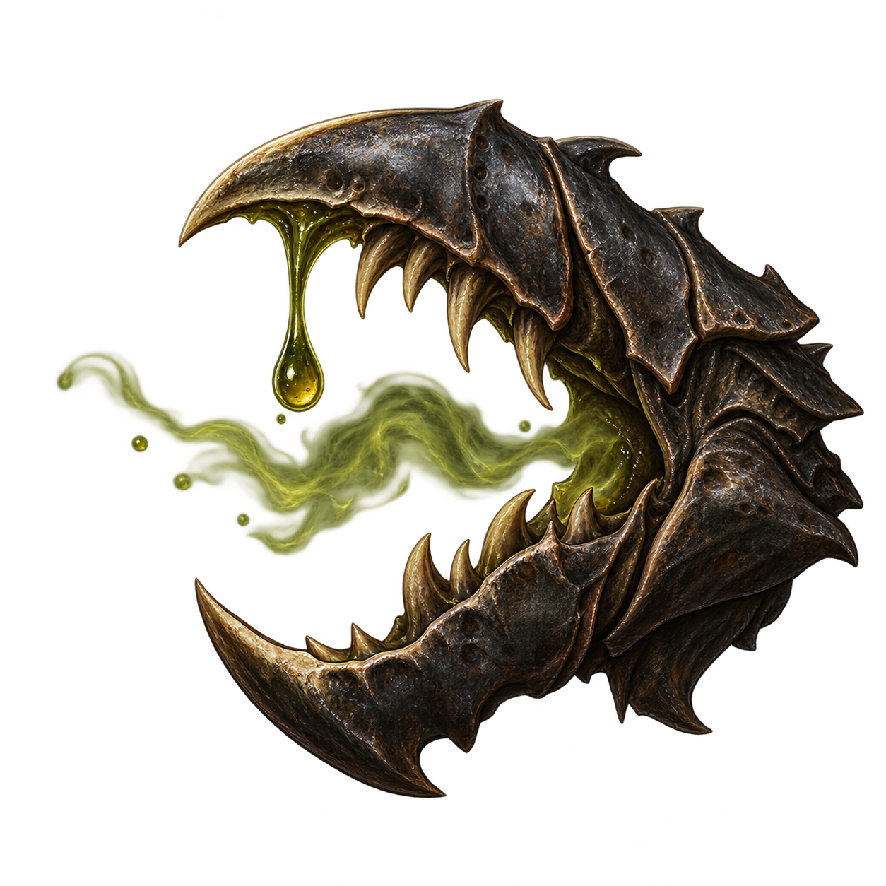

Ядовитый выброс.

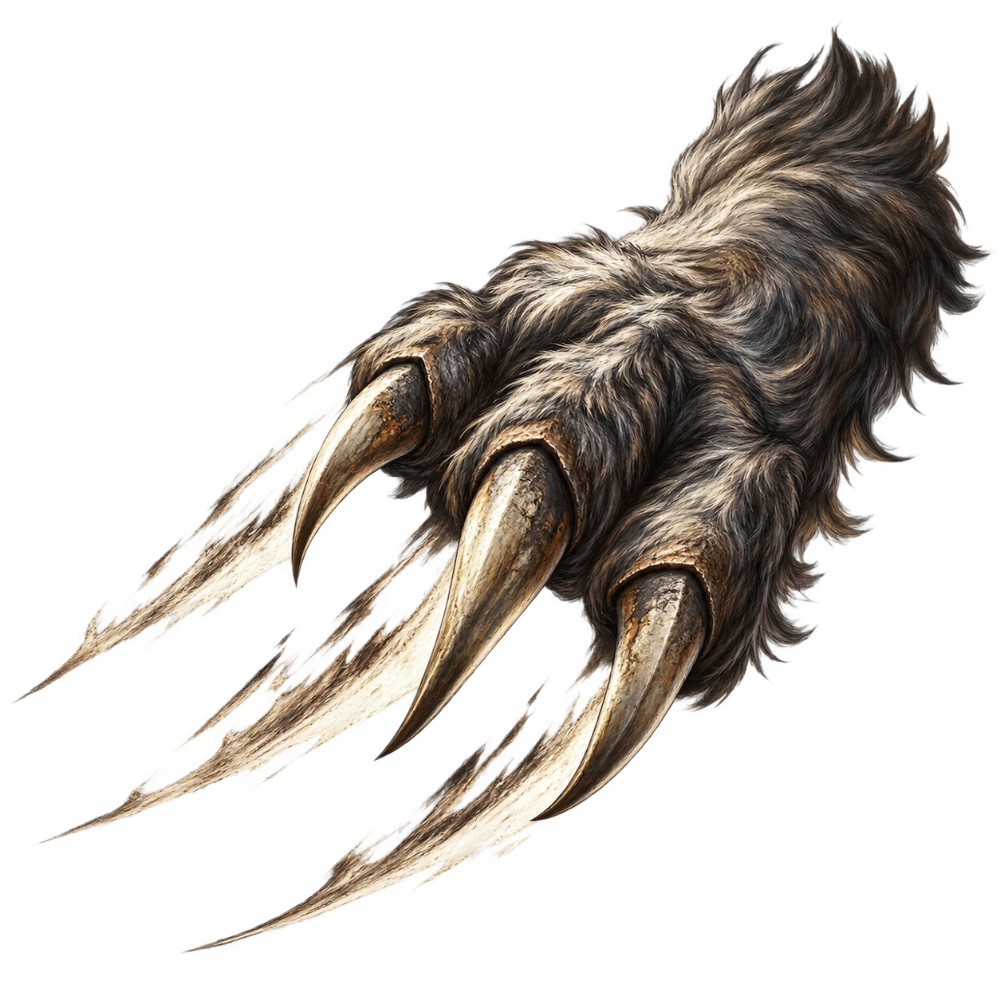

Удар лапой.

**Основа:** физическое существо материального мира, враждебное людям.

**Внешность:** сморщенная, сгорбленная старуха с зеленоватыми седыми волосами и крючковатыми руками. Так выглядят и молодые, и старые болотницы; возраст загадочен и фактически не служит различительным признаком.

**Поведение:** заманивает и запутывает людей в болотах, утаскивает в жилище. Истязает, мучает, пожирает заживо или распоряжается жертвой ради удовольствия. Человеческие страх и смерть развлекают её.

**Места:** болота и скрытые болотные жилища.

**Способности:** физическая сила, запугивание, отравление зловонными болотными испарениями.

**Атака:** физическая и ядовитая. Нагоняемый страх сам по себе не означает магического типа атаки.

**Уязвимости:** подвержена магическим атакам. Дополнение: материальное тело можно ранить; вне знакомой трясины ей сложнее скрываться и запутывать добычу.

**Диалог:** заманивание установлено; сложность речи не задана. Дополнение: может притворяться заблудившейся старухой и предлагать помощь.

**Текст встречи — дополнение:** «Из камышей протягивается скрюченная рука. Старуха обещает показать сухую тропу, но на её волосах колышется ряска, а изо рта тянет сладковатой гнилью».

### 10.5. БОЕВОЙ МАГ

**Каталог:** `data/creatures.json` → `battle-mage`.

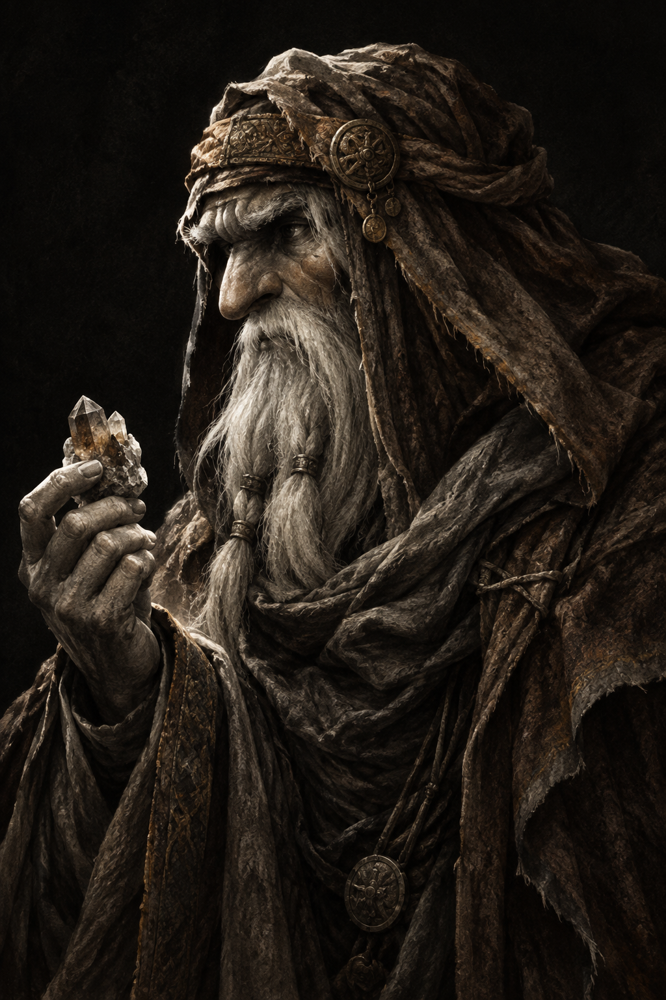

**Иллюстрации действий:**

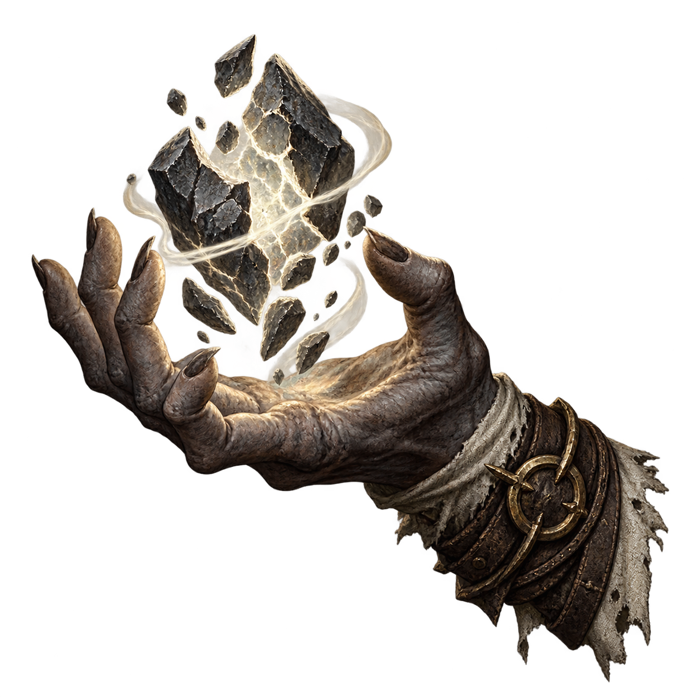

Магический удар.

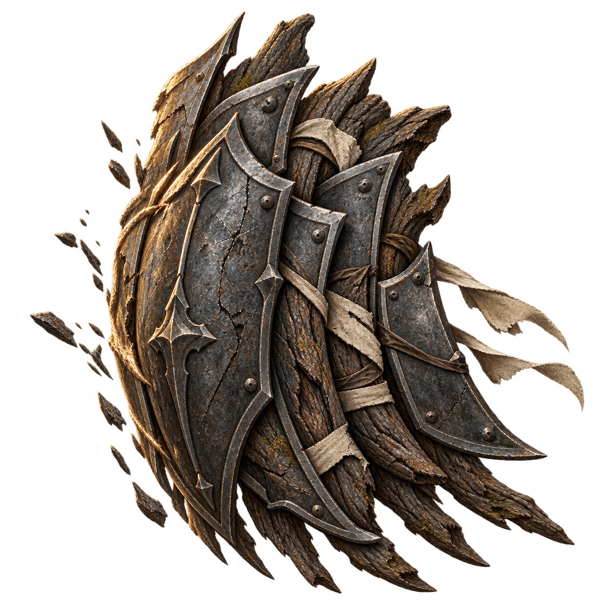

Защита.

**Основа:** человек, чувствующий сознание Логоса и применяющий магию в бою. Может быть противником героя; не каждый боевой маг обязательно враждебен.

**Внешность:** не задана. Дополнение: дорожное или военное снаряжение, камни и ёмкости с подготовленными составами; внешний вид зависит от службы и школы.

**Поведение:** действует в интересах государства, военного отряда или собственной стороны конфликта. Для состоящих на службе действует описанная правовая неприкосновенность.

**Места — дополнение:** лагеря, укрепления, поля сражений, охраняемые склады.

**Способности:** магия первоэлементов, составные заклинания, применение зелий. Боевые маги исторически создавали живые доспехи.

**Атака:** магическая.

**Уязвимости:** конкретные не заданы. Дополнение: человеческое тело; подготовка и доступные материалы различаются у разных магов.

**Диалог:** возможен как с человеком; определяется задачей, лояльностью и обстоятельствами.

**Текст встречи — дополнение:** «Человек у заставы поднимает камень на медной цепи. В золе погасшего костра вспыхивают огненные точки. Он требует назвать, что вы несёте».

### 10.6. ДИКИЙ МАГ

**Каталог:** `data/creatures.json` → `wild-mage`.

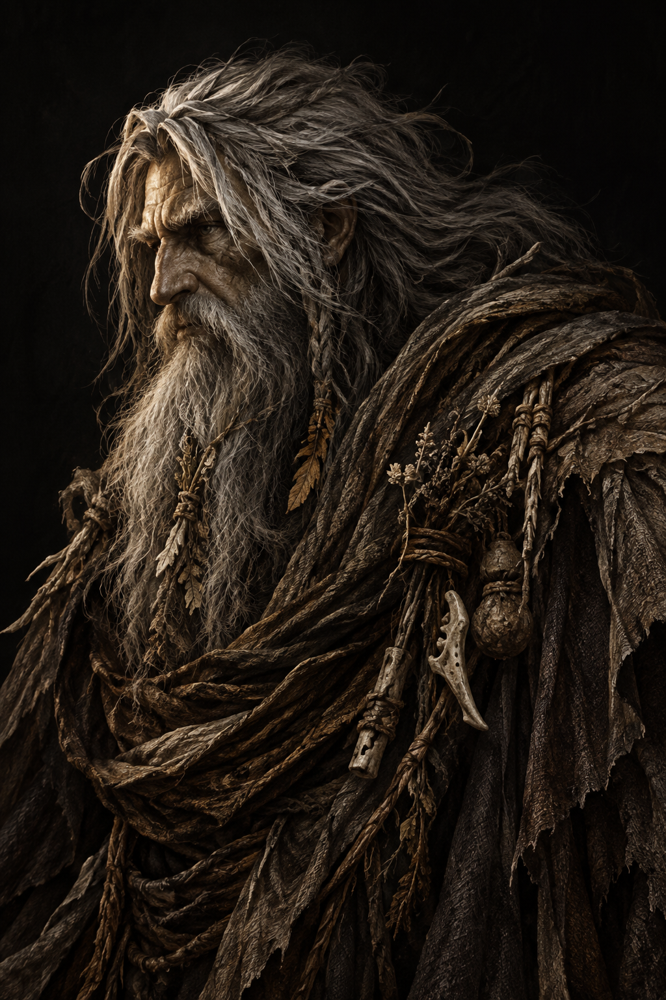

**Иллюстрации действий:**

Магический удар.

Защита.

**Основа:** маг, практикующий собственную магию. Может быть враждебен, но принадлежность к этой категории сама по себе не определяет нравственность.

**Внешность и места — дополнение:** одежда и набор компонентов отражают местность; может жить в глуши, на окраине поселения или среди руин.

**Поведение:** следует собственным знаниям и целям, создаёт индивидуальные сочетания частиц сознания.

**Способности:** магия стихий, камней и составов из трав, плоти, когтей, клыков, волос и прочих материалов; вредоносные, целительные и практические зелья.

**Атака:** магическая.

**Уязвимости:** особые не заданы. Дополнение: человеческое тело; зависимость отдельных приёмов от подготовленных веществ.

**Диалог:** возможен; условия обмена, помощи или конфликта индивидуальны.

**Текст встречи — дополнение:** «Над котлом висят пучки трав и обломки костей. Хозяин хижины слушает не вас, а камень у собственного уха».

### 10.7. ЭЛЬФ

**Каталог:** `data/creatures.json` → `elf`.

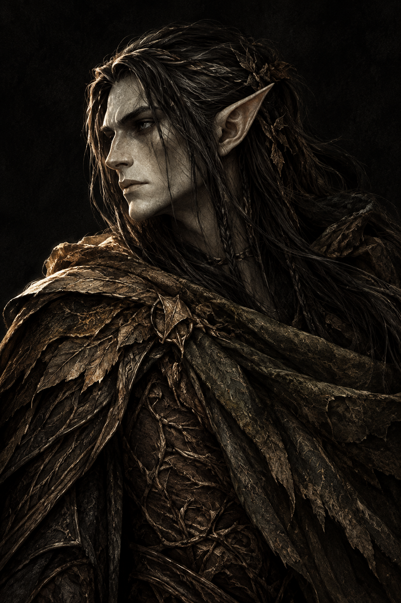

**Иллюстрации действий:**

Магический удар.

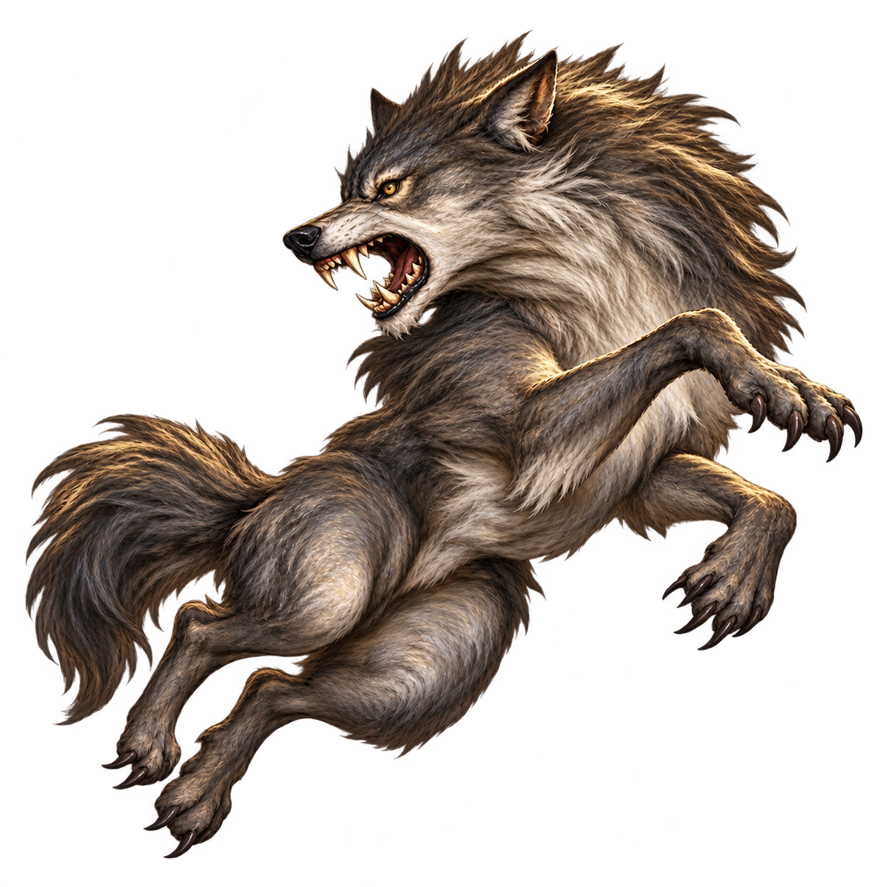

Отпрыгивание.

**Основа:** представитель народа, возникшего из более возвышенных и сложных фрагментов сознания Логоса.

**Внешность:** автором не задана. Дополнение для портретов: человекоподобный облик, тонкие черты, внимательное спокойное выражение; конкретная анатомия и одежда могут различаться между общинами.

**Поведение:** живёт отдельно от людей, старается не вмешиваться в их дела. Может помочь решить задачу или оказать услугу в обмен на помощь. Плохое обращение и нападение вызывают враждебность.

**Места:** скрытые города, деревни и жилища в лесной чаще, далёких горах, скалах и пещерах.

**Способности:** особая мудрость, знание рецептов заклинаний, ориентирование, умение скрываться в лесу и оказывать первую помощь. Среди эльфов есть маги.

**Отношение к аттракторам:** против изъятия частей Логоса из мира; считают это препятствием его самопознанию и опасным вмешательством в совершенное целое.

**Атака:** у текущей записи `elf` собственная атака магическая. Это игровой представитель народа, а не утверждение, что каждый эльф — маг. Вооружённые эльфы могут наносить физический урон своей экипировкой.

**Уязвимости:** особые не установлены; не приписывать всему народу произвольную слабость к конкретному материалу.

**Диалог:** возможен; важны уважение, поступки героя и взаимная услуга.

**Текст встречи — дополнение:** «Голос звучит из чащи: “Ты несёшь место, которого больше нет в мире. Кто убедил тебя, что мир от этого стал целее?”».

### 10.8. ФЕИРИ, ИЛИ ФЕЯ

**Каталог:** `data/creatures.json` → `faerie`.

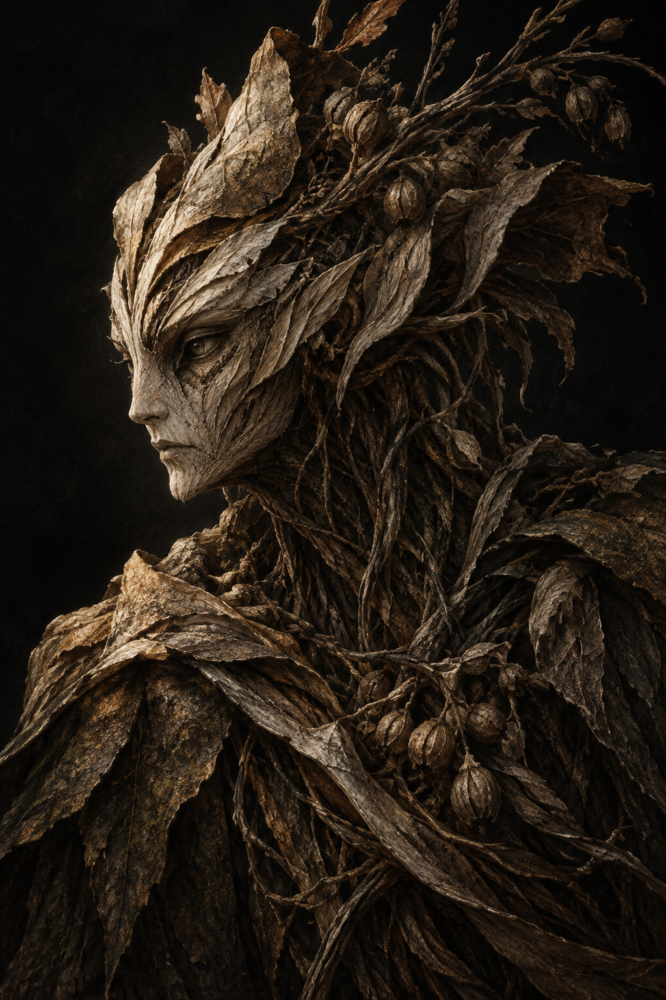

**Иллюстрации действий:**

Магический удар.

Ускользание.

**Основа:** тонкое существо, частично пребывающее вне материального мира. Феири называют духами природы.

**Внешность:** постоянная форма не задана. В материальном мире встречается по собственной воле, когда решает воплотиться. Маленький рост и крылья не являются обязательными свойствами.

**Поведение:** тесно привязана к определённой территории и устроенному там энергетическому месту. Феи могут жить семьями и колониями.

**Места:** пещеры, лесная чаща, озёра, поля и другие природные области.

**Способности:** знают свою территорию и её обитателей; могут сообщить об опасностях. Помогают семенам прорастать, переносят растения и семена, участвуют в заселении пространств и трансформации.

**Атака:** в текущем боевом профиле — магическая. Возможность столкновения не означает врождённой враждебности всех фей.

**Уязвимости:** не заданы. Привязанность к месту важна для поведения, но не означает автоматически невозможность его покинуть.

**Диалог:** возможен, если удаётся призвать фею или она сама пожелает явиться.

**Союзники:** гарпии, лешие и фавны, живущие на общей территории. Нападение на фею может вызвать их вмешательство.

**Текст встречи — дополнение:** «Семена висят в неподвижном воздухе. Между ними проступает лицо: “Дальше не ходи. Я знаю, что поселилось под корнями”».

### 10.9. ТЁМНАЯ ПОДЗЕМНАЯ ФЕЯ

**Каталог:** `data/creatures.json` → `dark-faerie`.

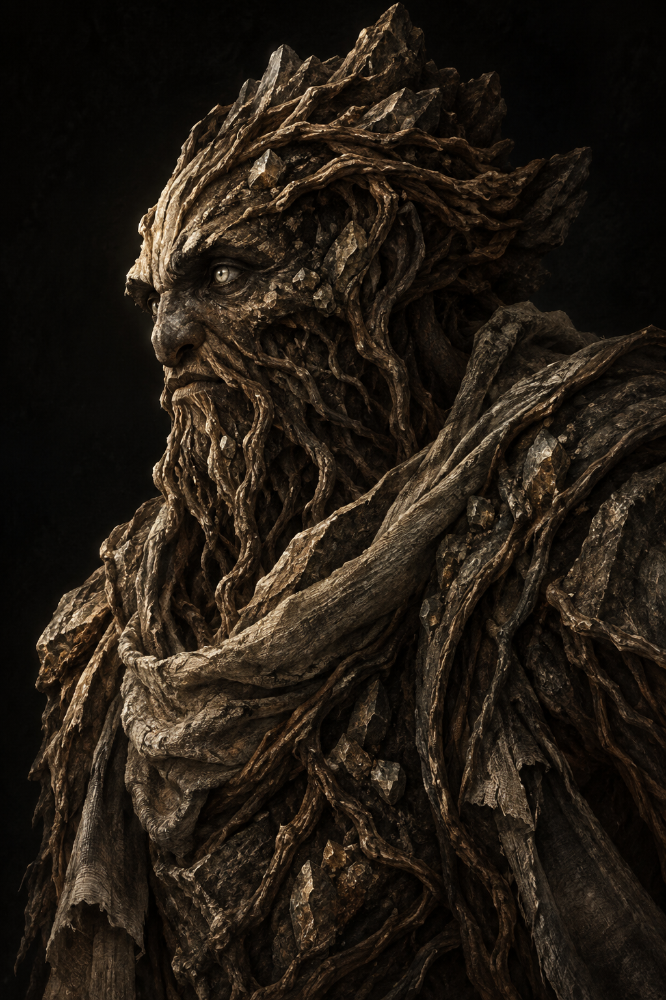

**Иллюстрации действий:**

Магический удар.

Ускользание.

**Основа:** отдельная разновидность феири, связанная с землёй и подземным пространством. Слово «тёмная» само по себе не означает злую или враждебную.

**Внешность — дополнение:** материальное воплощение может напоминать небольшую фигуру из влажной земли, корневых волокон и тусклого минерального блеска; это вариант, а не обязательная анатомия.

**Поведение:** занимается преобразованием и расщеплением сложных соединений.

**Места:** земля и подземные области.

**Способности:** может разрушить аттрактор, высвободить его содержимое и разрушить прежнее соединение частиц, образовывавшее сущность. Возможность возникновения нового чудовища сохраняется.

**Атака:** в текущем боевом профиле — магическая. Способность разрушить аттрактор не является обычной атакой и не даёт каждому удару этого свойства.

**Уязвимости:** не определены.

**Диалог:** герой может найти у таких фей способ уничтожения камня. Цена услуги и условия ещё не заданы.

**Текст встречи — дополнение:** «Из земли поднимается тихий голос: “Разомкнуть пустоту я могу. Обещать тебе, что из неё выйдет, — нет”».

### 10.10. ВАМПИР

**Каталог:** `data/creatures.json` → `vampire`.

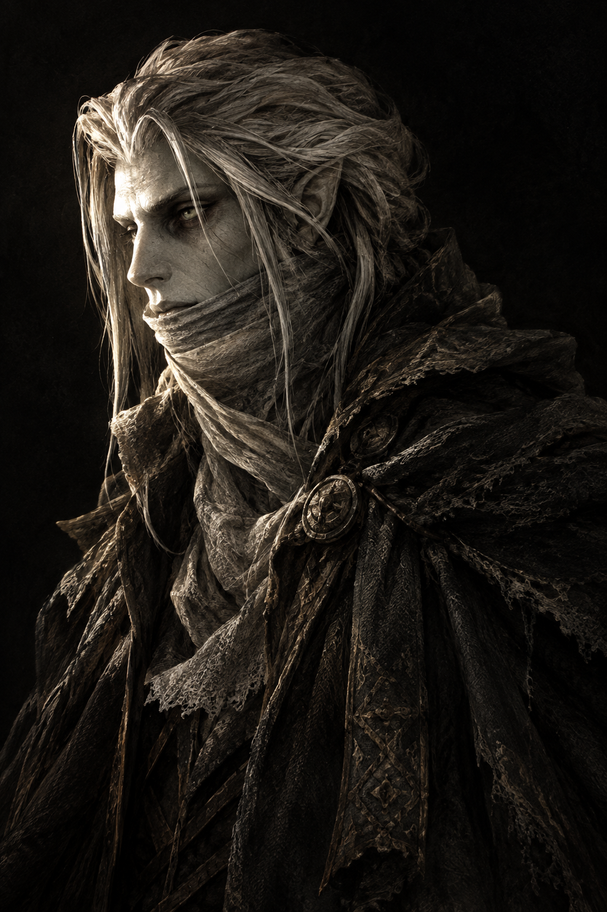

**Иллюстрации действий:**

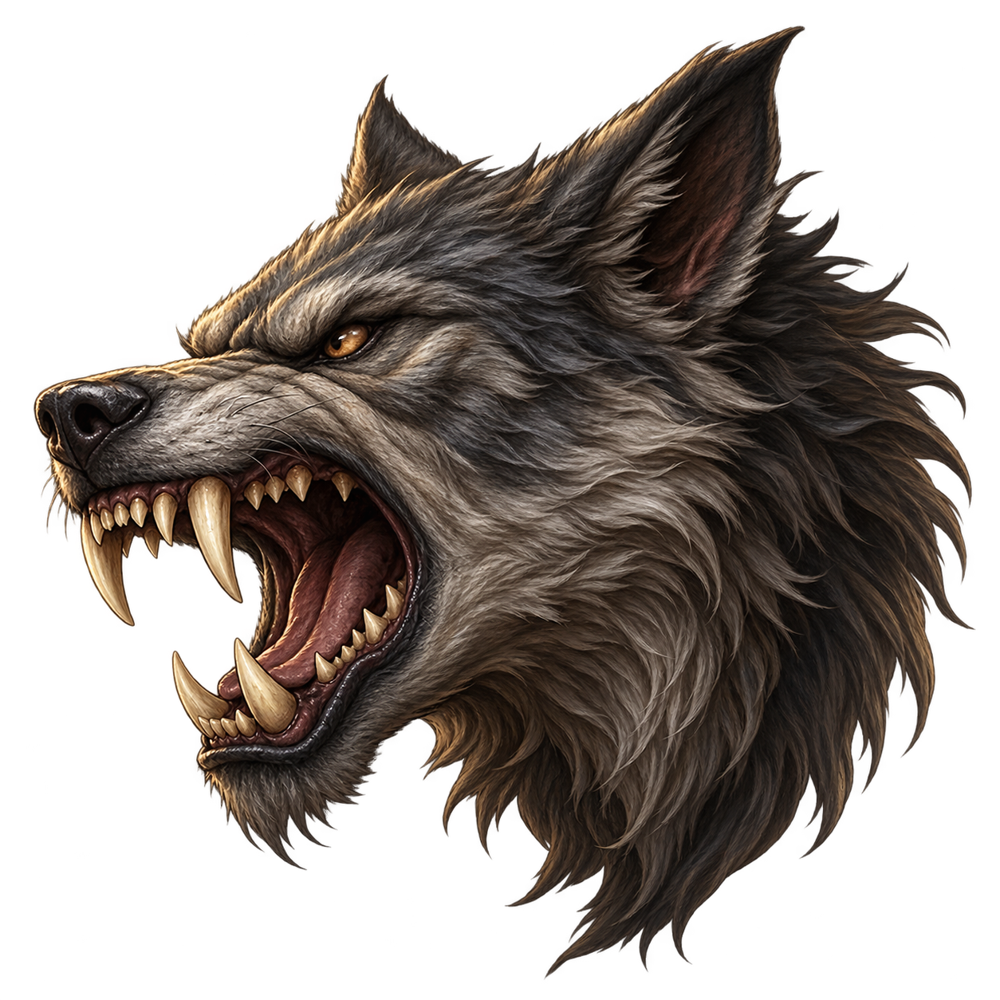

Укус.

Отпрыгивание.

**Основа:** пограничное существо, не способное автономно поддерживать жизнь в материальном мире. Питается человеческой кровью и жизненными силами.

**Внешность:** способен выдавать себя за беззащитного человека. Конкретные признаки внешности не заданы; постоянная чудовищная маска не обязательна.

**Поведение:** всю жизнь скрывается и опасается разоблачения. Обманывает, пользуется высокой харизмой и нападает, когда человек теряет осторожность. По сравнению с другими угрозами достаточно слаб.

**Места:** города, гостиницы, таверны, ярмарки; нуждается в людях и укрытии от солнца.

**Способности:** обаяние, обман, питание кровью и жизненными силами. Не может покинуть своё материальное тело.

**Атака:** физическая.

**Уязвимости:** не переносит солнечный свет, зависит от питания и собственной телесной оболочки. Другие классические вампирские слабости не установлены.

**Диалог:** возможен; убедительная речь может скрывать подготовку нападения.

**Текст встречи — дополнение:** «Постоялец просит помочь ему добраться до комнаты: на улице ещё слишком светло. Он держит вашу руку чуть дольше, чем нужно слабому человеку для опоры».

### 10.11. ГАРПИЯ

**Каталог:** `data/creatures.json` → `harpy`.

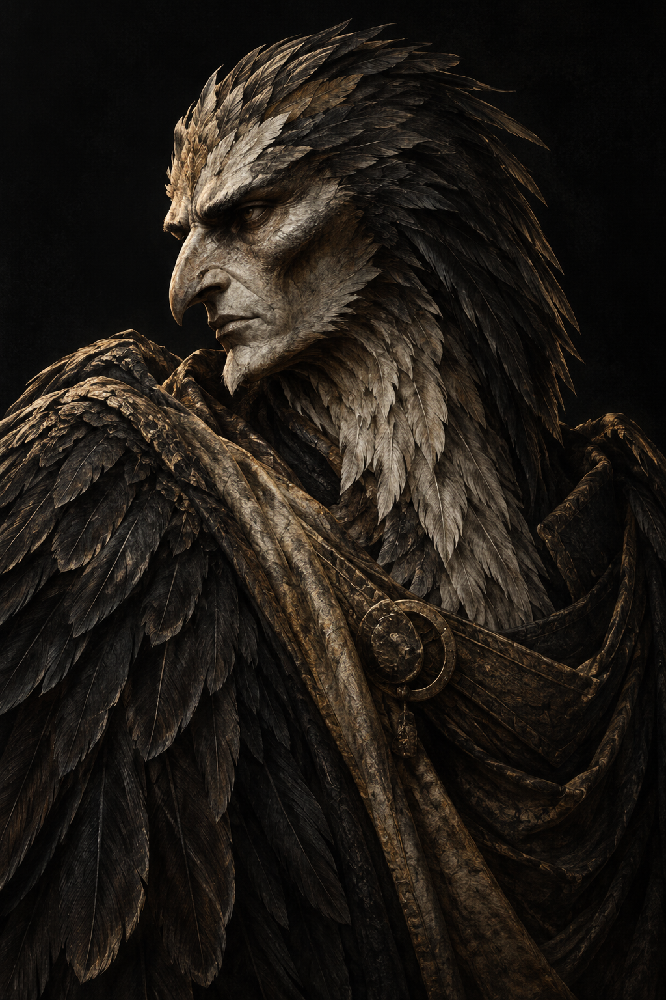

**Иллюстрации действий:**

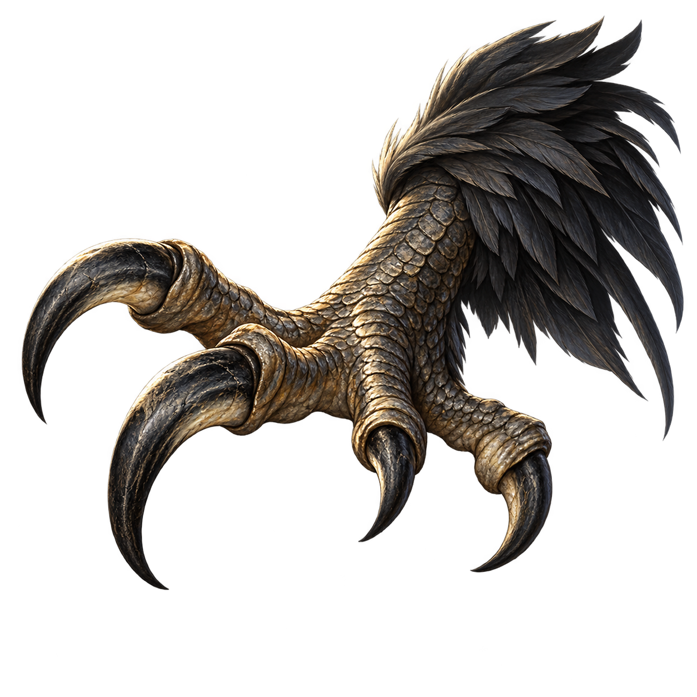

Удар когтями.

Отпрыгивание.

**Основа:** существо бестиария, сочетающее человеческие и звериные черты; связано с феями и состоит с ними в союзе.

**Внешность — дополнение:** человеческое лицо и часть торса сочетаются с птичьими крыльями, оперением и цепкими лапами.

**Места:** общие с феями территории. Дополнение: скалы, лесные обрывы и высокие деревья.

**Поведение — дополнение:** охраняет гнездовья и реагирует на угрозу союзникам.

**Способности — дополнение:** полёт, наблюдение с высоты, резкое нападение с воздуха.

**Атака — дополнение:** физическая.

**Уязвимости — дополнение:** тесное пространство ограничивает полёт; телесная природа позволяет ранить её.

**Диалог — дополнение:** возможен у отдельных гарпий; реакция зависит от отношения к местным феям.

**Текст встречи — дополнение:** «Над дорогой осыпаются перья. С обрыва смотрит лицо, слишком человеческое для птицы. “Зачем вы трогали нашу рощу?”».

### 10.12. ЛЕШИЙ

**Каталог:** `data/creatures.json` → `leshy`.

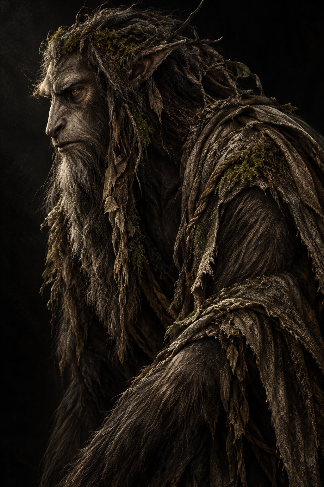

**Иллюстрации действий:**

Удар лапой.

Отпрыгивание.

**Основа:** существо бестиария с чертами человека и дикого зверя, союзник фей. Обитает в лесу.

**Внешность — дополнение:** высокий сутулый силуэт, грубая шерсть, вытянутые конечности и лицо с человеческими и звериными чертами. Мох и ветви могут служить маскировкой, но тело не обязательно состоит из дерева.

**Поведение — дополнение:** скрытно наблюдает за путниками, защищает свою территорию и фей.

**Способности — дополнение:** сила, знание лесных проходов, способность незаметно приближаться среди зарослей.

**Атака — дополнение:** физическая.

**Уязвимости — дополнение:** вне лесных укрытий ему труднее оставаться незамеченным; особой слабости к огню не задано.

**Диалог — дополнение:** возможен, особенно при посредничестве фей.

**Текст встречи — дополнение:** «Ствол у тропы поворачивается к вам лицом. Теперь видно, что это плечо, покрытое спутанной шерстью. Существо молча закрывает проход».

### 10.13. ФАВН

**Каталог:** `data/creatures.json` → `faun`.

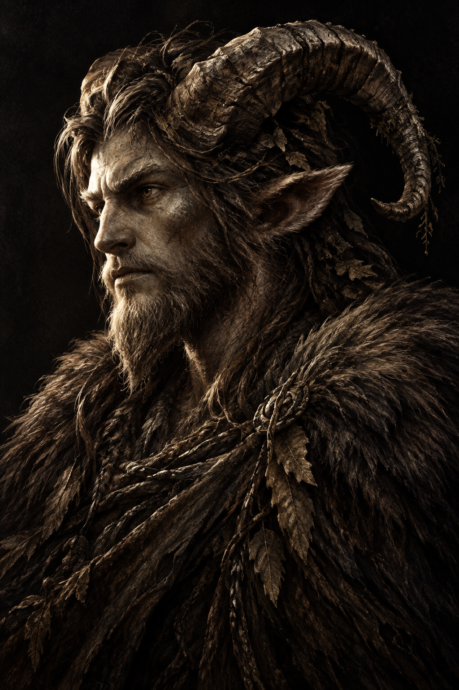

**Иллюстрации действий:**

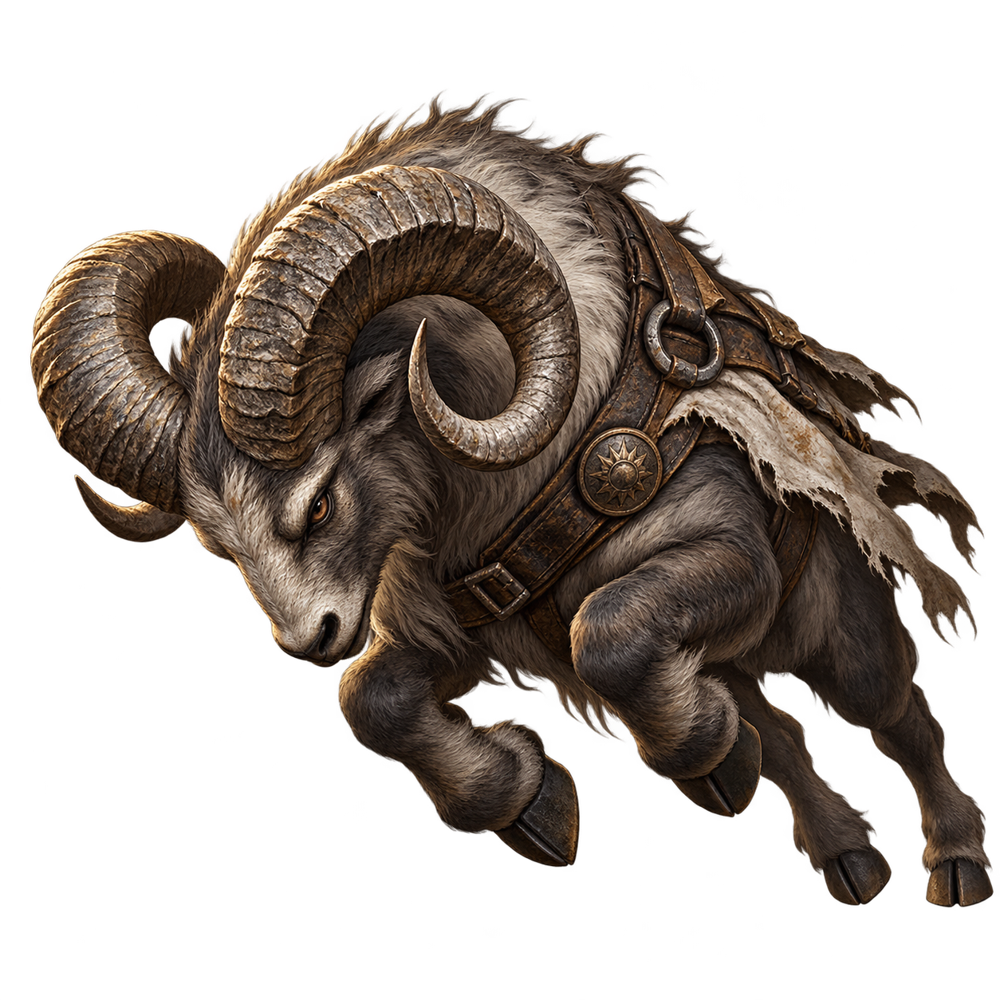

Удар рогами.

Отпрыгивание.

**Основа:** существо бестиария с человеческими и звериными чертами; живёт рядом с феями и состоит с ними в союзе.

**Внешность — дополнение:** человеческие лицо и торс, рога, шерсть и копытные ноги.

**Места:** общая с феями территория. Дополнение: рощи, лесные поляны, края полей.

**Поведение:** может напасть в ответ на нападение на фею. Дополнение: способен следить за чужаком до открытого столкновения.

**Способности — дополнение:** быстрые перемещения по пересечённой местности, удары рогами, копытами или простым оружием.

**Атака — дополнение:** физическая.

**Уязвимости — дополнение:** материальное тело; особые уязвимости не заданы.

**Диалог — дополнение:** возможны предупреждение, переговоры и просьба об услуге.

**Текст встречи — дополнение:** «В траве щёлкает копыто. Рогатый незнакомец указывает на лес: “Она велела тебя пропустить. Не заставляй её пожалеть”».

### 10.14. ЖИВОЙ ДОСПЕХ

**Каталог:** `data/creatures.json` → `living-armor`.

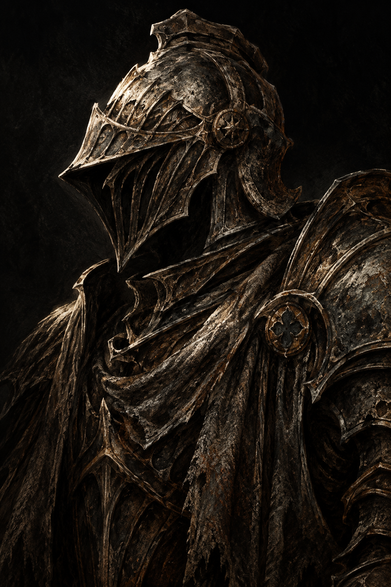

**Иллюстрации действий:**

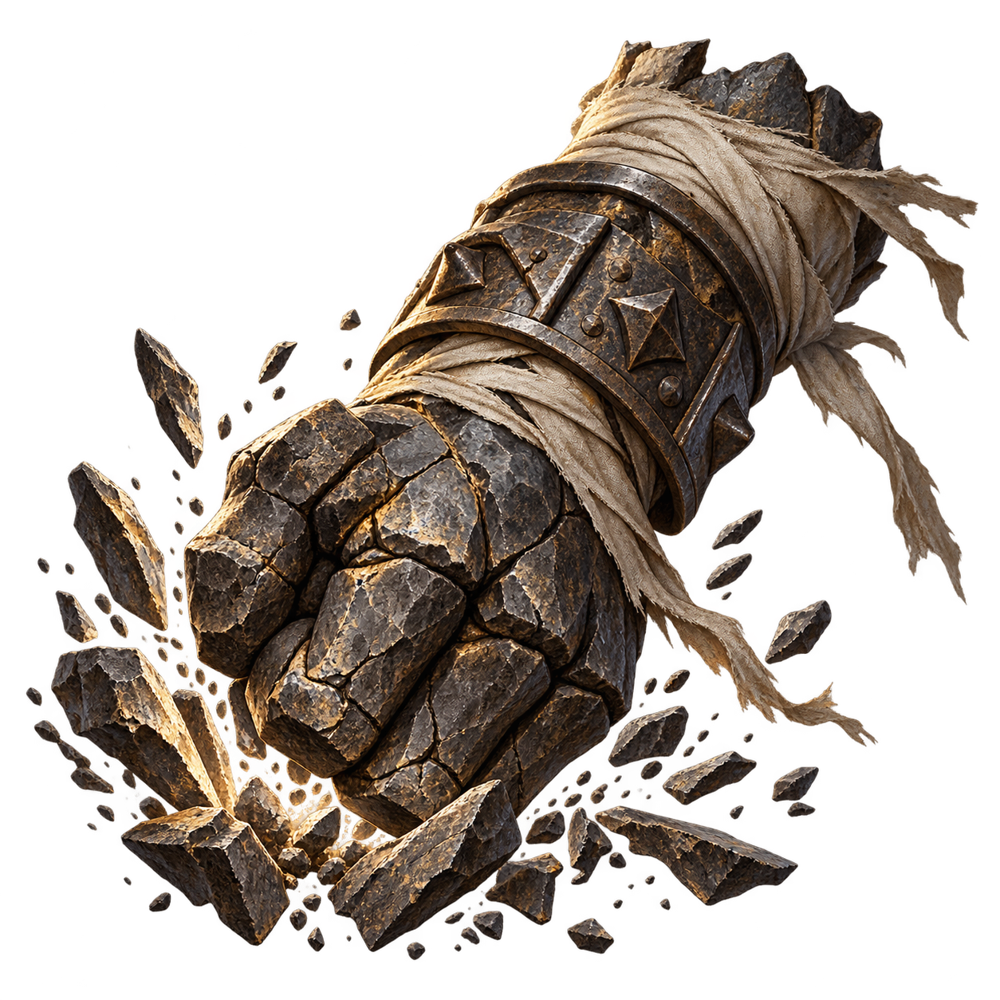

Сокрушение.

Защита.

**Основа:** результат работы мага, поймавшего бесплотный дух из другого измерения и соединившего его с железным доспехом. Дух заперт внутри материальной оболочки.

**Внешность:** пустой шагающий доспех, способный сражаться. Обладает примитивной или потусторонней волей.

**Поведение:** выполняет конкретную охранную миссию. Такие стражи изначально создавались боевыми магами для долгосрочной защиты хранилищ, оружейных и подобных объектов. Не нуждаются во сне и пище.

**Места:** руины, старые хранилища и оружейные.

**Способности:** непрерывная охрана, передвижение и бой без живого тела внутри.

**Атака:** собственное сокрушение — физическое; дополнительные приёмы зависят от выданной игрой экипировки. Конкретное оружие не является обязательным признаком вида.

**Уязвимости:** не заданы. Дополнение: разрушение сочленений ограничивает движение; возможность освободить дух требует отдельного сюжетного решения.

**Диалог:** не задан. Дополнение: может реагировать на пропуск, пароль или формулировку приказа; обычная человеческая беседа необязательна.

**Текст встречи — дополнение:** «У рухнувшей двери стоит часовой. Сквозь проржавевшее забрало видна пустота. Когда вы подходите, он поднимает оружие, словно смена караула была вчера».

### 10.15. ЗВЕРИ И КРУПНЫЕ ЖИВОТНЫЕ

**Общая основа:** материальные существа, часть которых агрессивна и опасна людям. Некоторые способны общаться, если не слишком дикие. Это не означает, что каждый зверь разговаривает.

Автором перечислены обычные собаки и дикие волки, огромные волки, волки-оборотни, кошки и огромные кошачьи хищники, малые и большие птицы, гигантские змеи — в том числе водные и летающие, озёрные змеи, летающие ящеры, драконы, спруты и другие звери.

Различные уровни предполагается оформлять как отдельных существ с различающимися способностями. Волк-оборотень — самостоятельный зверь, а не превращающийся человек. Возраст, размер и сила не образуют обязательную общую шкалу развития.

Следующие краткие карточки дополняют перечисленных автором зверей. Их экологические детали, способности, атаки, уязвимости и тексты встреч являются предложениями; исходными являются сами названия и возможность существования таких зверей.

#### СОБАКА

**Каталог:** `data/creatures.json` → `dog`.

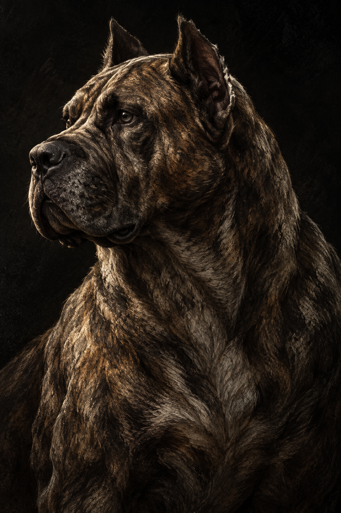

**Иллюстрации действий:**

Укус.

Отпрыгивание.

**Внешность и происхождение:** обычное материальное животное; одичавшая либо обученная человеком собака.

**Место и поведение:** дороги, дворы, разорённые деревни; защищает территорию, хозяина или пищу.

**Способности и атака:** обоняние, преследование, укус; физическая.

**Уязвимости:** обычное телесное животное; поведение может зависеть от голода и привычных команд.

**Диалог:** не предполагается по умолчанию; возможен редкий достаточно разумный представитель.

**Встреча:** «Пёс лежит поперёк порога сожжённого дома и рычит на каждого, кто приближается».

#### ДИКИЙ ВОЛК

**Каталог:** `data/creatures.json` → `wolf`.

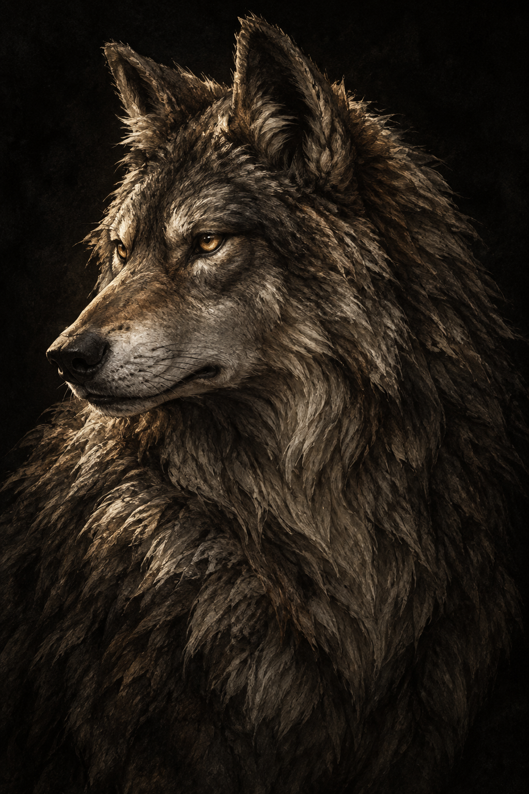

**Иллюстрации действий:**

Удар лапой, Прыжок.

Укус.

Защита.

**Внешность и происхождение:** обычный лесной волк материального мира.

**Место и поведение:** лес, поля, окраины поселений; охотится один или в стае.

**Способности и атака:** выслеживание, окружение добычи; физическая.

**Уязвимости:** материальное тело; отдельный волк лишён преимуществ стаи.

**Диалог:** возможен у достаточно недикого представителя, не гарантирован.

**Встреча:** «На снегу одна цепочка следов становится тремя. Из леса больше не доносится птичьих голосов».

#### ОГРОМНЫЙ ВОЛК

**Каталог:** `data/creatures.json` → `huge-wolf`.

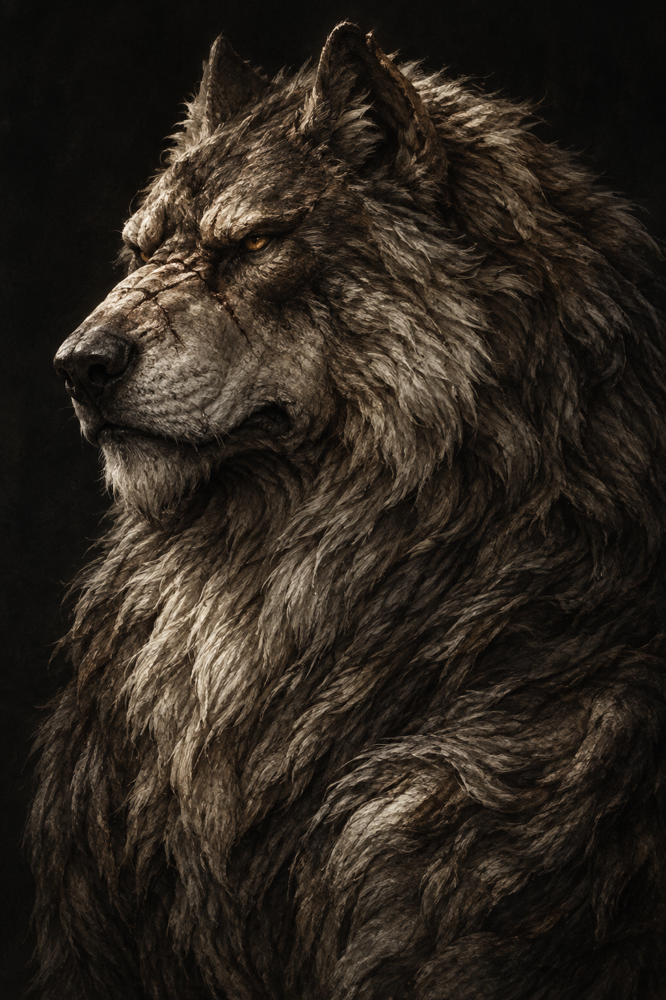

**Иллюстрации действий:**

Укус.

Удар лапой.

Отпрыгивание.

**Внешность и происхождение:** отдельный крупный зверь; точная история происхождения не задана.

**Место и поведение:** лесные окраины и опустевшие земли; способен угрожать целому поселению.

**Способности и атака:** мощный бросок и челюсти; физическая.

**Уязвимости:** крупное тело труднее скрыть в тесном пространстве; магическая защита не подразумевается.

**Диалог:** по индивидуальному уровню разумности.

**Встреча:** «За изгородью поднимается волчья голова. Она выше ворот, через которые вчера гнали скот».

#### ВОЛК-ОБОРОТЕНЬ

**Каталог:** `data/creatures.json` → `werewolf`.

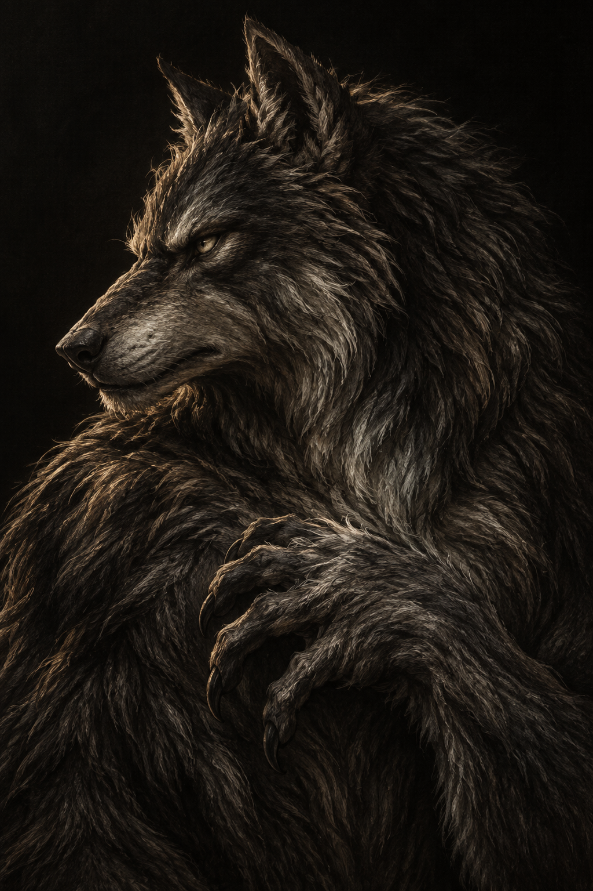

**Иллюстрации действий:**

Удар лапой.

Укус.

Отпрыгивание.

**Внешность и происхождение:** самостоятельный зверь, не человек; дополнение — волкоподобное тело с длинными хватательными передними конечностями.

**Место и поведение:** лесные дороги и развалины; дополнение — пользуется укрытиями и умеет открывать простые преграды.

**Способности и атака:** укус, удары и захват; физическая.

**Уязвимости:** не заданы; серебро и полнолуние не являются установленными свойствами.

**Диалог:** возможен у отдельных особей.

**Встреча:** «Волк за оградой поднимается и тянется к засову. Его лапа двигается почти как человеческая рука».

#### КОШАЧИЙ ХИЩНИК

**Каталог:** `data/creatures.json` → `cat`.

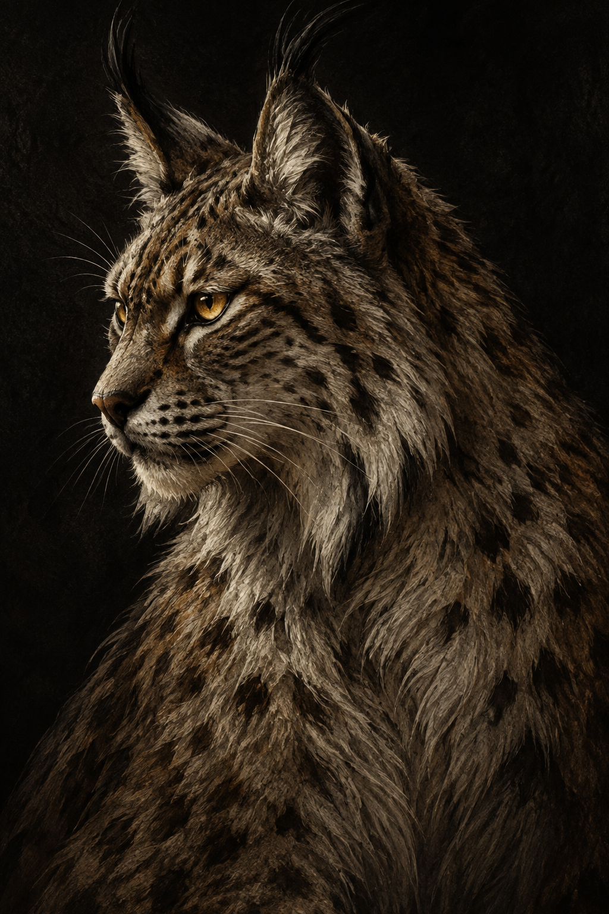

**Иллюстрации действий:**

Удар лапой.

Отпрыгивание.

**Внешность и происхождение:** материальный зверь с гибким приземистым телом, короткой мордой и пятнистой либо полосатой шерстью. Окраска помогает растворяться в сухой траве и каменных тенях; не повторяет обязательный рисунок одного земного вида.

**Место и поведение:** заросли, скалы и опустевшие поселения. Выбирает короткую дистанцию для броска, следит за движением рук и предпочитает отступить в укрытие после неудачного нападения.

**Способности и атака:** тихое приближение, удар лапой с когтями, быстрый отход; физическая. В основном игровом наборе нет отдельного укуса.

**Уязвимости:** обнаруженная засада лишает преимущества неожиданности; это особенность поведения, а не гарантированная победа.

**Диалог:** редкая возможность для достаточно разумной особи. Нельзя считать каждое рычание осмысленной человеческой репликой.

**Встреча:** «На камне над тропой открываются глаза. Всё остальное вы до этого принимали за сухую траву».

#### ОГРОМНЫЙ КОШАЧИЙ ХИЩНИК

**Каталог:** `data/creatures.json` → `huge-cat`.

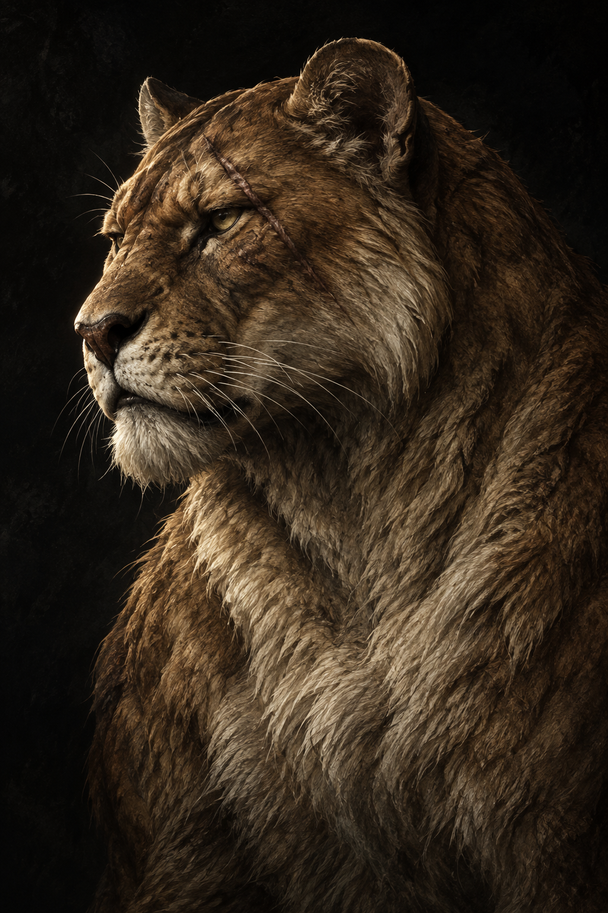

**Иллюстрации действий:**

Укус.

Удар лапой.

Отпрыгивание.

**Внешность и происхождение:** самостоятельный крупный кошачий зверь с тяжёлыми плечами, широкой пастью и длинными передними лапами. Не является обязательной будущей формой обычного хищника.

**Место и поведение:** глубокие овраги, скальные террасы и покинутые загоны. Способен утащить человека; оставляет добычу в укрытии и возвращается к ней, отчего один зверь надолго закрывает дорогу.

**Способности и атака:** укус, удар лапой, резкий отход перед новым броском; физическая. Крупный размер не даёт магической неуязвимости.

**Уязвимости:** узкие проходы ограничивают разворот тела; особые гарантированные слабости не установлены.

**Диалог:** возможен у редкой разумной особи; сила и размер сами по себе не означают мудрости.

**Встреча — дополнение:** «Из канавы тянется след волочения. Над ним на осыпи сидит зверь, чья пасть могла бы сомкнуться вокруг твоего плеча».

#### МАЛАЯ ХИЩНАЯ ПТИЦА

**Каталог:** `data/creatures.json` → `small-bird`.

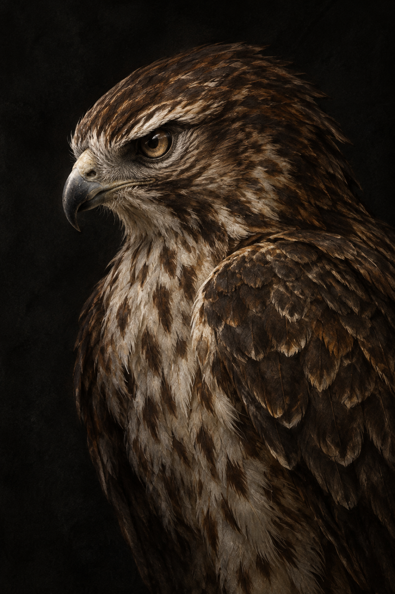

**Иллюстрации действий:**

Удар когтями.

Отпрыгивание.

**Внешность и происхождение:** материальная птица с узкими крыльями, цепкими лапами и коротким загнутым клювом. Малая — относительно других опасных птиц этого мира, а не обязательно безвредная для человека.

**Место и поведение:** поля, крыши развалин и карнизы над тропами. Охраняет гнездо, совершает быстрые налёты и возвращается на недоступное с земли место.

**Способности и атака:** удар когтями и быстрый уход из-под ответного удара; физическая. Не обязана уносить человека или сокрушать его весом.

**Уязвимости:** в помещении труднее набрать скорость и развернуть крылья.

**Диалог:** редкая возможность для разумного представителя; обычные птицы отвечают криком и поведением.

**Встреча — дополнение:** «Из окна разрушенной башни раздаётся резкий крик. Птица срывается с карниза и метит когтями в лицо».

#### БОЛЬШАЯ ХИЩНАЯ ПТИЦА

**Каталог:** `data/creatures.json` → `large-bird`.

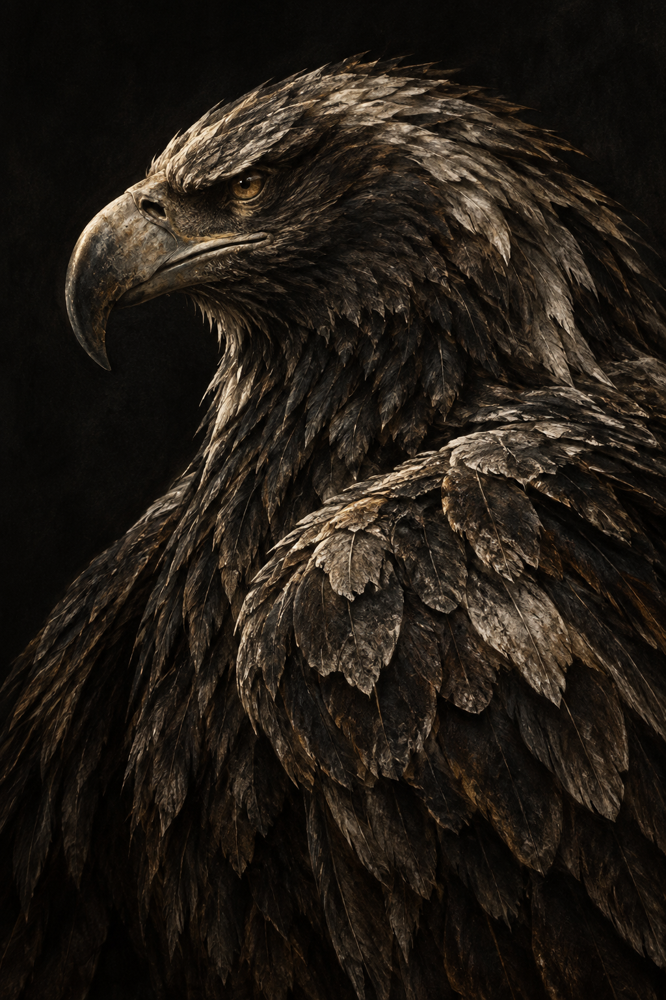

**Иллюстрации действий:**

Удар когтями.

Сокрушение.

Отпрыгивание.

**Внешность и происхождение:** отдельный пернатый зверь с широким размахом крыльев, тяжёлой грудью и мощными лапами. Это не просто взрослая малая птица и не гарпия: человеческих частей тела у неё нет.

**Место и поведение:** обрывы, высокие руины и открытые каменистые равнины. Гнездо заметно издали; вокруг лежат остатки крупной добычи. Может попытаться поднять человека или столкнуть его с опоры.

**Способности и атака:** удар когтями, сокрушительный налёт тяжёлым телом и уход из-под ответа; физическая. Полёт не является переходом между планами.

**Уязвимости:** крупным крыльям требуется пространство. Отдельные боевые правила высоты и воздушной неуязвимости не вводятся.

**Диалог:** допустим у подходящей разумной особи; не предполагается у всех птиц.

**Встреча:** «Над дорогой проходит тень. На скале лежит гнездо, сложенное из ветвей и обломков телеги».

#### ГИГАНТСКАЯ ЗМЕЯ

**Каталог:** `data/creatures.json` → `giant-snake`.

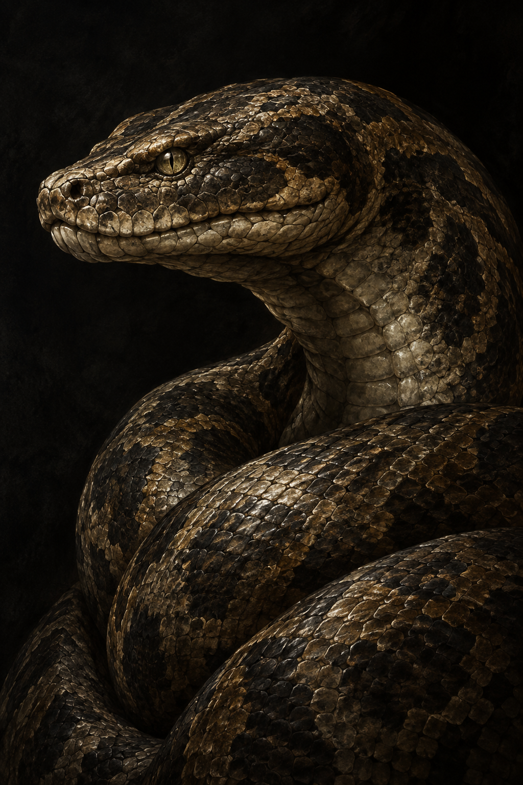

**Иллюстрации действий:**

Укус.

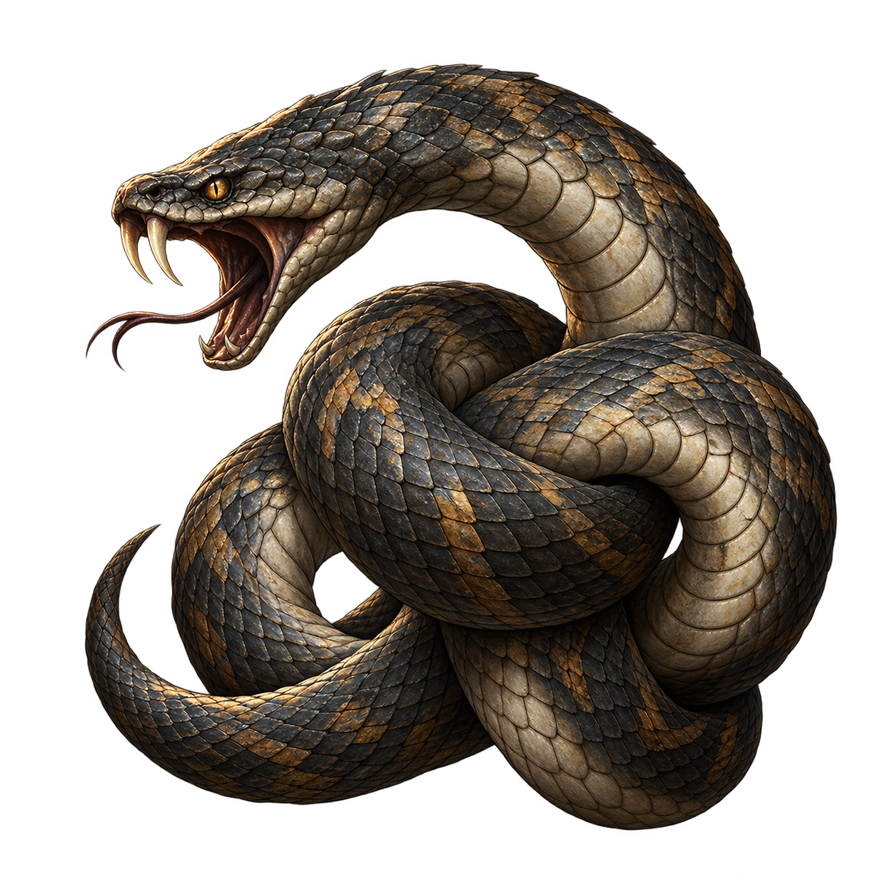

Сдавливание.

Отпрыгивание.

**Внешность и происхождение:** крупный материальный змей.

**Место и поведение:** густые заросли, тёплые каменные укрытия; подстерегает добычу.

**Способности и атака:** укус и сдавливание; физическая. У текущего вида ядовитой атаки нет.

**Уязвимости:** материальное тело; при открытом перемещении её легче заметить.

**Диалог:** возможен у отдельных представителей.

**Встреча:** «Поперёк тропы лежит ствол. Когда вы подходите, на нём медленно смыкается узор чешуи».

#### ОЗЁРНАЯ ЗМЕЯ

**Каталог:** `data/creatures.json` → `lake-snake`.

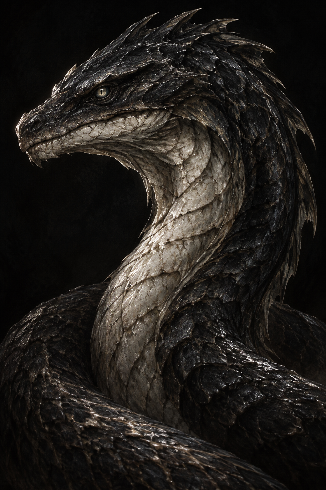

**Иллюстрации действий:**

Укус.

Сдавливание.

Отпрыгивание.

**Внешность и происхождение:** длинный водный зверь. В текущем каталоге озёрная и гигантская водная змея представлены одной записью `lake-snake`; второе название — вариант описания размера, не отдельный вид данных.

**Место и поведение:** озёра и глубокие воды; скрывается под поверхностью.

**Способности и атака:** нападение из воды, опрокидывание небольших лодок, утаскивание добычи; физическая.

**Уязвимости:** преимущество связано с водой; способность долго жить на суше не задана.

**Диалог:** возможен у отдельных представителей.

**Встреча:** «По тихому озеру идёт волна. У неё нет ни ветра, ни лодки впереди».

#### ЛЕТАЮЩАЯ ГИГАНТСКАЯ ЗМЕЯ

**Каталог:** `data/creatures.json` → `flying-snake`.

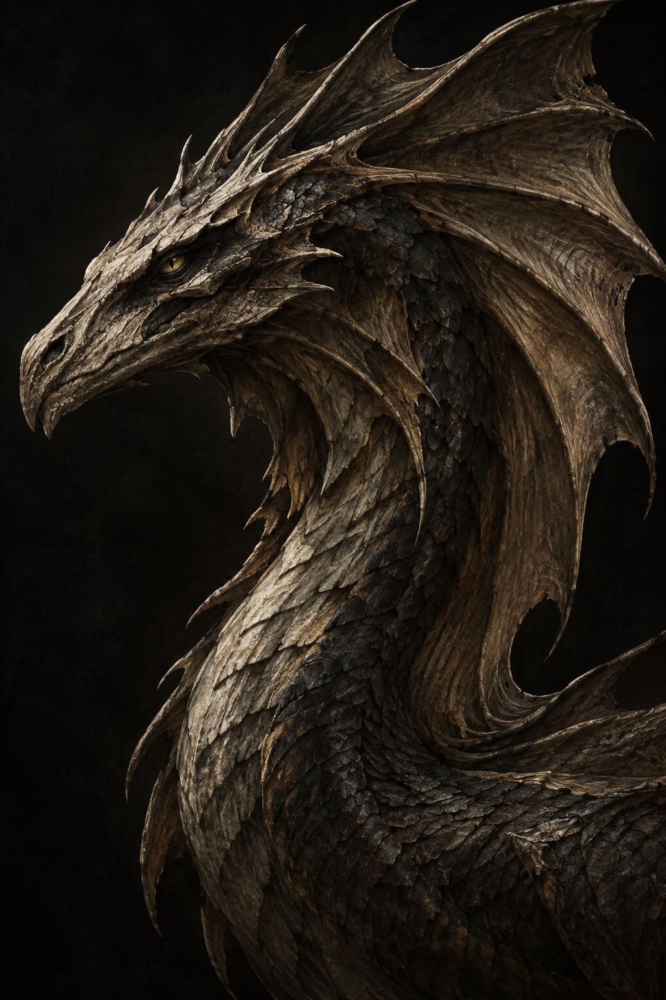

**Иллюстрации действий:**

Укус.

Отпрыгивание.

**Внешность и происхождение:** отдельный змееобразный зверь, способный летать; дополнение — широкие перепончатые выросты вдоль тела.

**Место и поведение:** открытые ущелья и воздушные пространства над лесом; высматривает добычу сверху.

**Способности и атака:** воздушный бросок и укус; физическая.

**Уязвимости:** тесные укрытия ограничивают возможность воздушной атаки.

**Диалог:** зависит от особи.

**Встреча:** «Между облаками изгибается длинная полоса. Она движется против ветра и опускается к дороге».

#### ЛЕТАЮЩИЙ ЯЩЕР

**Каталог:** `data/creatures.json` → `flying-lizard`.

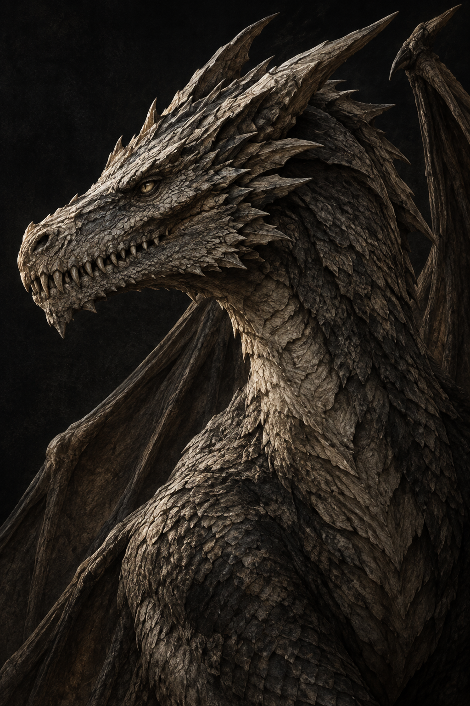

**Иллюстрации действий:**

Удар когтями.

Укус.

Отпрыгивание.

**Внешность и происхождение:** крылатый материальный зверь; дополнение — кожистые перепонки и вытянутая зубастая пасть.

**Место и поведение:** обрывы и высокие развалины; охраняет гнездовье или охотится.

**Способности и атака:** пикирование, укусы, когти; физическая.

**Уязвимости:** повреждения крыльев затрудняют полёт.

**Диалог:** редок, но не исключён общим правилом разумных зверей.

**Встреча:** «С верхушки разрушенной башни свешивается длинная шея. Камни под когтями крошатся, когда ящер раскрывает крылья».

#### ДРАКОН

**Каталог:** `data/creatures.json` → `dragon`.

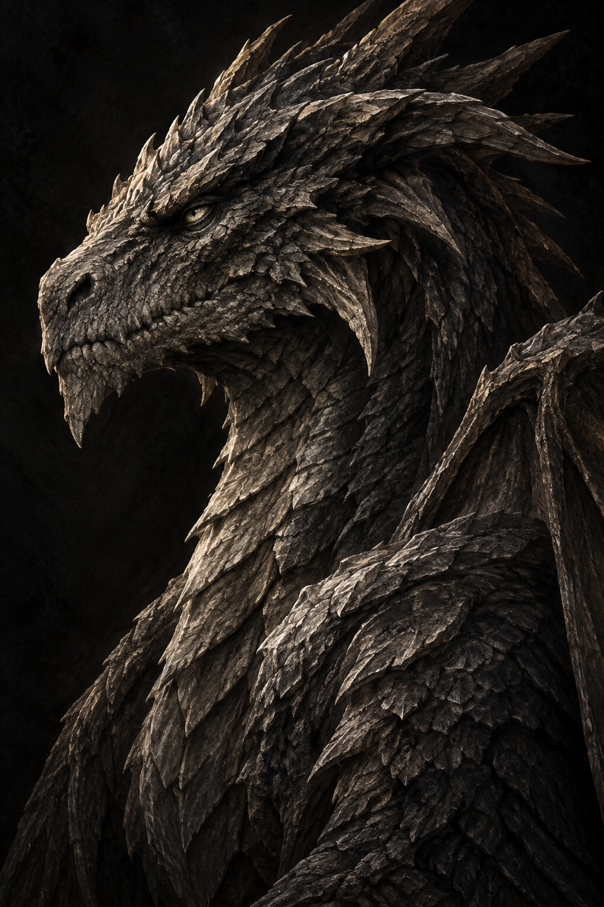

**Иллюстрации действий:**

Укус.

Удар лапой.

Отпрыгивание.

**Внешность и происхождение:** существование драконов задано, конкретный облик — нет. Дополнение: крупный чешуйчатый зверь с тяжёлой головой и крыльями.

**Место и поведение — дополнение:** горные укрытия и труднодоступные руины; охраняет собственную территорию.

**Способности и атака — дополнение:** сила, полёт, когти и челюсти; физическая. В текущем профиле нет огненного дыхания и магической атаки. Сокровищница также не является обязательной чертой дракона.

**Уязвимости:** особые не определены.

**Диалог:** допустим; степень разумности зависит от выбранного дракона.

**Встреча:** «Из пещеры звучит вопрос. Только после него вы понимаете, что гряда камней у входа — сложенные когти».

#### СПРУТ

**Каталог:** `data/creatures.json` → `octopus`.

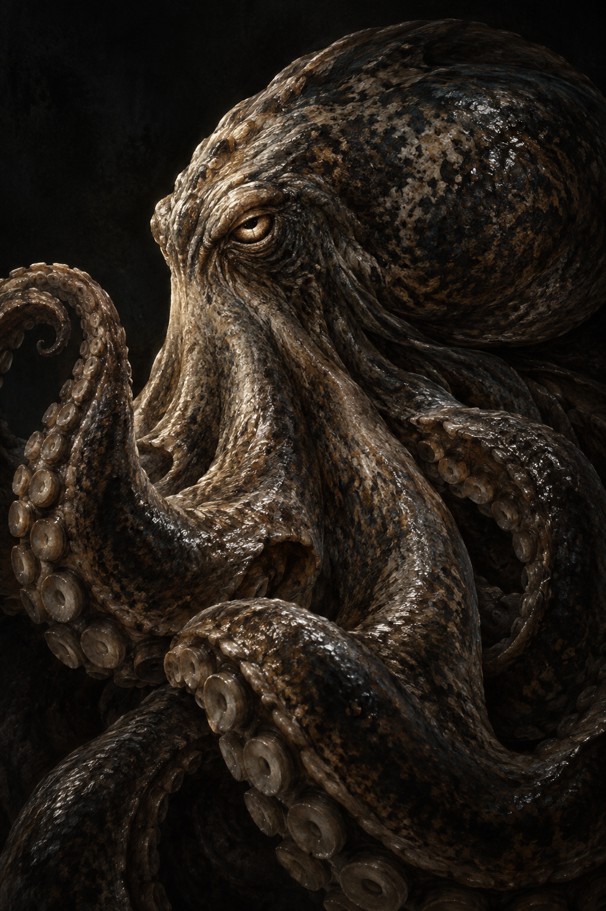

**Иллюстрации действий:**

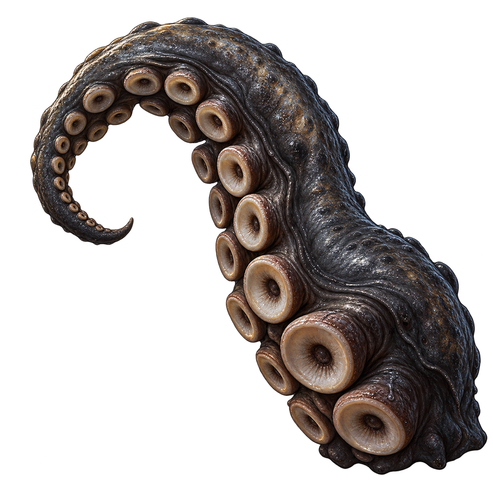

Захват щупальцем.

Сдавливание.

Отпрыгивание.

**Внешность и происхождение:** материальное водное существо со щупальцами; опасная крупная разновидность.

**Место и поведение:** водоёмы; подстерегает добычу у глубины и затопленных сооружений.

**Способности и атака:** захват несколькими щупальцами, утаскивание под воду; физическая.

**Уязвимости:** связан с водной средой; отдельное щупальце можно повредить.

**Диалог:** возможен только если конкретный представитель достаточно разумен.

**Встреча:** «Верёвка у причала натягивается сама собой. Затем вы замечаете на ней присоски».

## 11. ДЕСЯТЬ НОВЫХ СУЩЕСТВ

Весь раздел — авторское расширение по разрешению пользователя. Все десять видов присутствуют в игровом каталоге. Развивать их истории можно без изменения установленных свойств; это не заменяет исходные виды и не устанавливает окончательной истины о Логосе.

### 11.1. КОСТЕСБОРЩИК

**Каталог:** `data/creatures.json` → `bone-collector`.

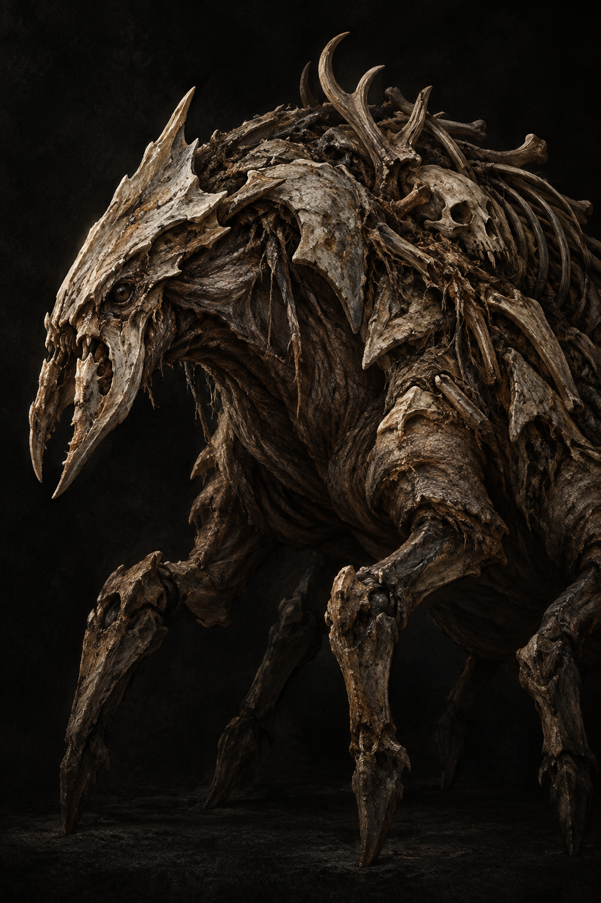

**Иллюстрации действий:**

Укус.

Удар лапой.

Отпрыгивание.

**Происхождение:** материальный падальщик, приспособившийся к землям непрерывных войн.

**Внешность:** низкое шестиногое тело под костяными наростами; морда с раздвоенной нижней челюстью. На спине застревают подобранные кости и обломки снаряжения.

**Поведение:** собирает останки, стаскивает их в нору; нападает на раненых и на тех, кто тревожит его кормовое место.

**Места:** поля сражений, массовые захоронения, опустевшие военные лагеря.

**Способности:** чувствует кровь, подкапывает землю и раскалывает кости челюстями.

**Атака:** физическая.

**Уязвимости:** сочленения ног и мягкая нижняя сторона тела; тяжёлая спина мешает быстро разворачиваться.

**Диалог:** обычная речь отсутствует; может отступить от более опасного соперника или переключиться на падаль.

**Встреча:** «Под разбитой телегой что-то складывает кости. На куче лежит ещё тёплая рука с солдатским кольцом».

### 11.2. РЖАВОЕД

**Каталог:** `data/creatures.json` → `rust-eater`.

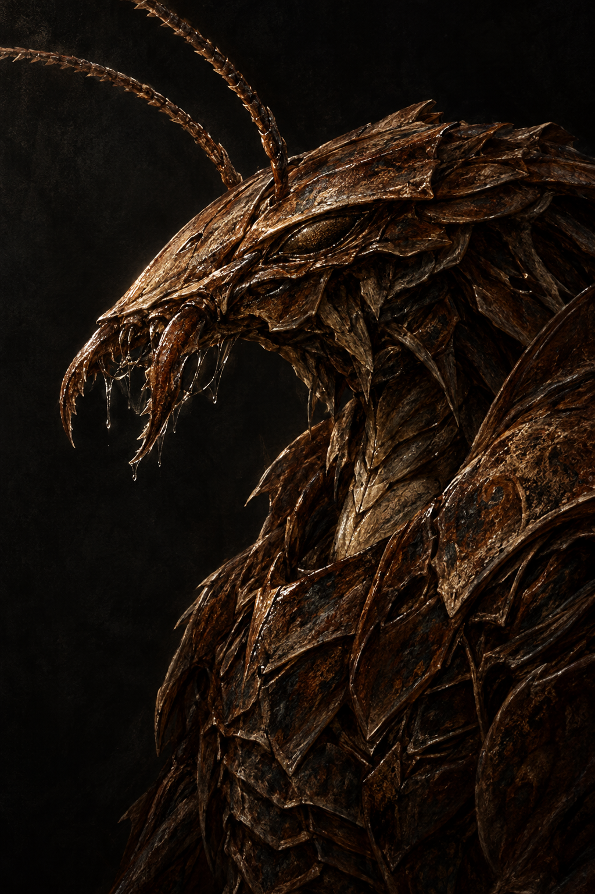

**Иллюстрации действий:**

Ядовитый выброс.

Укус.

Отпрыгивание.

**Происхождение:** материальное насекомоподобное существо, питающееся металлами и минеральными отложениями.

**Внешность:** длинное плоское тело, медно-бурый панцирь, жёсткие усики; у рта блестят капли едкой слюны.

**Поведение:** обычно ищет железо, но защищает кладку и атакует приблизившихся вооружённых людей.

**Места:** заброшенные оружейные, шахты, развалины кузниц и поля сражений.

**Способности:** выгрызает металл, оставляет едкие выделения, чувствует залежи железа.

**Атака:** физическая и ядовитая.

**Уязвимости:** мягкие участки под панцирем; после линьки особенно уязвим.

**Диалог:** нет; можно отвлечь металлической приманкой.

**Встреча:** «Из шлема высыпается рыжая труха. Следом наружу вытягиваются два усика, а изнутри доносится скрежет».

### 11.3. ТОПЯНОЙ КОЛОКОЛ

**Каталог:** `data/creatures.json` → `bog-bell`.

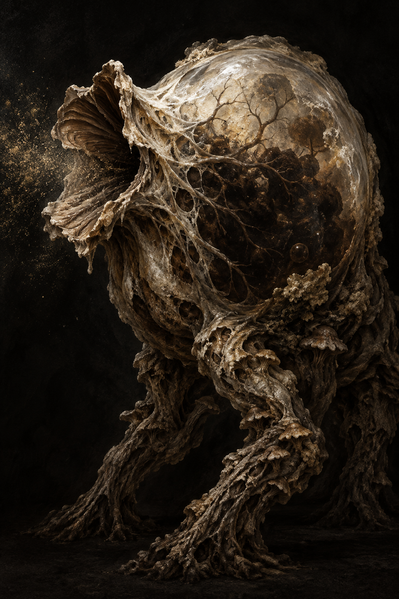

**Иллюстрации действий:**

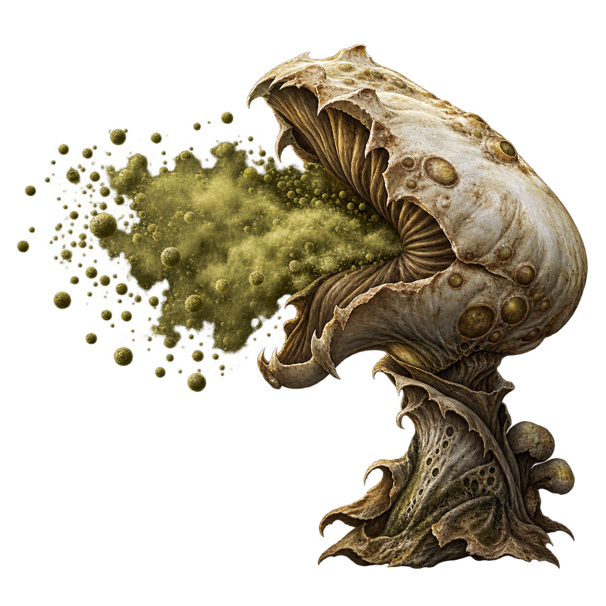

Облако спор.

Защита.

**Происхождение:** хищный организм материального мира, сочетающий свойства грибной колонии и подвижного болотного животного.

**Внешность:** вздутый полупрозрачный мешок на корневидных ногах; внутри колышется тёмная жидкость. На ветру оболочка издаёт глухой звон.

**Поведение:** замирает у тропы, привлекая путников звуком, напоминающим далёкий колокол. При приближении выбрасывает облако спор.

**Места:** болота, затопленные кладбища, заросшие канавы.

**Способности:** отравляющие споры, медленное перемещение, маскировка среди болотных наростов.

**Атака:** ядовитая.

**Уязвимости:** хрупкая оболочка; сухая местность затрудняет движение. Разрыв мешка опасен из-за содержимого.

**Диалог:** нет; звуки не являются осмысленной речью.

**Встреча:** «Колокол звучит совсем близко, но часовни вокруг нет. Над трясиной медленно раздувается бледный пузырь».

### 11.4. ПЕПЕЛЬНЫЙ ГОНЧИЙ

**Каталог:** `data/creatures.json` → `ash-hound`.

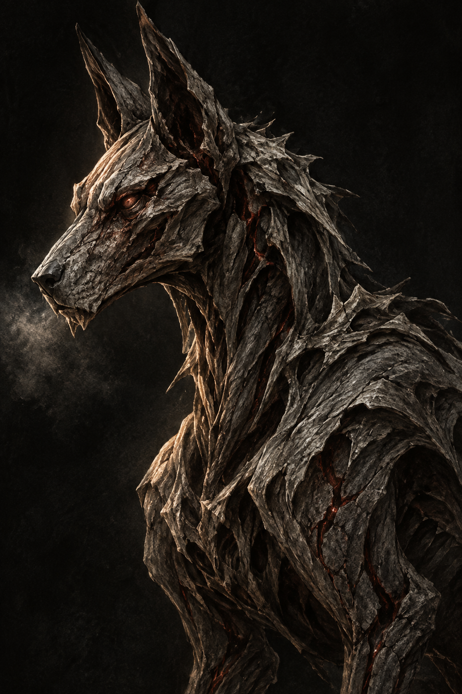

**Иллюстрации действий:**

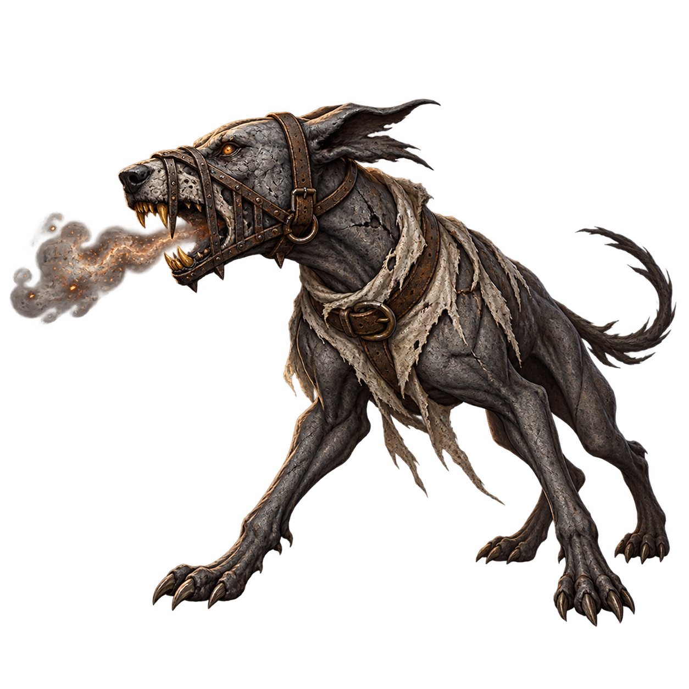

Пепельное дыхание.

Укус.

Отпрыгивание.

**Происхождение:** зверь материального мира, чья структура сознания была изменена длительным соседством с остатками боевых заклинаний. Это не демон.

**Внешность:** худое четвероногое тело, покрытое серой коркой; в трещинах теплится красный свет, дыхание несёт золу.

**Поведение:** бродит по пожарищам, преследует людей, чьи вещи хранят следы магии.

**Места:** сожжённые поселения, старые осадные позиции, разрушенные мастерские магов.

**Способности:** чует следы заклинаний и выдыхает обжигающую золу.

**Атака:** физическая и магическая.

**Уязвимости:** вода охлаждает и утяжеляет наружную корку, но не уничтожает зверя мгновенно.

**Диалог:** некоторые особи понимают короткие обращения; ясная речь редка.

**Встреча:** «На пепле проступают свежие следы. Худой зверь поднимает голову и втягивает воздух возле ваших вещей».

### 11.5. КОРНЕВОЙ ПАСТУХ

**Каталог:** `data/creatures.json` → `root-shepherd`.

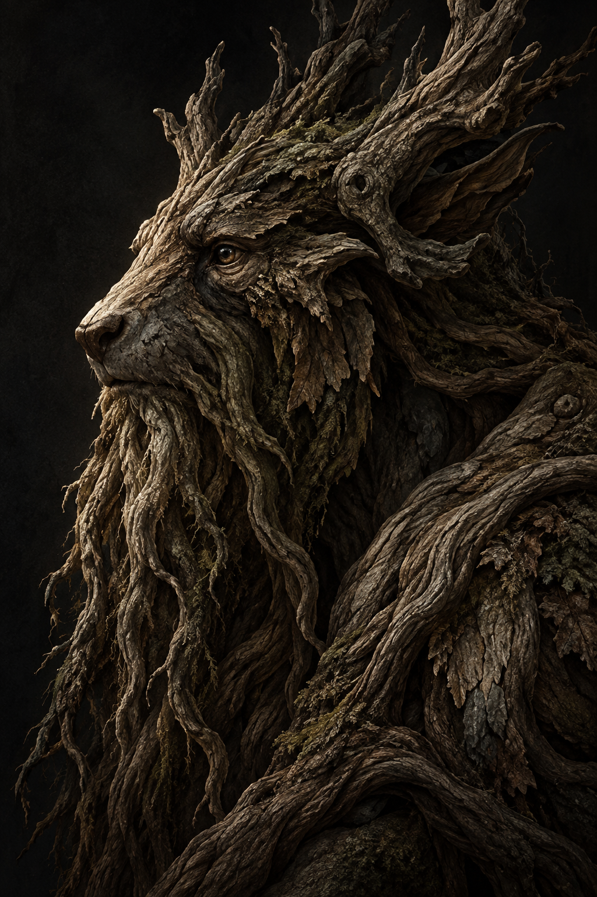

**Иллюстрации действий:**

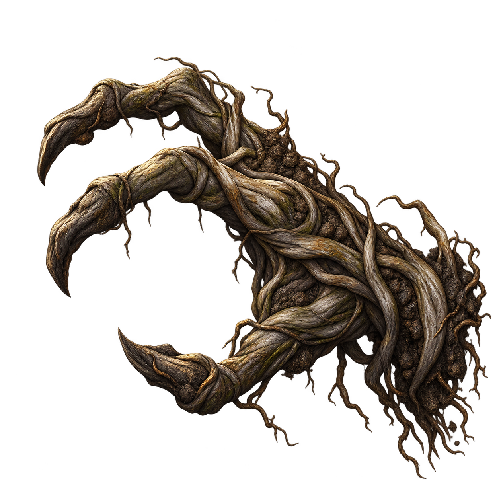

Захват корнями.

Сокрушение.

Отпрыгивание.

**Происхождение:** самостоятельное существо материального мира, чьё тело объединяет древесные и животные ткани. Соседствует с феями, но не подчиняется им автоматически.

**Внешность:** тяжёлое туловище на четырёх узловатых ногах, пучки корней вместо бороды, влажные глаза под корой.

**Поведение:** переносит саженцы и собирает повреждённые растения. Нападает на тех, кто разоряет его участок или мешает переселению зарослей.

**Места:** старые леса, заросшие сады, лесные границы покинутых деревень.

**Способности:** поднимает растения вместе с почвой, хватает корнями, узнаёт следы повреждения рощи.

**Атака:** физическая.

**Уязвимости:** медлителен на каменных поверхностях; мягкие ткани открываются между древесными пластинами.

**Диалог:** понимает медленную речь, отвечает жестами и редкими словами; способен попросить о помощи.

**Встреча:** «Дерево пересекает тропу. Под ним шагает существо, бережно прижимающее к груди ком земли с молодыми корнями».

### 11.6. ЗЕРКАЛЬЩИК

**Каталог:** `data/creatures.json` → `mirror-being`.

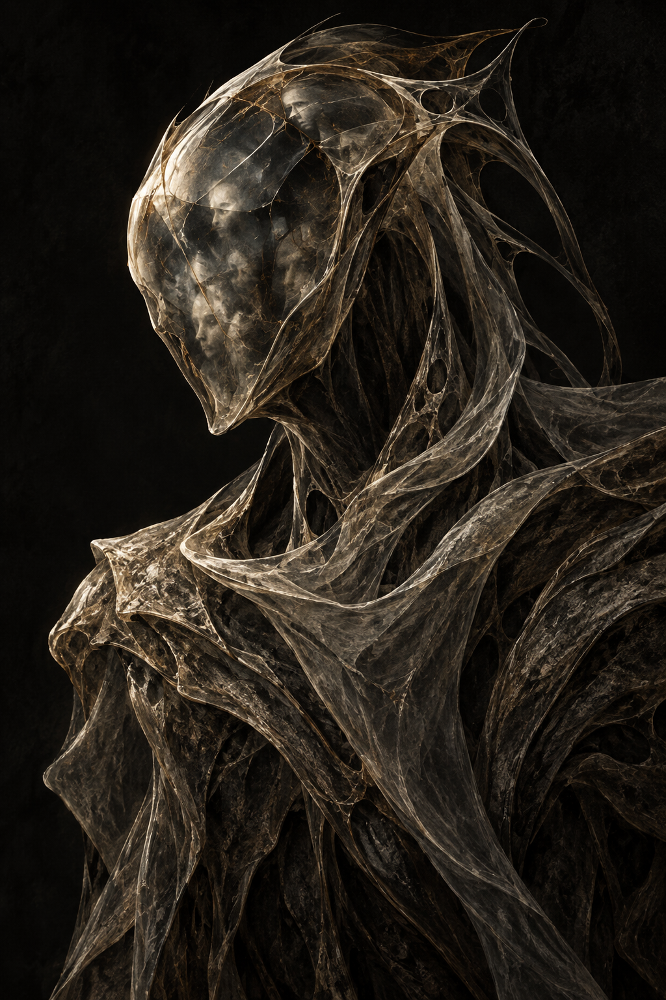

**Иллюстрации действий:**

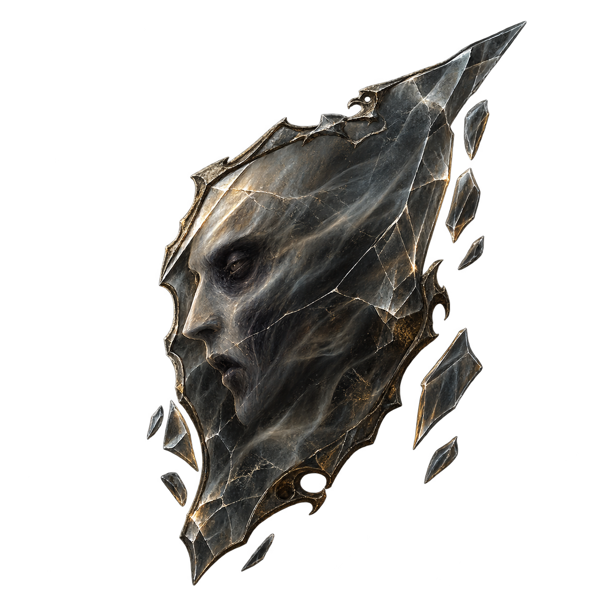

Ложное отражение.

Ускользание.

**Происхождение:** пограничный паразит из плана отражений; не относится к демонам и не поглощает души ради роста.

**Внешность:** в отражающей поверхности выглядит как запоздалое движение чужого лица. Воплощаясь, напоминает тонкую фигуру из дымчатого стекла.

**Поведение:** привязывается к человеку, который долго наблюдает отражение, и искажает его узнавание лиц и мест.

**Места:** дома с зеркалами, заброшенные бани, помещения со стоячей водой.

**Способности:** создаёт ложные отражения, подменяет знакомые черты, вызывает мучительное недоверие к собственным чувствам.

**Атака:** магическая.

**Уязвимости:** закрытие отражающей поверхности прерывает его непосредственное проявление в ней; это не равнозначно окончательному уничтожению.

**Диалог:** отвечает фразами наблюдателя, меняя их смысл; способен выдавать полезные сведения ради продолжения контакта.

**Встреча:** «Вы отворачиваетесь от зеркала. Отражение остаётся на месте и смотрит вам вслед».

### 11.7. ШОВНИК

**Каталог:** `data/creatures.json` → `stitchling`.

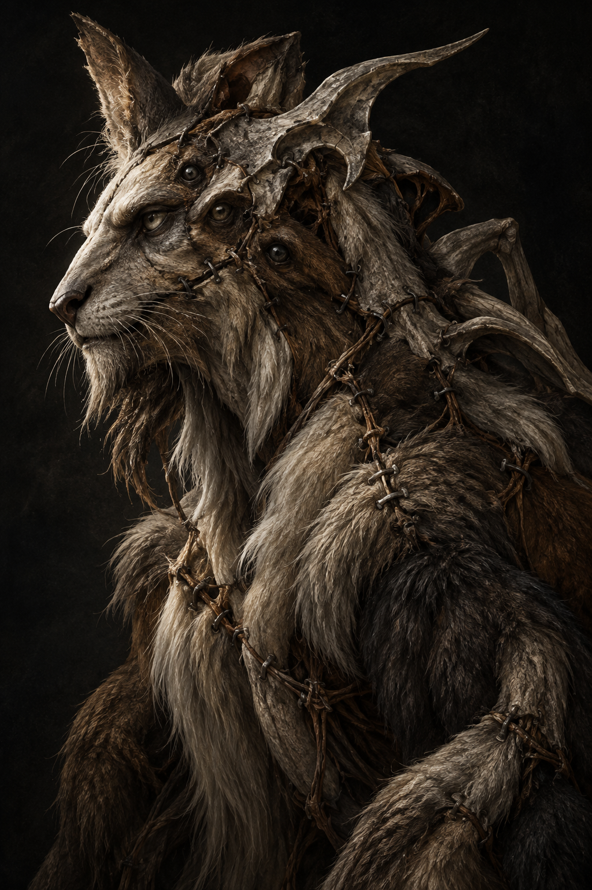

**Иллюстрации действий:**

Удар лапой.

Сокрушение.

Отпрыгивание.

**Происхождение:** искусственное существо, созданное магом из останков животных и связанного с ними сознания. Не требует человеческой души.

**Внешность:** несимметричное тело, стянутое жилами и металлическими скобами; разные по длине лапы, лишние суставы, несколько плохо согласованных органов чувств.

**Поведение:** следует закреплённому поручению, но отдельные части тела иногда реагируют на собственные прежние привычки.

**Места:** брошенные лаборатории, подвалы, мастерские диких магов.

**Способности:** неожиданно меняет способ движения, протискивается через тесные проходы, хватает несколькими конечностями.

**Атака:** физическая.

**Уязвимости:** соединительные швы и противоречащие друг другу реакции частей тела.

**Диалог:** возможны отдельные слова и узнавание приказов; связная беседа зависит от конкретного создания.

**Встреча:** «Из подвала доносится скуление. Потом цокот копыт. К двери приближается только одно существо».

### 11.8. ШЁПОТНИЦА

**Каталог:** `data/creatures.json` → `whisperess`.

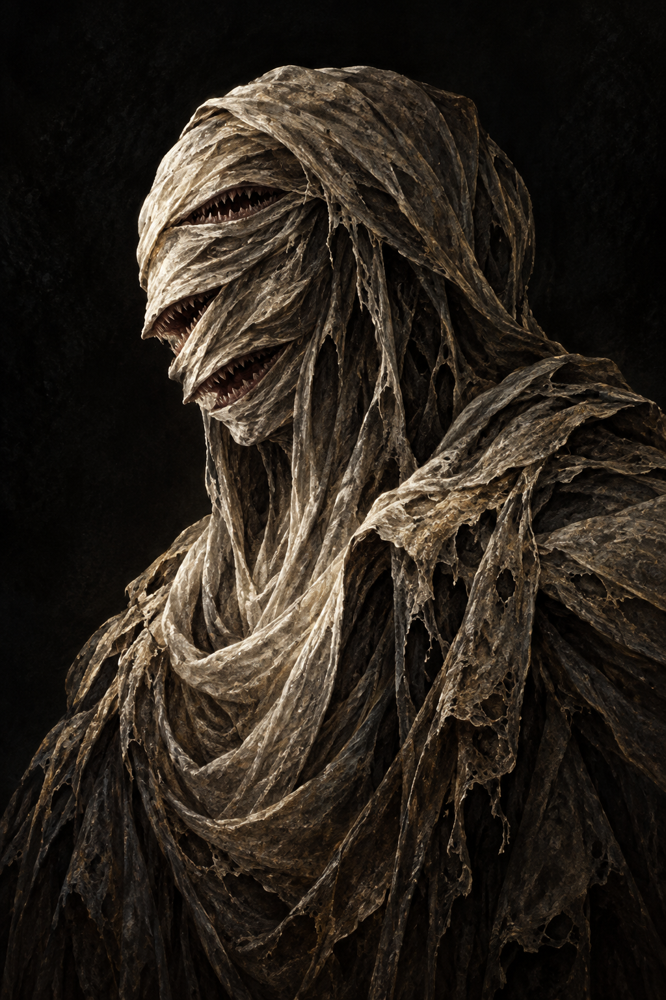

**Иллюстрации действий:**

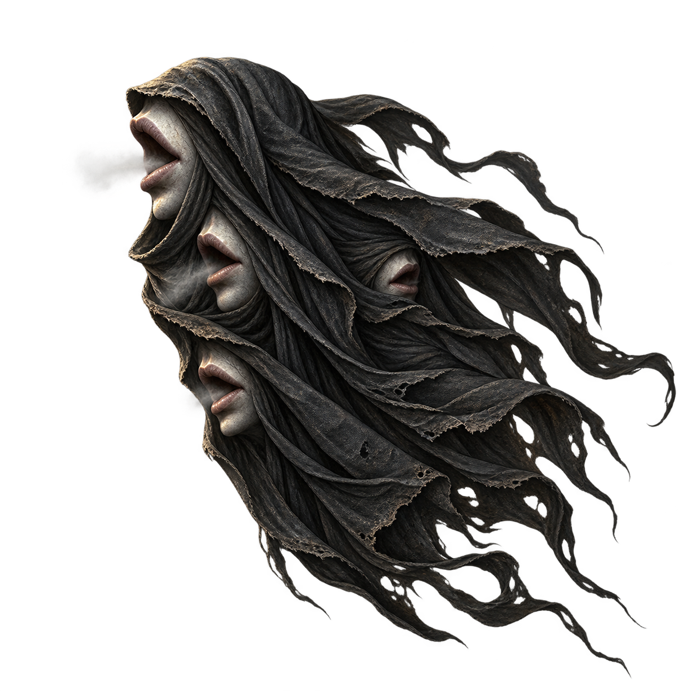

Истощающий шёпот.

Ускользание.

**Происхождение:** пограничное существо, питающееся переживанием горя, но не поглощающее человеческую душу целиком.

**Внешность:** узкая фигура в складках, похожих на мокрую погребальную ткань; вместо лица — несколько едва видимых движущихся ртов.

**Поведение:** селится там, где люди оплакивают погибших. Повторяет голоса умерших, заставляя живых возвращаться и слушать.

**Места:** разорённые дома, кладбищенские часовни, места недавней бойни.

**Способности:** подражает знакомым голосам, углубляет отчаяние, истощает жизненные силы длительным воздействием.

**Атака:** магическая.

**Уязвимости:** для влияния необходим слышимый контакт; уход за пределы голоса ослабляет воздействие. Сама сущность не исчезает от одного отказа слушать.

**Диалог:** имитирует близость, но может выдать то, что слышала от других посетителей.

**Встреча:** «Из пустого дома вас зовут голосом человека, которого вы похоронили. Он просит только одного: подойти ближе».

### 11.9. КАМЕННЫЙ ЗЕВОК

**Каталог:** `data/creatures.json` → `stone-yawn`.

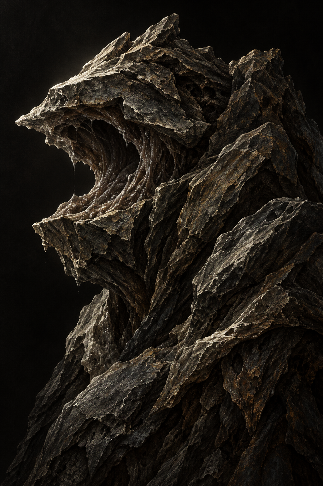

**Иллюстрации действий:**

Сокрушение.

Сдавливание.

Отпрыгивание.

**Происхождение:** медленно растущий материальный хищник, чьё сознание связано преимущественно с землёй и камнем.

**Внешность:** снаружи напоминает груду валунов или участок кладки. Раскрываясь, обнаруживает влажную пасть между минеральными пластинами.

**Поведение:** годами сохраняет неподвижность, поджидая тепло и колебания шагов.

**Места:** пещеры, горные проходы, старые карьеры и каменные руины.

**Способности:** маскировка под породу, резкое смыкание пластин, удержание добычи.

**Атака:** физическая.

**Уязвимости:** мягкая внутренняя поверхность раскрытой пасти; после броска медленно возвращается в исходное положение.

**Диалог:** человеческую речь не понимает; чувствующий может исследовать его сознание как сложное соединение элементов, но это не простой разговор.

**Встреча:** «Щель в кладке пахнет тёплой сыростью. Камень под ногой подаётся, и вся стена начинает смыкаться».

### 11.10. СЛИТНИК

**Каталог:** `data/creatures.json` → `meldling`.

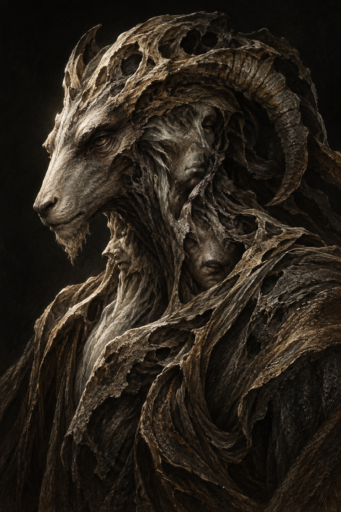

**Иллюстрации действий:**

Магический удар.

Удар лапой.

Отпрыгивание.

**Происхождение:** возможное новое существо из смешавшихся частиц, освобождённых при разрушении одного аттрактора. Это пример опасного исхода, а не обязательный результат каждого разрушения.

**Внешность:** неустойчивая общая форма, в которой проступают несовместимые черты нескольких существ; разные части пытаются обрести собственные очертания.

**Поведение:** в нём сосуществуют разрушительные устремления поглощённых частиц. Оно стремится удержать единство и может воспринимать людей как материал для укрепления себя.

**Места:** место разрушения аттрактора и прилегающая территория; дальнейшая среда зависит от его состава.

**Способности:** сочетает некоторые свойства исходных частиц, но не является восстановлением прежних пленников. Не должен автоматически получать способности всех существ мира.

**Атака:** у текущего Слитника физическая и магическая. Ядовитой атаки в каталоге нет; её нельзя приписывать этому игровому виду лишь из-за возможного состава поглощённых частиц.

**Уязвимости:** внутренние противоречия затрудняют согласованные действия. Особый способ окончательного уничтожения не установлен; правило перерождения не отменяется.

**Диалог:** говорит несогласованными голосами; иногда способен к краткому осмысленному разговору.

**Встреча:** «Камень расколот. На мгновение становится тихо. Затем из пустоты звучит голос, в котором слишком много говорящих: “Теперь мы вместе”».

## 12. ОЖИВЛЁННЫЕ КОСТИ

Добавлены по запросу автора два самостоятельных игровых вида. Объяснение их происхождения ниже — художественное дополнение: оно передаёт представления жителей, а не доказанную истину о Логосе.

### 12.1. СКЕЛЕТ

**Каталог:** `data/creatures.json` → `skeleton`.

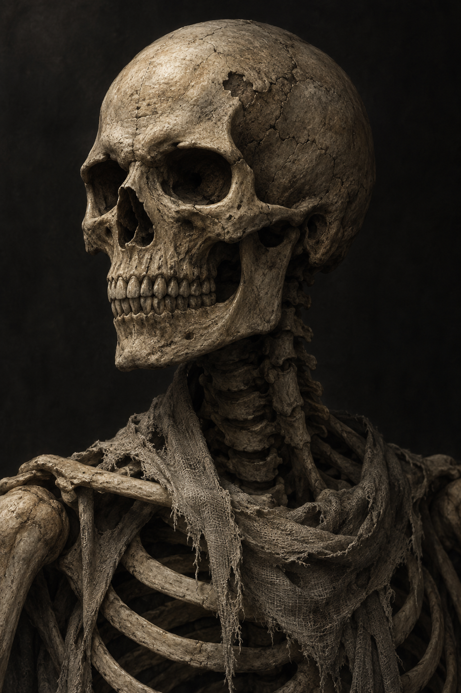

**Происхождение:** маги научились удерживать в человеческих костях простое соединение частиц сознания. По мнению жрецов, это новый страж из старых останков, а не возвращённый умерший: привычные движения не доказывают сохранения его личности. После разрушения скелета действует общий цикл возвращения частиц в их родной мир.

**Внешность:** открытый широкий череп с небольшой старой трещиной, потемневшие пористые кости, пустые глазницы, остатки погребальной ткани у ключиц. Без плоти. Это не Костесборщик и не пустой живой доспех.

**Поведение:** повторяет простые приказы, охраняет проходы и преследует нарушителя границы. Иногда продолжает караул давно разрушенного здания. Ни страх, ни усталость в человеческом смысле не объясняют его поступки; это не добавляет иммунитетов или исключений из игровых правил.

**Места:** склепы, руины крепостей, разорённые кладбища и старые поля сражений.

**Способности и уязвимости:** сохраняет простую координацию без живых мышц; повреждённые сочленения мешают удерживать тело. Разрушение костей прерывает его службу, но не уничтожает сами частицы Логоса. Особых числовых уязвимостей не вводится.

**Диалог:** осмысленная речь отсутствует.

**Встреча:** «За проломом слышен сухой стук костей. Из темноты выходит скелет. Он перекрывает проход, словно приказ сторожить эти стены всё ещё имеет силу».

### 12.2. СКЕЛЕТ-ЛУЧНИК

**Каталог:** `data/creatures.json` → `skeleton-archer`.

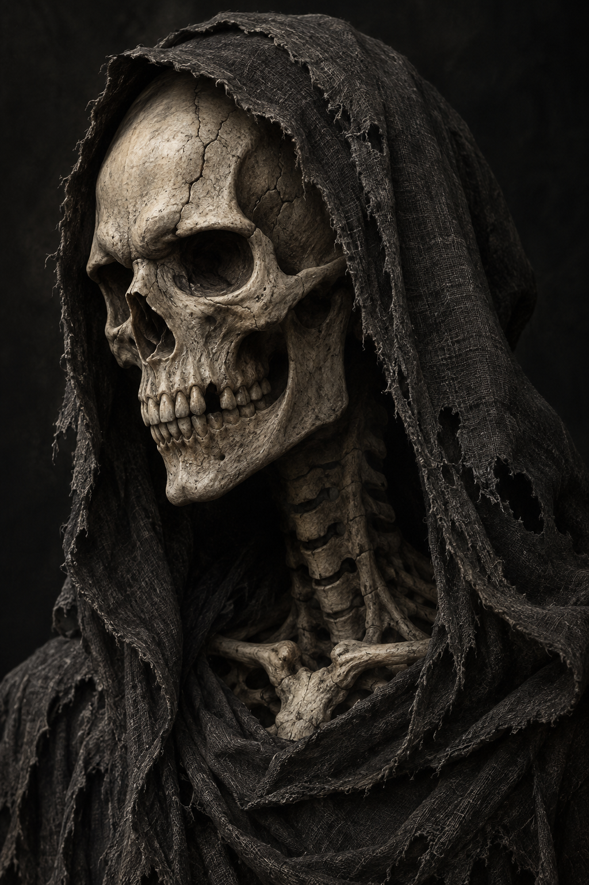

**Происхождение:** разновидность оживлённого костяного стража, в которую вложена последовательность движений стрелка. Это отдельный игровой вид с собственными ограничениями экипировки, а не случайно вооружённый обычный скелет.

**Внешность:** вытянутый узкий череп с отсутствующим верхним клыком, тонкие трещины у виска, истлевший тёмный капюшон и настороженный наклон головы. На портрете нет лука, стрел или колчана: оружие отображается из текущей экипировки.

**Поведение:** занимает место над дорогой или у проёма, поворачивается вслед за движением цели и повторяет выученную последовательность стрельбы. Не ведёт переговоров.

**Места:** крепостные галереи, сторожевые башни, погребальные переходы и развалины застав.

**Способности и уязвимости:** точность повторяемого движения сохраняется, пока целы связанные сочленения. Повреждение кистей и плеч нарушает стрельбу — это описание образа, а не отдельная система прицельных попаданий. После разрушения действует общий цикл частиц сознания.

**Диалог:** отсутствует.

**Встреча:** «Над обвалившейся галереей поворачивается бледный череп в рваном капюшоне. Костяной лучник замечает тебя и выходит из неподвижности».

## Диалоговый образ из каталога

### АТТРАКТОР

**Каталог:** `data/creatures.json` → `attractor`.

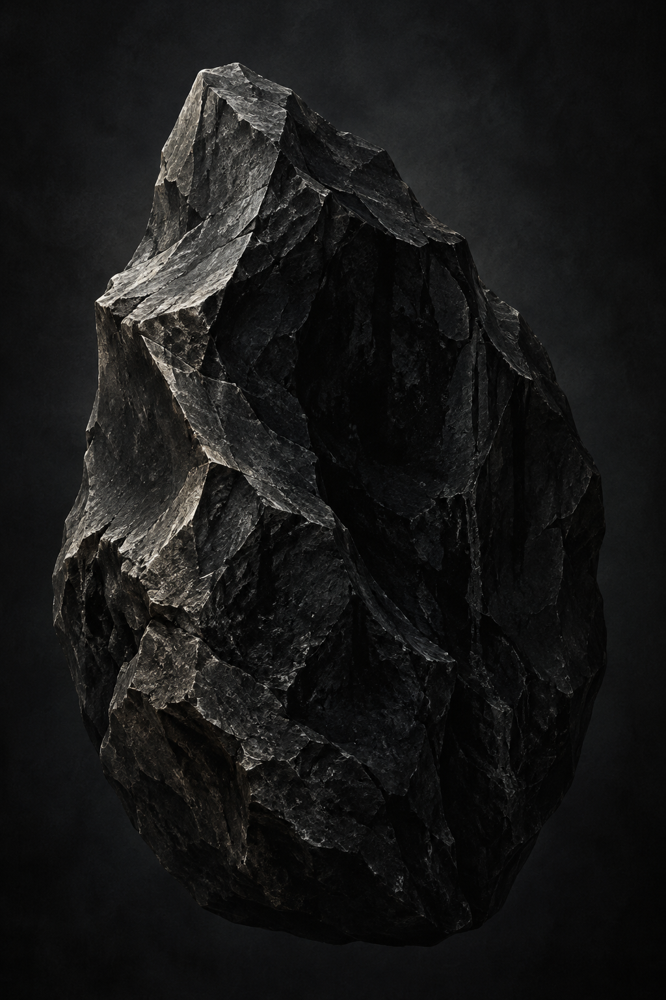

**Природа:** чёрный камень, созданный жрецами Света в месте, очищенном от сознания Логоса. Его присутствие в каталоге нужно для портрета и общения. Он не относится к обычным живым существам; подробное устройство описано в [разделе 9 лора](LORE.md#9-аттрактор-и-путешествие-героя).

**Внешность:** камень с почти нечитаемой чёрной поверхностью. Для изображения допустимы неровная грань и слабый отсвет на краю; внутри не следует рисовать лицо демона, жреца или самого Логоса. Не превращать сравнение с чёрной дырой в обязательное космическое зрелище.

**Поведение и голос:** наполненность усиливает осознание. Сначала голос обрывочен, затем способен убеждать, присваивать себе заслуги носителя и склонять его к жестокости. Доступный запас осколков героя и уже переданные камню осколки — разные величины. Камень не всеведущ и не принимает решения за игрока.

**Места:** конвои ордена Света, путь носителя и тайное захоронение. Опасные существа вокруг него не обязательно являются беглецами из его содержимого.

**Способности:** поглощает помещённые внутрь частицы сознания, исключая их из цикла перерождения; передача осколков позволяет усиливать героя. По согласованному сценарию возвращает погибшего носителя в начало текущей карты ради дальнейшей пользы. Не воскрешает его спутников и не отменяет сохранённые сюжетные решения.

**Атака:** отсутствует; в каталоге нет боевых фигур. Влияние на носителя — часть истории, не самостоятельный боевой тип урона.

**Ограничения:** разрушение доступно тёмным подземным феям. Оно освобождает частицы, но не возвращает прежних пленников целиком и может породить новую опасную сущность. Обычная кузница и оружие не заменяют способность феи.

**Диалог:** в сценарии герой слышит внутренний голос; окружающие не слышат его автоматически. Правила показа голоса находятся в RULES.md.

**Реплика — дополнение для развитого голоса:** «Они называют это жадностью. Я называю это ещё одним днём, который ты переживёшь».

## Рекомендации для изображений и расширения бестиария

### Для изображений

Строй портрет по внешности, среде и поведению конкретного существа. Не добавляй всем видам одинаковые рога, светящиеся глаза, крылья или дым. Демон может выглядеть совершенно безобидно. Исчезающий обязан оставаться чёрным и безобъёмным. Лёгкий дух — почти неуловимым. Болотница выглядит старой независимо от возраста. Живой доспех пуст внутри и не является человеком в броне. Волк-оборотень — отдельный зверь, не стадия превращения человека.

Материальный облик фей, эльфов, драконов и многих зверей допускает разработку. Предлагаемые визуальные детали в карточках не следует выдавать за дословные требования автора. Тёмная фея не обязана выглядеть злодейкой. Демон и вампир могут находиться среди обычных людей без очевидных внешних признаков чудовища.

### Для дальнейшего расширения бестиария

Добавляй существ с различными силуэтами, средой обитания, поведением и способностями. Не своди все различия к размеру. Привязывай встречи к локациям и состоянию мира. Указывай происхождение, внешность, поведение, способности, допустимые типы атаки, уязвимости, возможность диалога и короткий текст встречи. Не придумывай числовые характеристики без нового запроса.

Сохраняй разделение между заданным материалом и новыми предложениями. Не расширяй редкие умения одного вида до общего правила: разрушение аттрактора принадлежит тёмным феям; вампир не может выходить из тела; демон обязан материализоваться для окончательного убийства; безвредные духи не становятся врагами только из-за потустороннего происхождения.
