# ЭКИПИРОВКА

Пути в обычном тексте и в обратных кавычках указаны от корня проекта; относительные Markdown-ссылки — от расположения документа.

Описания экипировки, связанные с лором. Документ описывает весь текущий каталог: 42 оружия, три щита и базовый кулак из `data/weapons.json`, девять предметов одежды, брони и обуви из `data/armor.json`, два украшения из `data/jewelry.json`.

Связанные материалы: [лор](LORE.md), [бестиарий](BESTIARY.md), [экипировка](EQUIPMENT.md).

## Статус материала

Раздел 13 содержит 42 оружия действующего каталога; разделы 14 и 15 — щиты и кулак из того же файла данных. Первые двадцать карточек сохраняют исходные номера 13.1–13.20, на которые ссылаются данные. Новые истории происхождения — художественное дополнение; они не меняют игровые эффекты. Разделы 16 и 17 добавляют броню, обувь и украшения. Имена, ID, слоты и свойства сверяются с соответствующими каталогами data; изображения — с `data/item-art.json`. Описания предназначены для историй и изображений, без числовых характеристик.

Пометка «не определено» означает отсутствие решения, а не запрет на дальнейшее развитие. Свободное творческое дополнение разрешено, но оно не должно противоречить заданным правилам. Числовые игровые характеристики не нужны. Допустимы только три обозначения типов атаки: физическая, магическая, ядовитая. Страх, утрата рассудка и высасывание жизненных сил описываются как свойства и последствия воздействия, без введения отдельных боевых систем.

Исходная нумерация разделов и карточек сохранена для ссылок из игровых данных и других документов.

## 13. ОРУЖИЕ ГЕРОЯ И ПРОТИВНИКОВ

Здесь описаны все виды оружия действующего каталога. Различия формы, материалов и происхождения помогают создавать тексты и изображения; числа и подробные правила боя остаются в data и документации баланса. В полях карточек рубящий, колющий и дробящий урон относятся к физической атаке; огонь, холод, ветер и чистая магия — к магической; яд — к ядовитой.

Обычное оружие действует через материальную форму существа. Оно не получает способности поражать бесплотные сущности только потому, что сделано из серебра, украшено знаком ордена или принадлежало жрецу. Убийство оружием не отменяет перерождение и не заменяет запечатывание в аттракторе.

Все игровые экземпляры магического оружия заранее подготовлены магом: в материале закреплено готовое действие. Поэтому ими может пользоваться обычный человек, включая героя, если соблюдены игровые требования предмета. Посохи и жезлы не требуют отдельного пробуждения чувствительности или дополнительного обряда после получения. Интеллект в требованиях отражает умение обращаться с изделием, а не талант чувствующего. Владелец не получает способности создавать и изменять заклинания, проникать в другие планы или ремонтировать сложные чары без мастера. Зелья и ядовитые составы также поступают готовыми к применению. Эти сведения не вводят расход зарядов, воды, топлива или боеприпасов сверх действующих правил.

### 13.1. ДОРОЖНЫЙ МЕЧ

**Каталог:** `data/weapons.json` → `road-sword`. Хват: одноручный. Тип атаки: физическая.

**Вид и облик:** одноручный прямой меч с простой крестовиной, потёртой кожаной рукоятью и узким долом. На клинке остаются следы многократной заточки.

**Происхождение и владельцы:** распространён среди наёмников, караванной охраны и разорившихся воинов. В смутные времена один меч может сменить нескольких хозяев за одну войну. Подходит герою без магической подготовки.

**Применение и атака:** рубящие и колющие удары; физическая. Универсален в дорожной схватке, но не обладает особыми средствами против тяжёлого доспеха или бесплотного существа.

**Где встречается:** лагеря, заставы, оружейные лавки, поля былых битв.

**Текст предмета:** «Имена владельцев стёрлись с ножен. Зарубки на гарде остались».

### 13.2. СОЛДАТСКОЕ КОПЬЁ

**Каталог:** `data/weapons.json` → `soldier-spear`. Хват: двуручный. Тип атаки: физическая.

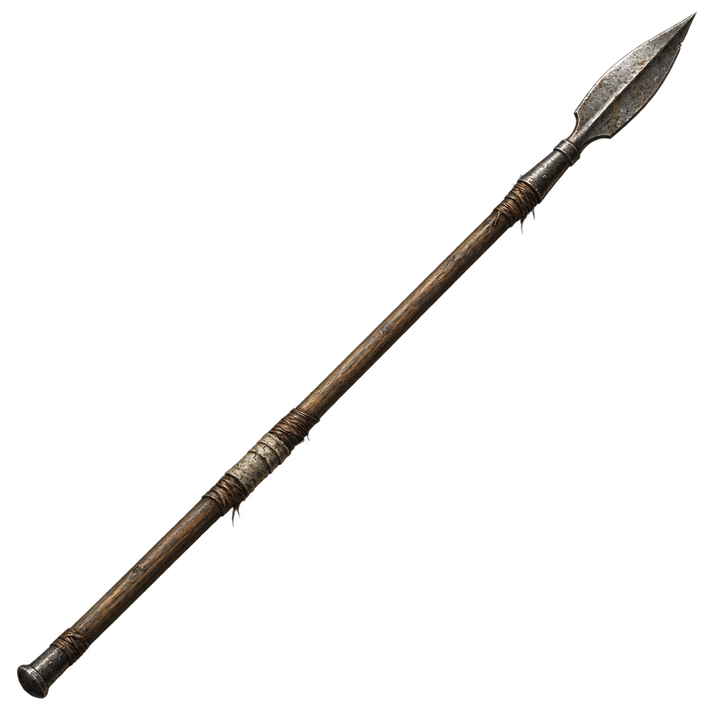

**Вид и облик:** длинное ясеневое древко с листовидным железным наконечником и грубой обмоткой в месте хвата.

**Происхождение и владельцы:** оружие пехоты и деревенского ополчения. После разгрома войска такие копья остаются у крестьян, разбойников и дорожных стражей. Герой может пользоваться им как обычным оружием.

**Применение и атака:** позволяет держать зверя или вооружённого противника на расстоянии; физическая. Длинное древко неудобно в тесных комнатах и густом кустарнике.

**Где встречается:** заставы, разорённые деревни, заброшенные лагеря.

**Текст предмета:** «Наконечник выковал кузнец. Древко хозяин вырезал сам, когда к деревне подошла война».

### 13.3. СЕЧА РАЗБОЙНИКА

**Каталог:** `data/weapons.json` → `bandit-cleaver`. Хват: одноручный. Тип атаки: физическая.

**Вид и облик:** короткий тяжёлый тесак с широким односторонним лезвием. Рукоять часто обмотана полосой чужого ремня.

**Происхождение и владельцы:** переделанный хозяйственный инструмент лесных разбойников и мародёров. Его происхождение не требует особой школы или редкого металла.

**Применение и атака:** грубые рубящие удары, рассечение верёвок и тонких преград; физическая. Короткое лезвие заставляет подходить близко. Доступен герою.

**Где встречается:** придорожные засады, разграбленные обозы, бандитские стоянки.

**Текст предмета:** «Им рубили хворост, вскрывали сундуки и добивали тех, кто не успел убежать».

### 13.4. КЛЮВАСТЫЙ МОЛОТ

**Каталог:** `data/weapons.json` → `beaked-hammer`. Хват: одноручный. Тип атаки: физическая.

**Вид и облик:** короткая прочная рукоять, небольшой ударный боёк и длинный загнутый клюв на обратной стороне головки.

**Происхождение и владельцы:** оружие воинов, сражающихся с бронированными противниками. Искатели добычи в руинах ценят его при столкновениях с живыми доспехами.

**Применение и атака:** удары по пластинам и сочленениям; физическая. Может повредить оболочку живого доспеха, но не освобождает и не уничтожает заключённый дух сам по себе. Герою не требуется чувствительность.

**Где встречается:** военные склады, руины укреплений, снаряжение тяжёлой пехоты.

**Текст предмета:** «Железному часовому нечего ломать под бронёй. Приходится ломать саму броню».

### 13.5. АЛЕБАРДА ПОСЛЕДНЕГО КАРАУЛА

**Каталог:** `data/weapons.json` → `last-watch-halberd`. Хват: двуручный. Тип атаки: физическая.

**Вид и облик:** длинное древковое оружие с топорным лезвием, верхним остриём и крюком; на втулке выбит знак давно исчезнувшего гарнизона.

**Происхождение и владельцы:** штатное оружие старых крепостных стражей, в том числе живых доспехов. Название связано с теми часовыми, которые продолжают охранять пустые хранилища.

**Применение и атака:** колет, рубит и цепляет выступающие части снаряжения; физическая. Само оружие не одушевлено. Герой может подобрать его, но длинный размах требует места.

**Где встречается:** оружейные, крепостные ворота, охраняемые руины.

**Текст предмета:** «Приказ караулу никто не отменил. Отдававший его рассыпался в прах раньше древка».

### 13.6. ЛУК ЛЕСНОЙ ОХОТЫ

**Каталог:** `data/weapons.json` → `hunting-bow`. Хват: двуручный. Тип атаки: физическая.

**Вид и облик:** длинный деревянный лук, простой колчан, стрелы с разным оперением. Поверхности натёрты воском и потемнели от дождя.

**Происхождение и владельцы:** оружие охотников, лесных дозорных и разбойников. Некоторые фавны пользуются сходными луками на территориях своих союзников-фей.

**Применение и атака:** дальняя стрельба; физическая. Требует навыка, обзора и пространства для натяжения; магической способности не даёт. Доступен герою.

**Где встречается:** лесные поселения, охотничьи стоянки, лагеря у опушек.

**Текст предмета:** «На дереве нет ни рун, ни благословений. Только следы пальцев человека, который редко промахивался».

**Боеприпасы лука:** стрелы бесконечны у героя и противников, включая скелета-лучника. Счётчика и пополнения стрел нет. Выносливость и правила колоды расходуются по обычным правилам режима боя.

### 13.7. АРБАЛЕТ ЗАСТАВЫ

**Каталог:** `data/weapons.json` → `outpost-crossbow`. Хват: двуручный. Тип атаки: физическая.

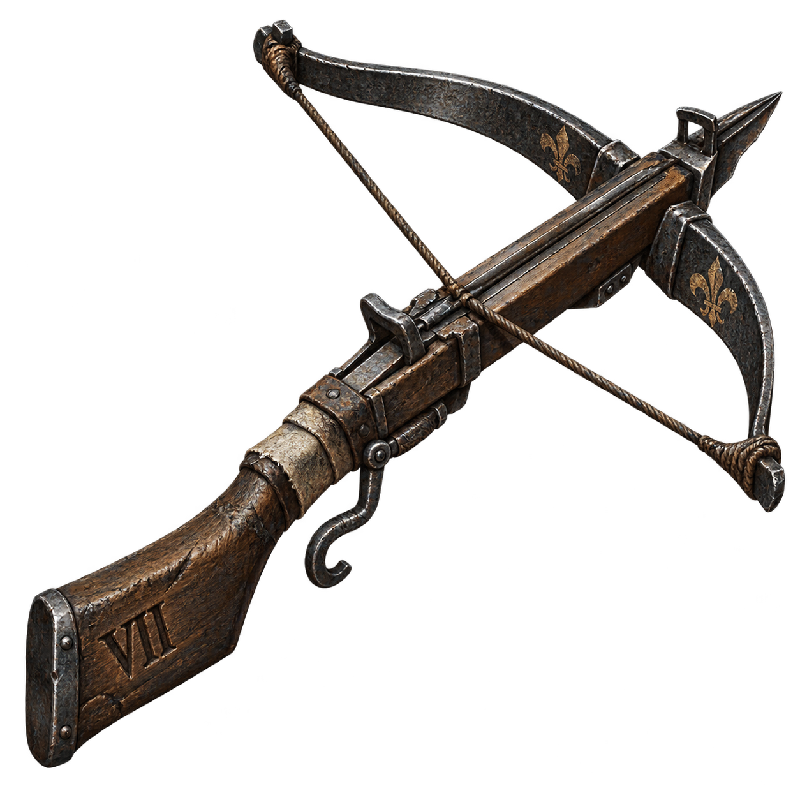

**Вид и облик:** крепкое деревянное ложе, металлическая дуга, поясной крюк для взвода. На прикладе вырезан номер караульного места.

**Происхождение и владельцы:** оружие городских стражей и защитников переправ. После падения застав попадает к наёмникам и грабителям.

**Применение и атака:** прицельный выстрел болтом; физическая. Между выстрелами нужно время для перезарядки. Герой может использовать без магии, освоив обращение.

**Где встречается:** города, мосты, пограничные укрепления, захваченные склады.

**Текст предмета:** «На прикладе двадцать зарубок. Ни одна не объясняет, кого здесь считали врагом».

### 13.8. ЛЕЗВИЕ ЛАСКОВОГО ГОСТЯ

**Каталог:** `data/weapons.json` → `guest-blade`. Хват: одноручный. Тип атаки: физическая.

**Вид и облик:** узкий кинжал, скрытый в неприметных ножнах или оформленный как часть дорогого дорожного прибора. Гарда мала и не цепляется за одежду.

**Происхождение и владельцы:** любимое орудие некоторых вампиров, обманщиков и убийц, предпочитающих сначала войти в доверие. Принадлежность вампиру не наделяет клинок его природой.

**Применение и атака:** короткий скрытый выпад вблизи; физическая. Не высасывает жизнь и не превращает жертву в вампира. Герой может применять как обычный кинжал.

**Где встречается:** гостиницы, городские дома, ярмарки, тайники за обивкой дорожных сундуков.

**Текст предмета:** «Хозяин просил поддержать его под локоть. Клинок оказался в другой руке».

### 13.9. БОЛОТНЫЙ КРЮК

**Каталог:** `data/weapons.json` → `marsh-hook`. Хват: одноручный. Тип атаки: физическая.

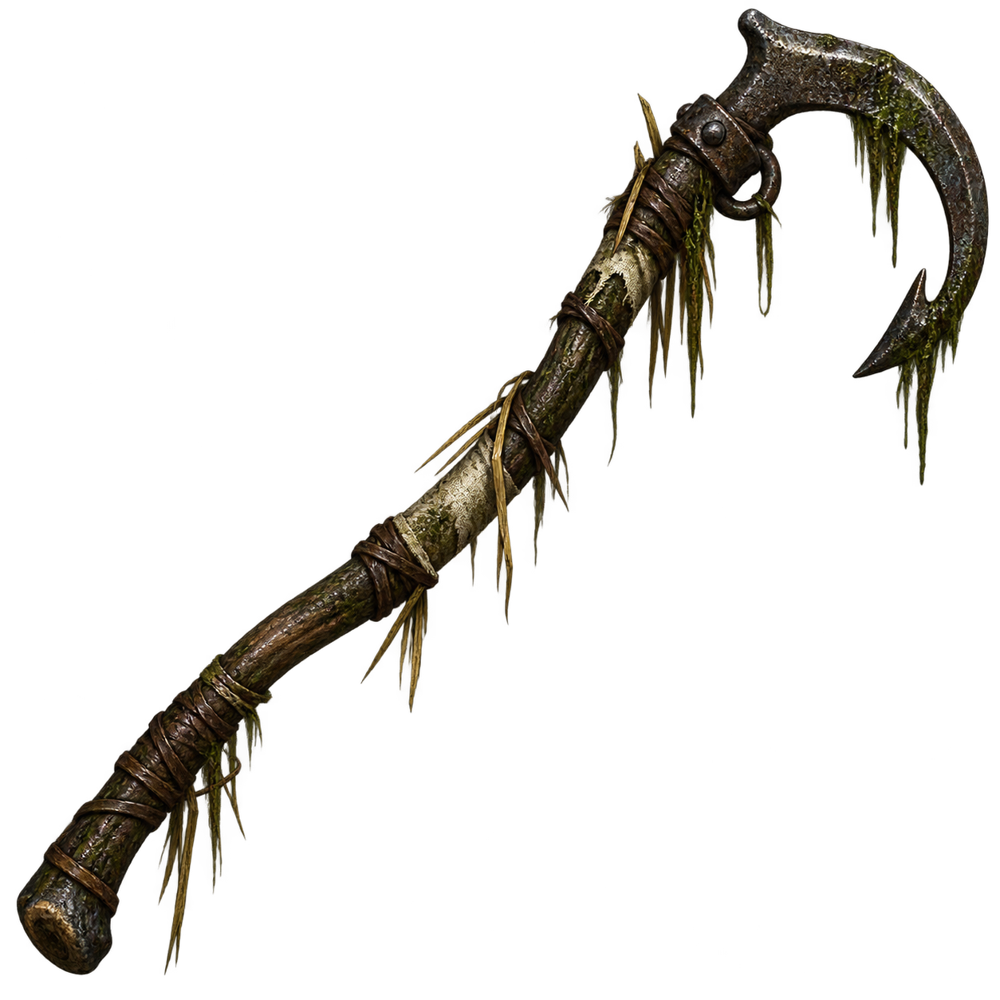

**Вид и облик:** длинная кривая рукоять с тяжёлым железным крюком; по металлу тянется зелёный налёт, а в обмотке застряли камышовые волокна.

**Происхождение и владельцы:** орудие отдельных болотниц и жестоких обитателей трясин. Болотница может утаскивать им добычу в жилище; это вариант её вооружения, а не обязательная черта всего вида.

**Применение и атака:** зацеп, рывок и удар; физическая. В текущем каталоге у крюка нет ядовитой атаки. Истории о болотных ядах не добавляют ему ядовитого покрытия автоматически.

**Где встречается:** болотные жилища, затопленные настилы, тайники в камышах.

**Текст предмета:** «Старуха называла его багром. Лодки возле её дома никто не видел».

### 13.10. ШИП ТРЯСИНЫ

**Каталог:** `data/weapons.json` → `bog-stinger`. Хват: одноручный. Тип атаки: физическая, ядовитая.

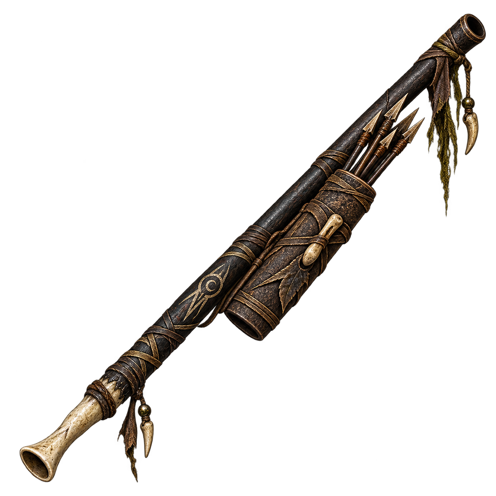

**Вид и облик:** духовая трубка из тёмного полого стебля с костяным мундштуком и связкой тонких дротиков в закрытом футляре.

**Происхождение и владельцы:** оружие болотных охотников и скрытных убийц. Яд для дротиков готовят знахари и алхимики; связь с сёстрами Млечного познания не предполагается.

**Применение и атака:** незаметный дротик прокалывает кожу и доставляет яд; физическая и ядовитая. Без покрытия рана мала, а против плотной брони орудие мало пригодно. Герой может использовать готовые дротики, не умея изготовлять состав.

**Где встречается:** болотные поселения, охотничьи тайники, подпольные городские рынки.

**Текст предмета:** «Путник смахнул с шеи то, что принял за мошку. До сухого берега он не дошёл».

### 13.11. ЛУННЫЙ СЕРП ЭЛЬФОВ

**Каталог:** `data/weapons.json` → `elven-moon-sickle`. Хват: одноручный. Тип атаки: физическая.

**Вид и облик:** короткое изогнутое лезвие матового металла, рукоять из плотного светлого дерева, узор ветвей вдоль обуха. Название описывает форму, а не источник силы.

**Происхождение и владельцы:** оружие и рабочий инструмент эльфийских хранителей рощ. Им срезают повреждённые ветви и защищают скрытые поселения.

**Применение и атака:** близкие режущие движения и зацеп; физическая. Свойства не требуют эльфийского происхождения владельца. Герой может получить серп за услугу или как трофей, что по-разному скажется на отношении прежних хозяев.

**Где встречается:** лесные поселения эльфов, пограничные рощи, тропы в скрытые долины.

**Текст предмета:** «Ветвь срезают, чтобы дерево жило. О целом мире его хозяева судят осторожнее».

### 13.12. РОГАТИНА ФАВНА

**Каталог:** `data/weapons.json` → `faun-boar-spear`. Хват: двуручный. Тип атаки: физическая.

**Вид и облик:** крепкое короткое копьё с широким наконечником и поперечиной; древко обвито корнями и украшено резными отметками рощи.

**Происхождение и владельцы:** оружие фавнов, защищающих общие с феями земли. Поперечина помогает удержать крупного зверя, бросившегося на остриё.

**Применение и атака:** упорный встречный укол и удержание дистанции; физическая. Не несёт врождённой магии фей. Пригодна герою, если он получит её у владельца или найдёт оставленной.

**Где встречается:** опушки, поляны, входы в природные убежища феири.

**Текст предмета:** «За этой чертой начинается чужой дом. Фавн показывает границу остриём».

### 13.13. ПОСОХ ТЛЕЮЩЕГО КАМНЯ

**Каталог:** `data/weapons.json` → `emberstone-staff`. Хват: двуручный. Тип атаки: магическая.

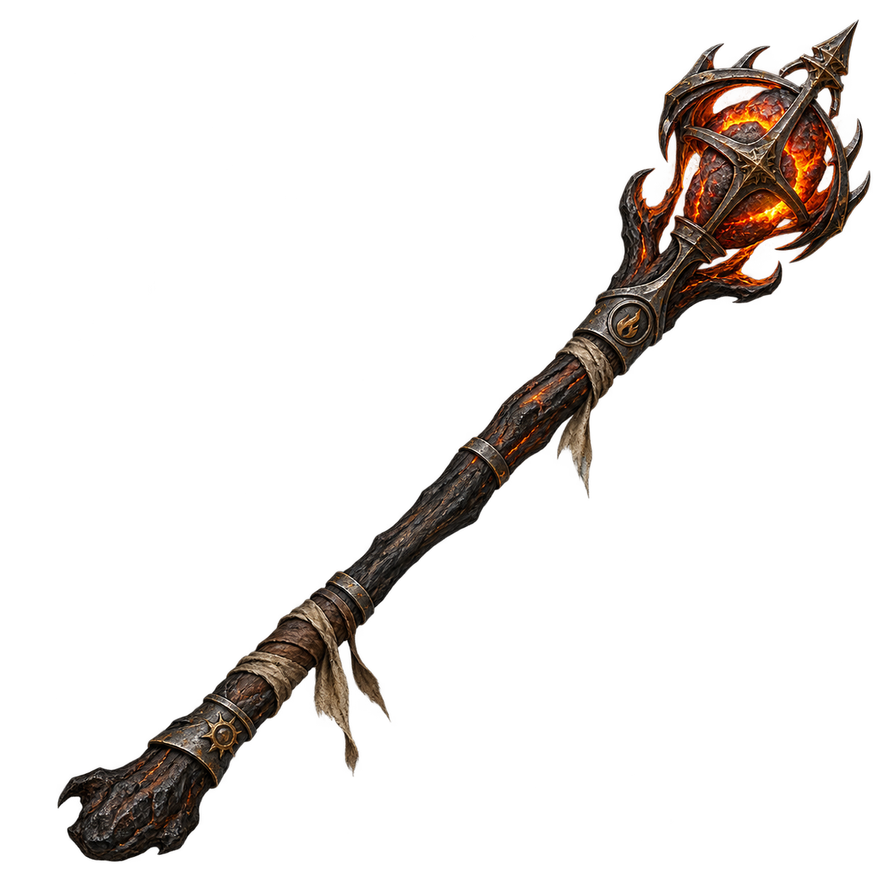

**Вид и облик:** обугленный посох с камнем в железной клетке навершия. В трещинах минерала виден жар, у хвата дерево остаётся холодным.

**Происхождение и владельцы:** инструмент магов, изучающих взаимодействие огня и камня. Чаще встречается у боевых магов, которым нужен управляемый источник жара.

**Применение и атака:** владелец направляет заранее закреплённое огненное действие; магическая. Игровой посох уже подготовлен мастером и доступен обычному герою без таланта чувствующего.

**Ограничения и места:** работа требует правильного обращения с готовым изделием; менять закреплённое действие и восстанавливать повреждённые чары способен маг. Встречается в военных лагерях, мастерских и на местах магических пожаров.

**Текст предмета:** «Камень не горит. Он помнит, как велено гореть тому, что находится рядом».

### 13.14. ЖЕЗЛ РЕЧНОГО ЛЬДА

**Каталог:** `data/weapons.json` → `river-ice-wand`. Хват: одноручный. Тип атаки: магическая.

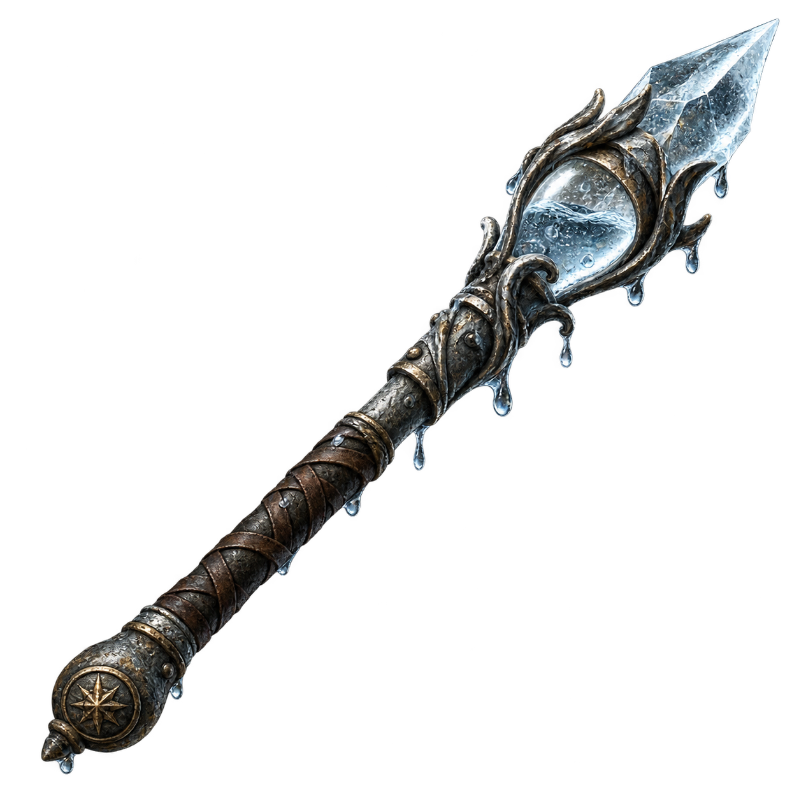

**Вид и облик:** короткий жезл с прозрачным минеральным наконечником и запаянной полостью для воды. По оправе медленно собираются холодные капли.

**Происхождение и владельцы:** происходит от инструментов магов, расчищавших реки для судоходства. Военные мастера приспособили те же знания для боя.

**Применение и атака:** владелец запускает закреплённое магом действие замерзания, формирующее острые ледяные выбросы; магическая. Жезл работает с материальным первоэлементом и не создаёт доступ к иному плану.

**Ограничения и доступность:** игровой жезл уже подготовлен магом; его запаянная водяная полость входит в устройство готового изделия. Обычный герой может пользоваться им. Поиск и расход воды не являются дополнительным условием боя.

**Где встречается:** речные города, склады у переправ, лагеря у водоёмов.

**Текст предмета:** «Когда-то им открывали путь лодкам. Теперь лёд смыкается вокруг тех, кто пытается переплыть реку».

### 13.15. КОПЬЁ ПОПУТНОГО ВЕТРА

**Каталог:** `data/weapons.json` → `tailwind-spear`. Хват: двуручный. Тип атаки: физическая, магическая.

**Вид и облик:** лёгкое копьё с полым навершием под наконечником; внутри закреплены тонкие каменные пластинки, тихо звенящие при движении.

**Происхождение и владельцы:** оружие, подготовленное магом воздуха для разведчиков и посыльных. В пластинках закреплено простое действие, усиливающее поток воздуха при направленном выпаде.

**Применение и атака:** остриё сопровождается кратким воздушным толчком; физическая и магическая. Обычный герой способен воспользоваться готовым действием, но не меняет направление ветров вокруг и не получает власть над погодой.

**Ограничения и места:** повреждённые пластинки требуют мастера; без чар остаётся обычное копьё. Встречается у армейских разведчиков и в снаряжении погибших посыльных.

**Текст предмета:** «Его заказывали, чтобы расчистить дорогу одному гонцу. Гонец не вернулся; копьё дошло до рынка».

### 13.16. КАМНЕДРОБ

**Каталог:** `data/weapons.json` → `stonecrusher`. Хват: одноручный. Тип атаки: физическая, магическая.

**Вид и облик:** тяжёлая булава с каменным навершием, стянутым железными полосами. По поверхности расходятся тонкие вырезанные борозды.

**Происхождение и владельцы:** работа магов земли, умеющих согласовывать поведение камня и металла. Подготовленное навершие при ударе передаёт короткое сотрясение соприкасающемуся материалу.

**Применение и атака:** тяжёлый удар с магическим воздействием на место соприкосновения; физическая и магическая. Герой может использовать закреплённое действие без собственной магии.

**Ограничения:** не разрывает сознание, не разрушает аттракторы и не обрушает горы. Повреждение борозд нарушает подготовленные чары.

**Где встречается:** осадные склады, старые карьеры, мастерские магов земли.

**Текст предмета:** «Мастер не учил камень ненавидеть. Он научил его передавать удар дальше».

### 13.17. КАДИЛО ГОРЬКОГО ДЫМА

**Каталог:** `data/weapons.json` → `bitter-censer`. Хват: одноручный. Тип атаки: ядовитая.

**Вид и облик:** закрытый перфорированный сосуд на короткой рукояти с крышкой и внутренней чашей для состава. Тёмные потёки забили часть отверстий.

**Происхождение и владельцы:** оружие некоторых диких магов и отравителей. В нём нагревают заранее приготовленную смесь растительных и минеральных компонентов. Название и форма не означают принадлежности ордену Света.

**Применение и атака:** выпускает едкий отравляющий дым; ядовитая. Герой может воспользоваться подготовленной смесью, но изготовление требует специальных знаний.

**Ограничения и места:** ветер может вернуть дым владельцу; в тесном помещении опасен всем присутствующим. Встречается в тайных лабораториях, болотных убежищах и городских подвалах.

**Текст предмета:** «Запах напоминает лекарство. Тот, кто приготовил смесь, хорошо знал разницу в пропорциях».

### 13.18. ПРАЩА ПЕЧАТНЫХ КАМНЕЙ

**Каталог:** `data/weapons.json` → `sealed-stone-sling`. Хват: одноручный. Тип атаки: физическая, магическая.

**Вид и облик:** широкая кожаная праща и футляр с гладкими камнями, каждый из которых отмечен отдельной тонкой печатью.

**Происхождение и владельцы:** снаряжение вспомогательных отрядов при боевых магах. Мастер заранее закрепляет в камнях короткий жаровой всплеск, срабатывающий от сильного удара.

**Применение и атака:** бросок подготовленного камня сочетает удар и закреплённое заклинание; физическая и магическая. Герой может метать готовые камни, но не создаёт новые печати сам.

**Ограничения:** обычный камень даёт только физическую атаку. Эти камни не являются аттракторами, не содержат пойманных чудовищ и не поглощают души.

**Где встречается:** военные обозы, мастерские, развалины лагерей.

**Текст предмета:** «На вид — речная галька. В обозе её хранили отдельно и запрещали ронять».

### 13.19. КЛИНОК ОСТРОВНОГО КОНВОЯ

**Каталог:** `data/weapons.json` → `convoy-blade`. Хват: одноручный. Тип атаки: физическая.

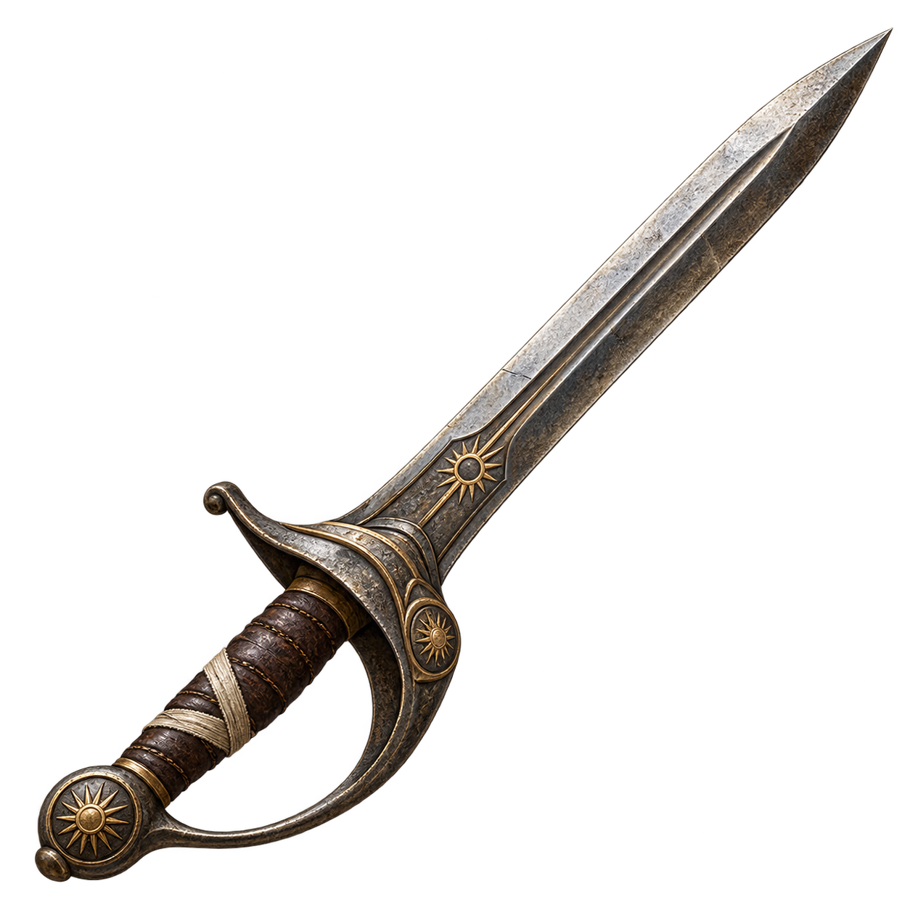

**Вид и облик:** простой короткий меч с закрытой гардой; у основания клинка выбит знак острова Света. Ножны рассчитаны на долгую дорогу и сырость.

**Происхождение и владельцы:** оружие мирских сопровождающих при жрецах Света. Его задача — защищать носителя аттрактора от разбойников и материальных существ. Может стать оружием героя из погибшего отряда, если такой вариант будет выбран для начала истории.

**Применение и атака:** ближний бой в дорожной колонне; физическая. Знак ордена не позволяет рубить бесплотных духов, очищать души или предотвращать перерождение.

**Где встречается:** снаряжение конвоя, убежища ордена, следы пропавших перевозок.

**Текст предмета:** «Жрец отвечал за то, что шло из других миров. Человек с этим мечом — за то, что выходило из придорожных кустов».

### 13.20. ЖИЛЬНЫЙ БИЧ

**Каталог:** `data/weapons.json` → `sinew-lash`. Хват: одноручный. Тип атаки: физическая, магическая.

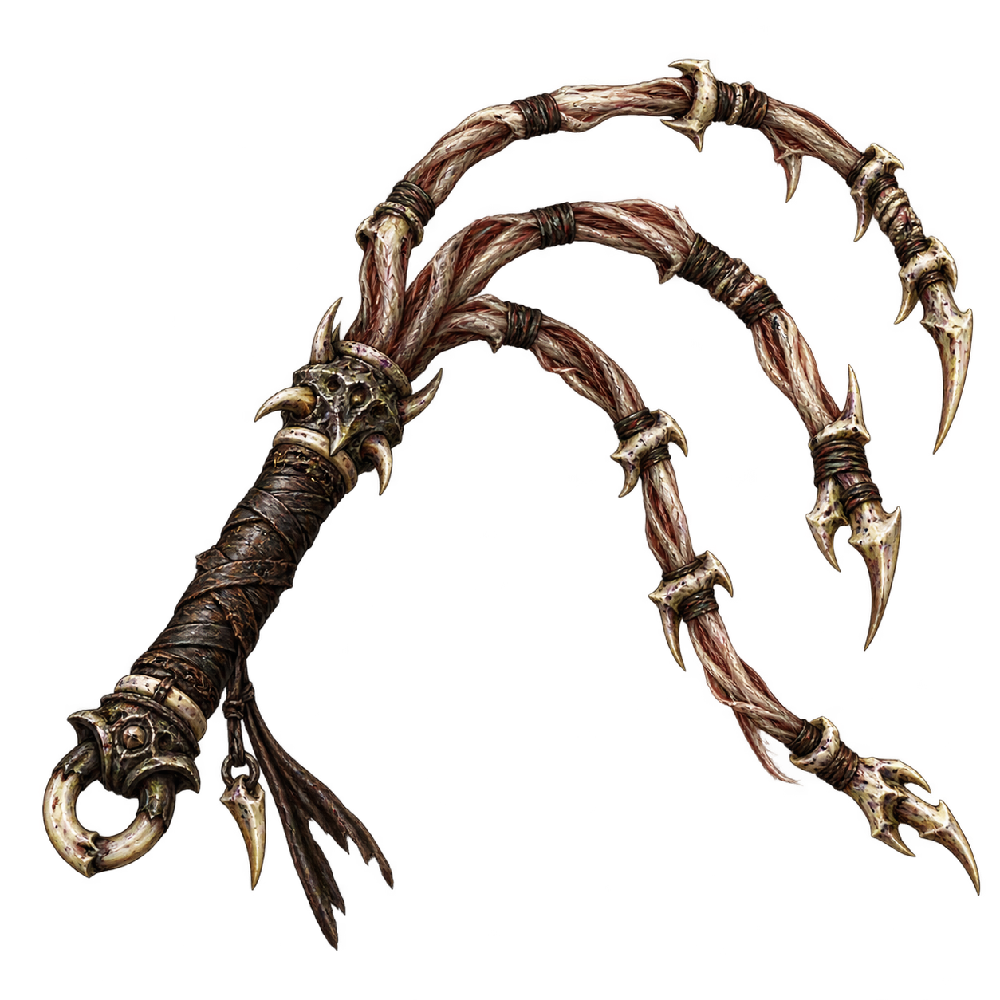

**Вид и облик:** короткая рукоять и несколько гибких плетей из обработанных сухожилий с костяными наконечниками. В покое они иногда слабо подёргиваются.

**Происхождение и владельцы:** работа дикого мага, соединившего остаточные свойства животных тканей с простым закреплённым действием. Оружие встречается у жестоких наёмников и хозяев подпольных мастерских; в нём не обязательно заключена самостоятельная душа.

**Применение и атака:** хлещет, цепляет и на краткий миг стягивает плети вокруг препятствия; физическая и магическая. Обычный герой способен пользоваться готовым изделием, но не переделывает его устройство.

**Ограничения:** нуждается в уходе за органическими частями; против гладких тяжёлых пластин менее удобен. Не крадёт души, не кормит аттрактор автоматически и не подчиняет волю жертвы.

**Где встречается:** мастерские диких магов, тайные подвалы, снаряжение наёмных истязателей.

**Текст предмета:** «Мастер утверждал, что ткани ничего не чувствуют. Бич дёргался всякий раз, когда он подносил иглу».

### 13.21. КИНЖАЛ ИЗГНАННИКА

**Каталог:** `data/weapons.json` → `dagger`. Хват: одноручный. Тип атаки: физическая.

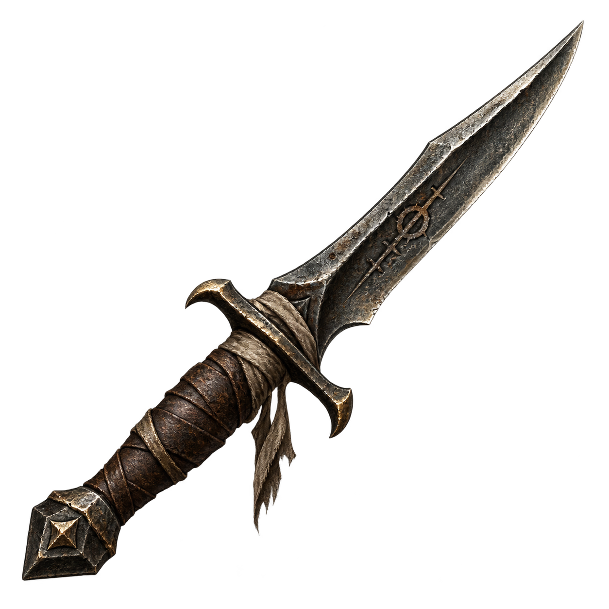

**Вид и облик:** Короткое узкое лезвие с простой гардой, тёмная кожаная рукоять. На обухе остались следы грубой работы точильным камнем.

**Происхождение и владельцы:** Такие кинжалы берут люди, которым пришлось уйти из дома налегке. Название не обозначает особого сословия: изгнанником здесь легко становится вчерашний хозяин земли.

**Применение и ограничения:** Быстрый колющий выпад на близком расстоянии. Вещь не зачарована; надёжность объясняется простой конструкцией.

**Где встречается:** Дорожные ночлежки, обозы беженцев, лавки подержанных вещей.

**Текст предмета:** «Из дома разрешили взять то, что поместится за поясом.».

### 13.22. СУЧКОВАТАЯ ДУБИНА

**Каталог:** `data/weapons.json` → `club`. Хват: одноручный. Тип атаки: физическая.

**Вид и облик:** Тяжёлая ветвь с сохранёнными сучками, срезанными у хвата. Потемневшее дерево местами отполировано ладонью.

**Происхождение и владельцы:** Оружие лесорубов и ополчения, которому не досталось железа. Иногда на нём вырезают обережные знаки, но сама резьба не даёт власти над Логосом.

**Применение и ограничения:** Тяжёлый дробящий удар. Трещины и сырость опаснее для неё любой забытой молитвы.

**Где встречается:** Лесные селения, углежогные стоянки, баррикады на сельских дорогах.

**Текст предмета:** «Когда железо забрали на войну, лес ещё оставался общим.».

### 13.23. МЕЧ ДОЗОРНОГО

**Каталог:** `data/weapons.json` → `shortsword`. Хват: одноручный. Тип атаки: физическая.

**Вид и облик:** Прямой короткий меч с неброской крестовиной. На гарде выбито почти стёртое клеймо караульного склада.

**Происхождение и владельцы:** Мечи выдавали дозорам малых застав. Многие заставы сгорели, а их оружие продолжает переходить из рук в руки; оно не свидетельствует о верности нынешнего владельца.

**Применение и ограничения:** Выверенные рубящие движения, удобные на тесной караульной площадке.

**Где встречается:** Старые заставы, караванная охрана, военные склады.

**Текст предмета:** «Дозор сменился. Приказа снять караул так и не принесли.».

### 13.24. РАПИРА СКОРБИ

**Каталог:** `data/weapons.json` → `rapier`. Хват: одноручный. Тип атаки: физическая.

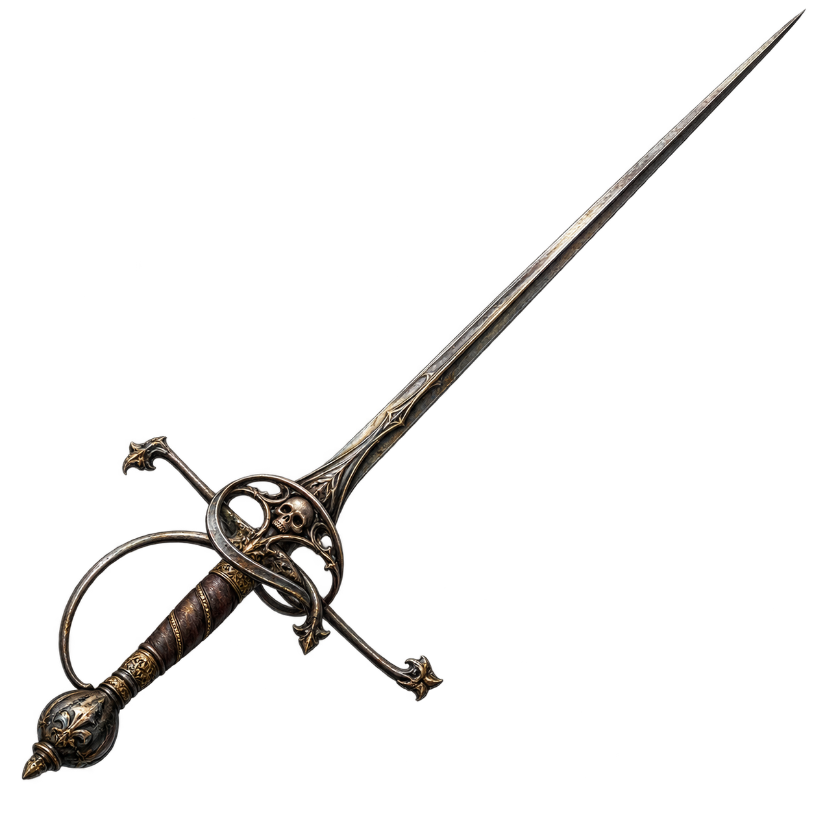

**Вид и облик:** Длинное тонкое лезвие, ажурная потемневшая гарда и узкая рукоять. Украшения сдержанны, острие тщательно выправлено.

**Происхождение и владельцы:** В разорённых городах такие рапиры продают вместе с фамильными вещами. Скорбь в названии — память о погибших владельцах, а не заключённая в стали сила.

**Применение и ограничения:** Точный колющий выпад. Требует уверенного движения; сама по себе не вызывает страха и не поражает душу.

**Где встречается:** Городские дома, дуэльные дворы, лавки с заложенными ценностями.

**Текст предмета:** «Имя на гарде ещё можно прочесть. Спросить о нём уже некого.».

### 13.25. ТОПОР ПЕПЕЛЬНИКА

**Каталог:** `data/weapons.json` → `axe`. Хват: одноручный. Тип атаки: физическая.

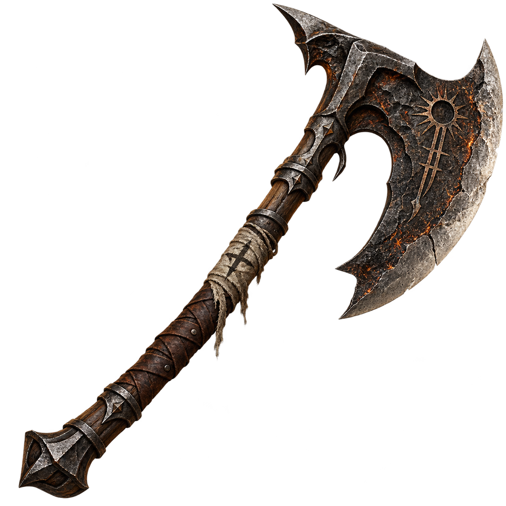

**Вид и облик:** Широкое железное лезвие на коротком тёмном топорище. В углублениях металла въелась сажа.

**Происхождение и владельцы:** Топоры пепельников собирали из железа покинутых кузниц: остывшие горны разжигали вновь для последней работы. Ими вооружались люди, возвращавшиеся на пепелища собственных домов.

**Применение и ограничения:** Рубящий удар. Название и следы огня не означают огненного заклинания.

**Где встречается:** Сожжённые селения, временные кузницы, обозы переселенцев.

**Текст предмета:** «Кузницу разожгли на одну ночь. К утру деревня снова была пуста.».

### 13.26. КОПЬЁ ПАЛОМНИКА

**Каталог:** `data/weapons.json` → `spear`. Хват: двуручный. Тип атаки: физическая.

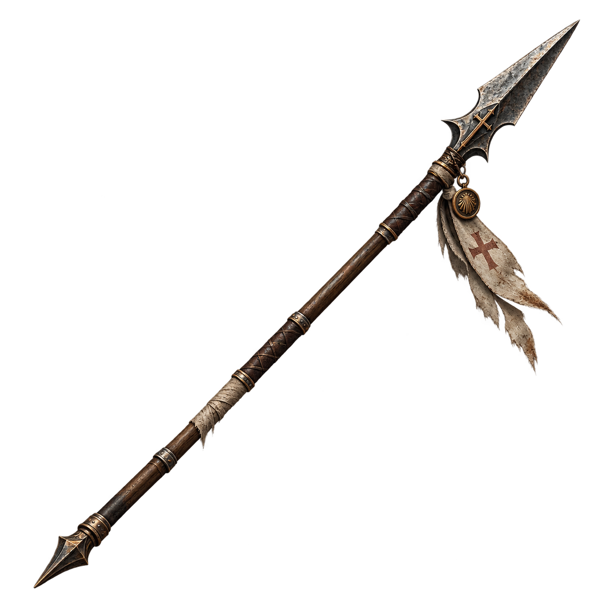

**Вид и облик:** Длинное гладкое древко, узкий наконечник и обмотка для обеих рук. На дереве видны следы дождя и дорожной пыли.

**Происхождение и владельцы:** Паломники собирались в группы, когда дороги стали опасными. Копьё охраняло их путь независимо от учения, к которому они шли; оно не является знаком ордена Света.

**Применение и ограничения:** Колющий удар с удержанием дистанции. Герой пользуется им как обычным двуручным оружием.

**Где встречается:** Дорожные приюты, переправы, покинутые стоянки паломников.

**Текст предмета:** «Молитва у каждого была своя. Древко держали одинаково.».

### 13.27. ДВУРУЧНИК БЕЗЫМЯННЫХ

**Каталог:** `data/weapons.json` → `greatsword`. Хват: двуручный. Тип атаки: физическая.

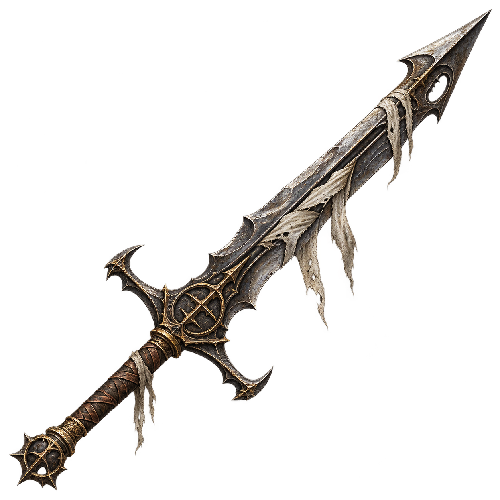

**Вид и облик:** Длинный широкий клинок с просторной крестовиной и рукоятью для двух рук. Старые владельческие знаки сошлифованы.

**Происхождение и владельцы:** Оружие уцелело после распада наёмных отрядов. Безымянными называли и похороненных без опознания, и тех, кто намеренно счищал с вещей прошлое.

**Применение и ограничения:** Размашистый рубящий удар. Длина и вес требуют обеих рук; души погибших не живут в клинке по умолчанию.

**Где встречается:** Поля сражений, склады наёмников, заброшенные крепости.

**Текст предмета:** «Сталь пережила всех, кто мог назвать её своей.».

### 13.28. МОЛОТ МОГИЛЬЩИКА

**Каталог:** `data/weapons.json` → `hammer`. Хват: двуручный. Тип атаки: физическая.

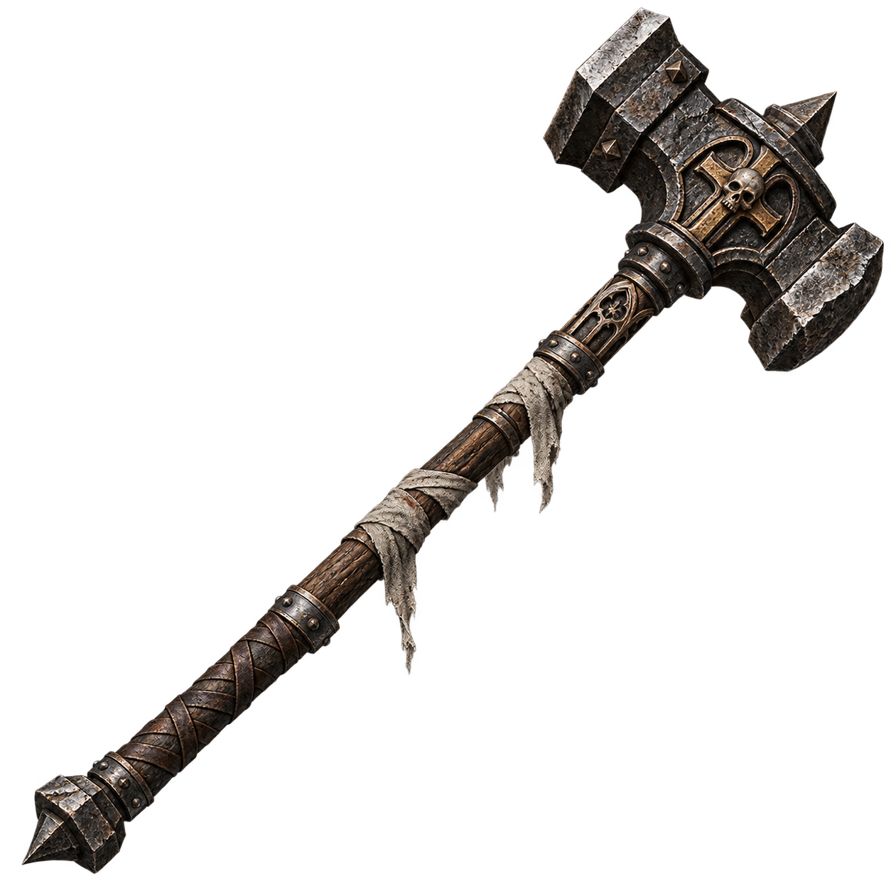

**Вид и облик:** Массивный железный боёк на длинной рукояти. По краям головки сбиты углы, в насечках держится белая каменная пыль.

**Происхождение и владельцы:** Инструмент людей, вскрывавших старые склепы и разбиравших могильную кладку. В смутные времена работа на кладбище требовала вооружённой защиты.

**Применение и ограничения:** Дробящий удар двумя руками. Название не даёт власти над умершими и не заменяет запечатывание сущности.

**Где встречается:** Каменоломни, кладбища, разграбленные усыпальницы.

**Текст предмета:** «Камень уступал не сразу. То, что было под ним, иногда торопило.».

### 13.29. ИНЕЙ

**Каталог:** `data/weapons.json` → `frost-dagger`. Хват: одноручный. Тип атаки: физическая, магическая.

**Вид и облик:** Тонкий кинжал с матовой кромкой; у основания лезвия закреплена бледная минеральная вставка. На металле проступает иней.

**Происхождение и владельцы:** Речные маги готовили такие клинки для людей, работавших на зимних переправах. В оправе закреплено простое действие холода, доступное обычному владельцу.

**Применение и ограничения:** Укол сочетается с холодным выбросом. Герой запускает готовые чары и не получает способности самостоятельно управлять водой.

**Где встречается:** Склады переправ, речные города, мастерские магов воды.

**Текст предмета:** «Клинок вынули. Холод остался.».

### 13.30. УГОЛЬНЫЙ КЛИНОК

**Каталог:** `data/weapons.json` → `ember-sword`. Хват: одноручный. Тип атаки: физическая, магическая.

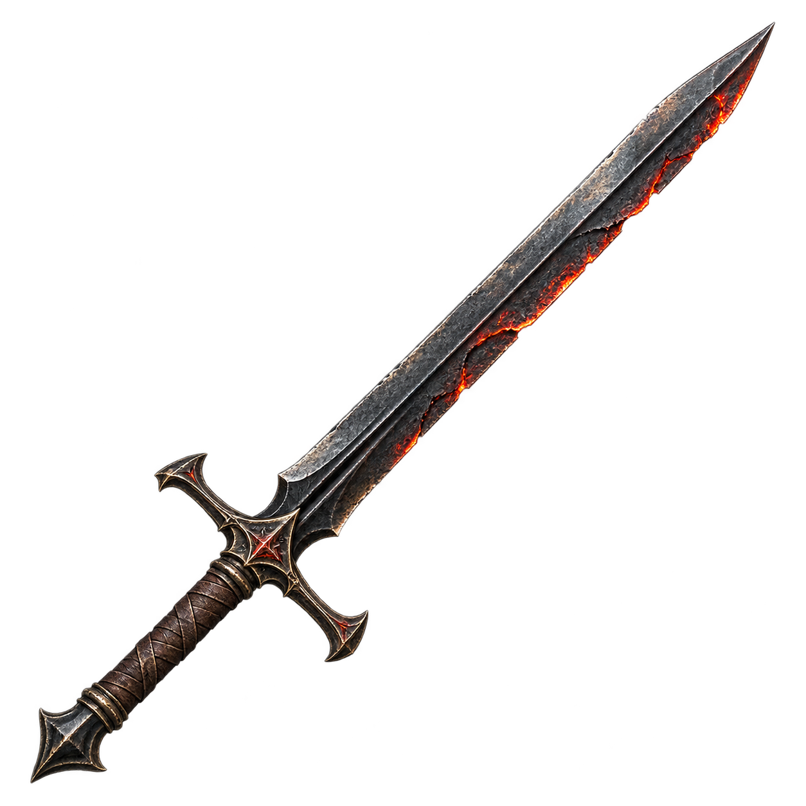

**Вид и облик:** Тёмный меч с угольно-серой поверхностью и узкими красноватыми прожилками у кромки. Рукоять защищена от жара.

**Происхождение и владельцы:** Вещь связывают с исчезнувшим огненным орденом, чья история сохранилась лишь в рассказах оружейников. Его не следует отождествлять с орденом Света. Подготовленные чары поддерживают короткий выброс жара.

**Применение и ограничения:** Рубящий удар соединяется с огненным действием. Обычный человек пользуется закреплённым заклинанием; меч не содержит душ членов ордена.

**Где встречается:** Старые арсеналы, руины огненных мастерских, тайные торги.

**Текст предмета:** «Орден погас. Последний приказ огню остался в стали.».

### 13.31. СЕРП ВЕТРА

**Каталог:** `data/weapons.json` → `wind-sickle`. Хват: одноручный. Тип атаки: магическая.

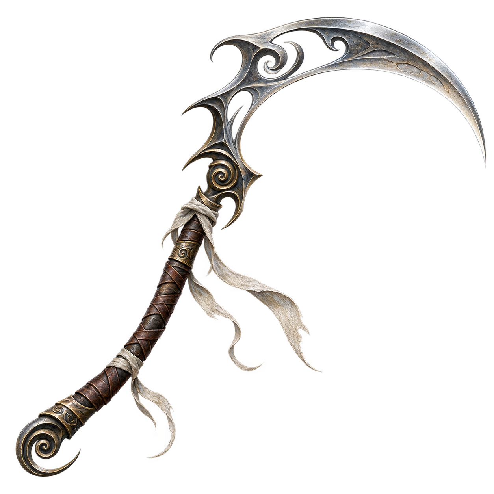

**Вид и облик:** Изогнутый серп с тонкой металлической кромкой и вставками в рукояти. При движении слышен короткий свист.

**Происхождение и владельцы:** Маги воздуха приспособили форму серпа для направленного порыва. Сходство с эльфийским инструментом не доказывает эльфийское происхождение каждого экземпляра.

**Применение и ограничения:** Взмах направляет подготовленную воздушную атаку. В текущем каталоге урон магический: наличие металлической кромки не добавляет самостоятельного физического типа.

**Где встречается:** Мастерские магов воздуха, караваны, склады разведчиков.

**Текст предмета:** «Травы легли раньше, чем рука закончила движение.».

### 13.32. ПОСОХ ОТШЕЛЬНИКА

**Каталог:** `data/weapons.json` → `staff`. Хват: двуручный. Тип атаки: магическая.

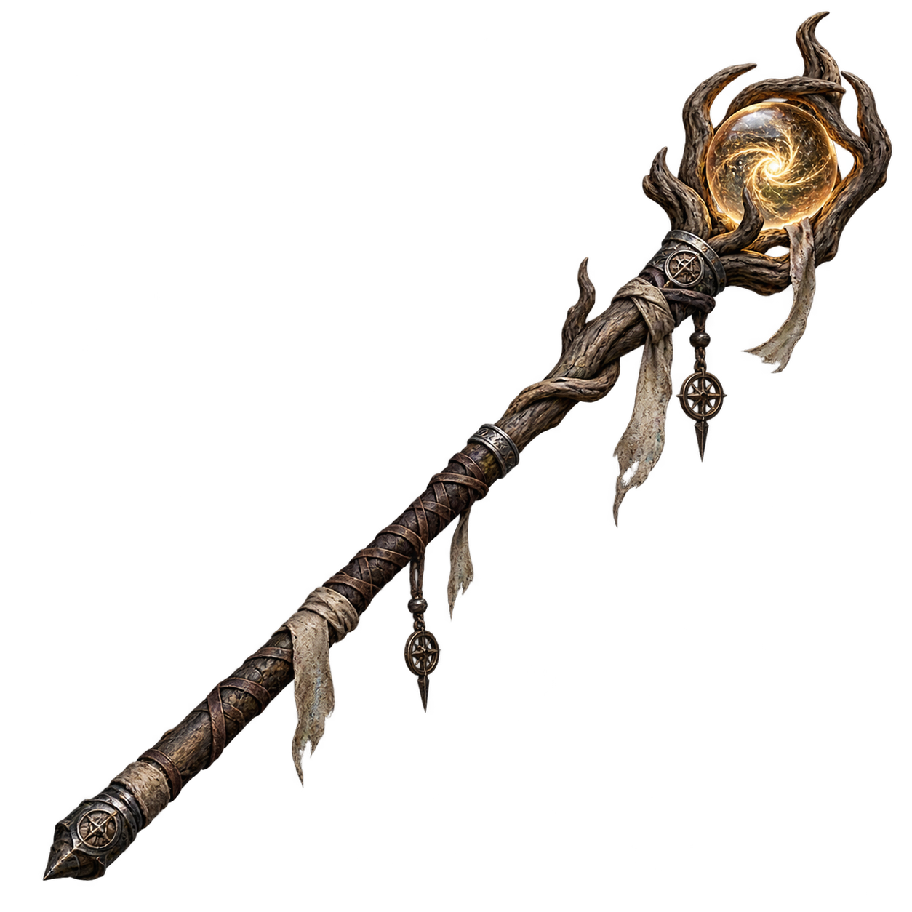

**Вид и облик:** Длинный потёртый посох с тёмной каменной сердцевиной. Обе зоны хвата гладкие от многолетнего использования.

**Происхождение и владельцы:** Отшельники среди чувствующих готовили такие посохи для защиты жилища, а позднее передавали ученикам или путникам. Название не связывает предмет с сёстрами Млечного познания.

**Применение и ограничения:** Двуручный жест запускает закреплённый магический импульс. Обычный человек может повторить его, но не переписать заключённое в материале действие.

**Где встречается:** Уединённые жилища, дорожные святилища, мастерские при приютах.

**Текст предмета:** «Хозяин ушёл дальше в горы. Посох оставил тому, кто придёт после.».

### 13.33. ЭФЕМЕРНЫЙ МЕЧ

**Каталог:** `data/weapons.json` → `ephemeral-sword`. Хват: одноручный. Тип атаки: магическая.

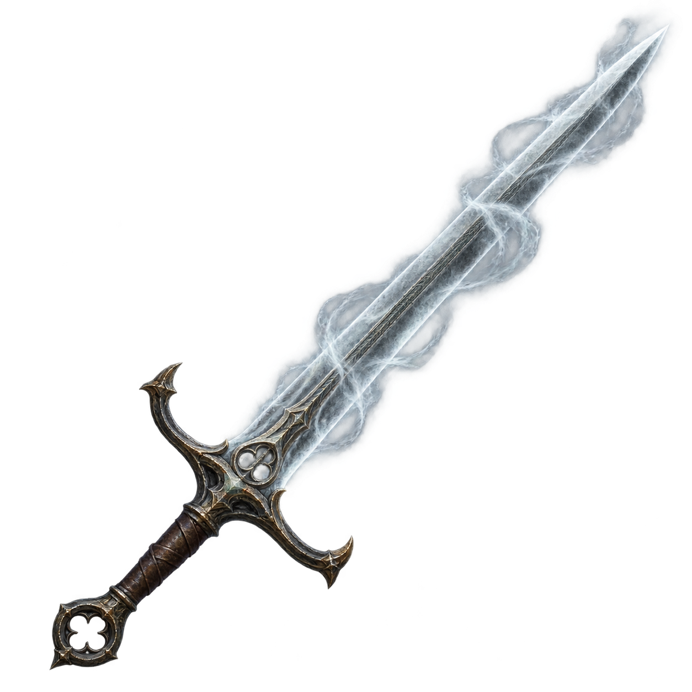

**Вид и облик:** Материальная рукоять с каменной вставкой; над ней проступает полупрозрачная форма клинка с дымчатыми краями.

**Происхождение и владельцы:** Маги согласовали действие материалов оправы так, чтобы удерживать направленное магическое лезвие. Призрачный вид не означает, что в нём заперт дух или открыт иной план.

**Применение и ограничения:** Подготовленное лезвие проходит через каменное препятствие и наносит магический урон. Это свойство оружия, а не способность владельца проходить сквозь стены; при отключённых камнях на поле преимущество обхода препятствий не проявляется.

**Где встречается:** Мастерские магов, старые подземные склады, редкие предложения кузнецов.

**Текст предмета:** «Стена осталась цела. По другую сторону перестали смеяться.».

### 13.34. ЦЕПНОЙ НОЖ КАНАТЧИКА

**Каталог:** `data/weapons.json` → `ropewalk-chain-knife`. Хват: одноручный. Тип атаки: физическая.

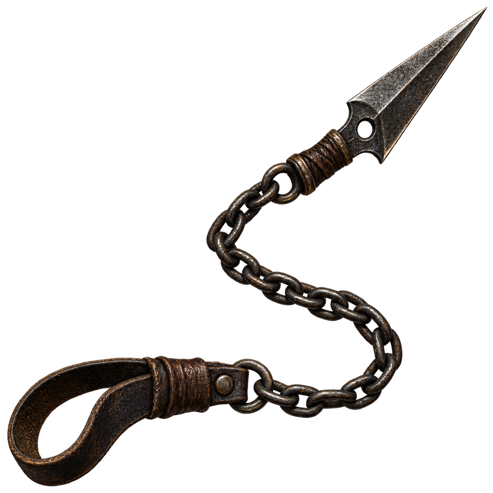

**Вид и облик:** Узкий треугольный нож на короткой тонкой цепи с кожаной петлёй для руки. Потемневшее железо и тёмная кожа.

**Происхождение и владельцы:** Канатчики портовых переправ приспособили нож для боя среди снастей. Цепь возвращает клинок в ладонь, но требует точного движения.

**Применение и ограничения:** Физический выпад и возврат клинка цепью. Не связывает сознание жертвы: цепь действует механически.

**Где встречается:** Портовые переправы, канатные мастерские, охрана речных обозов.

**Текст предмета:** «Верёвку здесь режут один раз. За ошибку платят пальцами».

### 13.35. ЖЕЗЛ ПЫЛЬНОГО СТЕКЛА

**Каталог:** `data/weapons.json` → `dustglass-wand`. Хват: одноручный. Тип атаки: магическая.

**Вид и облик:** Короткий жезл с дымчатым стеклом в треснувшей деревянной оправе и потёртым кожаным хватом.

**Происхождение и владельцы:** Учебный инструмент мастеров, направляющих мелкие частицы стекла. Помутневшая сердцевина сохраняет следы многих неудачных опытов.

**Применение и ограничения:** Закреплённый импульс проходит через стеклянную сердцевину; атака магическая, а не отдельный бросок стеклянных осколков. Осколки стекла не являются собираемым ресурсом сознания Логоса.

**Где встречается:** Учебные мастерские, разрушенные стекольни, городские подвалы магов.

**Текст предмета:** «Первый урок — собрать осколки, не касаясь их».

### 13.36. КАМЕРТОН ПУСТЫХ ЗАЛОВ

**Каталог:** `data/weapons.json` → `hollow-tuning-fork`. Хват: одноручный. Тип атаки: магическая.

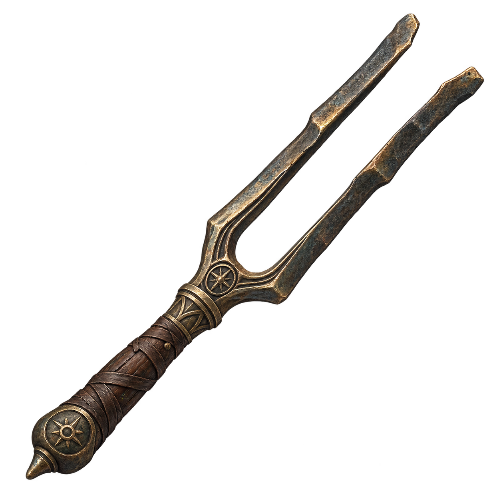

**Вид и облик:** Бронзовый камертон на деревянной ручке. Его длинные неровные ветви потемнели от времени.

**Происхождение и владельцы:** Маги воздуха проверяли им резонанс пустых водохранилищ. В бою дрожание ветвей направляет короткую воздушную волну.

**Применение и ограничения:** Подготовленное колебание направляет воздушную волну. Звук не призывает духов и не позволяет слышать другие планы.

**Где встречается:** Пустые водохранилища, подземные насосные залы, мастерские магов воздуха.

**Текст предмета:** «В пустом зале всегда есть кому ответить».

### 13.37. ФОНАРЬ ЗАБЫТОЙ ИСКРЫ

**Каталог:** `data/weapons.json` → `spark-lantern`. Хват: одноручный. Тип атаки: магическая.

**Вид и облик:** Переносной железный фонарь с жёсткой ручкой. За закопчённым янтарным стеклом тлеет единственный уголёк.

**Происхождение и владельцы:** Смотрители магических печей носили в таких фонарях образец поддерживаемого огня. Искра подчиняется подготовленному направляющему жесту.

**Применение и ограничения:** Направляющий жест выпускает готовый огненный всплеск. Уголёк не служит аттрактором и не питается душами.

**Где встречается:** Заброшенные печи, горновые мастерские, снаряжение смотрителей.

**Текст предмета:** «Печь остыла. Дежурный свет остался».

### 13.38. ОСКОЛОК ЗИМНЕГО КОЛОДЦА

**Каталог:** `data/weapons.json` → `winter-shard`. Хват: одноручный. Тип атаки: магическая.

**Вид и облик:** Матовый ледяной кристалл в тёмной железной оправе с короткой кожаной ручкой.

**Происхождение и владельцы:** Холодный минерал извлекли из колодца, который не оттаивал даже летом. Мастера закрепили его в оправе для простых ледяных выбросов.

**Применение и ограничения:** Оправа направляет закреплённое холодное действие. Минеральный осколок — часть оружия, не запас осколков героя; его нельзя отдавать аттрактору вместо ресурса.

**Где встречается:** Колодезные поселения, мастерские магов воды, склады зимних переправ.

**Текст предмета:** «Воду из того колодца больше не пьют».

### 13.39. ПОСОХ ГОРЬКИХ СПОР

**Каталог:** `data/weapons.json` → `bitter-spore-staff`. Хват: двуручный. Тип атаки: ядовитая.

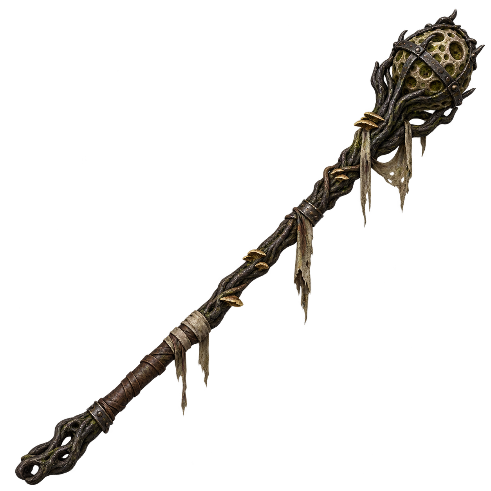

**Вид и облик:** Длинный посох из тёмного древесного корня. Пористое навершие удерживает железная сетка; у отверстий проступает оливковый налёт.

**Происхождение и владельцы:** Болотные алхимики запечатывают сухие споры в пористом навершии. Обученный владелец выпускает отмеренную порцию, удерживая посох обеими руками.

**Применение и ограничения:** Двуручный жест выпускает приготовленные споры; атака ядовитая. Обычному человеку достаточно освоить обращение с готовым изделием. Связь с сёстрами Млечного познания не подразумевается.

**Где встречается:** Лаборатории болотных алхимиков, склады лекарственных составов, убежища отравителей.

**Текст предмета:** «Лечебный порошок хранят в другой комнате».

### 13.40. ПОСОХ ГЛИНЯНОГО КРУГА

**Каталог:** `data/weapons.json` → `clay-circle-staff`. Хват: двуручный. Тип атаки: магическая.

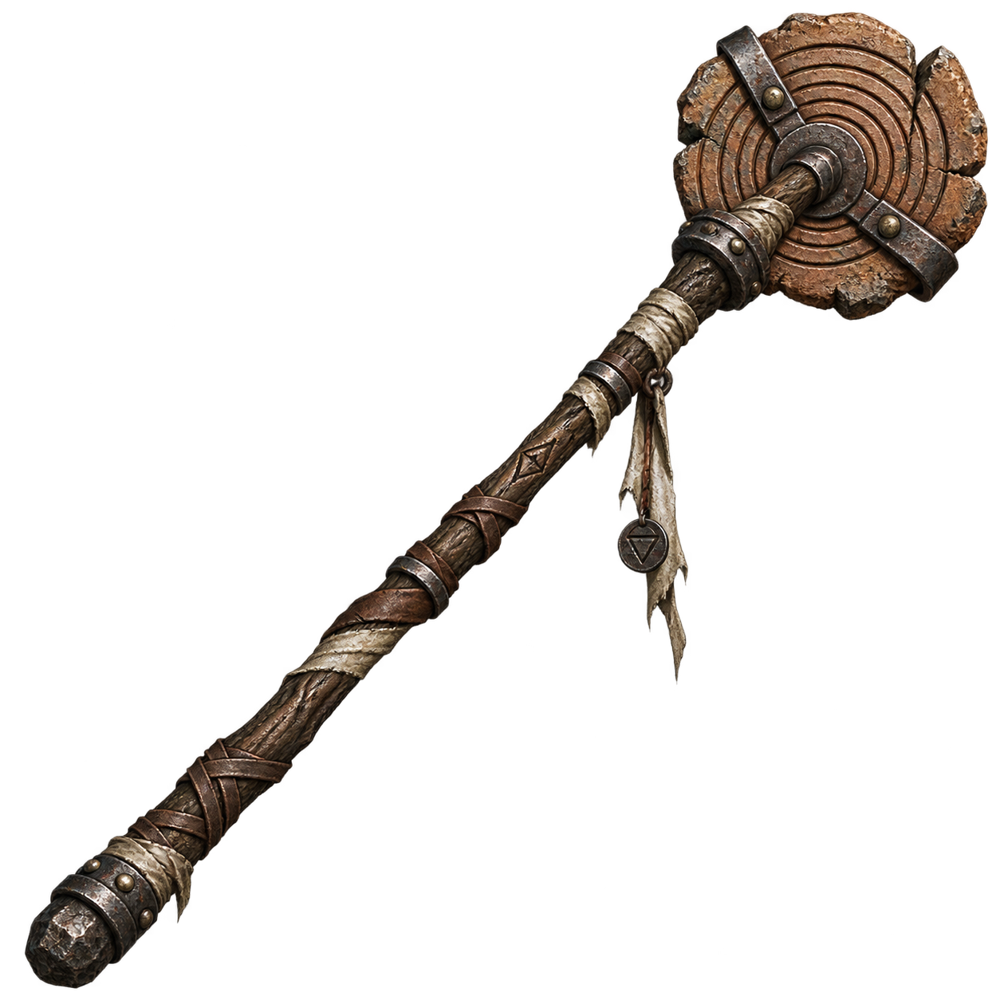

**Вид и облик:** Деревянный посох с круглым глиняным навершием. Железные скобы стягивают сколотый диск с концентрическими бороздами.

**Происхождение и владельцы:** Мастера земли использовали этот инструмент при укреплении подземных сводов. Борозды собирают усилие в короткий направленный толчок.

**Применение и ограничения:** Двуручный толчок запускает подготовленное магическое действие. Диск не оживает и не содержит пойманного пограничного существа.

**Где встречается:** Подземные стройки, заброшенные укрепления, мастерские магов земли.

**Текст предмета:** «Свод не рухнул. Лестница к нему не сохранилась».

### 13.41. ЭСПАДОН ПЕРЕПРАВЫ

**Каталог:** `data/weapons.json` → `ferry-espadon`. Хват: двуручный. Тип атаки: физическая.

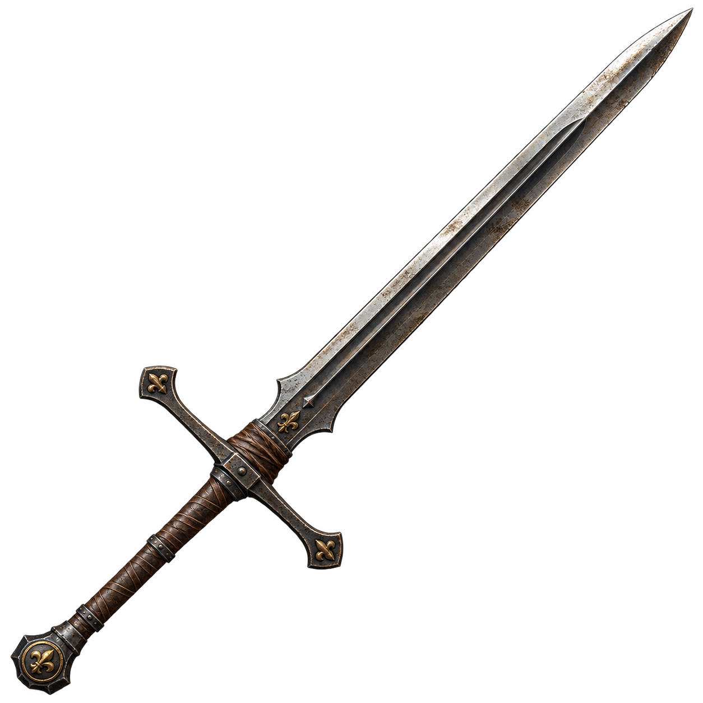

**Вид и облик:** Тяжёлый двуручный меч с длинной рукоятью, широкой крестовиной и кожаной обмоткой у основания клинка.

**Происхождение и владельцы:** Охрана переправы ценила этот меч за управляемый широкий размах. Вес требует силы, а тесный настил — точности.

**Применение и ограничения:** Двуручный рубящий удар, требующий силы и точности. Оружие не зачаровано и не обещает владельцу особой защиты на мосту.

**Где встречается:** Военные переправы, речные заставы, склады дорожной стражи.

**Текст предмета:** «На мосту некуда отступить ни тому, ни другому».

### 13.42. МОЛОТ СТЕКОЛЬНОГО ГОРНА

**Каталог:** `data/weapons.json` → `glassfurnace-hammer`. Хват: двуручный. Тип атаки: физическая, магическая.

**Вид и облик:** Двуручный молот на обожжённой деревянной рукояти. В массивном железном бойке заключён тускло-красный осколок жаропрочного стекла.

**Происхождение и владельцы:** Маг стекольного горна закрепил в бойке краткий выброс жара. Сильный владелец удерживает тяжёлую головку, знание устройства направляет нагрев.

**Применение и ограничения:** Двуручный удар сочетает физическое воздействие с готовым выбросом жара. Владелец управляет хватом и направлением, а не создаёт огненное заклинание сам.

**Где встречается:** Стекольные горны, мастерские магов огня, осадные обозы.

**Текст предмета:** «Им не ковали сталь. Стекло помнило удары дольше».

## 14. ЩИТЫ

Щиты находятся в `data/weapons.json`, но имеют отдельный тип `shield` и не входят в число 42 оружий. Их защитные свойства задаются конфигом; описанный удар щитом относится к физической атаке.

### 14.1. ПОТЁРТЫЙ БАКЛЕР

**Каталог:** `data/weapons.json` → `buckler`. Хват: одноручный. Тип атаки: физическая.

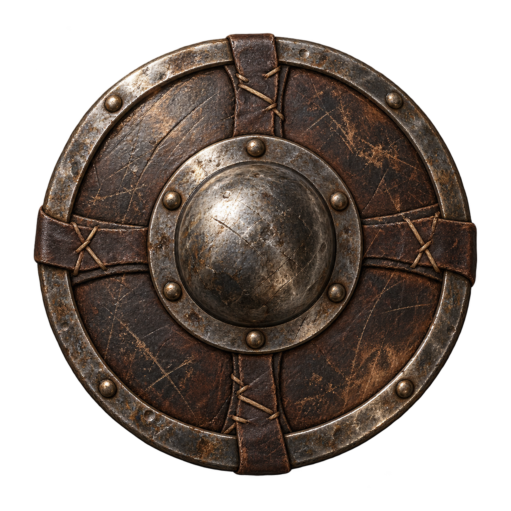

**Вид и облик:** Небольшой круглый щит с выпуклым железным умбоном, потёртым краем и тёмной рукоятью на обороте.

**Происхождение и владельцы:** Обычная защита дорожных бойцов и городской стражи. Кузнецы меняют разбитые части, сохраняя удобный хозяину хват.

**Применение и ограничения:** Прикрывает руку и корпус, позволяет нанести физический удар щитом. Магических свойств не имеет.

**Где встречается:** Заставы, городские рынки, снаряжение караванной охраны.

**Текст предмета:** «С лица железо всё в зарубках. С оборота рукоять ещё тёплая.».

### 14.2. ЩИТ СУМЕРЕЧНОГО СТРАЖА

**Каталог:** `data/weapons.json` → `kite-shield`. Хват: одноручный. Тип атаки: физическая.

**Вид и облик:** Вытянутый щит с нижним остриём и потемневшей окантовкой. На лицевой стороне почти исчез знак караула.

**Происхождение и владельцы:** Сумеречными стражами называли дозоры, встречавшие опасность на исходе дня. Конструкция помогает удерживать защитное положение и возвращать ровное дыхание после удачного перекрытия удара.

**Применение и ограничения:** Защита и физический удар щитом. Игровое восстановление выносливости связано с полным перекрытием атаки; оно не является исцелением или неуязвимостью.

**Где встречается:** Старые караульные дома, крепостные склады, охрана городских ворот.

**Текст предмета:** «Переживи удар. Выдохни. Следующий уже близко.».

### 14.3. ЗЕРКАЛО ЗАБВЕНИЯ

**Каталог:** `data/weapons.json` → `mirror-shield`. Хват: одноручный. Тип атаки: физическая.

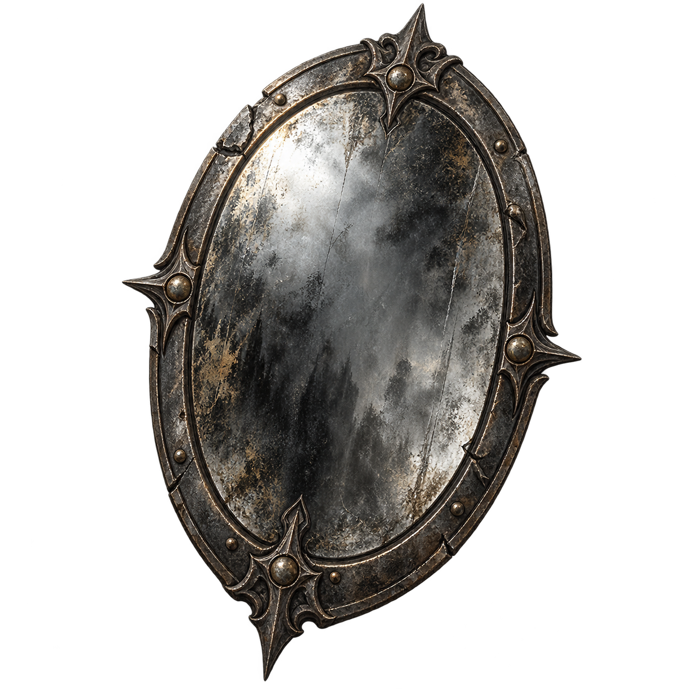

**Вид и облик:** Овальный щит с потускневшей отражающей поверхностью. Вмятины дробят отражение на неровные пятна.

**Происхождение и владельцы:** Мастера закрепляют в материале защитные свойства, ослабляющие чужие воздействия. Забвение — имя изделия; оно не обещает стирать память и не связано с лечением жрецов.

**Применение и ограничения:** Служит защитой и наносит физический удар оправой. Рассказ об отражении колдовства не добавляет автоматического возврата заклинаний: действуют только свойства из конфига.

**Где встречается:** Мастерские при военных лагерях, хранилища магов, редкие городские лавки.

**Текст предмета:** «Своё лицо видишь плохо. Чужую вспышку — вовремя.».

## 15. БЕЗОРУЖНОЕ ДЕЙСТВИЕ

### 15.1. КУЛАК

**Каталог:** `data/weapons.json` → `fist`. Базовое безоружное действие, не отдельный предмет. Тип атаки: физическая.

**Вид и облик:** сжатая человеческая кисть без оружия и перчатки; следы труда и возраста соответствуют владельцу.

**Происхождение и применение:** последняя возможность защищаться, когда за поясом ничего не осталось. Удар не требует магии и не превращает свободную руку в самостоятельную вещь для покупки или добычи. Доступность безоружных приёмов определяется экипировкой и конфигурацией базовых действий.

**Текст действия:** «В дороге можно потерять всё. Пока пальцы сгибаются, ещё не всё потеряно».

## 16. ОДЕЖДА, БРОНЯ И ОБУВЬ

### 16.1. ХЛАМИДА СТРАННИКА

**Каталог:** `data/armor.json` → `robe`. Слот: тело.

**Вид и облик:** Плотная выцветшая ткань свободно спускается с плеч. Вдоль швов проступают древние знаки, часть которых скрыта под починками.

**Происхождение и владельцы:** Мастера закрепляли защитное действие в переплетении нитей для людей, вынужденных ходить рядом с магическими мастерскими. Хламида не делает владельца жрецом.

**Действие и ограничения:** Ослабляет чистое магическое воздействие. Не обещает общей защиты от всех стихий; действие определяется защитным профилем предмета.

**Где встречается:** Приюты путников, старые мастерские, дорожные лавки.

**Текст предмета:** «Шов разошёлся. Знак под ним ещё держался.».

### 16.2. ОБМОТКИ ПАЛОМНИКА

**Каталог:** `data/armor.json` → `rags`. Слот: тело.

**Вид и облик:** Несколько слоёв серого льна, туго перехваченных простыми завязками. Края ткани истёрты и неоднократно подшиты.

**Происхождение и владельцы:** Паломники закрывали тело тем, что можно было выстирать в ручье и починить без кузнеца. После войны обмотки стали одеждой беженцев и ночных сторожей.

**Действие и ограничения:** Плотные слои немного смягчают режущие удары. Молитвы прежнего хозяина не добавляют магических свойств.

**Где встречается:** Дорожные приюты, лагеря переселенцев, сельские рынки.

**Текст предмета:** «Ткань принимала пыль, дождь и кровь. Никто не спрашивал, какой дорогой она пришла.».

### 16.3. КУРТКА СЛЕДОПЫТА

**Каталог:** `data/armor.json` → `leather`. Слот: тело.

**Вид и облик:** Куртка из тёмной выделанной кожи, гибкая в плечах, с потёртыми швами и следами старых заплат.

**Происхождение и владельцы:** Следопыты ценили её за возможность двигаться в зарослях без звона металла. Такие вещи часто переходят от лесной стражи к охотникам и проводникам.

**Действие и ограничения:** Защищает от колющих и режущих воздействий. Не делает владельца невидимым и не сообщает ему знания леса.

**Где встречается:** Охотничьи стоянки, лесные заставы, мастерские кожевников.

**Текст предмета:** «По ветвям читали его путь. По коже — всё, что пыталось его остановить.».

### 16.4. КОЛЬЧУГА ДОЗОРНОГО

**Каталог:** `data/armor.json` → `chainmail`. Слот: тело.

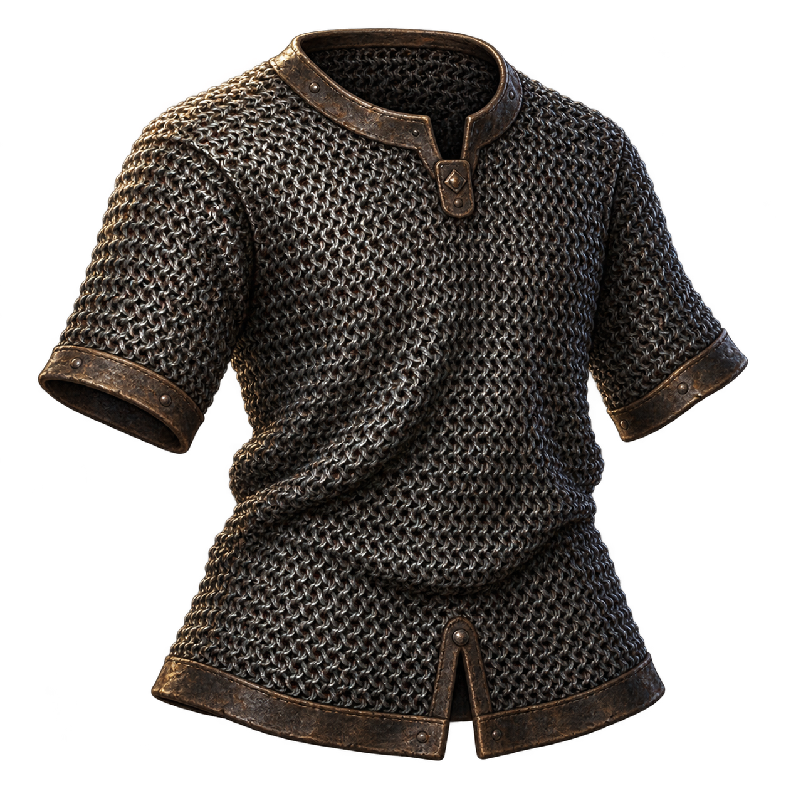

**Вид и облик:** Потемневшая кольчуга с рядами колец разного возраста. Светлые участки починки выделяются на старом металле.

**Происхождение и владельцы:** Дозоры ремонтировали её после каждой схватки, вплетая кольца из снаряжения погибших. Преемственность службы здесь видна лучше любого герба.

**Действие и ограничения:** Ослабляет колющий, режущий и дробящий урон. Память прежних боёв — образное описание, не самостоятельное сознание доспеха.

**Где встречается:** Караульные склады, крепости, обозы оружейников.

**Текст предмета:** «Новых колец всё больше. Людей в карауле всё меньше.».

### 16.5. ПАНЦИРЬ ПОЛОГО РЫЦАРЯ

**Каталог:** `data/armor.json` → `plate`. Слот: тело.

**Вид и облик:** Тяжёлый стальной панцирь с потускневшими широкими пластинами и грубыми следами рихтовки. Изображается пустым, без носителя.

**Происхождение и владельцы:** Название прижилось среди сборщиков трофеев, находивших целую броню на давно опустевших полях боя. Само изделие не является живым доспехом: дух в нём не заключён.

**Действие и ограничения:** Защищает от физических типов урона. Не скрывает душу от пограничных существ и не защищает автоматически от магии.

**Где встречается:** Поле старой осады, арсеналы, лавки военных трофеев.

**Текст предмета:** «Внутри давно никого. Снаружи ещё есть чему принять удар.».

### 16.6. МАНТИЯ ПЕПЛА

**Каталог:** `data/armor.json` → `ash-mantle`. Слот: тело.

**Вид и облик:** Тяжёлая мантия пепельно-серого цвета. В складках держится тонкая зола, нити местами спеклись в матовую корку.

**Происхождение и владельцы:** Маги готовили защитную ткань для работы рядом с последствиями боевых заклинаний. Пепел удерживает закреплённые свойства; это не прах пленённого человека.

**Действие и ограничения:** Ослабляет огонь, холод, ветер и чистую магию. Подготовленная защита доступна обычному владельцу; мантия не учит его управлять стихиями.

**Где встречается:** Магические мастерские, выгоревшие укрепления, склады походных лекарей.

**Текст предмета:** «Огонь погас давно. Ткань всё ещё помнит, как его не пропустить.».

### 16.7. БОТИНКИ С ЖЕЛЕЗНЫМ НОСКОМ

**Каталог:** `data/armor.json` → `iron-boots`. Слот: ноги.

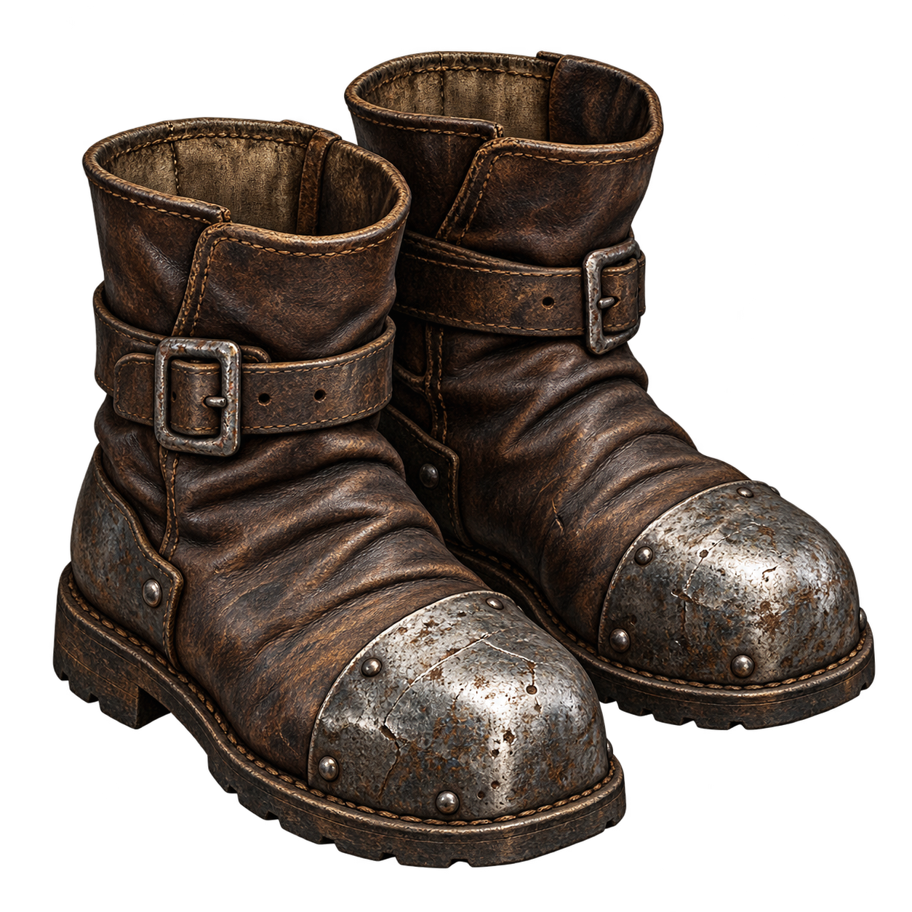

**Вид и облик:** Крепкие кожаные ботинки с накладками старого железа на носках. На металле заметны вмятины; пара согласована по форме.

**Происхождение и владельцы:** Обувь мастеровых, грузчиков и военной прислуги. Железо защищало пальцы при работе, а на дороге стало последним доводом в тесной схватке.

**Действие и ограничения:** Добавляют физический пинок с воздействием на здоровье и выносливость. В текущем профиле нет отдельного шанса нокдауна или потери равновесия.

**Где встречается:** Кузницы, склады, снаряжение обозной охраны.

**Текст предмета:** «Сначала ими придерживали дверь. Потом — тех, кто пытался её выбить.».

### 16.8. САПОГИ СКИТАЛЬЦА

**Каталог:** `data/armor.json` → `wanderer-boots`. Слот: ноги.

**Вид и облик:** Мягкие высокие сапоги из тёмной кожи, с широкими складками у щиколоток и много раз чиненной подошвой.

**Происхождение и владельцы:** Мастера северных трактов закрепляли в подкладке простое защитное действие против холода. Носить их может путник без магического таланта.

**Действие и ограничения:** Дают защиту от холода и физический пинок. Не позволяют ходить по воде и не заменяют осторожности на льду.

**Где встречается:** Зимние переправы, дорожные рынки, убежища скитальцев.

**Текст предмета:** «Следы на снегу обрывались часто. Эти сапоги находили дальше.».

### 16.9. ПОНОЖИ БАСТИОНА

**Каталог:** `data/armor.json` → `greaves`. Слот: ноги.

**Вид и облик:** Стальные накладки прикрывают голени и стопы. Шарниры тёмные от масла, края пластин истёрты камнем.

**Происхождение и владельцы:** Их собирали для защитников стен, которым приходилось стоять среди падающей кладки. После сдачи бастионов поножи разошлись по наёмным отрядам.

**Действие и ограничения:** Смягчают режущий и дробящий урон, дают физический пинок. Дополнительное сбивание с ног не является действующей механикой.

**Где встречается:** Разрушенные бастионы, армейские обозы, ремонтные кузницы.

**Текст предмета:** «Стена рухнула. Тот, кто стоял на ней, ещё сделал несколько шагов.».

## 17. УКРАШЕНИЯ

### 17.1. КОЛЬЦО РАЗМЫКАНИЯ

**Каталог:** `data/jewelry.json` → `unlock-ring`. Слот: кольцо.

**Вид и облик:** Тёмное металлическое кольцо с разомкнутым рисунком оправы и небольшим камнем, пересечённым тонкой бороздой.

**Происхождение и владельцы:** Маги земли готовили такие кольца для расчистки опасных проходов. Вещь хранит короткое действие, нарушающее связь частиц материальной преграды; с пустотой аттрактора это умение не связано.

**Действие и ограничения:** Открывает выбранное каменное препятствие для обеих сторон на текущий ход, с ограничением использования за бой. Сейчас камни на поле отключены, поэтому доступных целей нет. Не открывает любое хранилище и не разрушает аттрактор.

**Где встречается:** Подземные стройки, заброшенные шахты, мастерские магов земли.

**Текст предмета:** «Мастер оставил проход. Никто не обещал, что только для тебя.».

### 17.2. АМУЛЕТ СЖАТИЯ

**Каталог:** `data/jewelry.json` → `fold-amulet`. Слот: амулет.

**Вид и облик:** Небольшой амулет из тусклого металла. Несколько вложенных пластин сходятся вокруг тесной каменной сердцевины.

**Происхождение и владельцы:** Мастер закрепил в нём способ сосредоточить уже подготовленное действие в узкой области. Это ремесло материальных элементов, не переход в другой план.

**Действие и ограничения:** Сжимает выбранную фигуру до одной клетки на текущий розыгрыш, сохраняя её эффект; использование ограничено боем. Не уменьшает тело владельца, не хранит пленников и не работает как аттрактор.

**Где встречается:** Мастерские боевых магов, старые арсеналы, редкие предложения кузнецов.

**Текст предмета:** «То же усилие. Меньше места, где от него можно укрыться.».

## Использование экипировки в историях и изображениях

При создании портрета учитывай владельца, материал, способ хвата и среду. Не делай каждое оружие светящимся: большинство вещей пережило дороги, сырость, починки и смену хозяев. Магические детали должны отражать конкретную работу с элементами, а не служить одинаковым украшением всех предметов.

Оружие разумного противника может быть тем же, что у героя. Принадлежность к фракции влияет на историю предмета и отношение встречных, но не превращает его автоматически в недоступную другим реликвию. Все игровые магические изделия уже содержат подготовленные действия и доступны обычному человеку. Самостоятельное изменение этих действий требует мага; использование предмета не делает героя чувствующим.

Эти описания предназначены для лора и разработки образов. Они сами по себе не меняют действующие игровые правила, конфигурацию предметов или систему боя.
