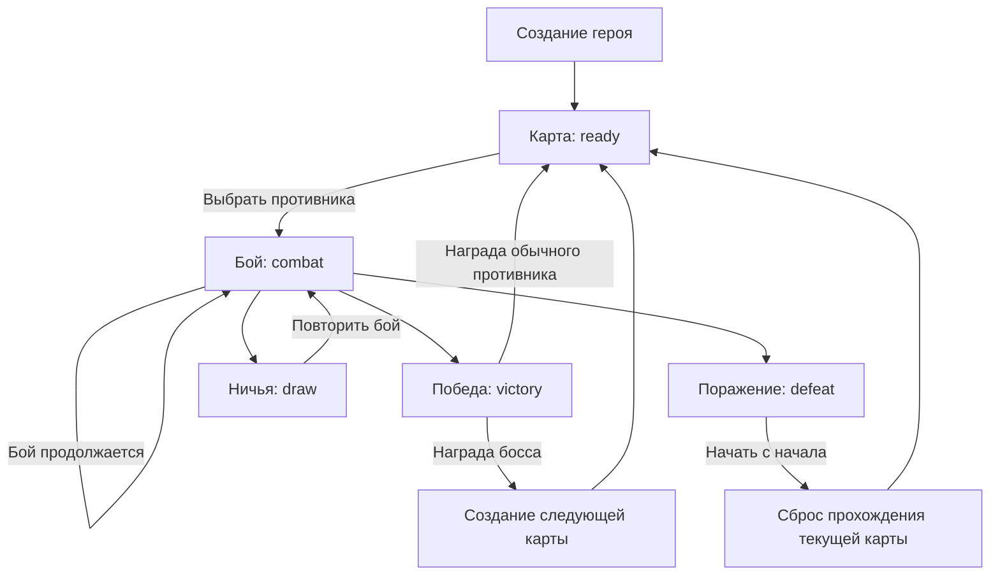
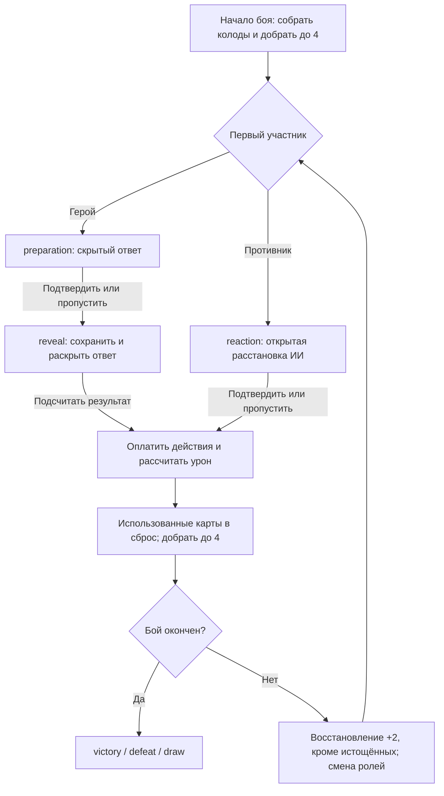

# Состояния игры и переходы между ними

В игре есть **три уровня состояний**: экраны приложения, сохранённая фаза игры и этап текущего хода. Карта, модалки и результат хода не всегда являются отдельными фазами.

## 1. Экраны приложения

| Экран                     | Что происходит                                      | Куда можно перейти                                     |
| ------------------------- | --------------------------------------------------- | ------------------------------------------------------ |
| Главное меню — `home`     | Вход в игру                                         | Выбор героев, создание героя, продолжение              |
| Выбор героев — `heroes`   | Просмотр сохранённых персонажей                     | Продолжить выбранным героем, создать нового, вернуться |
| Создание героя — `create` | Имя, портрет, распределение начальных характеристик | Создать героя → первая карта                           |
| Игра — `game`             | Карта, бой, награды, просмотр персонажа             | Главное меню                                           |

При создании героя генерируется первая карта. Герой появляется на карте перед первым противником.

## 2. Основные сохранённые фазы — `game.phase`

| Фаза      | Значение                                                   | Что завершает фазу                |
| --------- | ---------------------------------------------------------- | --------------------------------- |
| `ready`   | Герой вне боя: начало карты или передвижение после награды | Вход в узел противника → `combat` |
| `combat`  | Бой продолжается                                           | Победа, поражение или ничья       |
| `victory` | Противник побеждён, награда ещё не выбрана                 | Получение награды → `ready`       |
| `defeat`  | Поражение зафиксировано, доступен просмотр результата      | «Начать с начала» → `ready`       |
| `draw`    | Бой завершился ничьей                                      | Повторный бой → `combat`          |

## Пресеты и граф карты

Пресеты фонов в `data/journey-maps.json` не содержат узлов и связей. При создании карты генератор выбирает фон и сохраняет координаты, связи и события в `journey.map`. Художественные требования к изображениям — в [MAP_ART_DIRECTION.md](MAP_ART_DIRECTION.md).

После каждого обычного противника доступен костёр; кузница может быть альтернативной веткой той же остановки. Состав противников фиксируется при создании карты. В браузерной версии на первой карте обычные враги имеют все характеристики по 1, босс — уровень 1. На последующих картах их уровни — −2/−1/−1/0/+1 относительно уровня героя при создании карты, минимум 1. Прокачка внутри карты не меняет зафиксированные уровни.

В мобильной сюжетной кампании уровни задаёт `data/journey-rules.json`: на первой карте все пять противников имеют характеристики по 1 и 30 HP, без экипировки. Далее — `max(1,L−2)`, `max(1,L−2)`, `max(1,L−1)`, `max(1,L−1)`, `L`, где L фиксируется при создании карты. Обновление уже сохранённого состава и сохранность начатого боя описаны в [STORY_GAMEPLAY.md](STORY_GAMEPLAY.md).

## 3. Состояния на карте

Они описываются полями `journey`, а не отдельными значениями `phase`.

| Ситуация                     | Поведение и переход                                                                             |
| ---------------------------- | ----------------------------------------------------------------------------------------------- |
| Начало карты                 | Активен первый противник. Нажатие начинает бой                                                  |
| После обычной награды        | Открываются доступные переходы по графу                                                         |
| Костёр                       | Полностью восстанавливает здоровье и выносливость. Можно двигаться дальше                       |
| Кузница, выбор не завершён   | Можно взять предмет или отказаться. Закрытие окна не завершает выбор: значок остаётся доступным |
| Кузница, выбор завершён      | Сохраняется `forgeResolved`, можно идти дальше                                                  |
| Победа без выбранной награды | Фаза остаётся `victory`. Активный значок противника возвращает к получению награды              |
| Незавершённый бой            | Фаза остаётся `combat`. Возвращаемся к текущему бою                                             |
| Сохранённое поражение        | Фаза остаётся `defeat`. Значок противника открывает экран поражения                             |
| Победа над боссом            | Сначала выбираем награду, затем автоматически создаётся следующая карта                         |

Номер карты хранится в `journey.expedition`. `journey.stage` — номер противника внутри текущей карты.

## 4. Этапы боя

Первый участник первого хода выбирается случайно, затем роли чередуются. Броска кубиков нет. Уведомление сообщает «Вы ходите первый» или «Противник сходил, вы реагируете».

| Этап `clashPlan.stage` | Доступные действия                                                                                    |
| ---------------------- | ----------------------------------------------------------------------------------------------------- |
| `preparation`          | Герой ставит первым; ответ скрыт. Можно менять расстановку, обменять карту или пропустить ход         |
| `reaction`             | Противник уже поставил фигуры. Герой отвечает; подтверждение сразу рассчитывает ход                   |
| `reveal`               | Расстановка героя подтверждена, ответ ИИ сохранён и раскрыт. Только просмотр и «Подсчитать результат» |

Черновик героя хранится в браузере, колоды и подтверждённые расстановки — на сервере. Перезагрузка на `reveal` возвращает тот же ответ. Скрытая рука ИИ и порядок стопок не входят в публичный ответ.

**Просмотр результата — `replayOpen`, состояние интерфейса.** Сервер уже сохранил новый ход и колоды; «К следующему ходу» только закрывает просмотр. При завершении боя сохраняется последний результат и итоговые ресурсы.

## 5. Завершение боя

| Причина                                                              | Результат                                                             |
| -------------------------------------------------------------------- | --------------------------------------------------------------------- |
| Здоровье противника закончилось                                      | `victory`                                                             |
| Здоровье героя закончилось                                           | `defeat`                                                              |
| Оба погибли одновременно                                             | `draw`                                                                |
| В «Единственном шансе» обе стороны больше не могут изменить здоровье | Сравниваются оставшиеся единицы здоровья: победа, поражение или ничья |

После победы: **результат → «К награде» → выбор награды → карта**.

После поражения:

- осколки теряются сразу и остаются у противника;
- здоровье и выносливость пока не восстанавливаются;
- результат можно изучать;
- **«Начать с начала»** полностью восстанавливает ресурсы, возрождает противников и возвращает к началу текущей карты;
- характеристики, экипировка и навыки сохраняются.

После ничьей повторяется тот же противник с прежними характеристиками и экипировкой, но с полными ресурсами обеих сторон.

## 6. Окна поверх игры

Карточка героя, характеристики, экипировка, свойства предмета, правила режима и выбор награды — отдельные состояния интерфейса. Их открытие само по себе не меняет `game.phase`.

Поэтому **«сейчас открыта карта» не означает `ready`**: на ней можно находиться с незавершённым боем, невыбранной наградой или сохранённым поражением. Именно это различие важно учитывать при описании переходов.

## Согласованные требования сюжетной кампании

[STORY.md](STORY.md) описывает будущий сюжетный слой поверх текущих переходов игры. Девять этапов главы не равны числу вершин графа: костёр и кузница — варианты одной остановки. Её обязательная сцена показывается до выбора ветки, один раз; после смерти выбор занятия доступен снова.

При повторе карты сохраняются сюжетные решения, отношения и однократные события. Бои повторяются, прочитанные разговоры сокращаются до напоминания; сюжетная награда не выдаётся повторно. Непрочитанные сцены показываются полностью. Это согласованные требования сценария, а не утверждение о наличии всех этих флагов в текущем сохранении.

### Карты сюжетной кампании

В авторском `data/story.json` подготовлена фиксированная привязка шести глав через `chapters[].mapBinding.mapId`: разорённые земли, Перевалец, лес, болота, земли войны и известняковая долина. Действующий генератор продолжает случайный выбор из каталога; сюжетный адаптер должен применять ID главы и сохранять его при поражении. Граф точек по-прежнему создаёт игра независимо от фона. Таблица и превью — в [MAP_ART_DIRECTION.md](MAP_ART_DIRECTION.md#локации-сюжетных-глав).

## Мобильная сюжетная кампания

В Godot поверх этих боевых правил добавлены состояния `story` и `ended`, фиксированные главы и сохранения версии 6. Перед боем и после его результата исполняется граф диалогов; обычная награда появляется после сюжетных последствий. Числа боя не менялись. Подробности и начальный баланс услуг — [STORY_GAMEPLAY.md](STORY_GAMEPLAY.md). Браузерные состояния остаются прежними.

Создание мобильного героя — два шага внутри экрана `create`: портрет/имя, затем распределение трёх начальных очков. «Назад» со второго шага возвращает к первому с сохранением черновика; с первого — в главное меню. «Начать путешествие» доступно после ввода имени и полного распределения очков. Успешная запись нового героя открывает сюжетный пролог; при ошибке записи остаётся второй шаг, а ранее загруженный герой не меняется. Оба шага переиспользуют оформление окна персонажа и масштабируются без прокрутки; на Android поле имени остаётся над клавиатурой.
