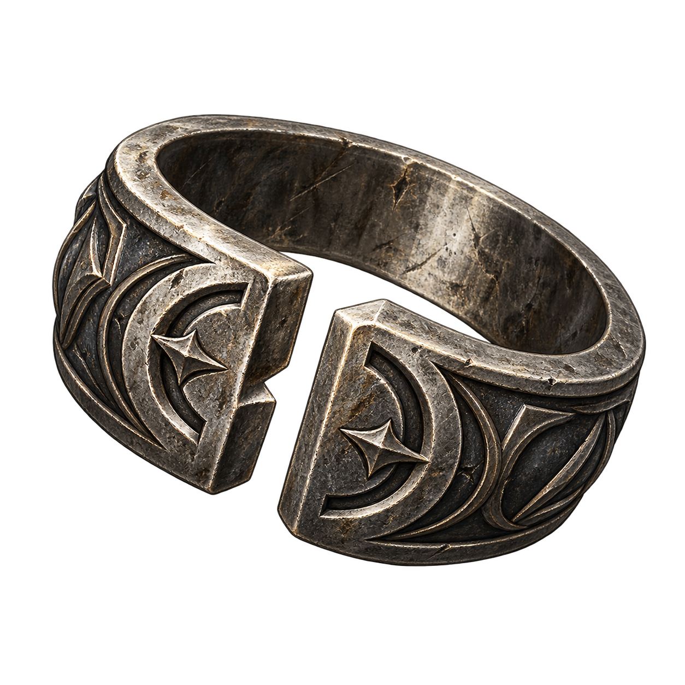
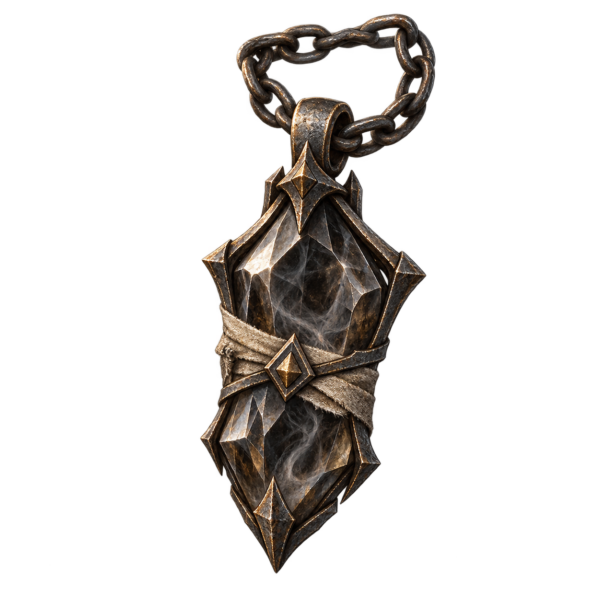

# Украшения

Каталог: `data/jewelry.json`. Правила — [RULES.md](RULES.md), формулы — [FORMULAS.md](FORMULAS.md).

### 17.1. КОЛЬЦО РАЗМЫКАНИЯ

**Каталог:** `data/jewelry.json` → `unlock-ring`.

**Вид и облик:** Тёмное металлическое кольцо с разомкнутым рисунком оправы и небольшим камнем, пересечённым тонкой бороздой.

**Происхождение и владельцы:** Маги земли готовили такие кольца для расчистки опасных проходов. Вещь хранит короткое действие, нарушающее связь частиц материальной преграды; с пустотой аттрактора это умение не связано.

**Где встречается:** Подземные стройки, заброшенные шахты, мастерские магов земли.

**Текст предмета:** «Мастер оставил проход. Никто не обещал, что только для тебя.».

### 17.2. АМУЛЕТ СЖАТИЯ

**Каталог:** `data/jewelry.json` → `fold-amulet`.

**Вид и облик:** Небольшой амулет из тусклого металла. Несколько вложенных пластин сходятся вокруг тесной каменной сердцевины.

**Происхождение и владельцы:** Мастер закрепил в нём способ сосредоточить уже подготовленное действие в узкой области. Это ремесло материальных элементов, не переход в другой план.

**Где встречается:** Мастерские боевых магов, старые арсеналы, редкие предложения кузнецов.

**Текст предмета:** «То же усилие. Меньше места, где от него можно укрыться.».

