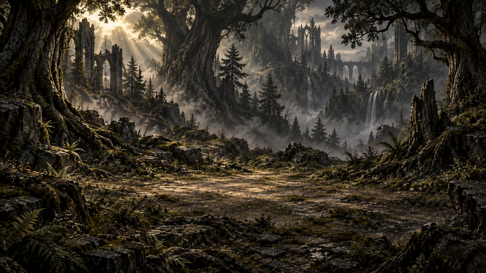
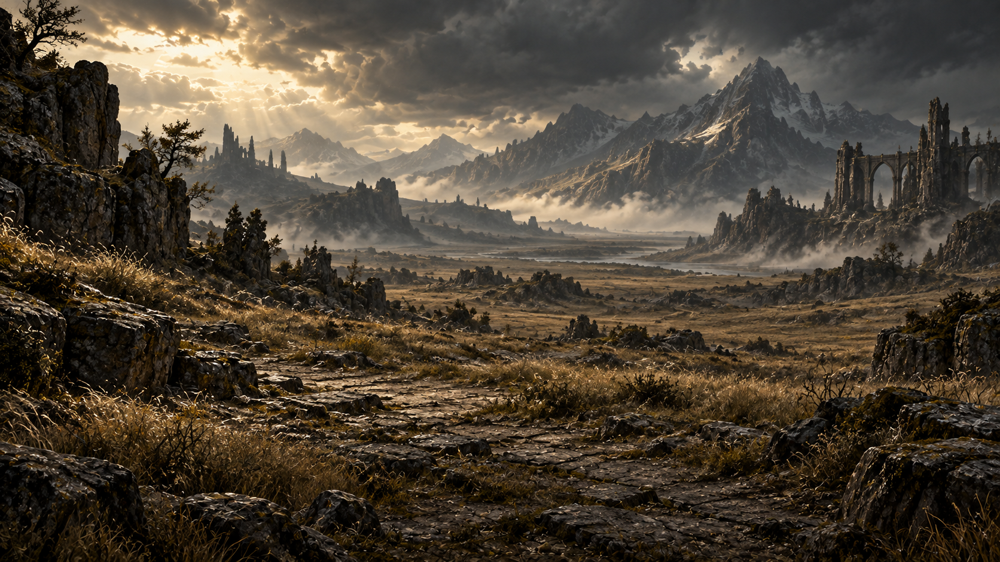
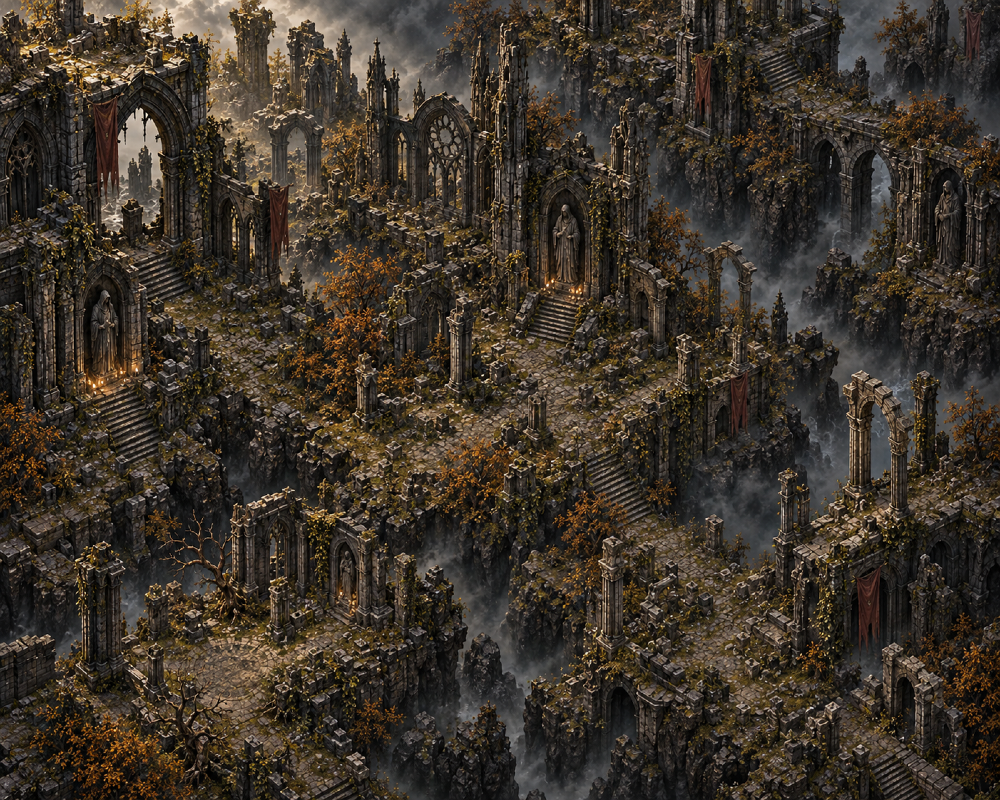
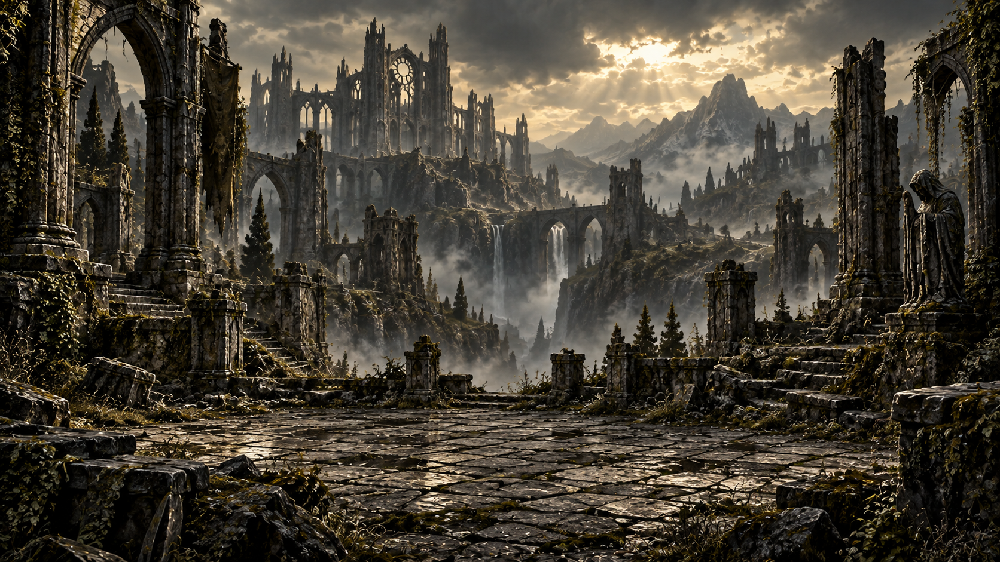
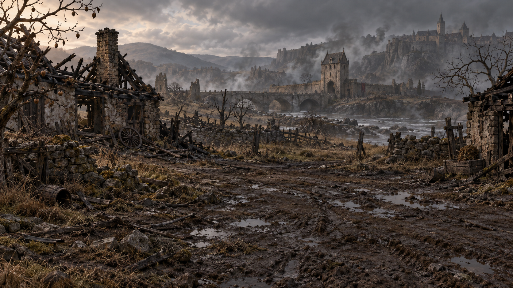
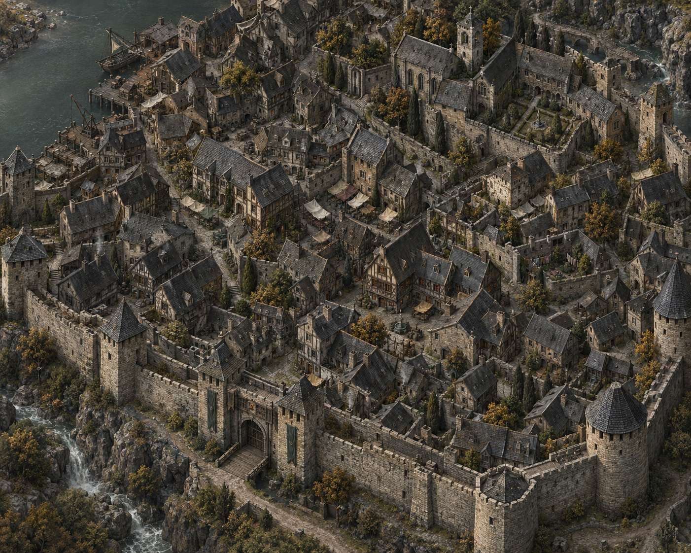
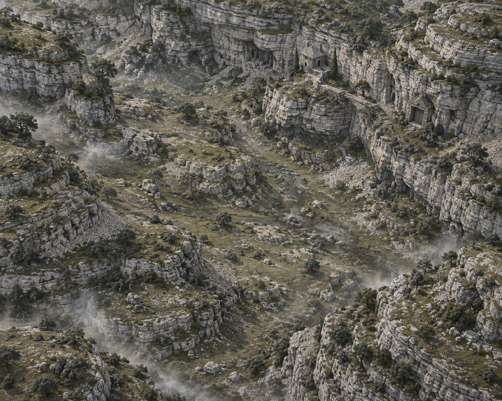

# Герои Орвеска — художественные требования к картам

Пути в обычном тексте и в обратных кавычках указаны от корня проекта; относительные Markdown-ссылки — от расположения документа.

Документ задаёт требования для **генератора пресета карты**: он создаёт новую картинку карты, фон боя и пресет с данными этих изображений. Пресет не содержит координат, связей или типов событий.

**Создание карты в игре** — отдельный процесс: при начале путешествия игра выбирает фон, сама генерирует координаты, связи и события и сохраняет результат в путешествии.

Документ описывает изображения карт путешествия и соответствующие фоны боя. Общие требования к свету, палитре и материалам согласованы с [ART_DIRECTION.md](ART_DIRECTION.md); требования к лицам, портретному кадрированию и анатомии на пейзажи не распространяются.

Структура пресетов и правила графа описаны в [GAME_STATES.md](GAME_STATES.md#пресеты-и-граф-карты). Данные фонов — [data/journey-maps.json](../data/journey-maps.json). Координаты и связи создаёт игровой генератор, они не относятся к художественному пресету. Игровые характеристики противников, награды и восстановление ресурсов не являются частью арт-требований.

## 1. Два изображения для каждого пресета

| Изображение       | Формат текущей серии                             | Назначение                                                                                                |
| ----------------- | ------------------------------------------------ | --------------------------------------------------------------------------------------------------------- |
| Карта путешествия | PNG, около 5:4: исходная серия 3000 × 2400, сюжетная v1 — 1402 × 1122 | Широкая местность; Граф накладывается интерфейсом независимо от фона.                                     |
| Фон боя           | PNG, 1672 × 941, как фон стартового экрана       | Пейзаж той же локации за интерфейсом боя. Показывается через `cover`, часть изображения может обрезаться. |

Оба изображения непрозрачные. Не рисовать шахматную сетку, текст, интерфейс, водяные знаки или внешнюю рамку.

Поля `width` и `height` всегда соответствуют реальному размеру файла: 3000 × 2400 у исходной серии и 1402 × 1122 у сюжетной v1. Генератору запрашивался размер 3000 × 2400, но полученные новые карты сохранены в исходном разрешении без искусственного увеличения. Пропорции новой серии близки к 5:4; интерфейс применяет `cover`. Активной области в изображении нет: фон независим от координат графа.

### Масштаб и прокрутка

- Схема значков на md/lg имеет ширину 450 CSS px и пропорции 9:16. На sm — 80% ширины экрана с теми же пропорциями.
- Фон заполняет всю прокручиваемую область через `cover`, без искажения пропорций. Обрезка изображения допустима.
- Ширина фона не меньше ширины экрана, высота — не меньше доступной высоты экрана и всей схемы с отступами.
- Фон, значки и пунктир прокручиваются вместе. Горизонтальной прокрутки нет.
- Затемнения по краям, переходов в чёрный и пустых полей нет.

## 2. Художественный язык

- Мрачное готическое фэнтези: убедительный объём, фактурные природные материалы, следы времени и запустения.
- Приглушённые угольные, оливковые, землистые и каменно-серые оттенки. Тёплые охристые акценты допустимы без яркого неона.
- Основной свет сверху-слева относительно изображения. Рельеф камней, земли и архитектуры должен читаться по светотени.
- Глубокие тени сохраняют читаемость маршрута. Избегать равномерной черноты, ярких пятен под интерфейсом и чрезмерного контраста мелкой фактуры.
- Материалы состаренные: треснувшая кладка, выветренный камень, корни, сухая трава, мох, потемневшее дерево.
- Без мультяшной графики, плоских векторных заливок, пластикового блеска, современной техники и научной фантастики.

## 3. Композиция карты путешествия

- Высокий вид сверху или с небольшим наклоном: местность читается как карта, без крупного горизонта и сильных перспективных сокращений.
- Всё изображение — непрерывное окружение без выделенной центральной или активной области.
- Не рисовать тропинки, дороги маршрута, площадки под узлы, круги, ромбы или схему графа. Заполнять бывшие маршруты естественной местностью.
- Значки, подписи, состояния и все переходы рисует игра поверх фона. Переходы отображаются пунктиром, в том числе доступные и пройденные.
- Картинка не задаёт расположение узлов и не требует калибровки координат под рисунок. Должна выдерживать обрезку через `cover`.

**Окружение:** лес — разнообразные группы крупных хвойных и лиственных деревьев, древние стволы с корнями, бурелом, мшистые скалы, трава и туман в низинах. Чередовать плотные кроны с нерегулярными просветами, избегать одинаковых мелких ёлок, равномерной текстуры и оранжевой осенней палитры. Сдержанные тёмно-зелёные, серые и землистые оттенки. Без руин, мостов и водопадов; допустима река с одной стороны. Степь — крупные выразительные скальные гряды и обрывы, неровная земля с мелкой россыпью камня, сухая серо-охристая трава, редкие кривые деревья и кусты. Чередовать крупные группы рельефа с открытым грунтом, избегать равномерной россыпи одинаковых маленьких скал и повторяющейся текстуры. Палитра приглушённая, без ярко-оранжевой заливки. Без воды, мостов и руин. Руины — выразительная крупная готическая архитектура: разрушенные арки, стены, колонны, статуи, остатки соборов, мох и осенняя растительность, глубина за счёт тумана и перепадов рельефа. Не превращать локацию в однообразное поле камней: архитектурные ориентиры должны читаться и в центре кадра. Без водопадов. Никаких выделенных мест под узлы или соединяющих их дорог.

Схему создаёт игра: значки соединяются прямым пунктиром. Фон не задаёт число, координаты или связи узлов. Изменение графа не требует изменения изображения или пресета.

## 4. Композиция фона боя

- Самостоятельный пейзаж той же локации: одинаковые материалы, растительность, архитектура, освещение и цветовая атмосфера с картой путешествия.
- Не использовать карту как фон боя и не переносить на него схему маршрута или площадки под значки.
- Центральная область и верхняя часть должны быть достаточно спокойными по тону и деталям, чтобы поле боя и шапка хорошо читались.
- Композиция должна выдерживать обрезку через `cover` на узких, широких и низких экранах. Не помещать обязательные для узнаваемости локации детали только у краёв.
- Не рисовать героев, противников, кубики, боевое поле, шкалы ресурсов, кнопки или текст: они отображаются отдельно.

## 5. Локации и визуальные ориентиры

Перед генерацией просматривать соответствующую пару существующих изображений. Для нового пресета использовать их как ориентир по стилю и читаемости, сохраняя собственную композицию.

| Пресет                    | Характер местности                                                               | Карта                                                 | Фон боя                                                             |
| ------------------------- | -------------------------------------------------------------------------------- | ----------------------------------------------------- | ------------------------------------------------------------------- |
| Тропинка в лесу           | Тёмный лес, корни, мох, трава и камни.                                           | [forest-v3.png](../public/ui/journey/maps/forest-v3.png) | [forest-battle-v1.png](../public/ui/journey/maps/forest-battle-v1.png) |
| Каменистая тропа в степях | Открытая местность, сухая трава и выветренные камни.                             | [steppe-v3.png](../public/ui/journey/maps/steppe-v3.png) | [steppe-battle-v1.png](../public/ui/journey/maps/steppe-battle-v1.png) |
| Заброшенные руины         | Разрушенная кладка, каменные переходы, остатки готической архитектуры и заросли. | [ruins-v3.png](../public/ui/journey/maps/ruins-v3.png)   | [ruins-battle-v1.png](../public/ui/journey/maps/ruins-battle-v1.png)   |

Круглые значки — отдельные ассеты; они не должны быть нарисованы внутри фонового изображения карты. Новая серия, общая рамка и проверка читаемости описаны в [MAP_POINT_ART_DIRECTION.md](MAP_POINT_ART_DIRECTION.md); типы — в [MAP_POINTS.md](MAP_POINTS.md), данные — в [map-points.json](../data/map-points.json).

## 6. Проверка результата

- [ ] Карта непрозрачная, около 5:4; реальные размеры совпадают с `width`/`height`. Окружение и свет согласованы с фоном боя.
- [ ] Нет нарисованных маршрутов, площадок, значков, выделенной активной области или затемнения краёв.
- [ ] Координаты узлов — проценты независимой схемы, не фонового изображения.
- [ ] Значки и пунктир читаются при 320 px; горизонтальной прокрутки нет.
- [ ] Схема шириной 450 px на md/lg и 80% экрана на sm.
- [ ] Фон покрывает всю прокручиваемую область на широких и высоких экранах и прокручивается вместе со значками.

Точные запросы для текущих фонов приведены в разделе [«Исходная серия фонов карт»](#исходная-серия-фонов-карт).

## Исходная серия фонов карт

Три фоновых изображения 3000 × 2400, сгенерированные встроенным image_gen. Исходный результат приведён к итоговому размеру через sips.

| Карта | Фон | Промпт |
| --- | --- | --- |
| Лес | [forest-v3.png](../public/ui/journey/maps/forest-v3.png) | [forest-terrain-prompt.txt](../art-prompts/ui/journey-maps-v3/forest-terrain-prompt.txt) |
| Степь | [steppe-v3.png](../public/ui/journey/maps/steppe-v3.png) | [steppe-terrain-prompt.txt](../art-prompts/ui/journey-maps-v3/steppe-terrain-prompt.txt) |
| Руины | [ruins-v3.png](../public/ui/journey/maps/ruins-v3.png) | [ruins-architecture-prompt.txt](../art-prompts/ui/journey-maps-v3/ruins-architecture-prompt.txt) |

Фоны не содержат маршрутов или площадок под значки. Игра рисует значки и прямые пунктирные соединения независимо от изображения. Данные фонов — в [data/journey-maps.json](../data/journey-maps.json); координаты и связи создаёт игровой генератор, художественные требования приведены выше в этом документе.

Отдельные `*-battle-v1.png` в public/ui/journey/maps используются на экране боя и не являются версиями карт путешествия.

## Превью действующих карт и фонов боя

Изображения ниже загружаются из тех же файлов, которые указаны в `data/journey-maps.json`; исходники не копируются.

### Тропинка в лесу

**Пресет:** `forest`.

**Карта путешествия:**

**Фон боя:**

### Каменистая тропа в степях

**Пресет:** `steppe`.

**Карта путешествия:**

**Фон боя:**

### Заброшенные руины

**Пресет:** `ruins`.

**Карта путешествия:**

**Фон боя:**

## Локации сюжетных глав

В `data/story.json` задана постоянная привязка `chapters[].mapBinding.mapId`. Главы I–VI используют следующую последовательность. Степь и старые руины остаются в общем каталоге для обычного генератора, но в эту сюжетную последовательность не входят. Координаты и события не записываются в арт-пресеты.

| Глава | ID | Окружение |
| --- | --- | --- |
| I | `ravaged-lands` | Разорённые земли: сожжённые усадьбы, обугленные сады, река и старый каменный мост перед Перевальцем. |
| II | `perevalets` | Перевалец: тесные кварталы, серые каменные стены, тёмные крыши, дворы и торговые навесы. Город обитаем, большая часть зданий цела. |
| III | `forest` | Существующий тёмный лес; крупные кроны, корни, мшистые скалы и туман. |
| IV | `mire` | Болота Тихой Заводи: чёрная вода, камыш, кривые ольхи, редкие хижины и полузатонувшая белая часовня. |
| V | `warlands` | Земли войны: вытоптанные поля, остатки осадных машин, обозов и лагеря под старой крепостью. |
| VI | `limestone-valley` | Известняковая долина: слоистые светлые скалы, скупая растительность, приют хранителей и закрытые входы в камень. Содержимое захоронения не показано. |

Небольшой мост, крыльцо, лестница, фрагмент настила или промежутки городской застройки — части окружения. Они не должны складываться в нарисованный маршрут прохождения или задавать места игровых узлов. У болота не рисовать сеть настилов между обязательными остановками; у города — выделенную главную улицу с этапами пути.

Пять новых пар созданы встроенным `image_gen`. Карты сохранены без преобразования в 1402 × 1122, фоны боя — 1672 × 941. Точные промпты, исходные пути и SHA-256: [generation-prompts.json](../art-prompts/ui/story-locations-v1/generation-prompts.json). Для III главы используется существующая пара леса.

Текстовый стенд хранит производную таблицу `chapterMaps`; игровой адаптер сценария ещё должен применять фиксированную привязку. Уже сейчас новые пресеты доступны обычному случайному генератору из общего каталога. Мобильные копии подготавливаются штатным `mobile/scripts/sync_content.py`.

### Разорённые земли — глава 1

**Пресет:** `ravaged-lands`.

**Карта путешествия:**

**Фон боя:**

### Перевалец — глава 2

**Пресет:** `perevalets`.

**Карта путешествия:**

**Фон боя:**

### Болота Тихой Заводи — глава 4

**Пресет:** `mire`.

**Карта путешествия:**

**Фон боя:**

### Земли войны — глава 5

**Пресет:** `warlands`.

**Карта путешествия:**

**Фон боя:**

### Известняковая долина — глава 6

**Пресет:** `limestone-valley`.

**Карта путешествия:**

**Фон боя:**

### Проверка новой серии

Стенд `npm run preview:map-points` показывает все восемь пресетов; переключатель «Вид» выбирает карту или фон боя. Проверять новые карты со значками 48 и 64 px, в том числе светлую известняковую долину. Узкий `cover` должен сохранять характер окружения, даже если отдельная постройка оказывается за краем.

Проверка сюжетной серии v1 выполнена: все 16 изображений каталога загружаются, пять новых карт просмотрены со значками 48/64/96 px, переключение на фон боя работает; на ширине 320 px нет горизонтального переполнения. Исходники в `public` совпадают с результатами генерации, 10 мобильных копий и каталог синхронизированы. Импорт Godot не запускался: исполняемый файл не найден. Отчёт — [qa.json](../art-prompts/ui/story-locations-v1/qa.json).
