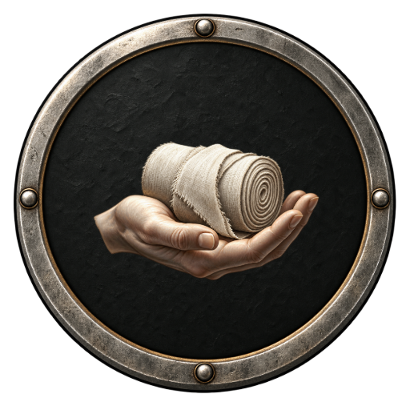

# Типы точек карты

Канонический каталог — [data/map-points.json](../data/map-points.json). Точки описывают вид встречи или занятия, а не отдельное поселение и не координаты графа. Фоны остаются в `journey-maps.json`, сюжет — в `story.json`.

Вся серия подключена к Godot через сюжетный адаптер. Лечебница, рынок и дополнительные разговоры используют [начальные правила](STORY_GAMEPLAY.md) из `data/story-gameplay.json`. Прежние четыре мобильные копии значков удаляются синхронизацией; оригиналы `public/ui/journey` сохранены для браузера.

## Формат и связи

- `points[].id` — устойчивый тип. `name` — общее имя; `storyLabels` — допустимые конкретные подписи сцен, включая имя собеседника.
- `description` — назначение, `actionLabel` — базовая кнопка; конкретная сцена может уточнять её.
- `icon.src` — готовый круглый PNG; `icon.symbol` — прозрачный исходный символ. Общая рамка задаётся один раз в `presentation.frame`.
- `engineBinding` и `availability` показывают существующий обработчик либо необходимость реализации. Новые численные эффекты здесь не назначаются.
- `story.json`: `chapters[].stages[].mapPointType` для боёв, `activities[].mapPointType` для остановок. «Костёр» соответствует существующей ветви `camp`, но ID сюжетного варианта остаётся `campfire`.
- Узел остановки объединяет обязательную сцену и выбор одного доступного занятия. Не создавать тип «Остановка» как дополнительную обязательную услугу, не исполнять все занятия сразу.
- Место, тайный груз и личность противника не раскрываются значком раньше сцены. Поражение, награда и финальный выбор — окна, а не новые точки карты.

## Каталог

### Бой — `combat`

Столкновение с обычным противником. Причину боя, собеседника и вид врага задаёт сцена.

**Символ:** Скрещённые клинки — условный знак боя, а не назначенная врагу экипировка.

**Этапы истории:** 1.1, 1.3, 1.5, 1.7, 2.1, 2.3, 2.5, 2.7, 3.1, 3.3, 3.5, 3.7, 4.1, 4.3, 4.5, 4.7, 5.1, 5.3, 5.5, 5.7, 6.1, 6.3, 6.5, 6.7.

### Босс — `boss`

Заключительный бой карты. После победы выполняются события главы; в финале кампании открывается выбор судьбы аттрактора.

**Символ:** Череп с короной обозначает опасность этапа, а не вид противника.

**Этапы истории:** 1.9, 2.9, 3.9, 4.9, 5.9, 6.9.

### Костёр — `campfire`

Отдых и подготовка к следующему бою. Место может быть костром под навесом, в караулке или у подворья.

**Символ:** Пламя над двумя поленьями.

**Этапы истории:** 1.2, 1.4, 1.6, 1.8, 2.2, 2.4, 2.6, 2.8, 3.2, 3.4, 3.6, 3.8, 4.2, 4.4, 4.6, 4.8, 5.2, 5.4, 5.6, 5.8, 6.2, 6.4, 6.6, 6.8.

### Кузница — `forge`

Работа со снаряжением по действующим правилам кузницы. В глуши это мастерская или переносная наковальня, а не обязательно отдельное здание.

**Символ:** Наковальня с молотом.

**Этапы истории:** 1.2, 1.4, 1.6, 1.8, 2.2, 2.4, 2.6, 2.8, 3.2, 3.4, 3.6, 3.8, 4.2, 4.4, 4.6, 4.8, 5.2, 5.4, 5.6, 5.8, 6.2, 6.4, 6.6, 6.8.

### Лечебница — `healer`

Помощь больным и разговор со служителями приёмного дома или приюта хранителей. Численная польза услуги ещё не назначена.

**Символ:** Ступка, пестик и листья лечебных трав.

**Этапы истории:** 2.2, 6.2.

### Рынок — `market`

Встреча с торговцами и предусмотренные сценарием предложения. Продажа семян зависит от прежнего решения героя; общий инвентарь не вводится.

**Символ:** Торговый прилавок под светлым навесом.

**Этапы истории:** 2.4, 5.2.

### Площадь — `square`

Городские слухи и свидетельства жителей. В Перевальце здесь можно услышать о постояльцах «Тихой двери».

**Символ:** Городской колокол в каменной арке.

**Этапы истории:** 2.4.

### Таверна — `tavern`

Необязательный разговор с обитателями гостиницы или трактира. В главе II служанка сообщает о странных исчезновениях.

**Символ:** Оловянная кружка с крупной ручкой.

**Этапы истории:** 2.6.

### Лесная встреча — `forest-meeting`

Разговор с лесным проводником и знакомство с жителями леса. Отношения учитывают поступки героя; новая ветка карты не создаётся сама собой.

**Символ:** Один древний ветвистый ствол с компактной кроной.

**Этапы истории:** 3.2.

### Встреча с феей — `fairy-meeting`

Встреча с феей её местности: лесной или подземной. Обязательные сведения Нимы сообщаются до выбора занятия; дополнительный разговор не заменяет финального решения.

**Символ:** Светлый корень, охватывающий огонёк; без портрета конкретной феи.

**Этапы истории:** 3.4, 3.8, 4.6, 6.4.

### Беседа с отшельником — `hermit-meeting`

Необязательная беседа с созерцателем. В этой истории — с Теей из сестёр Млечного познания о её учении.

**Символ:** Раскрытая книга и свеча как знак созерцания.

**Этапы истории:** 4.2.

### Помощь — `aid`

Помощь спасённому человеку после обязательной сцены. В подворье Теи герой поддерживает освобождённого пленника.

**Символ:** Открытая ладонь с перевязочным полотном.

**Этапы истории:** 4.4.

## Проверка

`npm run check:map-points` проверяет уникальность ID, все ссылки сюжета, подписи, наличие изображений, круглый формат, ссылку на общую рамку и подготовленный статус. Интерактивный стенд — [map-point-preview.html](../public/ui/map-point-preview.html); запуск через `npm run preview:map-points` (для чтения канонических конфигов нужен этот локальный сервер). Художественные правила — [MAP_POINT_ART_DIRECTION.md](MAP_POINT_ART_DIRECTION.md).
