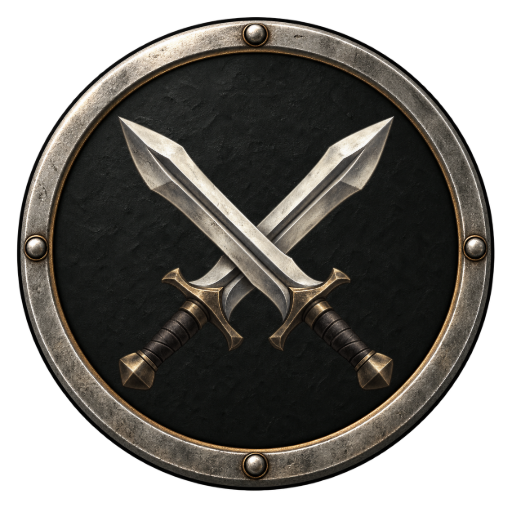
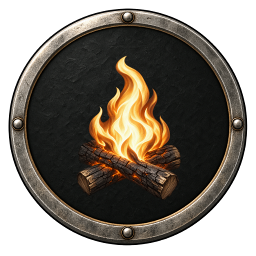
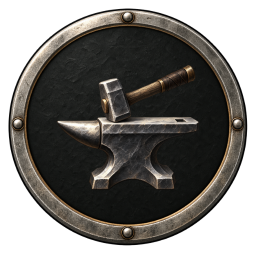
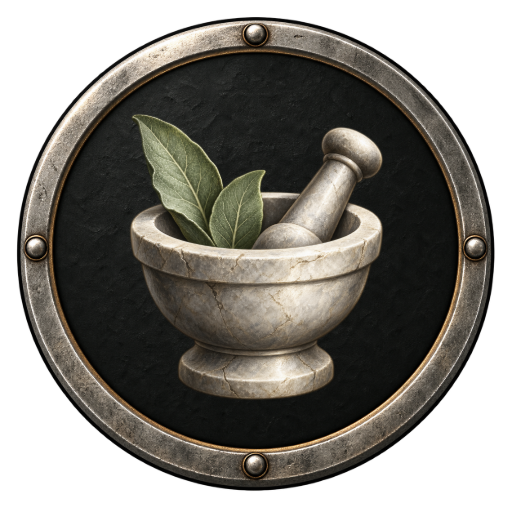
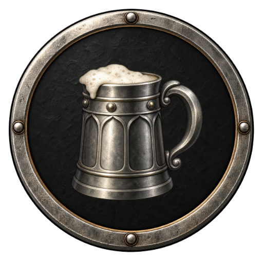
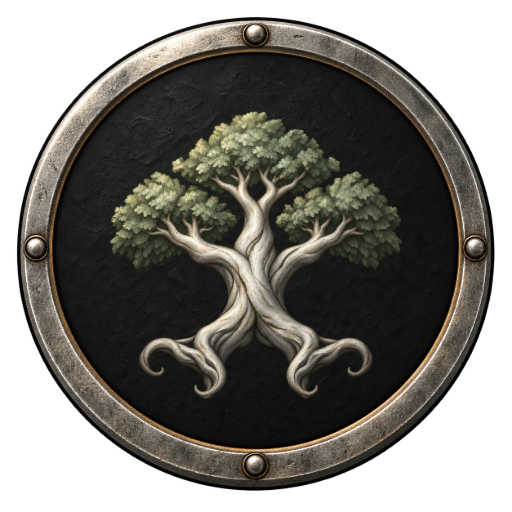
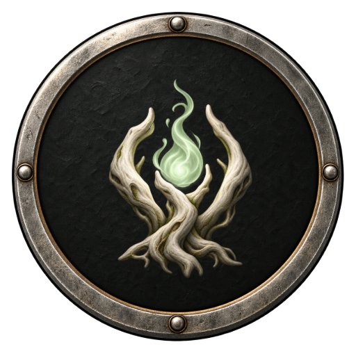

# Каталог точек карты

ID, символы и привязки к этапам истории из [data/map-points.json](../data/map-points.json). Правила занятий и переходов — в [RULES.md](RULES.md#занятия-остановок), расчёты услуг — в [FORMULAS.md](FORMULAS.md#награды-и-услуги), единое оформление — в [ART_DIRECTION.md](ART_DIRECTION.md#значки-точек-карты).

`mapPointType` связывает сцену или занятие с типом. Сам тип не задаёт координаты, поселение, цену или новые эффекты. Данные фонов находятся в `maps.json`, привязки сцен — в `story.json`; каталог не заменяет сценарий.

### Бой — `combat`

**Символ:** Скрещённые клинки — условный знак боя, а не назначенная врагу экипировка.

**Этапы истории:** 1.1, 1.3, 1.5, 1.7, 2.1, 2.3, 2.5, 2.7, 3.1, 3.3, 3.5, 3.7, 4.1, 4.3, 4.5, 4.7, 5.1, 5.3, 5.5, 5.7, 6.1, 6.3, 6.5, 6.7.

### Босс — `boss`

**Символ:** Череп с короной обозначает опасность этапа, а не вид противника.

**Этапы истории:** 1.9, 2.9, 3.9, 4.9, 5.9, 6.9.

### Костёр — `campfire`

**Символ:** Пламя над двумя поленьями.

**Этапы истории:** 1.2, 1.4, 1.6, 1.8, 2.2, 2.4, 2.6, 2.8, 3.2, 3.4, 3.6, 3.8, 4.2, 4.4, 4.6, 4.8, 5.2, 5.4, 5.6, 5.8, 6.2, 6.4, 6.6, 6.8.

### Кузница — `forge`

**Символ:** Наковальня с молотом.

**Этапы истории:** 1.2, 1.4, 1.6, 1.8, 2.2, 2.4, 2.6, 2.8, 3.2, 3.4, 3.6, 3.8, 4.2, 4.4, 4.6, 4.8, 5.2, 5.4, 5.6, 5.8, 6.2, 6.4, 6.6, 6.8.

### Лечебница — `healer`

**Символ:** Ступка, пестик и листья лечебных трав.

**Этапы истории:** 2.2, 6.2.

### Рынок — `market`

**Символ:** Торговый прилавок под светлым навесом.

**Этапы истории:** 2.4, 5.2.

### Площадь — `square`

**Символ:** Городской колокол в каменной арке.

**Этапы истории:** 2.4.

### Таверна — `tavern`

**Символ:** Оловянная кружка с крупной ручкой.

**Этапы истории:** 2.6.

### Лесная встреча — `forest-meeting`

**Символ:** Один древний ветвистый ствол с компактной кроной.

**Этапы истории:** 3.2.

### Встреча с феей — `fairy-meeting`

**Символ:** Светлый корень, охватывающий огонёк; без портрета конкретной феи.

**Этапы истории:** 3.4, 3.8, 4.6, 6.4.

### Беседа с отшельником — `hermit-meeting`

**Символ:** Раскрытая книга и свеча как знак созерцания.

**Этапы истории:** 4.2.

### Помощь — `aid`

**Символ:** Открытая ладонь с перевязочным полотном.

**Этапы истории:** 4.4.

## Проверка каталога

`npm run check:map-points` проверяет ID, ссылки сцен, подписи, изображения, круглый формат и общую рамку. Стенд — `npm run preview:map-points`; порядок визуальной проверки — в ART_DIRECTION.md.
