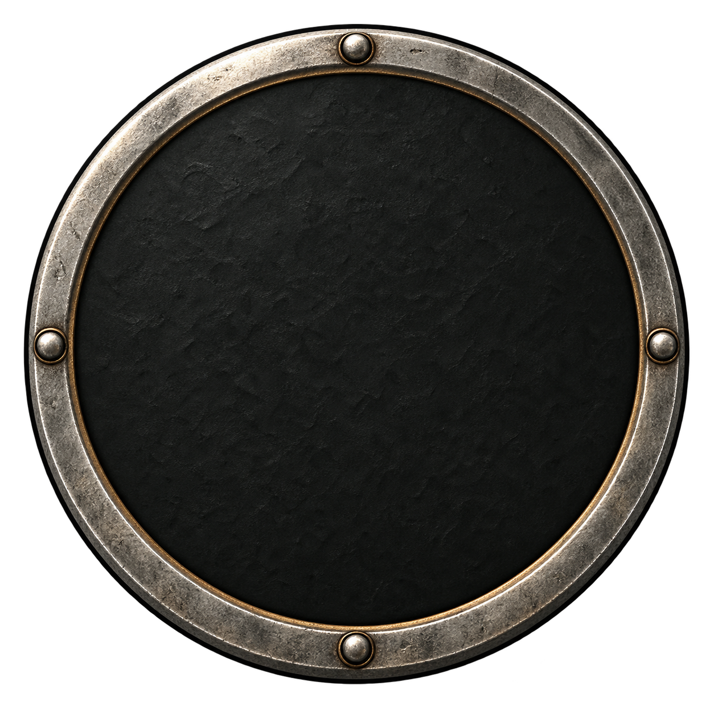
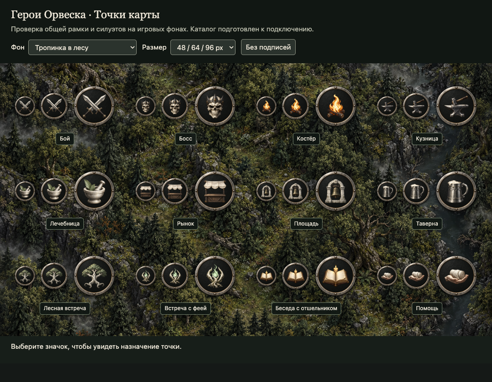
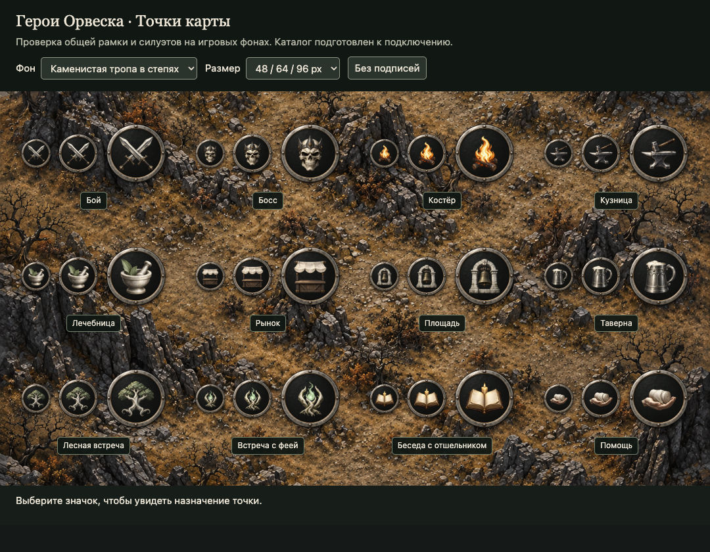
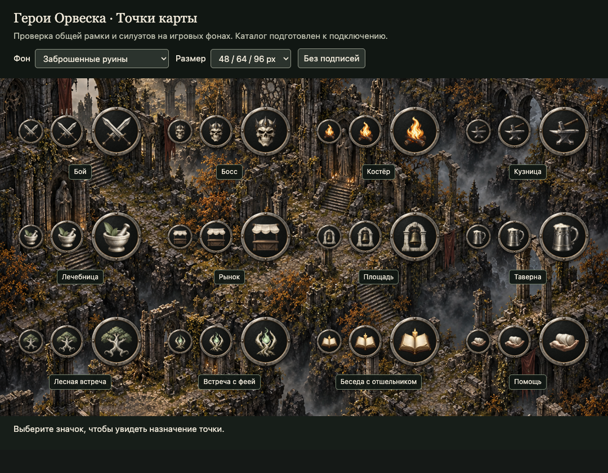

# Художественное направление значков точек карты

## Назначение и источники

Круглые маркеры путешествия для «Героев Орвеска». Все типы находятся в [data/map-points.json](../data/map-points.json); назначение, этапы истории и превью — в [MAP_POINTS.md](MAP_POINTS.md). Серия подготовлена к подключению в клиенты, новые услуги ещё не реализованы.

Материалы и освещение наследуются от [ART_DIRECTION.md](ART_DIRECTION.md), условия окружения — от [MAP_ART_DIRECTION.md](MAP_ART_DIRECTION.md). До генерации просмотрены три общих референса и все текущие фоны: [лес](../public/ui/journey/maps/forest-v3.png), [степь](../public/ui/journey/maps/steppe-v3.png), [руины](../public/ui/journey/maps/ruins-v3.png). Лес имеет пёструю тёмную листву, степь — светлую охристую землю и камни, руины — контрастные стены, тени и туман.

## Общая конструкция

1. Строго круглый медальон анфас, без выступающих шпилей и корон на самой рамке. Снаружи настоящая прозрачность, внутри непрозрачный почти чёрный диск: текстура карты не просвечивает через символ.
2. Одна общая [рамка](../public/ui/map-points/v1/frame.png) для всей серии: непрерывный широкий обод из состаренного светлого металла, тонкая бронзовая внутренняя кромка, четыре утопленные заклёпки. Тёмная внешняя кромка отделяет металл от светлых участков карты.
3. Под рамкой интерфейс рисует общий непрозрачный круг `#111513` с отступом 8% (`presentation.backing`): альфа художественной текстуры не должна пропускать карту в середине. Рамку не генерировать заново для каждого типа. Все готовые PNG собраны из одного и того же исходника, в одинаковом положении и масштабе. Новые типы используют этот же файл.
4. Символ — один крупный предмет или компактная группа с узнаваемым силуэтом. Светлая кость, лён и серебро; маленький охристый или зелёный акцент допустим. Без подписей, букв, чисел и мелкой декоративной вязи внутри круга.
5. Свет всегда сверху и спереди-слева изображения. Фактура готического фэнтези, умеренная потёртость, ясные объёмные формы. Портретные правила направления взгляда к условным символам не применяются.



## Размеры и читаемость

Готовый PNG — 512 × 512, RGBA. Отображение: 64 px по умолчанию, 48 px — нижняя граница, 96 px — крупное превью. Центр символа совпадает с центром рамки; его квадрат занимает 62% холста, отступ сверху и слева — 19%. Эти значения заданы в `presentation.symbolBox`, не подбирать разные размеры рамки для разных точек.

На пёстром фоне обязательны три уровня разделения: светлый предмет, тёмная непрозрачная середина, светлая рамка с тёмным внешним краем. Интерфейс дополнительно задаёт тень `0 2px 3px #000b`. Подпись размещать снаружи на тёмной плашке; имя также доступно в подсказке и доступном названии кнопки.

Различать точки по силуэту, а не только цвету: клинки, коронованный череп, костёр, наковальня, ступка, прилавок, колокол, кружка, дерево, корни с огоньком, книга со свечой, ладонь с перевязью. Полный перечень и соответствия сюжету — в каталоге типов.

Доступность, текущую позицию и завершение обозначать внешним кольцом или отдельной меткой интерфейса. Не перекрашивать весь PNG и не снижать общую непрозрачность: это разрушит читаемость. Заблокированная точка сохраняет символ и получает явный замок. Не раскрывать значком тайного собеседника, вид скрывающегося существа или содержимое груза.

## Генерация и сохранение

Создавать отдельный прозрачный символ инструментом генерации изображений; рамка и подложка уже готовы. Пример запроса:

```text
Foreground symbol for a circular map marker in Heroes of Orvesk, dark gothic
fantasy. One compact silhouette: [предмет из symbolDescription]. Pale aged
ivory and silver, graphite shadows, restrained accent. Sculptural painted
realism, large crisp shapes, upper-front-left lighting. Centered complete
object with clear margins, readable at 32 px. Genuine alpha transparency.
NO frame, circle, disk, scenery, lettering, numerals or background.
```

Исходные PNG символов сохранять без перерисовки в `public/ui/map-points/v1/symbols/`. Поверх непрозрачного круга и общей рамки интерфейс размещает символ в `symbolBox`; снимок этого элемента в размере 512 px даёт готовый `public/ui/map-points/v1/<id>.png`. Не растягивать готовый круг в овал. Не встраивать тень интерфейса в экспорт: она задаётся при показе.

Точные запросы, инструмент `builtin`, первоначальные файлы, размеры и SHA-256 сохранены в [generation-prompts.json](../art-prompts/ui/map-points-v1/generation-prompts.json). При добавлении точки обновлять конфиг, каталог с превью, сюжетные ссылки и [ASSET_INVENTORY.md](ASSET_INVENTORY.md).

## Проверка на картах

Стенд: `npm run preview:map-points`, затем адрес, напечатанный командой. Он читает канонические конфиги и показывает все типы на любом текущем фоне при 48, 64 и 96 px. Переключатель «Вид» позволяет отдельно проверить фон боя. Кнопка «Без подписей» помогает проверить различимость самих символов. Стенд — средство проверки ассетов, не игровая карта.

Перед приёмкой проверить все три фона при 48 и 64 px, светлые и тёмные области, сетку при ширине 320 px, реальные прозрачные углы и непрозрачную середину. В готовых файлах обод должен совпадать пиксель в пиксель. При потере узнаваемости упрощать или перегенерировать символ, а не менять индивидуальную рамку.

Контрольные снимки всей серии на реальных фонах при трёх размерах:







Проверка серии v1 выполнена 2026-09-27: 12 PNG 512 × 512, прозрачные углы, непрозрачная середина и совпадающий обод; просмотрены лес, степь и руины при 48/64/96 px. На ширине 320 px нет горизонтального переполнения, выбор точки и скрытие подписей работают. Подробности — [qa.json](../art-prompts/ui/map-points-v1/qa.json).

После добавления сюжетных локаций каталог включает восемь пресетов. Проверять значки также на сожжённых усадьбах, крышах Перевальца, болотной воде, полях войны и светлом известняке. Правила новых фонов и превью — в [MAP_ART_DIRECTION.md](MAP_ART_DIRECTION.md#локации-сюжетных-глав).
