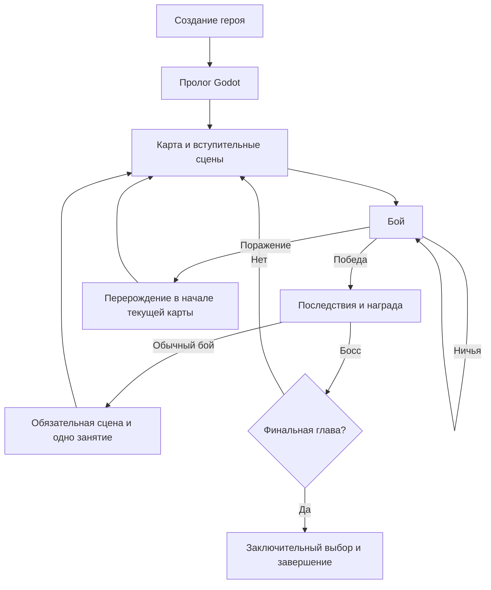

# Правила игры «Герои Орвеска»

Единое описание действующих игровых правил. Документ описывает мобильное приложение Godot. Все вычисления, округления, коэффициенты и численный баланс находятся в [FORMULAS.md](FORMULAS.md). Исполняемые значения задаются в `data`; лорные описания не добавляют механик.

## Источники и границы

| Содержание | Источник |
|---|---|
| Характеристики, ресурсы, параметры боя и добычи | [combat-balance.json](../data/combat-balance.json) |
| Собственные действия и существа | [base-actions.json](../data/base-actions.json), [creatures.json](../data/creatures.json) |
| Предметы и их фигуры | [weapons.json](../data/weapons.json), [shields.json](../data/shields.json), [armor.json](../data/armor.json), [footwear.json](../data/footwear.json), [jewelry.json](../data/jewelry.json), [basic-equipment.json](../data/basic-equipment.json) |
| Навыки | [skills.json](../data/skills.json) |
| Противники и вводные варианты | [journey-rules.json](../data/journey-rules.json), [journey-encounters.json](../data/journey-encounters.json) |
| Кампания, диалоги, занятия и последствия | [story.json](../data/story.json), [story-preview.json](../data/story-preview.json), [story-gameplay.json](../data/story-gameplay.json) |

Godot исполняет игровые правила локально; расчёты и жизненный цикл проверяются тестами в `mobile/tests`. Скрытая рука и порядок колоды противника не раскрываются игроку. Форматы данных и порядок редактирования описаны в `data/FIGURES.md`, `data/CREATURES.md` и `data/STORY.md`; технический запуск и проверки — в README соответствующего клиента.

## Герой и развитие

Герой — обычный человек. Игрок задаёт имя, портрет и распределяет стартовые очки между силой, ловкостью, живучестью и интеллектом. Внешность не определяет характеристики или способности. Создание мобильного героя состоит из выбора имени/портрета и распределения очков; возврат сохраняет черновик. Путешествие начинается после успешного сохранения законченного героя.

Живучесть повышает максимум здоровья. Сила, ловкость и интеллект усиливают действия, в профиле которых они указаны. Характеристики также определяют доступность экипировки. Выносливость не растёт непосредственно от характеристик. Пассивные бонусы навыков учитываются в эффективных характеристиках, но не записываются в базовые очки и не повышают уровень героя.

Характеристики повышаются за осколки вне боя. Можно оплатить несколько повышений и недостающие требования выбранного предмета. Только покупка живучести полностью лечит героя. Изучение навыка само по себе не лечит и не восполняет выносливость; уменьшение максимума при замене навыка ограничивает текущий запас новым максимумом.

Название ресурса — «осколки»; первое объяснение — «осколки сознания Логоса». Сообщение о нехватке — «Недостаточно осколков». «Душа» остаётся понятием лора. Запас героя и уже переданные аттрактору осколки учитываются отдельно. В Godot аттрактор наполняется только при успешной оплате характеристик; покупка на рынке и само получение награды его не наполняют. После передачи камня в концовке долга прокачка недоступна.

## Экипировка

Инвентаря нет: награда или покупка сразу заменяет надетую вещь. В бою переодеваться нельзя. Предмет должен подходить по эффективным характеристикам, виду существа и разрешённому слоту. Требования проверяются и при выдаче предложения, и при принятии предмета.

Слоты: оружие в правой руке, щит в левой, тело, ноги, кольцо и амулет. Двуручный предмет исключает щит и собственный блок свободной рукой; надевание щита снимает двуручное оружие. Уровень полученного предмета фиксирован: прокачка владельца не улучшает вещь автоматически. Ранг шаблона `tier` ограничивает его появление в наградах и услугах и отличается от уровня экземпляра `template@N`.

`fist`, `bare-hands` и `bare-foot` обозначают базовые действия свободных слотов. Они не выпадают как добыча, не продаются и не занимают места обычных вещей в генерации врага. Их карточки используют определения из `base-actions.json`, не добавляя повторных копий в колоду. Мобильный манекен показывает эти предметы в свободных слотах человека; существам не выдаются человеческие кулаки или пинки поверх их природных действий.

Одежда защищает от указанных в её профиле типов урона. Защита нескольких вещей складывается; броня не поглощает урон выносливости. Обувь может добавлять собственные пинки. Изображение предмета и литературное происхождение не дают дополнительных эффектов.

Магическими предметами может пользоваться обычный герой: действие заранее закреплено магом. Не вводятся дополнительные проверки чувствительности, заряды, топливо или обряд активации. Стрелы бесконечны у героя и противников, включая скелета-лучника; нет отдельной перезарядки или дальности стрельбы. Действия луков и посохов подчиняются тем же правилам размещения и выносливости.

### Различия оружия

Оружие различается хватом, профилем урона, формами, копиями и стоимостью карт, воздействием на выносливость. Вес — категория наполнения каталога, а не отдельный эффект движка: лёгкое оружие удобно при малом запасе ресурса, тяжёлое обычно покрывает больше клеток и сильнее истощает цель. Число занятых клеток определяется самой формой, а не её ограничивающим прямоугольником.

Каждая чистая атакующая ветка имеет сопоставимый выбор одноручных и двуручных предметов всех весов. Магический родственник сохраняет характер приёмов физического оружия. Внутри `family` допустим одинаковый набор форм; у разных семейств набор должен отличаться, даже если отдельные простые фигуры совпадают. Точные бюджеты и сравнение при равных вложениях — в [FORMULAS.md](FORMULAS.md#баланс-каталога-оружия).

### Украшения

Украшения применяются отдельно от руки, каждое — один раз за бой. Амулет сжатия превращает выбранную фигуру в одну клетку на текущий розыгрыш. Её потенциальный урон сохраняется, защита действует только в фактически занятой клетке; стоимость действия и лечение за фигуру не увеличиваются. Кольцо размыкания освобождает одну клетку от препятствия. При текущей конфигурации препятствий на поле нет, поэтому кольцо не имеет цели.

## Колода и навыки

Колода объединяет доступные собственные действия человека или существа, фигуры экипировки и активных навыков. Наличие природной атаки не запрещает фигуры оружия. Например, вампир сохраняет укус и получает действия надетого оружия.

| Условие собственной фигуры | Доступность |
|---|---|
| `emptyWeapon` | Нет обычного оружия |
| `emptyFeet` | Нет обычной обуви |
| `emptyShield` | Нет щита и двуручного оружия |
| Условие отсутствует | Не зависит от экипировки |

Базовые предметы `unarmed` считаются свободными слотами. Вариант существа выбирает весь его набор `variants[creatureVariant].figures`. Каждая копия карты самостоятельна; одинаковые карты можно разыграть вместе. Общий размер колоды не ограничен.

Активный навык добавляет фигуру, пассивный меняет параметры бойца или сборку колоды. У героя три ячейки навыков; изученный навык повторно не предлагается. При заполненных ячейках выбирается замена. Навыки одной `exclusiveGroup` заменяют друг друга в общей ячейке. «Защитная подготовка» распространяется в том числе на «Шаг назад».

| Навык | Игровое действие |
|---|---|
| Уворот | Уклонение в квадратной области |
| Шаг в сторону | Уклонение в диагонально расположенных клетках |
| Перевязка | Лечение после входящего урона, только если боец выжил |
| Парирование | Уклонение с ответным колющим уроном от ловкости при встрече с атакой |
| Силовой отбой | Уклонение с ответным дробящим уроном от силы при встрече с атакой |
| Расчётливый удар | Атака выносливости от интеллекта, без урона здоровью |
| Отскок | Бесплатное уклонение S-образной фигурой |
| Шаг назад | Уклонение на всём поле; сжатие сокращает защищённую область |
| Наступательная подготовка | Увеличивает число копий атакующих карт |
| Защитная подготовка | Увеличивает число копий защитных карт |
| Неутомимость | Повышает максимум выносливости |
| Крепкое здоровье | Даёт пассивный бонус живучести |
| Реакция | Герой действует первым на каждом ходу при разрешимом предпочтении |
| Стратег | Герой действует вторым на каждом ходу при разрешимом предпочтении |

«Реакция» и «Стратег» несовместимы у одного бойца. Их конфликт между сторонами разрешается общим правилом очерёдности. Числа навыков, геометрия и формулы — в [FORMULAS.md](FORMULAS.md#навыки-и-базовые-действия). Происхождение умений и иллюстрации — в [SKILLS.md](SKILLS.md).

## Бой

### Подготовка и размещение

Единственный режим — «Свободное поле» (`free`). В начале боя колоды перемешиваются, руки добираются до четырёх карт, выносливость восстанавливается полностью. Начало боя само по себе не лечит. После хода использованные карты уходят в сброс; остальные остаются в руке. При необходимости добора пустая стопка пополняется перемешанным сбросом. Окончательного исчерпания колоды нет.

Поле имеет размер 3×3. Свои фигуры не пересекаются и не выходят за поле. Чужие фигуры можно перекрывать; фигуры можно поворачивать. Отдельного лимита числа сыгранных фигур нет: ограничивают рука, свободные клетки и выносливость. Черновик можно менять, но подтвердить расстановку с отрицательным остатком выносливости нельзя.

На каждом ходу проверяются предпочтения `passive.turnOrder`. Если они разрешимы, действует указанный порядок. Если предпочтений нет или они одинаковы у обеих сторон, первый участник первого хода выбирается случайно, затем роли чередуются. Загрузка сохранения порядок не меняет.

| Этап | Поведение |
|---|---|
| `preparation` | Герой ставит первым, будущий ответ скрыт; можно подтвердить расстановку или пропустить ход |
| `reaction` | Противник уже поставил фигуры; герой видит их и отвечает; подтверждение рассчитывает ход |
| `reveal` | Ответ ИИ сохранён и раскрыт после подтверждения героя; редактирование запрещено, следующее подтверждение рассчитывает результат |

Обмен карт в мобильном интерфейсе недоступен.

### Контакты и ресурсы

Обычная атака по пустоте или поддержке проходит полностью; встречные атаки ослабляют друг друга; блок или уклонение отменяет входящий урон в закрытой клетке. Контратака наносит ответный урон только при встрече с атакой. Атакой считается и фигура, повреждающая только выносливость.

Стоимость действия оплачивается за фигуру. Блок дополнительно оплачивается за клетки, встретившие атаку; при неизвестном ответе резервируется максимальная стоимость, при расчёте списываются реальные контакты. Входящий урон выносливости применяется после оплаты и не отменяет уже поставленную защиту.

Урон обеих сторон рассчитывается одновременно: погибающий боец успевает нанести свой. Затем лечение получают только выжившие. Пустое собственное поле означает отдых: выживший полностью восстанавливает выносливость после входящего урона. Входящий урон выносливости, исчерпавший оплаченный остаток, вызывает истощение и пропуск ближайшего автоматического восстановления; полный отдых снимает истощение. Расход до нуля собственными действиями сам по себе его не вызывает.

Ядовитый урон использует свой тип защиты; отдельного периодического отравления нет. Страх, потеря рассудка и высасывание жизненных сил в литературных описаниях не создают дополнительных боевых шкал. Физическая, магическая и ядовитая атаки — лорные группы; конкретные составляющие и защита заданы в `damage-types.json`.

### Результат

Гибель только противника даёт победу, только героя — поражение, обоих одновременно — ничью. Если оба живы, начинается следующий ход. Просмотр рассчитанного результата — состояние интерфейса: закрытие окна не рассчитывает ход повторно.

ИИ пользуется своей рукой, геометрией и выносливостью. В роли первого он не знает будущей расстановки героя; в роли отвечающего видит открытую расстановку. Оценка кандидатов описана в [FORMULAS.md](FORMULAS.md#выбор-хода-ии).

## Карта и противники

Глава мобильной кампании соответствует одной карте: четыре обычных боя с остановкой после каждого, затем босс. На остановке сначала показывается обязательная сцена, затем выбирается одно доступное занятие. Костёр, кузница и сюжетные варианты — альтернативы этой остановки, а не последовательность обязательных услуг. Прокачка внутри главы не пересчитывает уже назначенные уровни врагов.

Сценарий Godot определяет вид противника и условные варианты встречи. Генератор распределяет характеристики и разрешённую экипировку; изученные навыки врагам не назначаются. Разрешённый слот не гарантирует предмет: учитываются вероятность допуска, требования, совместимость и бюджет. Портрет не закрепляет конкретное оружие. Таблица природных действий и ограничений видов приведена ниже.

На первой мобильной карте противники не имеют экипировки и используют начальные характеристики. Обычным существам назначается `introductory`, если он существует; люди сохраняют человеческие действия. Босс использует обычные фигуры и начинает раненым после удара Севрана. Ранение уменьшает текущее, а не максимальное здоровье; повтор боя снова использует сохранённый раненый профиль. Цель вводных встреч — доступность герою без экипировки и навыков с отдыхом между боями; это не обещание победы любой стратегии.

Точные параметры противников — в [FORMULAS.md](FORMULAS.md#генерация-противников).

### Пресеты и граф карты

`maps.json` хранит только фоны. Координаты, связи и события создаются отдельно и сохраняются в `journey.map`. Фон не задаёт расположение узлов. Выбор доступной точки ведёт по сохранённому графу; открытие карты при незавершённом бое или награде не сбрасывает текущую фазу.

Godot проходит пролог и шесть глав «Последнего носителя»: разорённые земли, Перевалец, лес, болота, земли войны, известняковая долина. Привязка берётся из `chapters[].mapBinding.mapId` и сохраняется при поражении. После финала следующая карта не создаётся.

### Занятия остановок

| Тип точки | Правило |
|---|---|
| Бой / босс | Вступительная сцена, сражение, последствия и награда |
| Костёр | Полное восстановление здоровья и выносливости |
| Лечебница | Восстановление, затем предусмотренный разговор |
| Кузница | Бесплатная замена одного предмета из предложений либо отказ |
| Рынок | Покупка одного предмета за осколки с немедленной заменой надетого |
| Площадь / таверна | Предусмотренный сценарием разговор и его последствия |
| Лесная встреча / встреча с феей / беседа с отшельником / помощь | Сюжетный разговор; дополнительных скрытых прибавок нет |

Закрытие незавершённого окна кузницы не означает отказа: выбор остаётся доступным. После завершения выбор не повторяется на том же прохождении остановки. Награда, поражение и финальное решение являются окнами, а не дополнительными точками карты. Каталог значков и ID — [MAP_POINTS.md](MAP_POINTS.md); цены, количество предложений и подбор вещей — [FORMULAS.md](FORMULAS.md#награды-и-услуги).

## Награды и перерождение

В Godot осколки автоматически начисляются один раз при победе. После обязательных сюжетных последствий показывается дополнительная награда: можно принять предмет или навык либо отказаться, сохранив начисленные осколки. Первое предложение применимо сразу; второе может быть на вырост. Два навыка или два экземпляра одного шаблона вместе не предлагаются. При отсутствии вариантов путь продолжается без дополнительной вещи.

После завершения выбора Godot проверяет доступность прокачки. Если она разрешена и осколков достаточно, появляется шаг «Поднять уровень» / «Продолжить». Первый вариант открывает характеристики, второй продолжает сюжет. Шаг сохраняется, не начисляет награду повторно и не заставляет тратить осколки.

Обычная награда внутри карты не лечит; переход на новую карту восстанавливает ресурсы.

При поражении весь неистраченный запас осколков остаётся у победившего врага. Новая потеря, включая нулевую, заменяет прежний тайник. Победа над этим врагом возвращает тайник один раз дополнительно к обычной награде. Потраченные на развитие осколки не теряются повторно.

Поражение сохраняется до подтверждения перерождения. Герой возвращается в начало текущей карты с полными ресурсами, сохранив характеристики, экипировку и навыки. Состав врагов, стартовый уровень главы и маршрут не пересоздаются случайно. Бои повторяются.

В Godot сохраняются решения, отношения, раскрытые тайны, выполненные события и выданные сюжетные награды. Прочитанные сцены сокращаются до напоминаний, непрочитанные показываются полностью; занятие остановки можно выбрать заново. Повтор боя не описывается как новая буквальная смерть уже погибшего сюжетного персонажа.

Ничья повторяет только текущий бой, без смерти, потери осколков и повторения сюжетных последствий. Герой восстанавливается полностью; враг берётся из сохранённого стартового профиля, включая исходное ранение босса.

## Диалоги и аттрактор

Персонаж говорит в окне с портретом и текстом. Герой располагается слева от текста, остальные — справа. Закадровое описание показывается без портрета. Вся необходимая игроку информация о месте, угрозе и последствиях сообщается через такие окна; технические пометки сценария не выводятся как реплики.

Пролог представляет героя наёмником и не раскрывает аттрактор. До объяснения Севрана в сцене 1.2 и флага `attractorKnown` нельзя показывать имя, портрет и голос камня, в том числе в поражении. Возвращение героя в это время описывается как действие неведомой силы. Раскрытия при поражении идут постепенно; сообщение о потерянном запасе показывается при наличии потери и объясняет возможность возврата.

Наполнение камня управляет доступностью его речи. Пока он молчит, пропускаются реплики и признания героя о слышимом голосе. Дальнейшие пороги задаются конфигом и описаны в [FORMULAS.md](FORMULAS.md#наполнение-аттрактора). Точное происхождение голоса не раскрывается как установленная истина мира.

До разоблачения сохраняются известная герою роль и человеческая маска собеседника. Пропуск текста останавливается на выборе; автоматического ответа или автоматической концовки нет. Голос камня внутренний и не слышен остальным персонажам автоматически.

Ответы героя меняют только явно заданные последствия: отношения, варианты встреч, награды, условия реплик и концовок. Уже созданные условные враги сохраняются для повторов. Условия оцениваются до соответствующих эффектов, однократные последствия не выдаются снова после загрузки.

После финального босса обычная награда предшествует заключительному разговору. Намерение в сцене 6.8 ещё не выбирает концовку. Все три окончательных решения доступны независимо от прежних поступков; прошлое меняет доверие, реплики и последствия. Полный текст развилок остаётся в JSON, без Markdown-копии сценария.

## Экраны и сохраняемые фазы

Главное меню ведёт к списку героев, созданию или продолжению игры. Карточка героя, экипировка, навыки, правила и просмотр результата — окна интерфейса; сами по себе они не меняют фазу. Каталоги экипировки и навыков в мобильном меню закрыты одним фиче-флагом отладочных инструментов.

| Фаза | Что ожидается |
|---|---|
| `ready` | Доступный переход по карте |
| `combat` | Продолжение сохранённого боя |
| `victory` | Завершение награды и доступного шага прокачки |
| `defeat` | Подтверждение возврата к началу текущей карты |
| `draw` | Повтор текущего боя |
| `story` (Godot) | Окно сценария или выбор ответа, затем заданное продолжение |
| `ended` (Godot) | Завершённая кампания |

Сохранение раскрытого ответа возвращает тот же ход; перезагрузка не даёт перебросить карты или ИИ. В мобильной кампании действие, эффекты, генератор случайных чисел и запись сохраняются согласованно; при ошибке записи новое действие не считается завершённым. Технический формат сохранений описан в [mobile/README.md](../mobile/README.md).

## Собственные действия и экипировка существ

Таблица переносит игровые сведения из бестиария. Названия видов и природных действий берутся из `data/creatures.json`; численные значения фигур и генерации — из соответствующих профилей. Литературные способности и уязвимости в [CREATURES.md](CREATURES.md) не являются дополнительными механиками. Боевой допуск вида не означает враждебности каждого его представителя; возможность диалога допускает знаки и поведение без человеческой речи.

| Существо | Собственные действия и ограничения экипировки |
|---|---|
| Демон (`demon`) | Истощение; Ускользание. Допустимые категории: оружие, щит, тело, ноги, кольцо, амулет. |
| Бесплотный дух (`light-spirit`) | боевых действий нет. Допустимые категории: без носимой экипировки. |
| Исчезающий (`vanishing`) | Истощение; Ускользание. Допустимые категории: без носимой экипировки. |
| Болотница (`swamp-hag`) | Ядовитый выброс; Удар лапой. Допустимые категории: оружие, щит. |
| Боевой маг (`battle-mage`) | Магический удар; Защита. Допустимые категории: оружие, щит, тело, ноги, кольцо, амулет. |
| Дикий маг (`wild-mage`) | Магический удар; Защита. Допустимые категории: оружие, щит, тело, ноги, кольцо, амулет. |
| Эльф (`elf`) | Магический удар; Отпрыгивание. Допустимые категории: оружие, щит, тело, ноги, кольцо, амулет. |
| Фея (`faerie`) | Магический удар; Ускользание. Допустимые категории: оружие, щит. |
| Подземная фея (`dark-faerie`) | Магический удар; Ускользание. Допустимые категории: оружие, щит. |
| Вампир (`vampire`) | Укус; Отпрыгивание. Допустимые категории: оружие, щит, тело, ноги, кольцо, амулет. |
| Гарпия (`harpy`) | Удар когтями; Отпрыгивание. Допустимые категории: без носимой экипировки. |
| Леший (`leshy`) | Удар лапой; Отпрыгивание. Допустимые категории: оружие, щит. |
| Фавн (`faun`) | Удар рогами; Отпрыгивание. Допустимые категории: оружие, щит, тело, кольцо, амулет. |
| Живой доспех (`living-armor`) | Сокрушение; Защита. Допустимые категории: оружие, щит. |
| Собака (`dog`) | Укус; Отпрыгивание. Допустимые категории: без носимой экипировки. |
| Дикий волк (`wolf`) | Удар лапой; Прыжок; Укус; Защита. Допустимые категории: без носимой экипировки. |
| Огромный волк (`huge-wolf`) | Укус; Удар лапой; Отпрыгивание. Допустимые категории: без носимой экипировки. |
| Волк-оборотень (`werewolf`) | Удар лапой; Укус; Отпрыгивание. Допустимые категории: без носимой экипировки. |
| Кошачий хищник (`cat`) | Удар лапой; Отпрыгивание. Допустимые категории: без носимой экипировки. |
| Огромный кошачий хищник (`huge-cat`) | Укус; Удар лапой; Отпрыгивание. Допустимые категории: без носимой экипировки. |
| Малая хищная птица (`small-bird`) | Удар когтями; Отпрыгивание. Допустимые категории: без носимой экипировки. |
| Большая хищная птица (`large-bird`) | Удар когтями; Сокрушение; Отпрыгивание. Допустимые категории: без носимой экипировки. |
| Гигантская змея (`giant-snake`) | Укус; Сдавливание; Отпрыгивание. Допустимые категории: без носимой экипировки. |
| Озёрная змея (`lake-snake`) | Укус; Сдавливание; Отпрыгивание. Допустимые категории: без носимой экипировки. |
| Летающая гигантская змея (`flying-snake`) | Укус; Отпрыгивание. Допустимые категории: без носимой экипировки. |
| Летающий ящер (`flying-lizard`) | Удар когтями; Укус; Отпрыгивание. Допустимые категории: без носимой экипировки. |
| Дракон (`dragon`) | Укус; Удар лапой; Отпрыгивание. Допустимые категории: без носимой экипировки. |
| Спрут (`octopus`) | Захват щупальцем; Сдавливание; Отпрыгивание. Допустимые категории: без носимой экипировки. |
| Костесборщик (`bone-collector`) | Укус; Удар лапой; Отпрыгивание. Допустимые категории: без носимой экипировки. |
| Ржавоед (`rust-eater`) | Ядовитый выброс; Укус; Отпрыгивание. Допустимые категории: без носимой экипировки. |
| Топяной колокол (`bog-bell`) | Облако спор; Защита. Допустимые категории: без носимой экипировки. |
| Пепельный гончий (`ash-hound`) | Пепельное дыхание; Укус; Отпрыгивание. Допустимые категории: без носимой экипировки. |
| Корневой пастух (`root-shepherd`) | Захват корнями; Сокрушение; Отпрыгивание. Допустимые категории: без носимой экипировки. |
| Зеркальщик (`mirror-being`) | Ложное отражение; Ускользание. Допустимые категории: без носимой экипировки. |
| Шовник (`stitchling`) | Удар лапой; Сокрушение; Отпрыгивание. Допустимые категории: без носимой экипировки. |
| Шёпотница (`whisperess`) | Истощающий шёпот; Ускользание. Допустимые категории: без носимой экипировки. |
| Каменный зевок (`stone-yawn`) | Сокрушение; Сдавливание; Отпрыгивание. Допустимые категории: без носимой экипировки. |
| Слитник (`meldling`) | Магический удар; Удар лапой; Отпрыгивание. Допустимые категории: без носимой экипировки. |
| Аттрактор (`attractor`) | боевых действий нет. Допустимые категории: без носимой экипировки. |
| Скелет (`skeleton`) | собственное уклонение; одноручное оружие из разрешённого набора. Щит появляется случайно при достаточном бюджете. Одежда, броня, обувь и украшения не выдаются. Атаки и блок щитом берутся из предметов; конкретное оружие не закреплено на портрете. |
| Скелет-лучник (`skeleton-archer`) | собственное уклонение; единственное разрешённое оружие — «Лук лесной охоты» (`hunting-bow`). Щит и остальные слоты недоступны. Выстрелы берутся из фигур лука, отдельной врождённой стрелковой атаки нет. |
