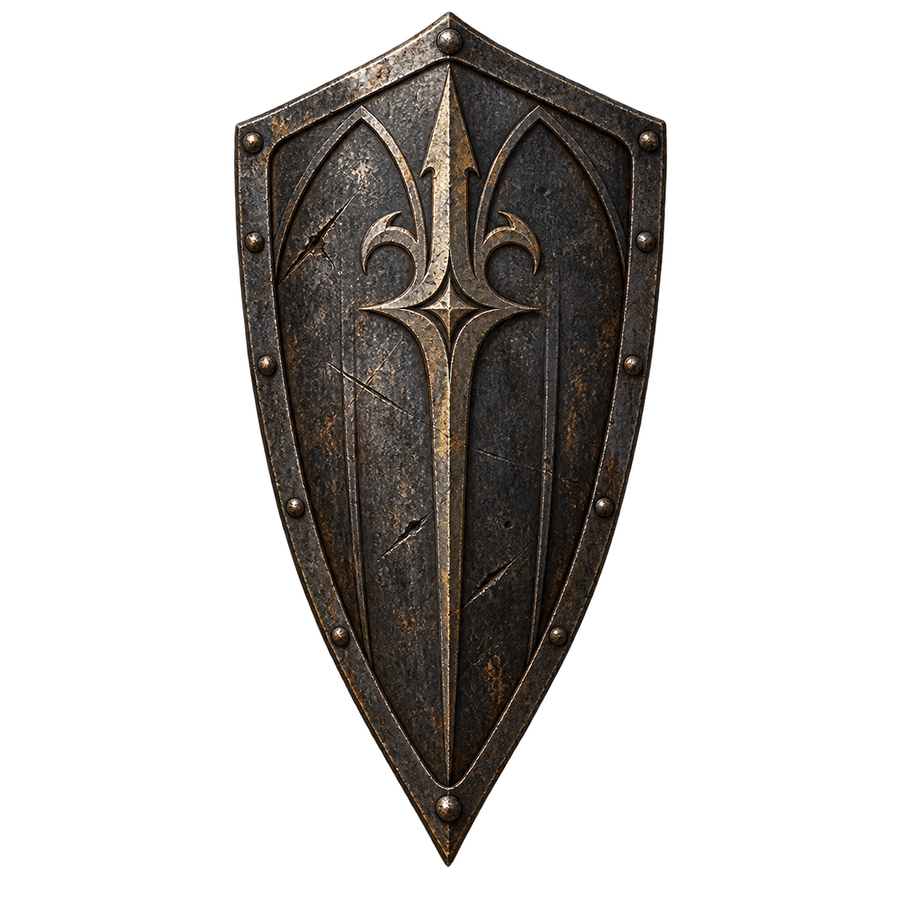

# Щиты

Каталог: `data/shields.json`. Правила — [RULES.md](RULES.md), формулы — [FORMULAS.md](FORMULAS.md).

### 14.1. ПОТЁРТЫЙ БАКЛЕР

**Каталог:** `data/weapons.json` → `buckler`.

**Вид и облик:** Небольшой круглый щит с выпуклым железным умбоном, потёртым краем и тёмной рукоятью на обороте.

**Происхождение и владельцы:** Обычная защита дорожных бойцов и городской стражи. Кузнецы меняют разбитые части, сохраняя удобный хозяину хват.

**Где встречается:** Заставы, городские рынки, снаряжение караванной охраны.

**Текст предмета:** «С лица железо всё в зарубках. С оборота рукоять ещё тёплая.».

### 14.2. ЩИТ СУМЕРЕЧНОГО СТРАЖА

**Каталог:** `data/weapons.json` → `kite-shield`.

**Вид и облик:** Вытянутый щит с нижним остриём и потемневшей окантовкой. На лицевой стороне почти исчез знак караула.

**Происхождение и владельцы:** Сумеречными стражами называли дозоры, встречавшие опасность на исходе дня. Конструкция помогает удерживать защитное положение и возвращать ровное дыхание после удачного перекрытия удара.

**Где встречается:** Старые караульные дома, крепостные склады, охрана городских ворот.

**Текст предмета:** «Переживи удар. Выдохни. Следующий уже близко.».

### 14.3. ЗЕРКАЛО ЗАБВЕНИЯ

**Каталог:** `data/weapons.json` → `mirror-shield`.

**Вид и облик:** Овальный щит с потускневшей отражающей поверхностью. Вмятины дробят отражение на неровные пятна.

**Происхождение и владельцы:** Мастера закрепляют в материале защитные свойства, ослабляющие чужие воздействия. Забвение — имя изделия; оно не обещает стирать память и не связано с лечением жрецов.

**Где встречается:** Мастерские при военных лагерях, хранилища магов, редкие городские лавки.

**Текст предмета:** «Своё лицо видишь плохо. Чужую вспышку — вовремя.».

