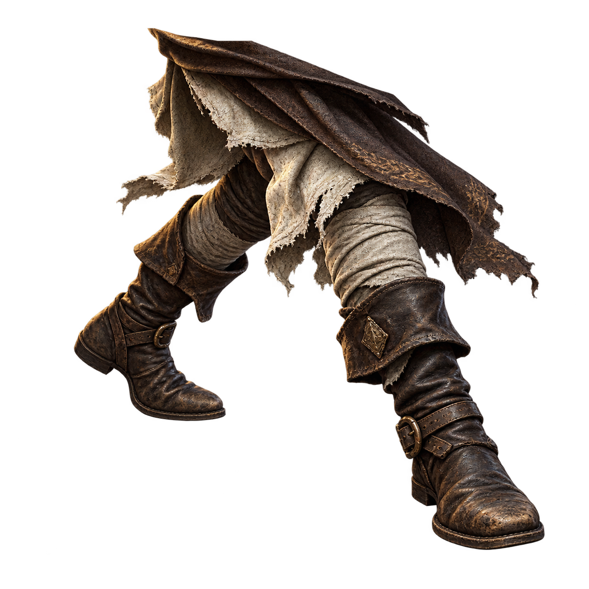
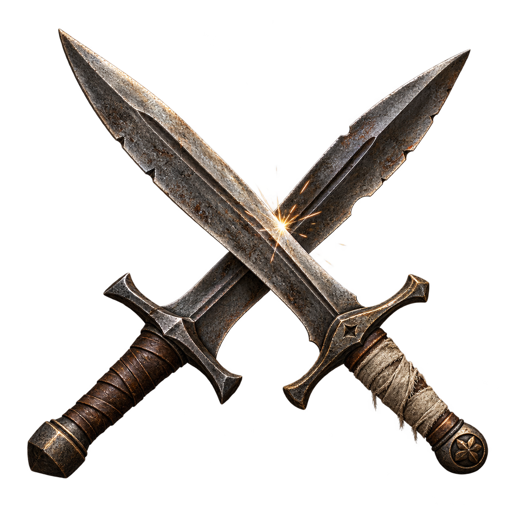
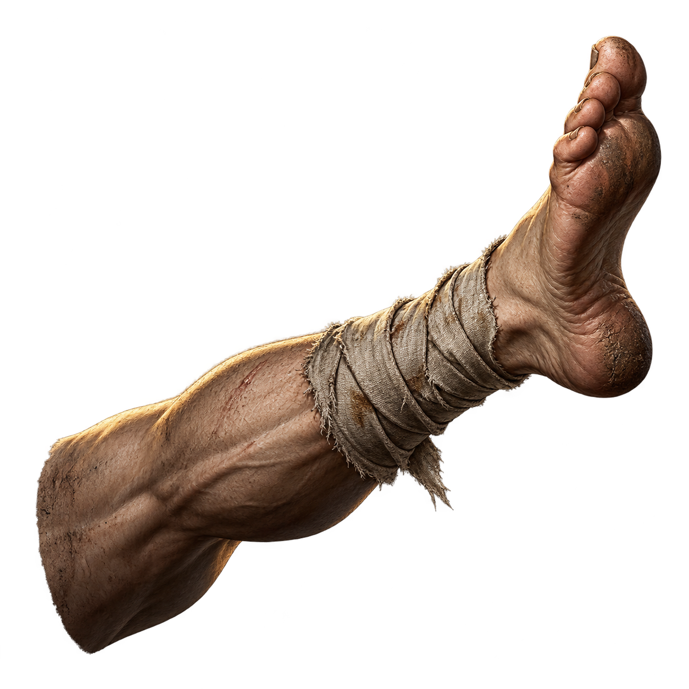

# Навыки и базовые действия

Карточки согласованы с `data/skills.json` и `data/base-figures.json`. Истории — художественные дополнения, эффекты берутся из конфигов. Числа и геометрия остаются в данных; общие правила — [DECK_COMBAT.md](DECK_COMBAT.md). Все изображения используют относительные ссылки на существующие файлы.

Навык не делает обычного героя чувствующим. Лечение перевязкой, уклонение и подготовка — освоенные действия, а не самостоятельные магические способности. Обычный герой может применять заранее подготовленные магом предметы: [EQUIPMENT.md](EQUIPMENT.md).

## Навыки

Активные навыки добавляют действия в колоду; пассивная подготовка изменяет состав колоды. Конкретное использование регулируют режим боя и конфиг, а не литературная формулировка карточки.

### Уворот

**Каталог:** `data/skills.json` → `dodge`. Тип: активный.

**Происхождение умения:** Путник учится замечать движение плеча раньше, чем видит само нападение. Резкий уход всем корпусом оставляет врагу пустое место.

**Действие и ограничения:** Защищает здоровье и выносливость в перекрытой области. Это движение тела, не исчезновение в другом плане; неперекрытые атаки остаются опасны.

**Короткий текст:** «Ты видишь удар там, где только что стоял.».

### Шаг в сторону

**Каталог:** `data/skills.json` → `sidestep`. Тип: активный.

**Происхождение умения:** Узкая тропа не оставляет места для широкого прыжка. Опытный боец смещает опору и пропускает чужое усилие рядом с собой.

**Действие и ограничения:** Уклонение покрывает диагонально разнесённые участки. Не даёт общей неуязвимости и не телепортирует владельца.

**Короткий текст:** «Достаточно шага, если сделать его вовремя.».

### Перевязка

**Каталог:** `data/skills.json` → `bandage`. Тип: активный.

**Происхождение умения:** Умение затянуть ткань одной рукой часто передают у походного костра. Его знают солдаты, носильщики и люди, пережившие нападение на обоз.

**Действие и ограничения:** Лечит после входящего урона только выжившего и не выше максимального здоровья. Не блокирует удар, не воскрешает и не заменяет лекарскую силу жреца.

**Короткий текст:** «Сначала останови кровь. О боли подумаешь потом.».

### Парирование

**Каталог:** `data/skills.json` → `parry`. Тип: активный.

**Происхождение умения:** Боец учится встречать направление чужого удара, а не всю его силу. Короткий ответ следует за открывшимся движением противника.

**Действие и ограничения:** Отменяет встретившуюся атаку и наносит физический встречный урон. Без входящей атаки ответного урона нет; результат зависит от ловкости.

**Короткий текст:** «Противник сам показал, куда смотреть.».

### Наступательная подготовка

**Каталог:** `data/skills.json` → `attack-training`. Тип: пассивный.

**Происхождение умения:** Повторённые в лагере движения становятся привычкой: рука находит нападение раньше, чем страх успевает остановить её.

**Действие и ограничения:** Пассивно удваивает копии атакующих карт при сборке колоды. Не является дополнительным ударом, отдельной картой или усилением урона каждой клетки.

**Короткий текст:** «Сначала повторяли до усталости. Потом — чтобы пережить её.».

### Защитная подготовка

**Каталог:** `data/skills.json` → `defense-training`. Тип: пассивный.

**Происхождение умения:** Опыт караула приучает не распрямляться после первого удара. Боец чаще выбирает знакомое защитное движение даже в суматохе.

**Действие и ограничения:** Пассивно удваивает копии защитных карт при сборке колоды. Не добавляет броню и не блокирует атаки автоматически.

**Короткий текст:** «Первый удар пережили многие. Второго ждали немногие.».

## Базовые действия

Это действия самого героя, а не выдаваемые предметы или отдельные изучаемые навыки. Два удара кулаком используют одну иллюстрацию, но имеют разные определения.

### Удар кулаком

**Каталог:** `data/base-figures.json` → `fist`.

**Образ действия:** Простой удар свободной рукой. Герой переносит вес и пытается попасть туда, где противник не успел закрыться.

**Доступность и ограничения:** Доступен без оружия в правой руке; физическая атака.

### Сильный удар кулаком

**Каталог:** `data/base-figures.json` → `fist-heavy`.

**Образ действия:** Боец вкладывает в движение корпус, рискуя остаться открытым после широкого удара. Это всё та же человеческая рука, не новое оружие.

**Доступность и ограничения:** Доступен без оружия в правой руке. Физическая атака воздействует на здоровье и выносливость; не вводит отдельный нокдаун.

### Блок руками

**Каталог:** `data/base-figures.json` → `guard`.

**Образ действия:** Скрещённые предплечья принимают столкновение, пока боец удерживает опору. Такое движение знакомо и тем, кто никогда не держал щит.

**Доступность и ограничения:** Доступен при свободной левой руке; двуручное оружие исключает его. Блок отменяет урон при контакте с атакой и расходует выносливость по действующим правилам. Сама карта не наносит урон.

### Пинок

**Каталог:** `data/base-figures.json` → `kick`.

**Образ действия:** Босая нога отталкивает приблизившегося врага. Движение не обещает той защиты, которую дала бы обувь.

**Доступность и ограничения:** Базовый физический пинок доступен без обуви; надетая обувь заменяет его своим действием. Не означает отдельного толчка по карте или гарантированного падения.

