# Оружие

Каталог: `data/weapons.json`. Правила — [RULES.md](RULES.md), формулы — [FORMULAS.md](FORMULAS.md).

Названия тиров задаются в [weapon-tiers.json](../data/weapon-tiers.json), цвета заголовков — в канонической палитре приложения. В карточке оружия под названием показывается строка «Редкое · Уровень 5 · Двуручное».

| Тир | Название | Цвет заголовка |
|---|---|---|
| 0 | Безымянное | `#C2BEB2` |
| 1 | Испытанное | `#97B887` |
| 2 | Редкое | `#91ADD9` |
| 3 | Легендарное | `#E0B76F` |

### 13.1. ДОРОЖНЫЙ МЕЧ

**Каталог:** `data/weapons.json` → `road-sword`.

**Тир:** 1.

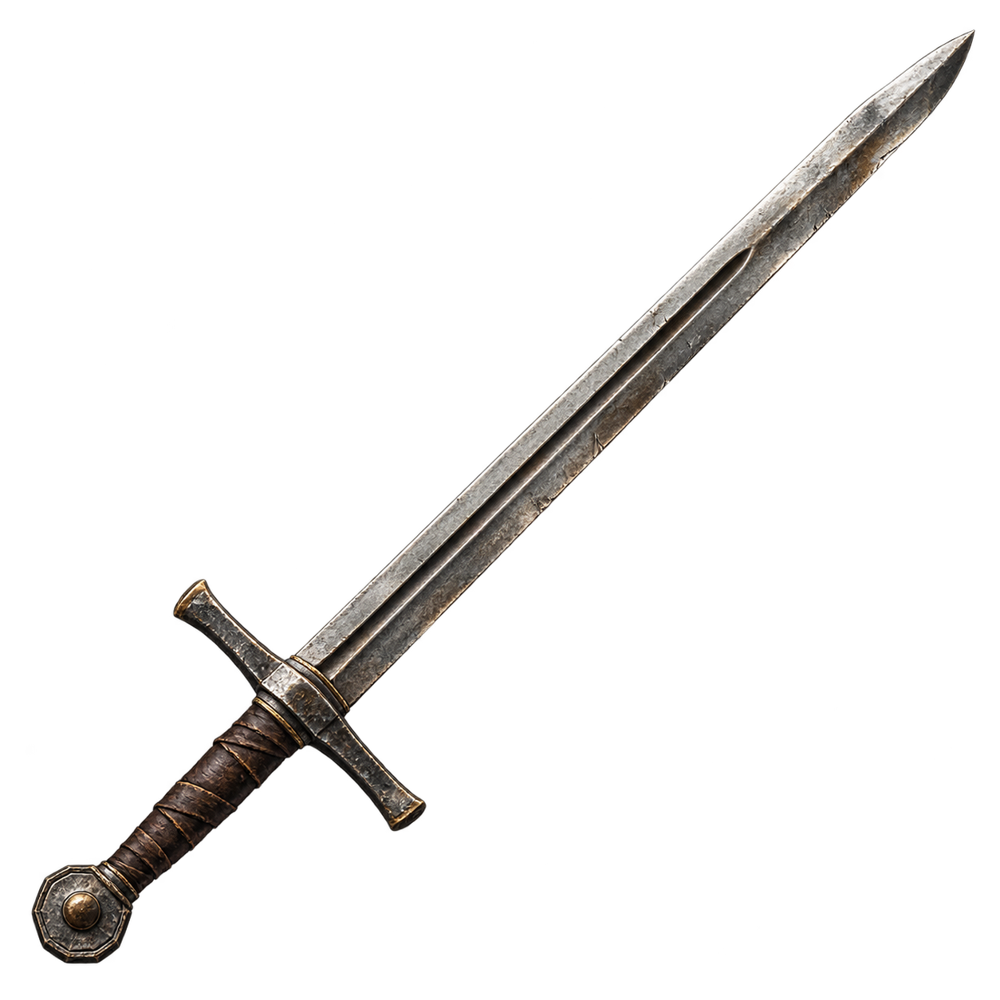

**Вид и облик:** одноручный прямой меч с простой крестовиной, потёртой кожаной рукоятью и узким долом. На клинке остаются следы многократной заточки.

**Происхождение и владельцы:** распространён среди наёмников, караванной охраны и разорившихся воинов. В смутные времена один меч может сменить нескольких хозяев за одну войну. Подходит герою без магической подготовки.

**Где встречается:** лагеря, заставы, оружейные лавки, поля былых битв.

**Текст предмета:** «Имена владельцев стёрлись с ножен. Зарубки на гарде остались».

### 13.2. СОЛДАТСКОЕ КОПЬЁ

**Каталог:** `data/weapons.json` → `soldier-spear`.

**Тир:** 0.

**Приём и образ:** «Прикрытый выпад» — копейщик встречает удар усиленным древком и отвечает уколом наконечника. Иллюстрация перехвата общая для копий; укол сохраняет изображение своего оружия. [Правила смешанных фигур](RULES.md#смешанные-фигуры).

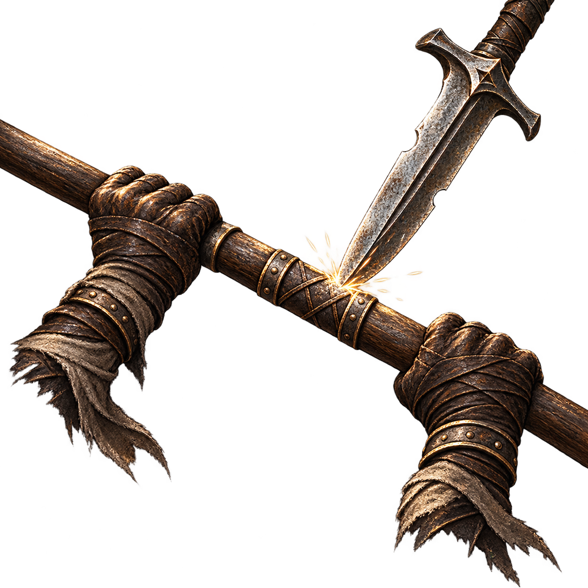

**Вид и облик:** длинное ясеневое древко с листовидным железным наконечником и грубой обмоткой в месте хвата.

**Происхождение и владельцы:** оружие пехоты и деревенского ополчения. После разгрома войска такие копья остаются у крестьян, разбойников и дорожных стражей. Герой может пользоваться им как обычным оружием.

**Где встречается:** заставы, разорённые деревни, заброшенные лагеря.

**Текст предмета:** «Наконечник выковал кузнец. Древко хозяин вырезал сам, когда к деревне подошла война».

### 13.3. СЕЧА РАЗБОЙНИКА

**Каталог:** `data/weapons.json` → `bandit-cleaver`.

**Тир:** 0.

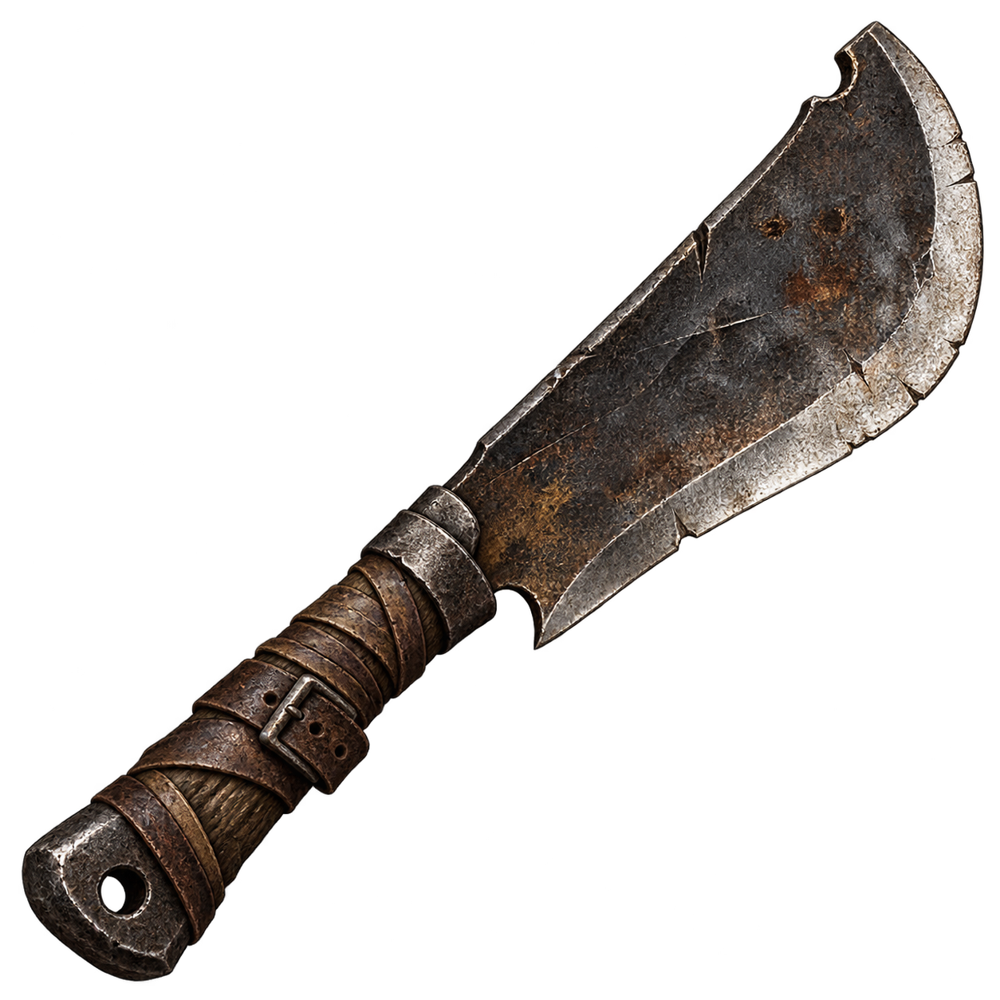

**Вид и облик:** короткий тяжёлый тесак с широким односторонним лезвием. Рукоять часто обмотана полосой чужого ремня.

**Происхождение и владельцы:** переделанный хозяйственный инструмент лесных разбойников и мародёров. Его происхождение не требует особой школы или редкого металла.

**Где встречается:** придорожные засады, разграбленные обозы, бандитские стоянки.

**Текст предмета:** «Им рубили хворост, вскрывали сундуки и добивали тех, кто не успел убежать».

### 13.4. КЛЮВАСТЫЙ МОЛОТ

**Каталог:** `data/weapons.json` → `beaked-hammer`.

**Тир:** 2.

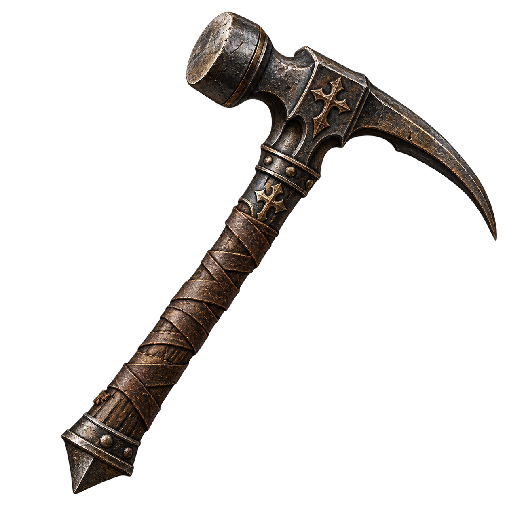

**Вид и облик:** короткая прочная рукоять, небольшой ударный боёк и длинный загнутый клюв на обратной стороне головки.

**Происхождение и владельцы:** оружие воинов, сражающихся с бронированными противниками. Искатели добычи в руинах ценят его при столкновениях с живыми доспехами.

**Где встречается:** военные склады, руины укреплений, снаряжение тяжёлой пехоты.

**Текст предмета:** «Железному часовому нечего ломать под бронёй. Приходится ломать саму броню».

### 13.5. АЛЕБАРДА ПОСЛЕДНЕГО КАРАУЛА

**Каталог:** `data/weapons.json` → `last-watch-halberd`.

**Тир:** 3.

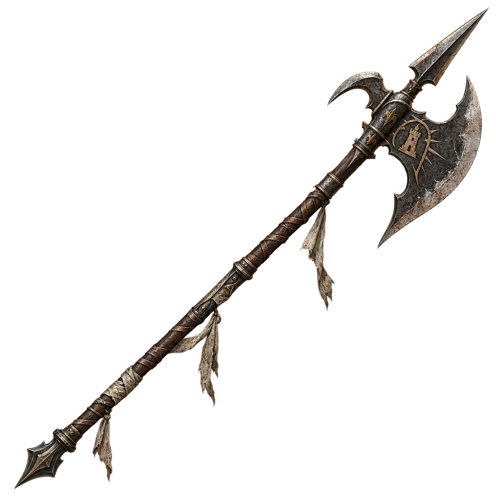

**Вид и облик:** длинное древковое оружие с топорным лезвием, верхним остриём и крюком; на втулке выбит знак давно исчезнувшего гарнизона.

**Происхождение и владельцы:** штатное оружие старых крепостных стражей, в том числе живых доспехов. Название связано с теми часовыми, которые продолжают охранять пустые хранилища.

**Где встречается:** оружейные, крепостные ворота, охраняемые руины.

**Текст предмета:** «Приказ караулу никто не отменил. Отдававший его рассыпался в прах раньше древка».

### 13.6. ЛУК ЛЕСНОЙ ОХОТЫ

**Каталог:** `data/weapons.json` → `hunting-bow`.

**Тир:** 1.

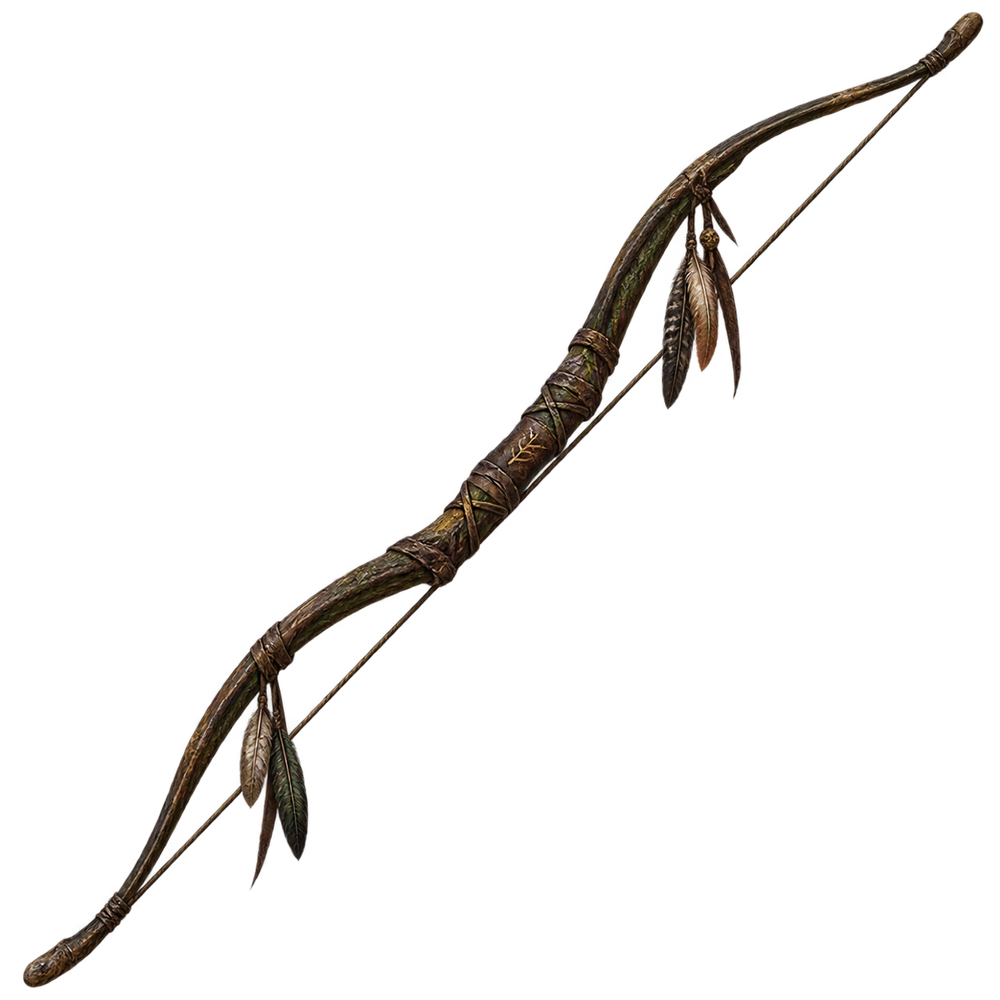

**Вид и облик:** длинный деревянный лук, простой колчан, стрелы с разным оперением. Поверхности натёрты воском и потемнели от дождя.

**Происхождение и владельцы:** оружие охотников, лесных дозорных и разбойников. Некоторые фавны пользуются сходными луками на территориях своих союзников-фей.

**Где встречается:** лесные поселения, охотничьи стоянки, лагеря у опушек.

**Текст предмета:** «На дереве нет ни рун, ни благословений. Только следы пальцев человека, который редко промахивался».

### 13.7. АРБАЛЕТ ЗАСТАВЫ

**Каталог:** `data/weapons.json` → `outpost-crossbow`.

**Тир:** 2.

**Вид и облик:** крепкое деревянное ложе, металлическая дуга, поясной крюк для взвода. На прикладе вырезан номер караульного места.

**Происхождение и владельцы:** оружие городских стражей и защитников переправ. После падения застав попадает к наёмникам и грабителям.

**Где встречается:** города, мосты, пограничные укрепления, захваченные склады.

**Текст предмета:** «На прикладе двадцать зарубок. Ни одна не объясняет, кого здесь считали врагом».

### 13.8. ЛЕЗВИЕ ЛАСКОВОГО ГОСТЯ

**Каталог:** `data/weapons.json` → `guest-blade`.

**Тир:** 2.

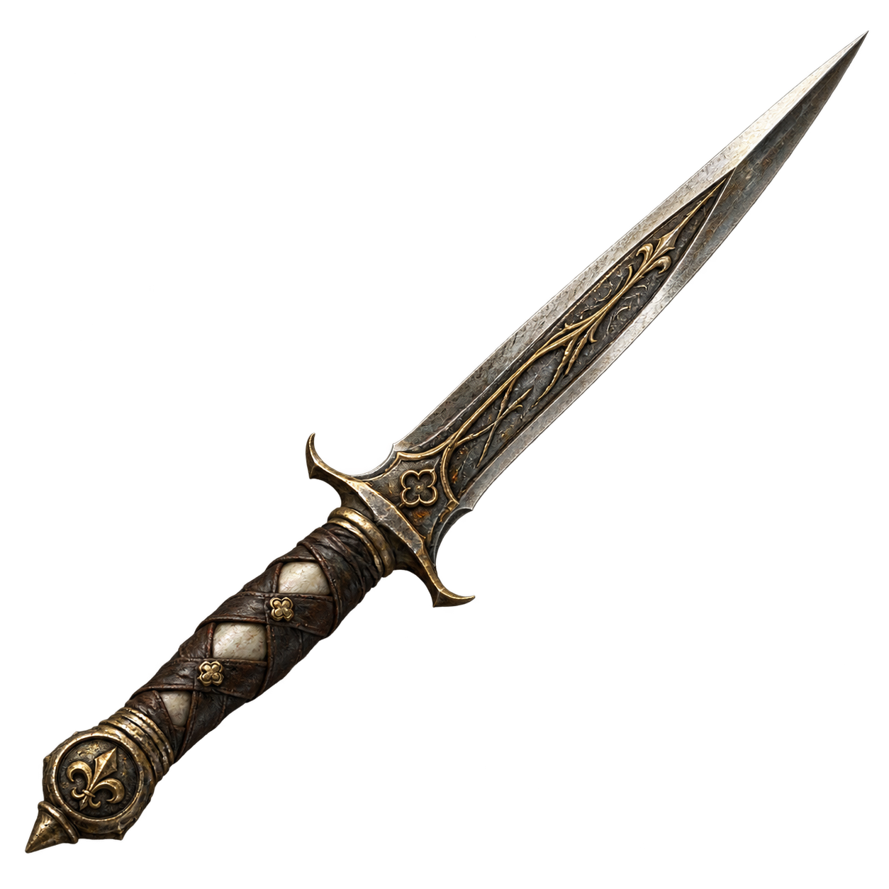

**Вид и облик:** узкий кинжал, скрытый в неприметных ножнах или оформленный как часть дорогого дорожного прибора. Гарда мала и не цепляется за одежду.

**Происхождение и владельцы:** любимое орудие некоторых вампиров, обманщиков и убийц, предпочитающих сначала войти в доверие. Принадлежность вампиру не наделяет клинок его природой.

**Где встречается:** гостиницы, городские дома, ярмарки, тайники за обивкой дорожных сундуков.

**Текст предмета:** «Хозяин просил поддержать его под локоть. Клинок оказался в другой руке».

### 13.9. БОЛОТНЫЙ КРЮК

**Каталог:** `data/weapons.json` → `marsh-hook`.

**Тир:** 2.

**Вид и облик:** длинная кривая рукоять с тяжёлым железным крюком; по металлу тянется зелёный налёт, а в обмотке застряли камышовые волокна.

**Происхождение и владельцы:** орудие отдельных болотниц и жестоких обитателей трясин. Болотница может утаскивать им добычу в жилище; это вариант её вооружения, а не обязательная черта всего вида.

**Где встречается:** болотные жилища, затопленные настилы, тайники в камышах.

**Текст предмета:** «Старуха называла его багром. Лодки возле её дома никто не видел».

### 13.10. ШИП ТРЯСИНЫ

**Каталог:** `data/weapons.json` → `bog-stinger`.

**Тир:** 3.

**Вид и облик:** духовая трубка из тёмного полого стебля с костяным мундштуком и связкой тонких дротиков в закрытом футляре.

**Происхождение и владельцы:** оружие болотных охотников и скрытных убийц. Яд для дротиков готовят знахари и алхимики; связь с сёстрами Млечного познания не предполагается.

**Где встречается:** болотные поселения, охотничьи тайники, подпольные городские рынки.

**Текст предмета:** «Путник смахнул с шеи то, что принял за мошку. До сухого берега он не дошёл».

### 13.11. ЛУННЫЙ СЕРП ЭЛЬФОВ

**Каталог:** `data/weapons.json` → `elven-moon-sickle`.

**Тир:** 2.

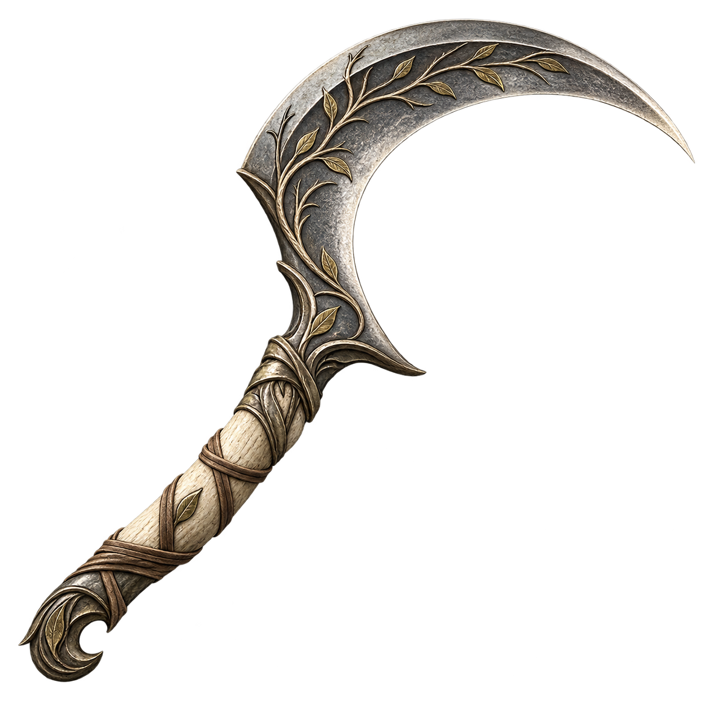

**Вид и облик:** короткое изогнутое лезвие матового металла, рукоять из плотного светлого дерева, узор ветвей вдоль обуха. Название описывает форму, а не источник силы.

**Происхождение и владельцы:** оружие и рабочий инструмент эльфийских хранителей рощ. Им срезают повреждённые ветви и защищают скрытые поселения.

**Где встречается:** лесные поселения эльфов, пограничные рощи, тропы в скрытые долины.

**Текст предмета:** «Ветвь срезают, чтобы дерево жило. О целом мире его хозяева судят осторожнее».

### 13.12. РОГАТИНА ФАВНА

**Каталог:** `data/weapons.json` → `faun-boar-spear`.

**Тир:** 2.

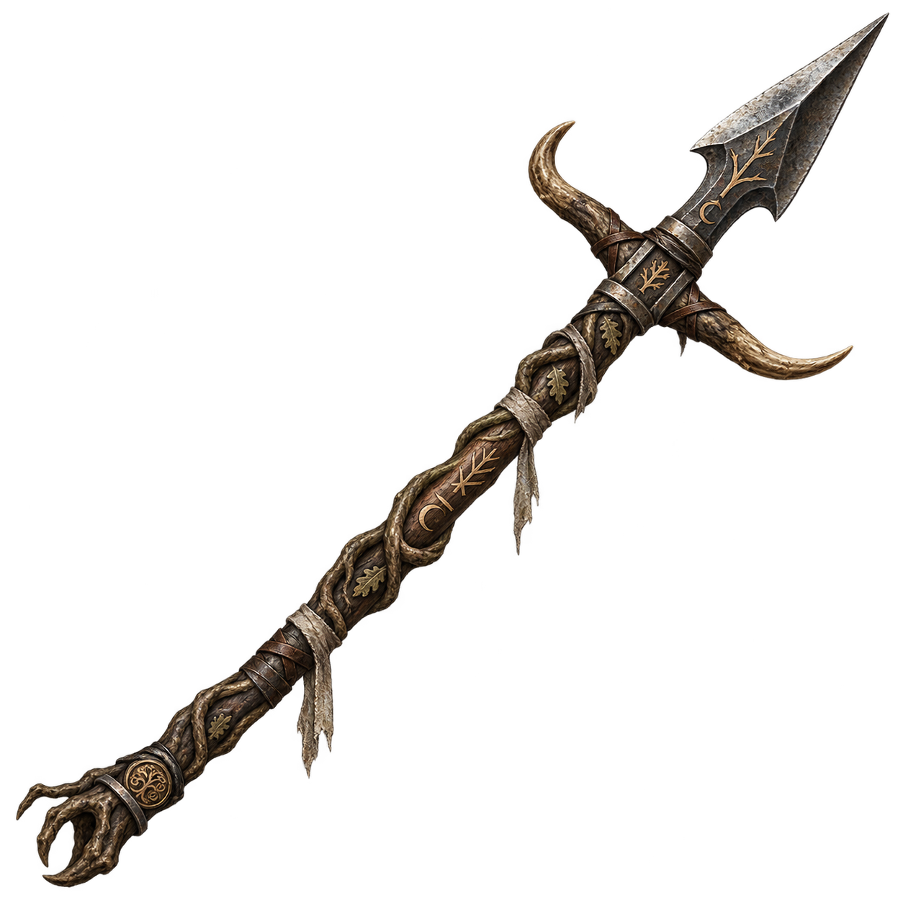

**Вид и облик:** крепкое короткое копьё с широким наконечником и поперечиной; древко обвито корнями и украшено резными отметками рощи.

**Происхождение и владельцы:** оружие фавнов, защищающих общие с феями земли. Поперечина помогает удержать крупного зверя, бросившегося на остриё.

**Где встречается:** опушки, поляны, входы в природные убежища феири.

**Текст предмета:** «За этой чертой начинается чужой дом. Фавн показывает границу остриём».

### 13.13. ПОСОХ ТЛЕЮЩЕГО КАМНЯ

**Каталог:** `data/weapons.json` → `emberstone-staff`.

**Тир:** 2.

**Вид и облик:** обугленный посох с камнем в железной клетке навершия. В трещинах минерала виден жар, у хвата дерево остаётся холодным.

**Происхождение и владельцы:** инструмент магов, изучающих взаимодействие огня и камня. Чаще встречается у боевых магов, которым нужен управляемый источник жара.

**Текст предмета:** «Камень не горит. Он помнит, как велено гореть тому, что находится рядом».

### 13.14. ЖЕЗЛ РЕЧНОГО ЛЬДА

**Каталог:** `data/weapons.json` → `river-ice-wand`.

**Тир:** 2.

**Вид и облик:** короткий жезл с прозрачным минеральным наконечником и запаянной полостью для воды. По оправе медленно собираются холодные капли.

**Происхождение и владельцы:** происходит от инструментов магов, расчищавших реки для судоходства. Военные мастера приспособили те же знания для боя.

**Где встречается:** речные города, склады у переправ, лагеря у водоёмов.

**Текст предмета:** «Когда-то им открывали путь лодкам. Теперь лёд смыкается вокруг тех, кто пытается переплыть реку».

### 13.15. КОПЬЁ ПОПУТНОГО ВЕТРА

**Каталог:** `data/weapons.json` → `tailwind-spear`.

**Тир:** 2.

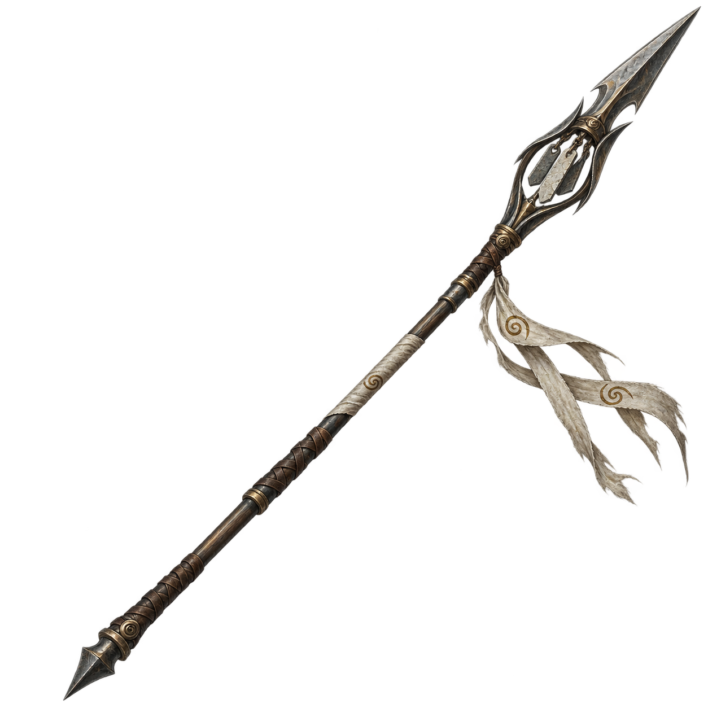

**Приём и образ:** «Прикрытый выпад» — копейщик встречает удар усиленным древком и отвечает уколом наконечника. Иллюстрация перехвата общая для копий; укол сохраняет изображение своего оружия. [Правила смешанных фигур](RULES.md#смешанные-фигуры).

**Вид и облик:** лёгкое копьё с полым навершием под наконечником; внутри закреплены тонкие каменные пластинки, тихо звенящие при движении.

**Происхождение и владельцы:** оружие, подготовленное магом воздуха для разведчиков и посыльных. В пластинках закреплено простое действие, усиливающее поток воздуха при направленном выпаде.

**Текст предмета:** «Его заказывали, чтобы расчистить дорогу одному гонцу. Гонец не вернулся; копьё дошло до рынка».

### 13.16. КАМНЕДРОБ

**Каталог:** `data/weapons.json` → `stonecrusher`.

**Тир:** 2.

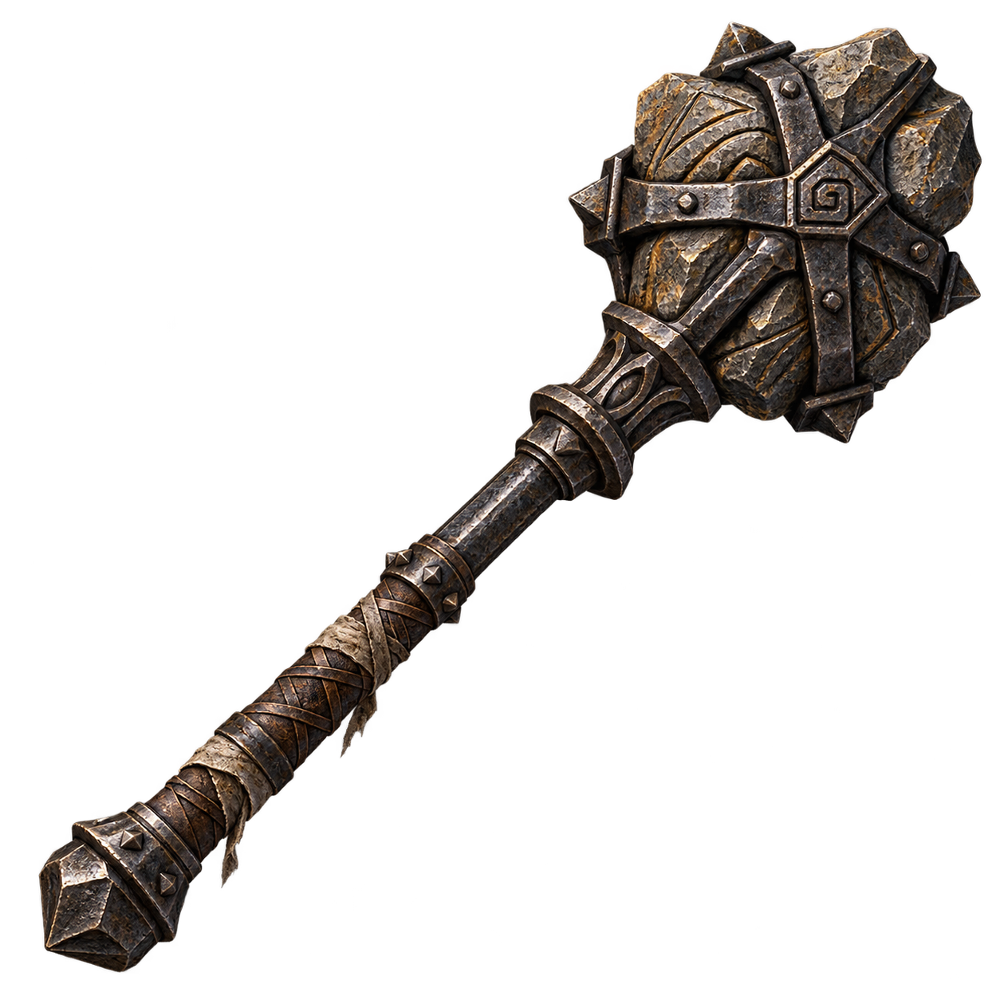

**Вид и облик:** тяжёлая булава с каменным навершием, стянутым железными полосами. По поверхности расходятся тонкие вырезанные борозды.

**Происхождение и владельцы:** работа магов земли, умеющих согласовывать поведение камня и металла. Подготовленное навершие при ударе передаёт короткое сотрясение соприкасающемуся материалу.

**Где встречается:** осадные склады, старые карьеры, мастерские магов земли.

**Текст предмета:** «Мастер не учил камень ненавидеть. Он научил его передавать удар дальше».

### 13.17. КАДИЛО ГОРЬКОГО ДЫМА

**Каталог:** `data/weapons.json` → `bitter-censer`.

**Тир:** 3.

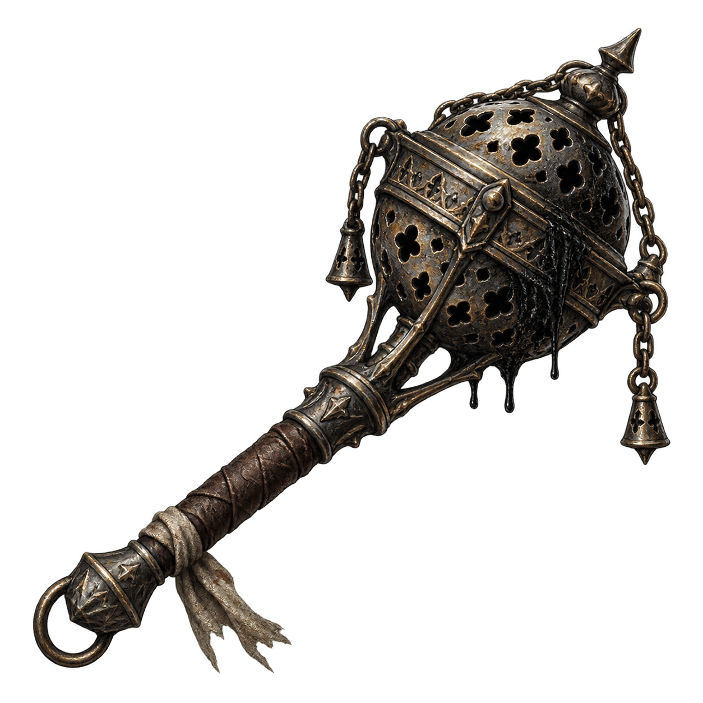

**Вид и облик:** закрытый перфорированный сосуд на короткой рукояти с крышкой и внутренней чашей для состава. Тёмные потёки забили часть отверстий.

**Происхождение и владельцы:** оружие некоторых диких магов и отравителей. В нём нагревают заранее приготовленную смесь растительных и минеральных компонентов. Название и форма не означают принадлежности ордену Света.

**Текст предмета:** «Запах напоминает лекарство. Тот, кто приготовил смесь, хорошо знал разницу в пропорциях».

### 13.18. ПРАЩА ПЕЧАТНЫХ КАМНЕЙ

**Каталог:** `data/weapons.json` → `sealed-stone-sling`.

**Тир:** 2.

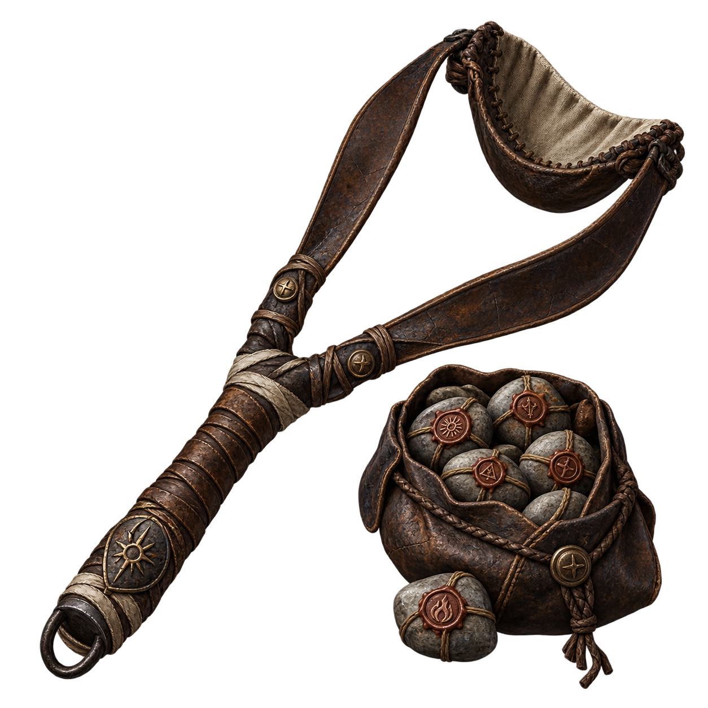

**Вид и облик:** широкая кожаная праща и футляр с гладкими камнями, каждый из которых отмечен отдельной тонкой печатью.

**Происхождение и владельцы:** снаряжение вспомогательных отрядов при боевых магах. Мастер заранее закрепляет в камнях короткий жаровой всплеск, срабатывающий от сильного удара.

**Где встречается:** военные обозы, мастерские, развалины лагерей.

**Текст предмета:** «На вид — речная галька. В обозе её хранили отдельно и запрещали ронять».

### 13.19. КЛИНОК ОСТРОВНОГО КОНВОЯ

**Каталог:** `data/weapons.json` → `convoy-blade`.

**Тир:** 1.

**Вид и облик:** простой короткий меч с закрытой гардой; у основания клинка выбит знак острова Света. Ножны рассчитаны на долгую дорогу и сырость.

**Происхождение и владельцы:** оружие мирских сопровождающих при жрецах Света. Его задача — защищать носителя аттрактора от разбойников и материальных существ. Может стать оружием героя из погибшего отряда, если такой вариант будет выбран для начала истории.

**Где встречается:** снаряжение конвоя, убежища ордена, следы пропавших перевозок.

**Текст предмета:** «Жрец отвечал за то, что шло из других миров. Человек с этим мечом — за то, что выходило из придорожных кустов».

### 13.20. ЖИЛЬНЫЙ БИЧ

**Каталог:** `data/weapons.json` → `sinew-lash`.

**Тир:** 2.

**Вид и облик:** короткая рукоять и несколько гибких плетей из обработанных сухожилий с костяными наконечниками. В покое они иногда слабо подёргиваются.

**Происхождение и владельцы:** работа дикого мага, соединившего остаточные свойства животных тканей с простым закреплённым действием. Оружие встречается у жестоких наёмников и хозяев подпольных мастерских; в нём не обязательно заключена самостоятельная душа.

**Где встречается:** мастерские диких магов, тайные подвалы, снаряжение наёмных истязателей.

**Текст предмета:** «Мастер утверждал, что ткани ничего не чувствуют. Бич дёргался всякий раз, когда он подносил иглу».

### 13.21. КИНЖАЛ ИЗГНАННИКА

**Каталог:** `data/weapons.json` → `dagger`.

**Тир:** 0.

**Вид и облик:** Короткое узкое лезвие с простой гардой, тёмная кожаная рукоять. На обухе остались следы грубой работы точильным камнем.

**Происхождение и владельцы:** Такие кинжалы берут люди, которым пришлось уйти из дома налегке. Название не обозначает особого сословия: изгнанником здесь легко становится вчерашний хозяин земли.

**Где встречается:** Дорожные ночлежки, обозы беженцев, лавки подержанных вещей.

**Текст предмета:** «Из дома разрешили взять то, что поместится за поясом.».

### 13.22. СУЧКОВАТАЯ ДУБИНА

**Каталог:** `data/weapons.json` → `club`.

**Тир:** 0.

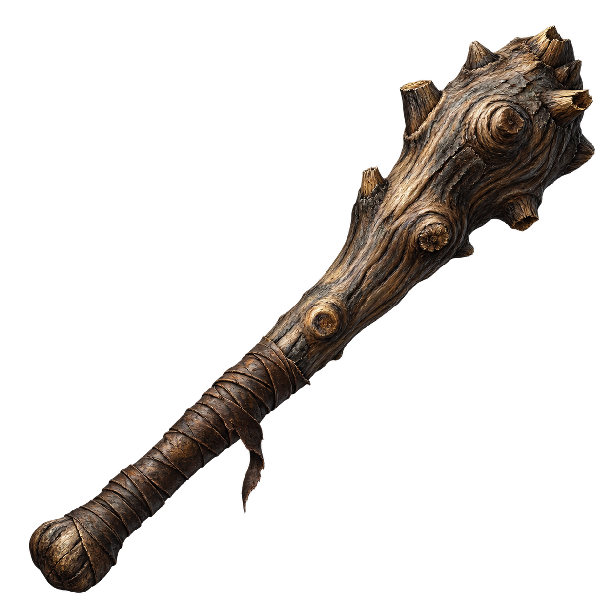

**Вид и облик:** Тяжёлая ветвь с сохранёнными сучками, срезанными у хвата. Потемневшее дерево местами отполировано ладонью.

**Происхождение и владельцы:** Оружие лесорубов и ополчения, которому не досталось железа. Иногда на нём вырезают обережные знаки, но сама резьба не даёт власти над Логосом.

**Где встречается:** Лесные селения, углежогные стоянки, баррикады на сельских дорогах.

**Текст предмета:** «Когда железо забрали на войну, лес ещё оставался общим.».

### 13.23. МЕЧ ДОЗОРНОГО

**Каталог:** `data/weapons.json` → `shortsword`.

**Тир:** 1.

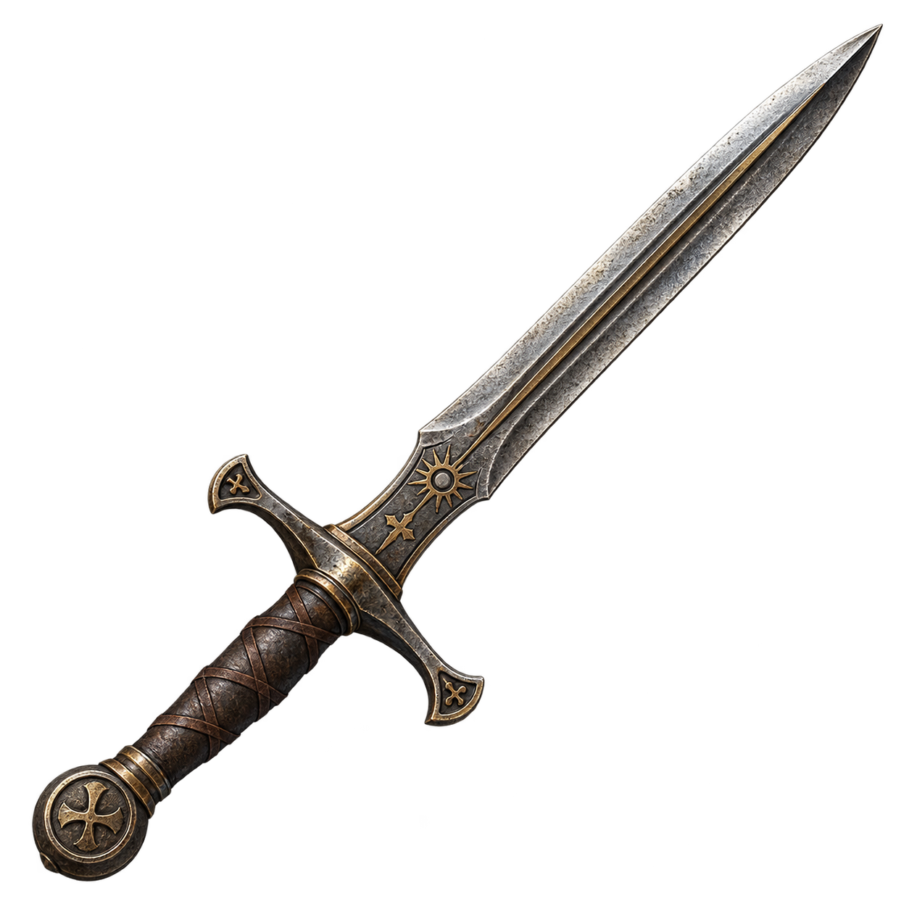

**Вид и облик:** Прямой короткий меч с неброской крестовиной. На гарде выбито почти стёртое клеймо караульного склада.

**Происхождение и владельцы:** Мечи выдавали дозорам малых застав. Многие заставы сгорели, а их оружие продолжает переходить из рук в руки; оно не свидетельствует о верности нынешнего владельца.

**Где встречается:** Старые заставы, караванная охрана, военные склады.

**Текст предмета:** «Дозор сменился. Приказа снять караул так и не принесли.».

### 13.24. РАПИРА СКОРБИ

**Каталог:** `data/weapons.json` → `rapier`.

**Тир:** 1.

**Вид и облик:** Длинное тонкое лезвие, ажурная потемневшая гарда и узкая рукоять. Украшения сдержанны, острие тщательно выправлено.

**Происхождение и владельцы:** В разорённых городах такие рапиры продают вместе с фамильными вещами. Скорбь в названии — память о погибших владельцах, а не заключённая в стали сила.

**Где встречается:** Городские дома, дуэльные дворы, лавки с заложенными ценностями.

**Текст предмета:** «Имя на гарде ещё можно прочесть. Спросить о нём уже некого.».

### 13.25. ТОПОР ПЕПЕЛЬНИКА

**Каталог:** `data/weapons.json` → `axe`.

**Тир:** 2.

**Вид и облик:** Широкое железное лезвие на коротком тёмном топорище. В углублениях металла въелась сажа.

**Происхождение и владельцы:** Топоры пепельников собирали из железа покинутых кузниц: остывшие горны разжигали вновь для последней работы. Ими вооружались люди, возвращавшиеся на пепелища собственных домов.

**Где встречается:** Сожжённые селения, временные кузницы, обозы переселенцев.

**Текст предмета:** «Кузницу разожгли на одну ночь. К утру деревня снова была пуста.».

### 13.26. КОПЬЁ ПАЛОМНИКА

**Каталог:** `data/weapons.json` → `spear`.

**Тир:** 1.

**Приём и образ:** «Прикрытый выпад» — копейщик встречает удар усиленным древком и отвечает уколом наконечника. Иллюстрация перехвата общая для копий; укол сохраняет изображение своего оружия. [Правила смешанных фигур](RULES.md#смешанные-фигуры).

**Вид и облик:** Длинное гладкое древко, узкий наконечник и обмотка для обеих рук. На дереве видны следы дождя и дорожной пыли.

**Происхождение и владельцы:** Паломники собирались в группы, когда дороги стали опасными. Копьё охраняло их путь независимо от учения, к которому они шли; оно не является знаком ордена Света.

**Где встречается:** Дорожные приюты, переправы, покинутые стоянки паломников.

**Текст предмета:** «Молитва у каждого была своя. Древко держали одинаково.».

### 13.27. ДВУРУЧНИК БЕЗЫМЯННЫХ

**Каталог:** `data/weapons.json` → `greatsword`.

**Тир:** 2.

**Вид и облик:** Длинный широкий клинок с просторной крестовиной и рукоятью для двух рук. Старые владельческие знаки сошлифованы.

**Происхождение и владельцы:** Оружие уцелело после распада наёмных отрядов. Безымянными называли и похороненных без опознания, и тех, кто намеренно счищал с вещей прошлое.

**Где встречается:** Поля сражений, склады наёмников, заброшенные крепости.

**Текст предмета:** «Сталь пережила всех, кто мог назвать её своей.».

### 13.28. МОЛОТ МОГИЛЬЩИКА

**Каталог:** `data/weapons.json` → `hammer`.

**Тир:** 3.

**Вид и облик:** Массивный железный боёк на длинной рукояти. По краям головки сбиты углы, в насечках держится белая каменная пыль.

**Происхождение и владельцы:** Инструмент людей, вскрывавших старые склепы и разбиравших могильную кладку. В смутные времена работа на кладбище требовала вооружённой защиты.

**Где встречается:** Каменоломни, кладбища, разграбленные усыпальницы.

**Текст предмета:** «Камень уступал не сразу. То, что было под ним, иногда торопило.».

### 13.29. ИНЕЙ

**Каталог:** `data/weapons.json` → `frost-dagger`.

**Тир:** 2.

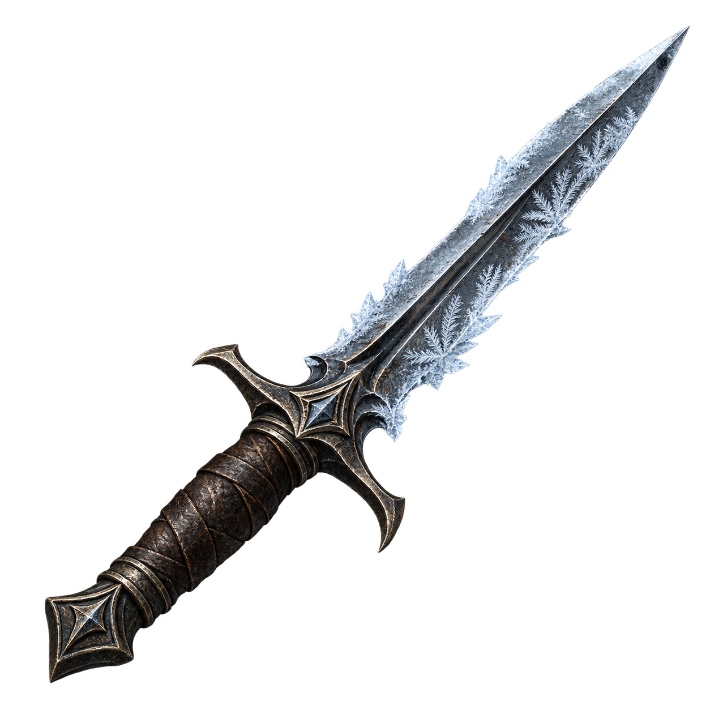

**Вид и облик:** Тонкий кинжал с матовой кромкой; у основания лезвия закреплена бледная минеральная вставка. На металле проступает иней.

**Происхождение и владельцы:** Речные маги готовили такие клинки для людей, работавших на зимних переправах. В оправе закреплено простое действие холода, доступное обычному владельцу.

**Где встречается:** Склады переправ, речные города, мастерские магов воды.

**Текст предмета:** «Клинок вынули. Холод остался.».

### 13.30. УГОЛЬНЫЙ КЛИНОК

**Каталог:** `data/weapons.json` → `ember-sword`.

**Тир:** 2.

**Вид и облик:** Тёмный меч с угольно-серой поверхностью и узкими красноватыми прожилками у кромки. Рукоять защищена от жара.

**Происхождение и владельцы:** Вещь связывают с исчезнувшим огненным орденом, чья история сохранилась лишь в рассказах оружейников. Его не следует отождествлять с орденом Света. Подготовленные чары поддерживают короткий выброс жара.

**Где встречается:** Старые арсеналы, руины огненных мастерских, тайные торги.

**Текст предмета:** «Орден погас. Последний приказ огню остался в стали.».

### 13.31. СЕРП ВЕТРА

**Каталог:** `data/weapons.json` → `wind-sickle`.

**Тир:** 2.

**Вид и облик:** Изогнутый серп с тонкой металлической кромкой и вставками в рукояти. При движении слышен короткий свист.

**Происхождение и владельцы:** Маги воздуха приспособили форму серпа для направленного порыва. Сходство с эльфийским инструментом не доказывает эльфийское происхождение каждого экземпляра.

**Где встречается:** Мастерские магов воздуха, караваны, склады разведчиков.

**Текст предмета:** «Травы легли раньше, чем рука закончила движение.».

### 13.32. ПОСОХ ОТШЕЛЬНИКА

**Каталог:** `data/weapons.json` → `staff`.

**Тир:** 1.

**Вид и облик:** Длинный потёртый посох с тёмной каменной сердцевиной. Обе зоны хвата гладкие от многолетнего использования.

**Происхождение и владельцы:** Отшельники среди чувствующих готовили такие посохи для защиты жилища, а позднее передавали ученикам или путникам. Название не связывает предмет с сёстрами Млечного познания.

**Где встречается:** Уединённые жилища, дорожные святилища, мастерские при приютах.

**Текст предмета:** «Хозяин ушёл дальше в горы. Посох оставил тому, кто придёт после.».

### 13.33. ЭФЕМЕРНЫЙ МЕЧ

**Каталог:** `data/weapons.json` → `ephemeral-sword`.

**Тир:** 1.

**Вид и облик:** Материальная рукоять с каменной вставкой; над ней проступает полупрозрачная форма клинка с дымчатыми краями.

**Происхождение и владельцы:** Маги согласовали действие материалов оправы так, чтобы удерживать направленное магическое лезвие. Призрачный вид не означает, что в нём заперт дух или открыт иной план.

**Где встречается:** Мастерские магов, старые подземные склады, редкие предложения кузнецов.

**Текст предмета:** «Стена осталась цела. По другую сторону перестали смеяться.».

### 13.34. ЦЕПНОЙ НОЖ КАНАТЧИКА

**Каталог:** `data/weapons.json` → `ropewalk-chain-knife`.

**Тир:** 3.

**Вид и облик:** Узкий треугольный нож на короткой тонкой цепи с кожаной петлёй для руки. Потемневшее железо и тёмная кожа.

**Происхождение и владельцы:** Канатчики портовых переправ приспособили нож для боя среди снастей. Цепь возвращает клинок в ладонь, но требует точного движения.

**Где встречается:** Портовые переправы, канатные мастерские, охрана речных обозов.

**Текст предмета:** «Верёвку здесь режут один раз. За ошибку платят пальцами».

### 13.35. ЖЕЗЛ ПЫЛЬНОГО СТЕКЛА

**Каталог:** `data/weapons.json` → `dustglass-wand`.

**Тир:** 0.

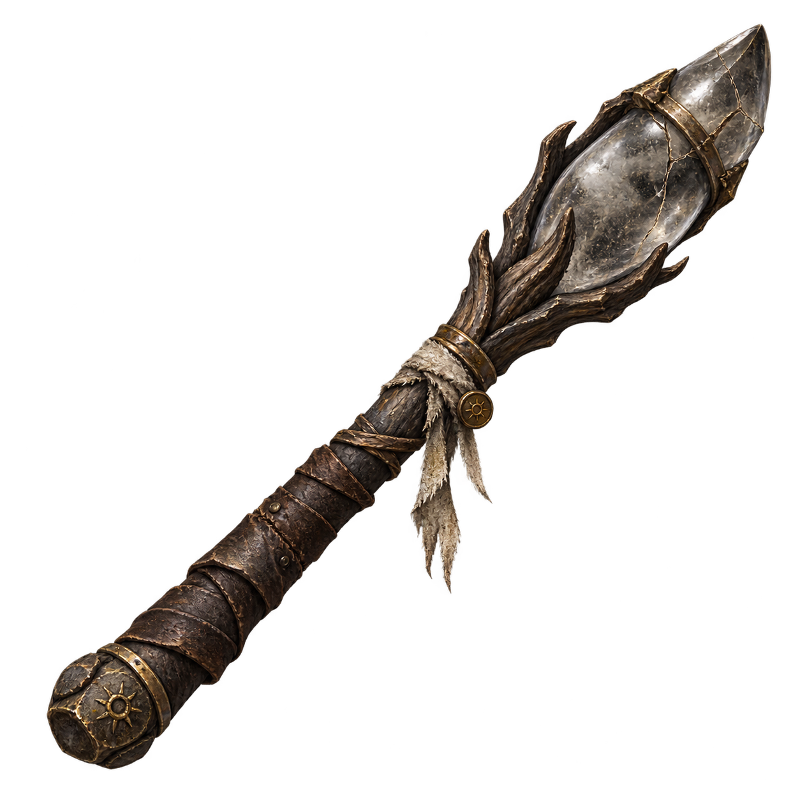

**Вид и облик:** Короткий жезл с дымчатым стеклом в треснувшей деревянной оправе и потёртым кожаным хватом.

**Происхождение и владельцы:** Учебный инструмент мастеров, направляющих мелкие частицы стекла. Помутневшая сердцевина сохраняет следы многих неудачных опытов.

**Где встречается:** Учебные мастерские, разрушенные стекольни, городские подвалы магов.

**Текст предмета:** «Первый урок — собрать осколки, не касаясь их».

### 13.36. КАМЕРТОН ПУСТЫХ ЗАЛОВ

**Каталог:** `data/weapons.json` → `hollow-tuning-fork`.

**Тир:** 1.

**Вид и облик:** Бронзовый камертон на деревянной ручке. Его длинные неровные ветви потемнели от времени.

**Происхождение и владельцы:** Маги воздуха проверяли им резонанс пустых водохранилищ. В бою дрожание ветвей направляет короткую воздушную волну.

**Где встречается:** Пустые водохранилища, подземные насосные залы, мастерские магов воздуха.

**Текст предмета:** «В пустом зале всегда есть кому ответить».

### 13.37. ФОНАРЬ ЗАБЫТОЙ ИСКРЫ

**Каталог:** `data/weapons.json` → `spark-lantern`.

**Тир:** 2.

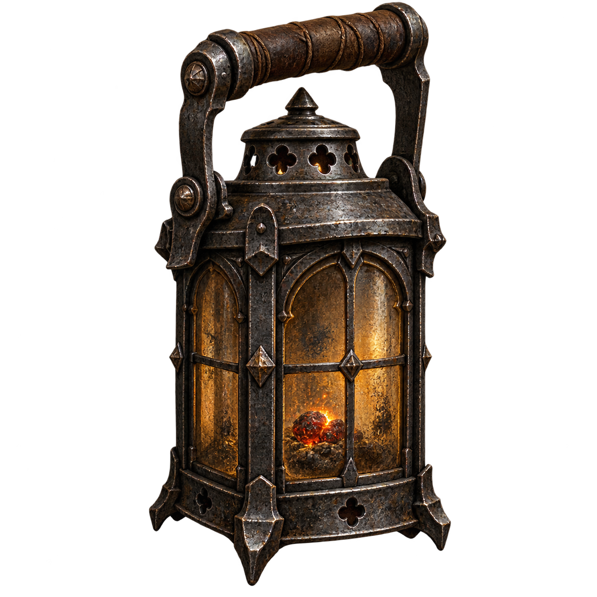

**Вид и облик:** Переносной железный фонарь с жёсткой ручкой. За закопчённым янтарным стеклом тлеет единственный уголёк.

**Происхождение и владельцы:** Смотрители магических печей носили в таких фонарях образец поддерживаемого огня. Искра подчиняется подготовленному направляющему жесту.

**Где встречается:** Заброшенные печи, горновые мастерские, снаряжение смотрителей.

**Текст предмета:** «Печь остыла. Дежурный свет остался».

### 13.38. ОСКОЛОК ЗИМНЕГО КОЛОДЦА

**Каталог:** `data/weapons.json` → `winter-shard`.

**Тир:** 0.

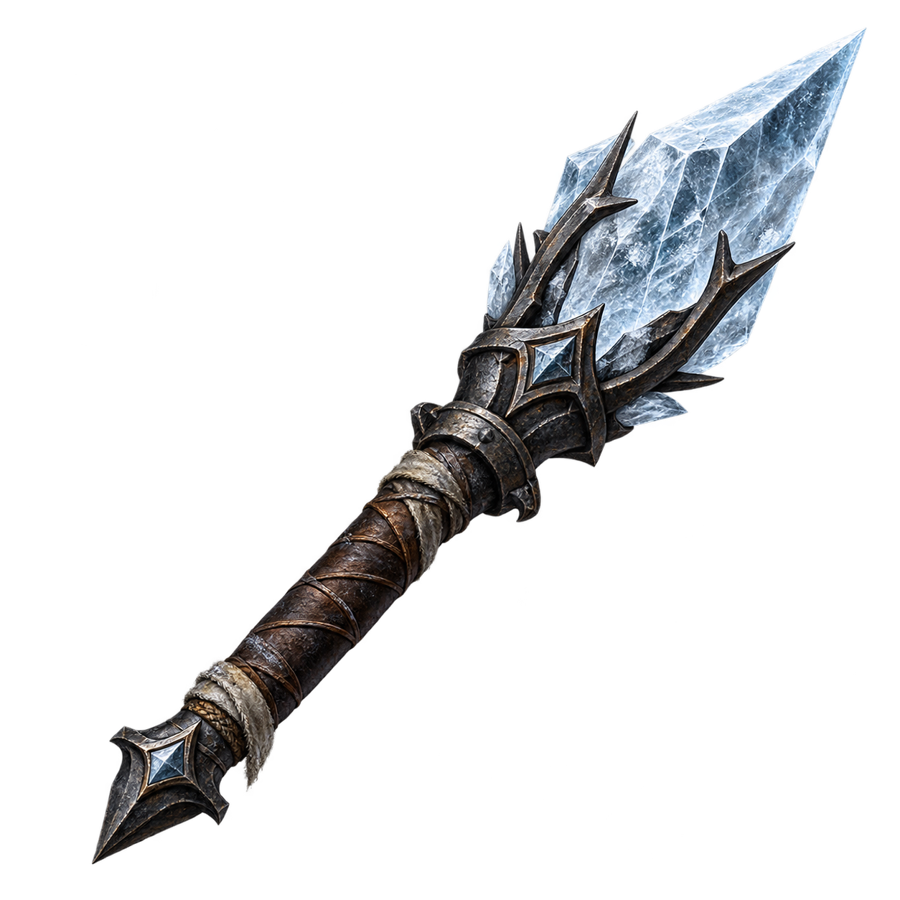

**Вид и облик:** Матовый ледяной кристалл в тёмной железной оправе с короткой кожаной ручкой.

**Происхождение и владельцы:** Холодный минерал извлекли из колодца, который не оттаивал даже летом. Мастера закрепили его в оправе для простых ледяных выбросов.

**Где встречается:** Колодезные поселения, мастерские магов воды, склады зимних переправ.

**Текст предмета:** «Воду из того колодца больше не пьют».

### 13.39. ПОСОХ ГОРЬКИХ СПОР

**Каталог:** `data/weapons.json` → `bitter-spore-staff`.

**Тир:** 3.

**Вид и облик:** Длинный посох из тёмного древесного корня. Пористое навершие удерживает железная сетка; у отверстий проступает оливковый налёт.

**Происхождение и владельцы:** Болотные алхимики запечатывают сухие споры в пористом навершии. Обученный владелец выпускает отмеренную порцию, удерживая посох обеими руками.

**Где встречается:** Лаборатории болотных алхимиков, склады лекарственных составов, убежища отравителей.

**Текст предмета:** «Лечебный порошок хранят в другой комнате».

### 13.40. ПОСОХ ГЛИНЯНОГО КРУГА

**Каталог:** `data/weapons.json` → `clay-circle-staff`.

**Тир:** 2.

**Вид и облик:** Деревянный посох с круглым глиняным навершием. Железные скобы стягивают сколотый диск с концентрическими бороздами.

**Происхождение и владельцы:** Мастера земли использовали этот инструмент при укреплении подземных сводов. Борозды собирают усилие в короткий направленный толчок.

**Где встречается:** Подземные стройки, заброшенные укрепления, мастерские магов земли.

**Текст предмета:** «Свод не рухнул. Лестница к нему не сохранилась».

### 13.41. ЭСПАДОН ПЕРЕПРАВЫ

**Каталог:** `data/weapons.json` → `ferry-espadon`.

**Тир:** 2.

**Вид и облик:** Тяжёлый двуручный меч с длинной рукоятью, широкой крестовиной и кожаной обмоткой у основания клинка.

**Происхождение и владельцы:** Охрана переправы ценила этот меч за управляемый широкий размах. Вес требует силы, а тесный настил — точности.

**Где встречается:** Военные переправы, речные заставы, склады дорожной стражи.

**Текст предмета:** «На мосту некуда отступить ни тому, ни другому».

### 13.42. МОЛОТ СТЕКОЛЬНОГО ГОРНА

**Каталог:** `data/weapons.json` → `glassfurnace-hammer`.

**Тир:** 2.

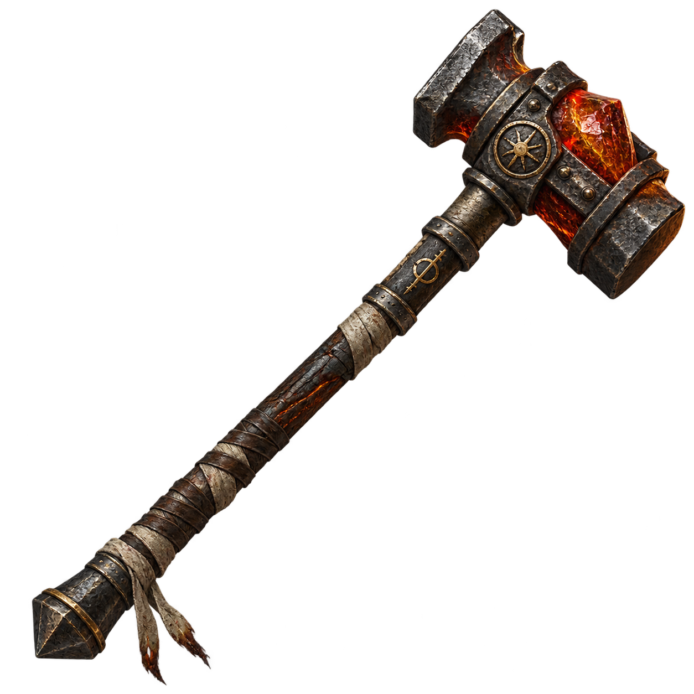

**Вид и облик:** Двуручный молот на обожжённой деревянной рукояти. В массивном железном бойке заключён тускло-красный осколок жаропрочного стекла.

**Происхождение и владельцы:** Маг стекольного горна закрепил в бойке краткий выброс жара. Сильный владелец удерживает тяжёлую головку, знание устройства направляет нагрев.

**Где встречается:** Стекольные горны, мастерские магов огня, осадные обозы.

**Текст предмета:** «Им не ковали сталь. Стекло помнило удары дольше».

